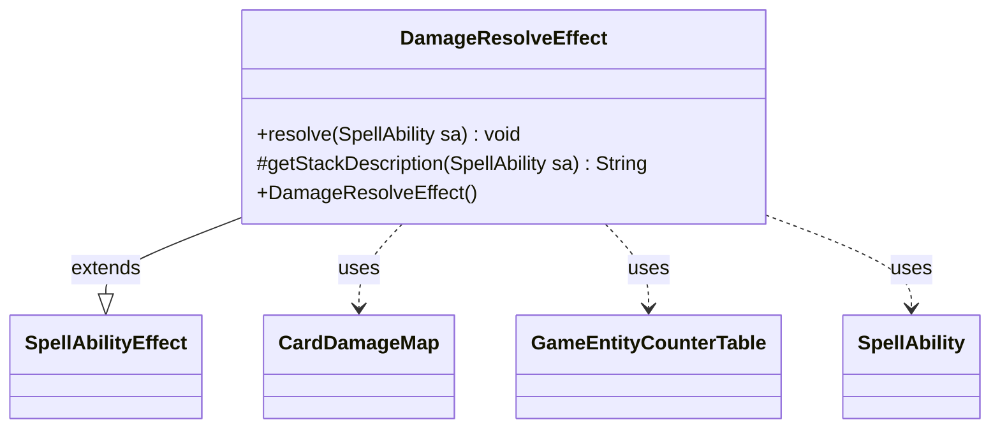

---
aliases:
  - DamageResolveEffect
tags:
  - java/class
  - module/forge-game
  - pkg/forge/game/ability/effects
fqn: forge.game.ability.effects.DamageResolveEffect
package: forge.game.ability.effects
module: forge-game
kind: Class
---

# DamageResolveEffect

**Package:** `forge.game.ability.effects` &nbsp; **Module:** `forge-game` &nbsp; **Kind:** Class



## Relationships
**Extends:**
- [[forge.game.ability.SpellAbilityEffect|SpellAbilityEffect]]
**Uses:**
- [[forge.game.GameEntityCounterTable|GameEntityCounterTable]]
- [[forge.game.card.CardDamageMap|CardDamageMap]]
- [[forge.game.spellability.SpellAbility|SpellAbility]]

## Design Description

The DamageResolveEffect is a terminal resolution handler within Forge's spell-ability effect framework, extending SpellAbilityEffect to apply previously accumulated damage when an ability resolves. Rather than computing damage itself, it acts as a commit step: it retrieves the SpellAbility's pre-populated CardDamageMap, companion prevention map, and GameEntityCounterTable, then delegates to the game's action layer to deal the batched damage in a single pass before triggering state-based death checks via replaceDying.

Its design reflects a deliberate separation of concerns—damage is gathered elsewhere and only finalized here—so the class defensively returns early when no damage map is present (e.g., a missing damage source). The empty getStackDescription override signals that this internal resolution effect contributes no player-facing stack text, marking it as a behind-the-scenes mechanism rather than a directly described game action.

## Source
`forge-game/src/main/java/forge/game/ability/effects/DamageResolveEffect.java`

```java
package forge.game.ability.effects;

import forge.game.GameEntityCounterTable;
import forge.game.ability.SpellAbilityEffect;
import forge.game.card.CardDamageMap;
import forge.game.spellability.SpellAbility;

public class DamageResolveEffect extends SpellAbilityEffect {

    public DamageResolveEffect() {
        // TODO Auto-generated constructor stub
    }

    /*
     * (non-Javadoc)
     * @see forge.game.ability.SpellAbilityEffect#resolve(forge.game.spellability.SpellAbility)
     */
    @Override
    public void resolve(SpellAbility sa) {
        CardDamageMap damageMap = sa.getDamageMap();
        if (damageMap == null) {
            // this can happen if damagesource was missing
            return;
        }
        CardDamageMap preventMap = sa.getPreventMap();
        GameEntityCounterTable counterTable = sa.getCounterTable();

        sa.getHostCard().getGame().getAction().dealDamage(false, damageMap, preventMap, counterTable, sa);

        replaceDying(sa);
    }

    /* (non-Javadoc)
     * @see forge.game.ability.SpellAbilityEffect#getStackDescription(forge.game.spellability.SpellAbility)
     */
    @Override
    protected String getStackDescription(SpellAbility sa) {
        return "";
    }

}
```
