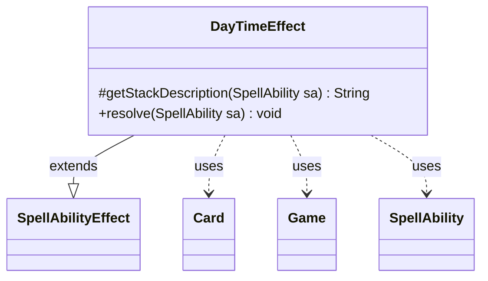

---
aliases:
  - DayTimeEffect
tags:
  - java/class
  - module/forge-game
  - pkg/forge/game/ability/effects
fqn: forge.game.ability.effects.DayTimeEffect
package: forge.game.ability.effects
module: forge-game
kind: Class
---

# DayTimeEffect

**Package:** `forge.game.ability.effects`   **Module:** `forge-game`   **Kind:** Class



## Relationships
**Extends:**
- [[forge.game.ability.SpellAbilityEffect|SpellAbilityEffect]]
**Uses:**
- [[forge.game.Game|Game]]
- [[forge.game.card.Card|Card]]
- [[forge.game.spellability.SpellAbility|SpellAbility]]

## Design Description

DayTimeEffect is a one-shot spell-ability effect that controls the game's day/night cycle. As a concrete subclass of `SpellAbilityEffect`, it overrides `getStackDescription` to render a human-readable outcome for the stack and `resolve` to apply the change. On resolution it locates the host `Card` from the `SpellAbility`, retrieves the owning `Game`, and reads the ability's `Value` parameter to call `Game.setDayTime` with day, night, or a toggle.

The class is deliberately stateless, deriving all behavior from ability parameters rather than holding any data of its own. The `Switch` branch—used by the Celestus—flips the current state, defaulting an unset value to day via `Objects.requireNonNullElse` so the toggle behaves predictably before any day/night state exists.

## Source
`forge-game/src/main/java/forge/game/ability/effects/DayTimeEffect.java`

```java
package forge.game.ability.effects;

import forge.game.Game;
import forge.game.ability.SpellAbilityEffect;
import forge.game.card.Card;
import forge.game.spellability.SpellAbility;

import java.util.Objects;

public class DayTimeEffect extends SpellAbilityEffect {

    @Override
    protected String getStackDescription(SpellAbility sa) {
        final StringBuilder sb = new StringBuilder();
        if ("Switch".equals(sa.getParam("Value"))) {
            sb.append("if it’s night, it becomes day. Otherwise, it becomes night.");
        } else {
            sb.append("It becomes ").append(sa.getParam("Value").toLowerCase()).append(".");
        }
        return sb.toString();
    }

    @Override
    public void resolve(SpellAbility sa) {
        Card host = sa.getHostCard();
        Game game = host.getGame();
        String newValue = sa.getParam("Value");
        if (newValue.equals("Day")) {
            game.setDayTime(false);
        } else if (newValue.equals("Night")) {
            game.setDayTime(true);
        } else if (newValue.equals("Switch")) {
            // logic for the Celestus
            game.setDayTime(!Objects.requireNonNullElse(game.getDayTime(), false));
        }
    }
}
```

## Python
`forge/game/ability/effects/DayTimeEffect.py`

```python
from forge.game.Game import Game
from forge.game.ability.SpellAbilityEffect import SpellAbilityEffect
from forge.game.card.Card import Card
from forge.game.spellability.SpellAbility import SpellAbility


class DayTimeEffect(SpellAbilityEffect):

    def getStackDescription(self, sa: SpellAbility) -> str:
        sb = []
        if "Switch" == sa.getParam("Value"):
            sb.append("if itΓÇÖs night, it becomes day. Otherwise, it becomes night.")
        else:
            sb.append("It becomes ")
            sb.append(sa.getParam("Value").lower())
            sb.append(".")
        return "".join(sb)

    def resolve(self, sa: SpellAbility) -> None:
        host = sa.getHostCard()
        game = host.getGame()
        newValue = sa.getParam("Value")
        if newValue == "Day":
            game.setDayTime(False)
        elif newValue == "Night":
            game.setDayTime(True)
        elif newValue == "Switch":
            # logic for the Celestus
            current = game.getDayTime()
            game.setDayTime(not (current if current is not None else False))
```
