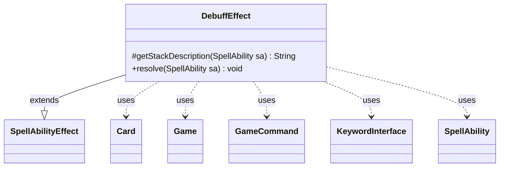

---
aliases:
  - DebuffEffect
tags:
  - java/class
  - module/forge-game
  - pkg/forge/game/ability/effects
fqn: forge.game.ability.effects.DebuffEffect
package: forge.game.ability.effects
module: forge-game
kind: Class
---

# DebuffEffect

**Package:** `forge.game.ability.effects`   **Module:** `forge-game`   **Kind:** Class



## Relationships
**Extends:**
- [[forge.game.ability.SpellAbilityEffect|SpellAbilityEffect]]
**Uses:**
- [[forge.GameCommand|GameCommand]]
- [[forge.game.Game|Game]]
- [[forge.game.card.Card|Card]]
- [[forge.game.keyword.KeywordInterface|KeywordInterface]]
- [[forge.game.spellability.SpellAbility|SpellAbility]]

## Design Description

DebuffEffect is a resolution handler for spell/ability effects that strip keywords from cards, implementing one concrete behavior within Forge's ability-effect framework by extending SpellAbilityEffect. It overrides `getStackDescription` to render a human-readable "[targets] loses [keywords]" line and `resolve` to apply the actual change, reading its `Keywords`, `Duration`, and `AllSuffixKeywords` parameters from the driving SpellAbility.

In `resolve` it iterates the targeted Cards, skipping any no longer legally in play (off-board, phased out, or stale via game-timestamp comparison against the live game state), then registers removed keywords through `addChangedCardKeywords` under a unique timestamp. Notable design intent includes special handling for landwalk suffixes and color-protection/Ward keywords—expanding aggregate "Protection from each color" forms into per-color entries—and, for non-permanent durations, scheduling a GameCommand via `addUntilCommand` to undo the change at end of turn. It collaborates with Game for state lookup and timestamping and KeywordInterface for inspecting existing keywords.

## Source
`forge-game/src/main/java/forge/game/ability/effects/DebuffEffect.java`

```java
package forge.game.ability.effects;

import java.util.Arrays;
import java.util.Iterator;
import java.util.List;

import org.apache.commons.lang3.StringUtils;

import com.google.common.collect.Lists;

import forge.GameCommand;
import forge.card.MagicColor;
import forge.game.Game;
import forge.game.ability.SpellAbilityEffect;
import forge.game.card.Card;
import forge.game.keyword.Keyword;
import forge.game.keyword.KeywordInterface;
import forge.game.spellability.SpellAbility;

public class DebuffEffect extends SpellAbilityEffect {

    @Override
    protected String getStackDescription(SpellAbility sa) {
        final List<String> kws = Lists.newArrayList();
        if (sa.hasParam("Keywords")) {
            kws.addAll(Arrays.asList(sa.getParam("Keywords").split(" & ")));
        }
        final StringBuilder sb = new StringBuilder();

        final List<Card> tgtCards = getTargetCards(sa);

        if (tgtCards.size() > 0) {
            final Iterator<Card> it = tgtCards.iterator();
            while (it.hasNext()) {
                final Card tgtC = it.next();
                if (tgtC.isFaceDown()) {
                    sb.append("Morph");
                } else {
                    sb.append(tgtC);
                }

                if (it.hasNext()) {
                    sb.append(" ");
                }
            }
            sb.append(" loses ");
            /*
             * Iterator<String> kwit = kws.iterator(); while(it.hasNext()) {
             * String kw = kwit.next(); sb.append(kw); if(it.hasNext())
             * sb.append(" "); }
             */
            sb.append(kws);
            if (!"Permanent".equals(sa.getParam("Duration"))) {
                sb.append(" until end of turn");
            }
            sb.append(".");
        }

        return sb.toString();
    }

    @Override
    public void resolve(SpellAbility sa) {
        final List<String> kws = Lists.newArrayList();
        if (sa.hasParam("Keywords")) {
            kws.addAll(Arrays.asList(sa.getParam("Keywords").split(" & ")));
        }
        final Game game = sa.getActivatingPlayer().getGame();
        final long timestamp = game.getNextTimestamp();

        for (final Card tgtC : getTargetCards(sa)) {
            if (!tgtC.isInPlay()) {
                continue;
            }
            if (tgtC.isPhasedOut()) {
                continue;
            }

            // check if the object is still in game or if it was moved
            Card gameCard = game.getCardState(tgtC, null);
            // gameCard is LKI in that case, the card is not in game anymore
            // or the timestamp did change
            // this should check Self too
            if (gameCard == null || !tgtC.equalsWithGameTimestamp(gameCard)) {
                continue;
            }

            final List<String> addedKW = Lists.newArrayList();
            final List<String> removedKW = Lists.newArrayList();
            if (sa.hasParam("AllSuffixKeywords")) {
                // this only for walk abilities, may to try better
                if (sa.getParam("AllSuffixKeywords").equals("walk")) {
                    for (final KeywordInterface kw : gameCard.getKeywords(Keyword.LANDWALK)) {
                        removedKW.add(kw.getOriginal());
                    }
                }
            }

            boolean ProtectionFromColor = false;
            for (final String kw : kws) {
                // Check if some of the Keywords are Protection from <color>
                if (!kw.startsWith("Protection from ")) {
                    continue;
                }
                for (byte col : MagicColor.WUBRG) {
                    final String colString = MagicColor.toLongString(col);
                    if (!kw.endsWith(colString)) {
                        continue;
                    }
                    final String wardString = StringUtils.capitalize(colString) + ":" + colString;
                    for (final KeywordInterface inst : gameCard.getKeywords(Keyword.PROTECTION)) {
                        // special for the Ward Auras Protection:Card.<Color>:<color>:*
                        String keyword = inst.getOriginal();
                        if (keyword.startsWith("Protection:") && keyword.contains(wardString)) {
                            removedKW.add(keyword);
                        }
                    }
                }
                ProtectionFromColor = true;
            }
            if (ProtectionFromColor) {
                // Split "Protection from each color" into extra Protection from <color>
                String allColors = "Protection from each color";
                if (gameCard.hasKeyword(allColors)) {
                    final List<String> allColorsProtect = Lists.newArrayList();

                    for (byte col : MagicColor.WUBRG) {
                        allColorsProtect.add("Protection from " + MagicColor.toLongString(col));

                    }
                    allColorsProtect.removeAll(kws);
                    addedKW.addAll(allColorsProtect);
                    removedKW.add(allColors);
                }

                // Extra for Spectra Ward
                allColors = "Protection:Card.nonColorless:each color:Aura";
                if (gameCard.hasKeyword(allColors)) {
                    final List<String> allColorsProtect = Lists.newArrayList();

                    for (byte col : MagicColor.WUBRG) {
                        final String colString = MagicColor.toLongString(col);
                        if (!kws.contains("Protection from " + colString)) {
                            allColorsProtect.add("Protection:Card." + StringUtils.capitalize(colString) + ":" + colString + ":Aura");
                        }
                    }
                    addedKW.addAll(allColorsProtect);
                    removedKW.add(allColors);
                }
            }

            removedKW.addAll(kws);
            gameCard.addChangedCardKeywords(addedKW, removedKW, false, timestamp, null);

            if (!"Permanent".equals(sa.getParam("Duration"))) {
                final GameCommand until = new GameCommand() {
                    private static final long serialVersionUID = 5387486776282932314L;

                    @Override
                    public void run() {
                        gameCard.removeChangedCardKeywords(timestamp, 0);
                    }
                };
                addUntilCommand(sa, until);
            }
        }
    }

}
```

## Python
`forge/game/ability/effects/DebuffEffect.py`

```python
from typing import List

from forge.GameCommand import GameCommand
from forge.card.MagicColor import MagicColor
from forge.game.Game import Game
from forge.game.ability.SpellAbilityEffect import SpellAbilityEffect
from forge.game.card.Card import Card
from forge.game.keyword.Keyword import Keyword
from forge.game.keyword.KeywordInterface import KeywordInterface
from forge.game.spellability.SpellAbility import SpellAbility


class DebuffEffect(SpellAbilityEffect):

    def getStackDescription(self, sa: SpellAbility) -> str:
        kws: List[str] = []
        if sa.hasParam("Keywords"):
            kws.extend(sa.getParam("Keywords").split(" & "))
        sb = []

        tgtCards = self.getTargetCards(sa)

        if len(tgtCards) > 0:
            it = iter(tgtCards)
            try:
                tgtC = next(it)
                has_next = True
            except StopIteration:
                has_next = False
            while has_next:
                if tgtC.isFaceDown():
                    sb.append("Morph")
                else:
                    sb.append(str(tgtC))

                try:
                    tgtC = next(it)
                    sb.append(" ")
                except StopIteration:
                    has_next = False
            sb.append(" loses ")
            #
            # Iterator<String> kwit = kws.iterator(); while(it.hasNext()) {
            # String kw = kwit.next(); sb.append(kw); if(it.hasNext())
            # sb.append(" "); }
            #
            sb.append(str(kws))
            if "Permanent" != sa.getParam("Duration"):
                sb.append(" until end of turn")
            sb.append(".")

        return "".join(sb)

    def resolve(self, sa: SpellAbility) -> None:
        kws: List[str] = []
        if sa.hasParam("Keywords"):
            kws.extend(sa.getParam("Keywords").split(" & "))
        game = sa.getActivatingPlayer().getGame()
        timestamp = game.getNextTimestamp()

        for tgtC in self.getTargetCards(sa):
            if not tgtC.isInPlay():
                continue
            if tgtC.isPhasedOut():
                continue

            # check if the object is still in game or if it was moved
            gameCard = game.getCardState(tgtC, None)
            # gameCard is LKI in that case, the card is not in game anymore
            # or the timestamp did change
            # this should check Self too
            if gameCard is None or not tgtC.equalsWithGameTimestamp(gameCard):
                continue

            addedKW: List[str] = []
            removedKW: List[str] = []
            if sa.hasParam("AllSuffixKeywords"):
                # this only for walk abilities, may to try better
                if sa.getParam("AllSuffixKeywords") == "walk":
                    for kw in gameCard.getKeywords(Keyword.LANDWALK):
                        removedKW.append(kw.getOriginal())

            ProtectionFromColor = False
            for kw in kws:
                # Check if some of the Keywords are Protection from <color>
                if not kw.startswith("Protection from "):
                    continue
                for col in MagicColor.WUBRG:
                    colString = MagicColor.toLongString(col)
                    if not kw.endswith(colString):
                        continue
                    wardString = StringUtils.capitalize(colString) + ":" + colString
                    for inst in gameCard.getKeywords(Keyword.PROTECTION):
                        # special for the Ward Auras Protection:Card.<Color>:<color>:*
                        keyword = inst.getOriginal()
                        if keyword.startswith("Protection:") and wardString in keyword:
                            removedKW.append(keyword)
                ProtectionFromColor = True
            if ProtectionFromColor:
                # Split "Protection from each color" into extra Protection from <color>
                allColors = "Protection from each color"
                if gameCard.hasKeyword(allColors):
                    allColorsProtect: List[str] = []

                    for col in MagicColor.WUBRG:
                        allColorsProtect.append("Protection from " + MagicColor.toLongString(col))

                    allColorsProtect = [c for c in allColorsProtect if c not in kws]
                    addedKW.extend(allColorsProtect)
                    removedKW.append(allColors)

                # Extra for Spectra Ward
                allColors = "Protection:Card.nonColorless:each color:Aura"
                if gameCard.hasKeyword(allColors):
                    allColorsProtect = []

                    for col in MagicColor.WUBRG:
                        colString = MagicColor.toLongString(col)
                        if ("Protection from " + colString) not in kws:
                            allColorsProtect.append("Protection:Card." + StringUtils.capitalize(colString) + ":" + colString + ":Aura")
                    addedKW.extend(allColorsProtect)
                    removedKW.append(allColors)

            removedKW.extend(kws)
            gameCard.addChangedCardKeywords(addedKW, removedKW, False, timestamp, None)

            if "Permanent" != sa.getParam("Duration"):
                def make_until(gameCard, timestamp):
                    class _Until(GameCommand):
                        serialVersionUID = 5387486776282932314

                        def run(self):
                            gameCard.removeChangedCardKeywords(timestamp, 0)
                    return _Until()

                until = make_until(gameCard, timestamp)
                self.addUntilCommand(sa, until)
```
