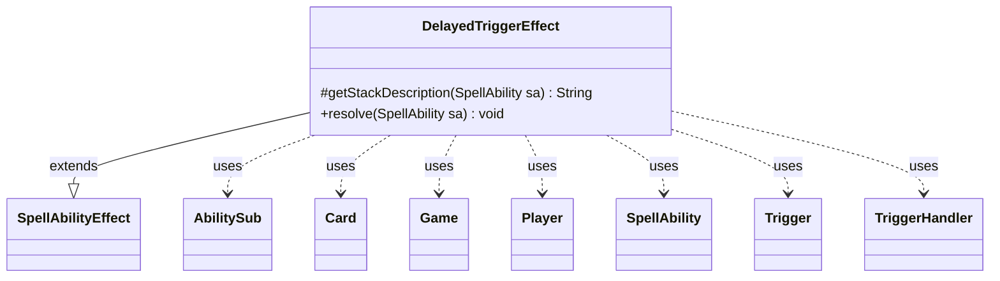

---
aliases:
  - DelayedTriggerEffect
tags:
  - java/class
  - module/forge-game
  - pkg/forge/game/ability/effects
fqn: forge.game.ability.effects.DelayedTriggerEffect
package: forge.game.ability.effects
module: forge-game
kind: Class
---

# DelayedTriggerEffect

**Package:** `forge.game.ability.effects`   **Module:** `forge-game`   **Kind:** Class



## Relationships
**Extends:**
- [[forge.game.ability.SpellAbilityEffect|SpellAbilityEffect]]
**Uses:**
- [[forge.game.Game|Game]]
- [[forge.game.card.Card|Card]]
- [[forge.game.player.Player|Player]]
- [[forge.game.spellability.AbilitySub|AbilitySub]]
- [[forge.game.spellability.SpellAbility|SpellAbility]]
- [[forge.game.trigger.Trigger|Trigger]]
- [[forge.game.trigger.TriggerHandler|TriggerHandler]]

## Design Description

`DelayedTriggerEffect` is a `SpellAbilityEffect` implementation that, when resolved, constructs and registers a delayed trigger — a one-shot triggered ability scheduled to fire later rather than immediately. Its core responsibility is translating an ability's parameter map into a `Trigger` via `TriggerHandler.parseTrigger`, attaching the spawning ability, any remembered objects/numbers/SVar amounts, and an optional overriding `Execute` ability (capturing transform state for `SetState` cases), then handing it to the game's `TriggerHandler`.

The design intent centers on flexible scheduling: timing keywords (`DelayedTriggerDefinedPlayer`, `ThisTurn`, `NextTurn`, `UpcomingTurn`) select among different registration paths, using the game's cleanup queue to defer registration to future turns. It normalizes `SpellDescription` into `TriggerDescription` and overrides `getStackDescription` so the delayed effect presents meaningful stack text, reflecting the data-driven, parameter-keyed style shared across the `effects` package.

## Source
`forge-game/src/main/java/forge/game/ability/effects/DelayedTriggerEffect.java`

```java
package forge.game.ability.effects;

import java.util.Map;

import com.google.common.collect.Iterables;
import com.google.common.collect.Maps;

import forge.game.Game;
import forge.game.ability.AbilityUtils;
import forge.game.ability.ApiType;
import forge.game.ability.SpellAbilityEffect;
import forge.game.card.Card;
import forge.game.player.Player;
import forge.game.spellability.AbilitySub;
import forge.game.spellability.SpellAbility;
import forge.game.trigger.Trigger;
import forge.game.trigger.TriggerHandler;

public class DelayedTriggerEffect extends SpellAbilityEffect {

    /* (non-Javadoc)
     * @see forge.card.abilityfactory.SpellEffect#resolve(java.util.Map, forge.card.spellability.SpellAbility)
     */
    @Override
    protected String getStackDescription(SpellAbility sa) {
        if (sa.hasParam("TriggerDescription")) {
            return sa.getParam("TriggerDescription");
        }
        if (sa.hasParam("SpellDescription")) {
            return sa.getParam("SpellDescription");
        }

        return "";
    }

    @Override
    public void resolve(SpellAbility sa) {
        final Card host = sa.getHostCard();
        final Game game = host.getGame();
        Map<String, String> mapParams = Maps.newHashMap(sa.getMapParams());

        if (mapParams.containsKey("SpellDescription") && !mapParams.containsKey("TriggerDescription")) {
            mapParams.put("TriggerDescription", mapParams.get("SpellDescription"));
        }
        mapParams.remove("SpellDescription");
        mapParams.remove("Cost");

        final Trigger delTrig = TriggerHandler.parseTrigger(mapParams, host, sa.isIntrinsic(), null);
        delTrig.setSpawningAbility(sa.copy(host, true));
        delTrig.setActiveZone(null);

        if (sa.hasParam("RememberObjects")) {
            delTrig.addRemembered(
                    AbilityUtils.getDefinedEntities(host, sa.getParam("RememberObjects").split(" & "), sa)
            );
        }

        if (sa.hasParam("RememberNumber")) {
            for (final Object o : host.getRemembered()) {
                if (o instanceof Integer) {
                    delTrig.addRemembered(o);
                }
            }
        }

        if (sa.hasParam("RememberSVarAmount")) {
            delTrig.addRemembered(AbilityUtils.calculateAmount(host, sa.getSVar(sa.getParam("RememberSVarAmount")), sa));
        }

        if (sa.hasAdditionalAbility("Execute")) {
            SpellAbility overridingSA = sa.getAdditionalAbility("Execute").copy(host, sa.getActivatingPlayer(), false);
            // need to reset the parent, additionalAbility does set it to this
            if (overridingSA instanceof AbilitySub) {
                ((AbilitySub)overridingSA).setParent(null);
            }
            // Set Transform timestamp when the delayed trigger is created
            if (ApiType.SetState == overridingSA.getApi()) {
                overridingSA.setSVar("StoredTransform", String.valueOf(host.getTransformedTimestamp()));
            }

            delTrig.setOverridingAbility(overridingSA);
        }
        final TriggerHandler trigHandler  = game.getTriggerHandler();
        if (mapParams.containsKey("DelayedTriggerDefinedPlayer")) { // on sb's next turn
            Player p = Iterables.getFirst(AbilityUtils.getDefinedPlayers(host, mapParams.get("DelayedTriggerDefinedPlayer"), sa), null);
            trigHandler.registerPlayerDefinedDelayedTrigger(p, delTrig);
        } else if (mapParams.containsKey("ThisTurn")) {
            trigHandler.registerThisTurnDelayedTrigger(delTrig);
        } else if (mapParams.containsKey("NextTurn")) {
            game.getCleanup().addUntil(() -> trigHandler.registerThisTurnDelayedTrigger(delTrig));
        }  else if (mapParams.containsKey("UpcomingTurn")) {
            game.getCleanup().addUntil(() -> trigHandler.registerDelayedTrigger(delTrig));
        } else {
            trigHandler.registerDelayedTrigger(delTrig);
        }
    }
}
```

## Python
`forge/game/ability/effects/DelayedTriggerEffect.py`

```python
from forge.game.Game import Game
from forge.game.ability.AbilityUtils import AbilityUtils
from forge.game.ability.ApiType import ApiType
from forge.game.ability.SpellAbilityEffect import SpellAbilityEffect
from forge.game.card.Card import Card
from forge.game.player.Player import Player
from forge.game.spellability.AbilitySub import AbilitySub
from forge.game.spellability.SpellAbility import SpellAbility
from forge.game.trigger.Trigger import Trigger
from forge.game.trigger.TriggerHandler import TriggerHandler


class DelayedTriggerEffect(SpellAbilityEffect):

    # (non-Javadoc)
    # @see forge.card.abilityfactory.SpellEffect#resolve(java.util.Map, forge.card.spellability.SpellAbility)
    def getStackDescription(self, sa: SpellAbility) -> str:
        if sa.hasParam("TriggerDescription"):
            return sa.getParam("TriggerDescription")
        if sa.hasParam("SpellDescription"):
            return sa.getParam("SpellDescription")

        return ""

    def resolve(self, sa: SpellAbility) -> None:
        host = sa.getHostCard()
        game = host.getGame()
        mapParams = dict(sa.getMapParams())

        if "SpellDescription" in mapParams and "TriggerDescription" not in mapParams:
            mapParams["TriggerDescription"] = mapParams["SpellDescription"]
        mapParams.pop("SpellDescription", None)
        mapParams.pop("Cost", None)

        delTrig = TriggerHandler.parseTrigger(mapParams, host, sa.isIntrinsic(), None)
        delTrig.setSpawningAbility(sa.copy(host, True))
        delTrig.setActiveZone(None)

        if sa.hasParam("RememberObjects"):
            delTrig.addRemembered(
                AbilityUtils.getDefinedEntities(host, sa.getParam("RememberObjects").split(" & "), sa)
            )

        if sa.hasParam("RememberNumber"):
            for o in host.getRemembered():
                if isinstance(o, int):
                    delTrig.addRemembered(o)

        if sa.hasParam("RememberSVarAmount"):
            delTrig.addRemembered(AbilityUtils.calculateAmount(host, sa.getSVar(sa.getParam("RememberSVarAmount")), sa))

        if sa.hasAdditionalAbility("Execute"):
            overridingSA = sa.getAdditionalAbility("Execute").copy(host, sa.getActivatingPlayer(), False)
            # need to reset the parent, additionalAbility does set it to this
            if isinstance(overridingSA, AbilitySub):
                overridingSA.setParent(None)
            # Set Transform timestamp when the delayed trigger is created
            if ApiType.SetState == overridingSA.getApi():
                overridingSA.setSVar("StoredTransform", str(host.getTransformedTimestamp()))

            delTrig.setOverridingAbility(overridingSA)

        trigHandler = game.getTriggerHandler()
        if "DelayedTriggerDefinedPlayer" in mapParams:  # on sb's next turn
            definedPlayers = AbilityUtils.getDefinedPlayers(host, mapParams["DelayedTriggerDefinedPlayer"], sa)
            p = definedPlayers[0] if definedPlayers else None
            trigHandler.registerPlayerDefinedDelayedTrigger(p, delTrig)
        elif "ThisTurn" in mapParams:
            trigHandler.registerThisTurnDelayedTrigger(delTrig)
        elif "NextTurn" in mapParams:
            game.getCleanup().addUntil(lambda: trigHandler.registerThisTurnDelayedTrigger(delTrig))
        elif "UpcomingTurn" in mapParams:
            game.getCleanup().addUntil(lambda: trigHandler.registerDelayedTrigger(delTrig))
        else:
            trigHandler.registerDelayedTrigger(delTrig)
```
