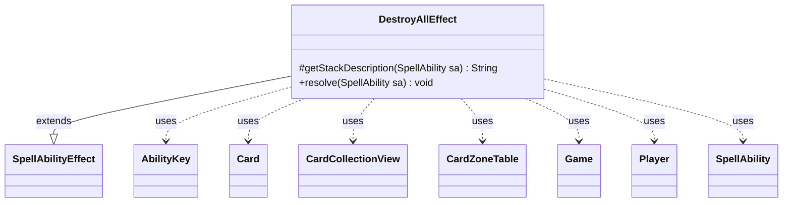

---
aliases:
  - DestroyAllEffect
tags:
  - java/class
  - module/forge-game
  - pkg/forge/game/ability/effects
fqn: forge.game.ability.effects.DestroyAllEffect
package: forge.game.ability.effects
module: forge-game
kind: Class
---

# DestroyAllEffect

**Package:** `forge.game.ability.effects` &nbsp; **Module:** `forge-game` &nbsp; **Kind:** Class



## Relationships
**Extends:**
- [[forge.game.ability.SpellAbilityEffect|SpellAbilityEffect]]
**Uses:**
- [[forge.game.Game|Game]]
- [[forge.game.ability.AbilityKey|AbilityKey]]
- [[forge.game.card.Card|Card]]
- [[forge.game.card.CardCollectionView|CardCollectionView]]
- [[forge.game.card.CardZoneTable|CardZoneTable]]
- [[forge.game.player.Player|Player]]
- [[forge.game.spellability.SpellAbility|SpellAbility]]

## Design Description

DestroyAllEffect implements the resolution logic for "destroy all matching permanents" abilities, a common board-wipe effect in Magic. As a concrete subclass of SpellAbilityEffect, it overrides `getStackDescription` to compose the human-readable stack text and `resolve` to perform the effect when the spell or ability resolves. It collaborates with the Game to gather the battlefield CardCollectionView, then filters that list by the ability's `ValidCards` criteria, optional controlling Player target, and per-card destructibility before destroying each Card.

The design is heavily parameter-driven, branching on SpellAbility params (`NoRegen`, `Optional`, `RememberDestroyed`, `NoRegenValid`, etc.) so a single class serves many card scripts. Notable intent includes ordering destroyed cards by owner for correct graveyard placement, routing zone changes through a shared CardZoneTable/AbilityKey params map so all moves fire as one batched trigger event, and optionally recording destroyed cards back onto the host card via its remembered-objects list.

## Source
`forge-game/src/main/java/forge/game/ability/effects/DestroyAllEffect.java`

```java
package forge.game.ability.effects;

import java.util.Map;

import forge.game.Game;
import forge.game.GameActionUtil;
import forge.game.ability.AbilityKey;
import forge.game.ability.AbilityUtils;
import forge.game.ability.SpellAbilityEffect;
import forge.game.card.Card;
import forge.game.card.CardCollectionView;
import forge.game.card.CardLists;
import forge.game.card.CardZoneTable;
import forge.game.player.Player;
import forge.game.spellability.SpellAbility;
import forge.game.zone.ZoneType;
import forge.util.Localizer;
import forge.util.TextUtil;

public class DestroyAllEffect extends SpellAbilityEffect {

    @Override
    protected String getStackDescription(SpellAbility sa) {
        if (sa.hasParam("SpellDescription")) {
            return sa.getParam("SpellDescription");
        }

        final StringBuilder sb = new StringBuilder();
        final boolean noRegen = sa.hasParam("NoRegen");
        sb.append(sa.getHostCard().getDisplayName()).append(" - Destroy permanents.");

        if (noRegen) {
            sb.append(" They can't be regenerated");
        }

        return sb.toString();
    }

    /* (non-Javadoc)
     * @see forge.card.abilityfactory.SpellEffect#resolve(java.util.Map, forge.card.spellability.SpellAbility)
     */
    @Override
    public void resolve(SpellAbility sa) {
        boolean noRegen = sa.hasParam("NoRegen");
        final Card card = sa.getHostCard();
        final boolean isOptional = sa.hasParam("Optional");
        final Game game = sa.getActivatingPlayer().getGame();
        final String desc = sa.getParamOrDefault("ValidDescription", "");

        Player targetPlayer = sa.getTargets().getFirstTargetedPlayer();
        String valid = sa.getParamOrDefault("ValidCards", "");

        // Ugh. If calculateAmount needs to be called with DestroyAll it _needs_
        // to use the X variable
        // We really need a better solution to this
        if (valid.contains("X")) {
            valid = TextUtil.fastReplace(valid,
                    "X", Integer.toString(AbilityUtils.calculateAmount(card, "X", sa)));
        }

        CardCollectionView list = game.getCardsIn(ZoneType.Battlefield);

        if (targetPlayer != null) {
            list = CardLists.filterControlledBy(list, targetPlayer);
        }

        list = AbilityUtils.filterListByType(list, valid, sa);

        final boolean remDestroyed = sa.hasParam("RememberDestroyed");
        if (remDestroyed) {
            card.clearRemembered();
        }

        if (sa.hasParam("RememberAllObjects")) {
            card.addRemembered(list);
        }
        if (list.isEmpty() && isOptional) {
            return;
        }
        if (isOptional && !sa.getActivatingPlayer().getController().confirmAction(sa, null, Localizer.getInstance().getMessage("lblWouldYouLikeDestroy", desc), null)) {
            return;
        }
        // exclude cards that can't be destroyed at this moment
        list = CardLists.filter(list, Card::canBeDestroyed);

        list = GameActionUtil.orderCardsByTheirOwners(game, list, ZoneType.Graveyard, sa);

        Map<AbilityKey, Object> params = AbilityKey.newMap();
        CardZoneTable zoneMovements = AbilityKey.addCardZoneTableParams(params, sa);

        for (Card c : list) {
            if (sa.hasParam("NoRegenValid")) {
                noRegen = c.isValid(sa.getParam("NoRegenValid"), sa.getActivatingPlayer(), card, sa);
            }
            if (game.getAction().destroy(c, sa, !noRegen, params) && remDestroyed) {
                card.addRemembered(zoneMovements.getLastStateBattlefield().get(c));
            }
        }

        zoneMovements.triggerChangesZoneAll(game, sa);
    }

}
```
