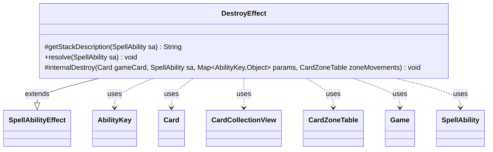

---
aliases:
  - DestroyEffect
tags:
  - java/class
  - module/forge-game
  - pkg/forge/game/ability/effects
fqn: forge.game.ability.effects.DestroyEffect
package: forge.game.ability.effects
module: forge-game
kind: Class
---

# DestroyEffect

**Package:** `forge.game.ability.effects` &nbsp; **Module:** `forge-game` &nbsp; **Kind:** Class



## Relationships
**Extends:**
- [[forge.game.ability.SpellAbilityEffect|SpellAbilityEffect]]
**Uses:**
- [[forge.game.Game|Game]]
- [[forge.game.ability.AbilityKey|AbilityKey]]
- [[forge.game.card.Card|Card]]
- [[forge.game.card.CardCollectionView|CardCollectionView]]
- [[forge.game.card.CardZoneTable|CardZoneTable]]
- [[forge.game.spellability.SpellAbility|SpellAbility]]

## Design Description

DestroyEffect implements the resolution logic for "destroy" abilities in Forge's card-effect framework. As a concrete subclass of SpellAbilityEffect, it overrides `getStackDescription` to render human-readable text (handling Radiance and no-regeneration variants) and `resolve` to carry out the destruction. During resolution it gathers both directly targeted cards and Radiance-induced collateral targets, orders them by owner for graveyard placement, and routes each through a shared `internalDestroy` helper that delegates the actual state change to the Game's action system.

The design centralizes per-card destruction in `internalDestroy` so targeted and untargeted cards share identical handling of regeneration, remembered-card bookkeeping (RememberDestroyed, AlwaysRemember, RememberLKI), and replacement-ability cause tracking. It carefully validates each card's in-play status and game timestamp before acting—guarding against stale last-known-information references—and accumulates all moves in a CardZoneTable so zone-change triggers fire collectively once the effect completes.

## Source
`forge-game/src/main/java/forge/game/ability/effects/DestroyEffect.java`

```java
package forge.game.ability.effects;

import java.util.List;
import java.util.Map;

import forge.game.Game;
import forge.game.GameActionUtil;
import forge.game.ability.AbilityKey;
import forge.game.ability.SpellAbilityEffect;
import forge.game.card.Card;
import forge.game.card.CardCollectionView;
import forge.game.card.CardUtil;
import forge.game.card.CardZoneTable;
import forge.game.spellability.SpellAbility;
import forge.game.zone.ZoneType;
import forge.util.Lang;

public class DestroyEffect extends SpellAbilityEffect {
    @Override
    protected String getStackDescription(SpellAbility sa) {
        final boolean noRegen = sa.hasParam("NoRegen");
        final StringBuilder sb = new StringBuilder();

        final List<Card> tgtCards = getTargetCards(sa);
        // up to X targets and chose 0 or similar situations
        if (tgtCards.isEmpty()) return sa.getParamOrDefault("SpellDescription", "");
        final boolean justOne = tgtCards.size() == 1;

        sb.append("Destroy ").append(Lang.joinHomogenous(tgtCards));

        if (sa.hasParam("Radiance")) {
            final String thing = sa.getParamOrDefault("ValidTgts", "thing");
            sb.append(" and each other ").append(thing).append(" that shares a color with ");
            sb.append(justOne ? "it" : "them");
        }

        if (noRegen) {
            sb.append(". ").append(justOne ? "It" : "They").append(" can't be regenerated");
        }
        sb.append(".");

        return sb.toString();
    }

    @Override
    public void resolve(SpellAbility sa) {
        final Card host = sa.getHostCard();
        final Game game = host.getGame();

        if (sa.hasParam("RememberDestroyed")) {
            host.clearRemembered();
        }

        CardCollectionView untargetedCards = CardUtil.getRadiance(sa);
        CardCollectionView tgtCards = getTargetCards(sa);

        tgtCards = GameActionUtil.orderCardsByTheirOwners(game, tgtCards, ZoneType.Graveyard, sa);
        untargetedCards = GameActionUtil.orderCardsByTheirOwners(game, untargetedCards, ZoneType.Graveyard, sa);

        Map<AbilityKey, Object> params = AbilityKey.newMap();
        CardZoneTable zoneMovements = AbilityKey.addCardZoneTableParams(params, sa);

        for (final Card tgtC : tgtCards) {
            if (!tgtC.isInPlay()) {
                continue;
            }
            Card gameCard = game.getCardState(tgtC, null);
            // gameCard is LKI in that case, the card is not in game anymore
            // or the timestamp did change
            // this should check Self too
            if (gameCard == null || !tgtC.equalsWithGameTimestamp(gameCard)) {
                continue;
            }
            internalDestroy(gameCard, sa, params, zoneMovements);
        }

        for (final Card unTgtC : untargetedCards) {
            if (unTgtC.isInPlay()) {
                internalDestroy(unTgtC, sa, params, zoneMovements);
            }
        }

        zoneMovements.triggerChangesZoneAll(game, sa);
    }

    protected void internalDestroy(Card gameCard, SpellAbility sa, Map<AbilityKey, Object> params, CardZoneTable zoneMovements) {
        final Card host = sa.getHostCard();
        final Game game = host.getGame();
        final boolean remDestroyed = sa.hasParam("RememberDestroyed");
        final boolean noRegen = sa.hasParam("NoRegen");
        final boolean alwaysRem = sa.hasParam("AlwaysRemember");

        SpellAbility cause = sa;
        if (sa.isReplacementAbility()) {
            cause = (SpellAbility) sa.getReplacingObject(AbilityKey.Cause);
        }

        boolean destroyed = game.getAction().destroy(gameCard, cause, !noRegen, params);
        if (destroyed && remDestroyed) {
            host.addRemembered(gameCard);
        }
        if ((destroyed || alwaysRem) && sa.hasParam("RememberLKI")) {
            host.addRemembered(zoneMovements.getLastStateBattlefield().get(gameCard));
        }
    }

}
```
