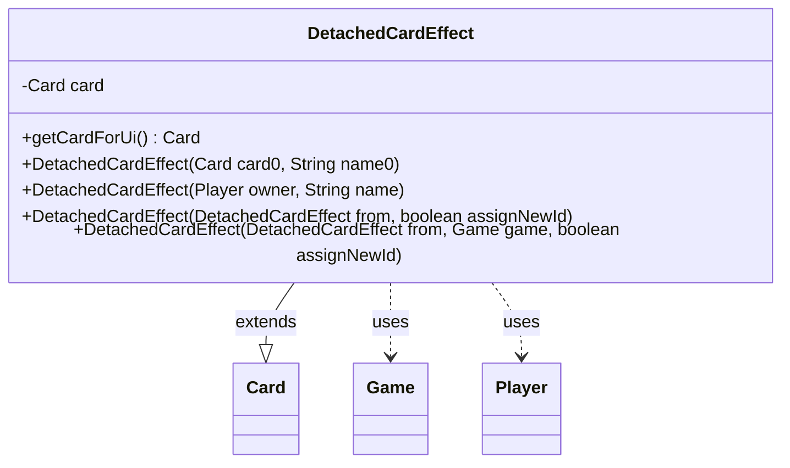

---
aliases:
  - DetachedCardEffect
tags:
  - java/class
  - module/forge-game
  - pkg/forge/game/ability/effects
fqn: forge.game.ability.effects.DetachedCardEffect
package: forge.game.ability.effects
module: forge-game
kind: Class
---

# DetachedCardEffect

**Package:** `forge.game.ability.effects` &nbsp; **Module:** `forge-game` &nbsp; **Kind:** Class



## Relationships
**Extends:**
- [[forge.game.card.Card|Card]]
**Uses:**
- [[forge.game.Game|Game]]
- [[forge.game.player.Player|Player]]

## Design Description

`DetachedCardEffect` represents a game effect that exists as a standalone card rather than being attached to an existing one — the Commander Effect being the canonical example. By extending `Card`, it can participate in the game like any other card object while marking itself as a non-rendered `EFFECT` game piece, so it carries game state without appearing as a normal card in the UI.

The class holds an optional reference to a linked source `Card`, which it exposes through the overridden `getCardForUi()` so display logic can borrow that card's appearance. Its constructors handle the distinct creation paths: deriving from a source card, instantiating bare against a `Player` owner, and copying an existing effect (optionally into another `Game` with a fresh or preserved id). The copy constructor only transfers owner and effect source when the target `Game` matches, reflecting careful handling of cross-game cloning during state duplication.

## Source
`forge-game/src/main/java/forge/game/ability/effects/DetachedCardEffect.java`

```java
package forge.game.ability.effects;

import forge.card.GamePieceType;
import forge.game.Game;
import forge.game.card.Card;
import forge.game.player.Player;

//Class for an effect that acts as its own card instead of being attached to a card
//Example: Commander Effect
public class DetachedCardEffect extends Card {
    private Card card; //card linked to effect

    public DetachedCardEffect(Card card0, String name0) {
        super(card0.getOwner().getGame().nextCardId(), card0.getPaperCard(), card0.getOwner().getGame());
        card = card0;

        this.renderForUi = false;
        setName(name0);
        setOwner(card0.getOwner());
        setGamePieceType(GamePieceType.EFFECT);

        setEffectSource(card0);
    }

    public DetachedCardEffect(Player owner, String name) {
        super(owner.getGame().nextCardId(), null, owner.getGame());
        this.card = null;
        this.renderForUi = false;

        this.setName(name);
        this.setOwner(owner);
        this.setGamePieceType(GamePieceType.EFFECT);
    }

    public DetachedCardEffect(DetachedCardEffect from, boolean assignNewId) {
        this(from, from.getGame(), assignNewId);
    }

    public DetachedCardEffect(DetachedCardEffect from, Game game, boolean assignNewId) {
        super(assignNewId ? game.nextCardId() : from.id, from.getPaperCard(), game);
        this.renderForUi = from.renderForUi;
        this.setName(from.getName());
        this.setGamePieceType(GamePieceType.EFFECT);
        if(from.getGame() == game) {
            this.setOwner(from.getOwner());
            this.setEffectSource(from.getEffectSource());
        }
    }

    @Override
    public Card getCardForUi() {
        return card; //use linked card for the sake of UI display logic
    }
}
```
