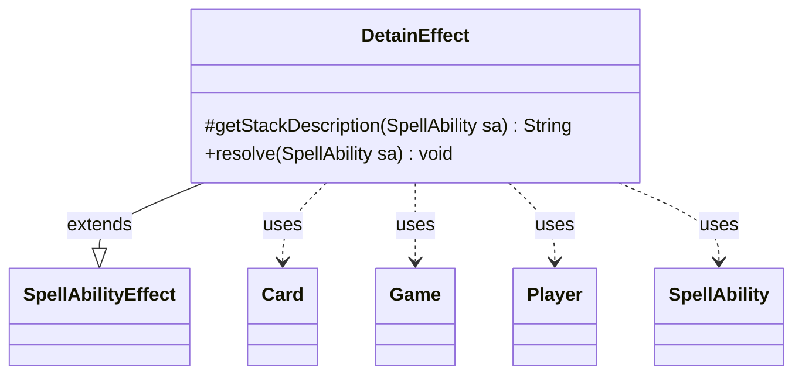

---
aliases:
  - DetainEffect
tags:
  - java/class
  - module/forge-game
  - pkg/forge/game/ability/effects
fqn: forge.game.ability.effects.DetainEffect
package: forge.game.ability.effects
module: forge-game
kind: Class
---

# DetainEffect

**Package:** `forge.game.ability.effects`   **Module:** `forge-game`   **Kind:** Class



## Relationships
**Extends:**
- [[forge.game.ability.SpellAbilityEffect|SpellAbilityEffect]]
**Uses:**
- [[forge.game.Game|Game]]
- [[forge.game.card.Card|Card]]
- [[forge.game.player.Player|Player]]
- [[forge.game.spellability.SpellAbility|SpellAbility]]

## Design Description

DetainEffect implements the game logic for the Magic: The Gathering "detain" keyword action as a concrete spell ability resolver. As a subclass of SpellAbilityEffect, it overrides `getStackDescription` to render a human-readable stack entry and `resolve` to apply the effect when the ability resolves, fitting into Forge's effect-dispatch framework where each keyword or ability maps to a dedicated effect class.

On resolution it detains each targeted Card on behalf of the activating Player, then registers a cleanup callback with the Game's cleanup scheduler to lift the detained state at the appropriate time. Collaborating with Card, Player, Game, and SpellAbility, the class keeps its responsibility narrow—delegating the actual state changes to Card.detain and deferring removal through the game's until-cleanup mechanism rather than tracking duration itself.

## Source
`forge-game/src/main/java/forge/game/ability/effects/DetainEffect.java`

```java
package forge.game.ability.effects;

import forge.game.Game;
import forge.game.ability.SpellAbilityEffect;
import forge.game.card.Card;
import forge.game.player.Player;
import forge.game.spellability.SpellAbility;

public class DetainEffect extends SpellAbilityEffect {

    @Override
    protected String getStackDescription(SpellAbility sa) {
        return "Detain " + getTargetCards(sa) + " .";
    }

    @Override
    public void resolve(SpellAbility sa) {
        final Player pl = sa.getActivatingPlayer();
        final Game game = pl.getGame();
        for (final Card c : getTargetCards(sa)) {
            c.detain(pl);
            game.getCleanup().addUntil(pl, () -> c.removeDetainedBy(pl));
        }
    }
}
```

## Python
`forge/game/ability/effects/DetainEffect.py`

```python
from forge.game.Game import Game
from forge.game.ability.SpellAbilityEffect import SpellAbilityEffect
from forge.game.card.Card import Card
from forge.game.player.Player import Player
from forge.game.spellability.SpellAbility import SpellAbility


class DetainEffect(SpellAbilityEffect):

    def getStackDescription(self, sa: SpellAbility) -> str:
        return "Detain " + str(self.getTargetCards(sa)) + " ."

    def resolve(self, sa: SpellAbility) -> None:
        pl = sa.getActivatingPlayer()
        game = pl.getGame()
        for c in self.getTargetCards(sa):
            c.detain(pl)
            game.getCleanup().addUntil(pl, lambda c=c: c.removeDetainedBy(pl))
```
