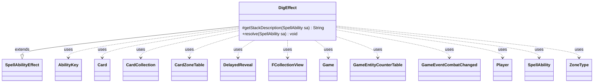

---
aliases:
  - DigEffect
tags:
  - java/class
  - module/forge-game
  - pkg/forge/game/ability/effects
fqn: forge.game.ability.effects.DigEffect
package: forge.game.ability.effects
module: forge-game
kind: Class
---

# DigEffect

**Package:** `forge.game.ability.effects` &nbsp; **Module:** `forge-game` &nbsp; **Kind:** Class



## Relationships
**Extends:**
- [[forge.game.ability.SpellAbilityEffect|SpellAbilityEffect]]
**Uses:**
- [[forge.game.Game|Game]]
- [[forge.game.GameEntityCounterTable|GameEntityCounterTable]]
- [[forge.game.ability.AbilityKey|AbilityKey]]
- [[forge.game.card.Card|Card]]
- [[forge.game.card.CardCollection|CardCollection]]
- [[forge.game.card.CardZoneTable|CardZoneTable]]
- [[forge.game.event.GameEventCombatChanged|GameEventCombatChanged]]
- [[forge.game.player.DelayedReveal|DelayedReveal]]
- [[forge.game.player.Player|Player]]
- [[forge.game.spellability.SpellAbility|SpellAbility]]
- [[forge.game.zone.ZoneType|ZoneType]]
- [[forge.util.collect.FCollectionView|FCollectionView]]

## Design Description

DigEffect implements the resolution of "dig"-style abilities, where a player looks at, reveals, or exiles a number of cards from the top of a library (or other source zone) and distributes them between two destination zones. As a concrete subclass of SpellAbilityEffect, it overrides `getStackDescription` to compose a human-readable summary and `resolve` to perform the effect, deriving all behavior from script parameters (DigNum, ChangeNum, DestinationZone, Reveal, WithCounters, and many others).

The design deliberately consolidates many card-advantage abilities into one highly configurable handler rather than separate effects, with branching parameters for optional choices, random or CMC-bounded selection, counters, control gain, and face-down exile. It manipulates Card and CardCollection instances, uses DelayedReveal to govern player visibility, batches moves through a CardZoneTable and counter additions through a GameEntityCounterTable for consolidated triggering, and fires GameEventCombatChanged when cards enter combat.

## Source
`forge-game/src/main/java/forge/game/ability/effects/DigEffect.java`

```java
package forge.game.ability.effects;

import java.util.*;

import forge.card.MagicColor;
import forge.game.Game;
import forge.game.GameActionUtil;
import forge.game.GameEntityCounterTable;
import forge.game.ability.AbilityKey;
import forge.game.ability.AbilityUtils;
import forge.game.ability.SpellAbilityEffect;
import forge.game.card.*;
import forge.game.event.GameEventCombatChanged;
import forge.game.player.DelayedReveal;
import forge.game.player.Player;
import forge.game.player.PlayerView;
import forge.game.spellability.SpellAbility;
import forge.game.zone.ZoneType;
import forge.util.Lang;
import forge.util.Localizer;
import forge.util.TextUtil;
import forge.util.collect.FCollectionView;
import org.apache.commons.lang3.StringUtils;

public class DigEffect extends SpellAbilityEffect {

    @Override
    protected String getStackDescription(SpellAbility sa) {
        final Card host = sa.getHostCard();
        final StringBuilder sb = new StringBuilder();
        final List<Player> tgtPlayers = getTargetPlayers(sa);
        final String spellDesc = sa.getParamOrDefault("SpellDescription", "");
        if (spellDesc.contains("X card")) { // X value can be changed after this goes to the stack, so use set desc
            sb.append("[").append(host.getController()).append("] ").append(spellDesc);
        } else {
            final int numToDig = AbilityUtils.calculateAmount(host, sa.getParam("DigNum"), sa);
            final String toChange = sa.getParamOrDefault("ChangeNum", "1");
            final int numToChange = toChange.equals("All") || toChange.equals("Any") ? numToDig : AbilityUtils.calculateAmount(host, toChange, sa);

            String verb = " looks at ";
            if (sa.hasParam("DestinationZone") && sa.getParam("DestinationZone").equals("Exile") &&
                    numToDig == numToChange) {
                verb = " exiles ";
            } else if (sa.hasParam("Reveal") && sa.getParam("Reveal").equals("True")) {
                verb = " reveals ";
            }
            sb.append(host.getController()).append(verb).append("the top ");
            sb.append(numToDig == 1 ? "card" : Lang.getNumeral(numToDig) + " cards").append(" of ");

            if (tgtPlayers.contains(host.getController())) {
                sb.append("their ");
            } else {
                for (final Player p : tgtPlayers) {
                    sb.append(Lang.getInstance().getPossesive(p.getName())).append(" ");
                }
            }
            sb.append("library.");

            if (numToDig != numToChange) {
                String destZone1 = sa.hasParam("DestinationZone") ?
                        sa.getParam("DestinationZone").toLowerCase() : "hand";
                String destZone2 = sa.hasParam("DestinationZone2") ?
                        sa.getParam("DestinationZone2").toLowerCase() : "on the bottom of their library in any order.";
                if (sa.hasParam("RestRandomOrder")) {
                    destZone2 = destZone2.replace("any", "a random");
                }

                String verb2 = "put ";
                String where = " into their hand ";
                if (destZone1.equals("exile")) {
                    verb2 = "exile ";
                    where = " ";
                } else if (destZone1.equals("battlefield")) {
                    verb2 = "put ";
                    where = " onto the battlefield ";
                }

                sb.append(" They ").append(sa.hasParam("Optional") ? "may " : "").append(verb2);
                if (sa.hasParam("ChangeValid")) {
                    String what = sa.hasParam("ChangeValidDesc") ? sa.getParam("ChangeValidDesc") :
                        sa.getParam("ChangeValid").toLowerCase();
                    if (!StringUtils.containsIgnoreCase(what, "card")) {
                        what = what + " card";
                    }
                    sb.append(Lang.nounWithNumeralExceptOne(numToChange, what)).append(" from among them").append(where);
                } else {
                    sb.append(Lang.getNumeral(numToChange)).append(" of them").append(where);
                }
                sb.append(sa.hasParam("ExileFaceDown") ? "face down " : "");
                if (sa.hasParam("WithCounters") || sa.hasParam("ExileWithCounters")) {
                    String ctr = sa.hasParam("WithCounters") ? sa.getParam("WithCounters") :
                        sa.getParam("ExileWithCounters");
                    sb.append("with a ");
                    sb.append(CounterType.getType(ctr).getName().toLowerCase());
                    sb.append(" counter on it. They ");
                } else {
                    sb.append("and ");
                }
                sb.append("put the rest ").append(destZone2);
            }
        }
        return sb.toString();
    }

    @Override
    public void resolve(SpellAbility sa) {
        final Card host = sa.getHostCard();
        final Player activator = sa.getActivatingPlayer();
        final Game game = activator.getGame();
        final Player cont = host.getController();
        Player chooser = activator;
        int digNum = AbilityUtils.calculateAmount(host, sa.getParam("DigNum"), sa);

        final ZoneType srcZone = sa.hasParam("SourceZone") ? ZoneType.smartValueOf(sa.getParam("SourceZone")) : ZoneType.Library;

        final ZoneType destZone1 = sa.hasParam("DestinationZone") ? ZoneType.smartValueOf(sa.getParam("DestinationZone")) : ZoneType.Hand;
        final ZoneType destZone2 = sa.hasParam("DestinationZone2") ? ZoneType.smartValueOf(sa.getParam("DestinationZone2")) : ZoneType.Library;

        final int libraryPosition = sa.hasParam("LibraryPosition") ? Integer.parseInt(sa.getParam("LibraryPosition")) : -1;
        final int libraryPosition2 = sa.hasParam("LibraryPosition2") ? Integer.parseInt(sa.getParam("LibraryPosition2")) : -1;

        String changeValid = sa.getParamOrDefault("ChangeValid", "");
        final boolean optional = sa.hasParam("Optional");
        final boolean skipReorder = sa.hasParam("SkipReorder");

        // A hack for cards like Explorer's Scope that need to ensure that a card is revealed to the player activating the ability
        final boolean forceReveal = sa.hasParam("ForceRevealToController")
                || sa.hasParam("ForceReveal") || sa.hasParam("WithMayLook");

        // These parameters are used to indicate that a dialog box must be show to the player asking if the player wants to proceed
        // with an optional ability, otherwise the optional ability is skipped.
        final boolean mayBeSkipped = sa.hasParam("PromptToSkipOptionalAbility");
        final String optionalAbilityPrompt = sa.getParam("OptionalAbilityPrompt");

        boolean remZone1 = false;
        boolean remZone2 = false;
        if (sa.hasParam("RememberChanged")) {
            remZone1 = true;
        }
        if (sa.hasParam("RememberMovedToZone")) {
            if (sa.getParam("RememberMovedToZone").contains("1")) {
                remZone1 = true;
            }
            if (sa.getParam("RememberMovedToZone").contains("2")) {
                remZone2 = true;
            }
        }

        boolean totalCMC = sa.hasParam("WithTotalCMC");
        int totcmc = AbilityUtils.calculateAmount(host, sa.getParam("WithTotalCMC"), sa);

        int destZone1ChangeNum = 1;
        boolean changeAll = false;
        boolean anyNumber = false;
        if (sa.hasParam("ChangeNum")) {
            if (sa.getParam("ChangeNum").equalsIgnoreCase("All")) {
                changeAll = true;
            } else if (sa.getParam("ChangeNum").equalsIgnoreCase("Any")) {
                anyNumber = true;
            } else {
                destZone1ChangeNum = AbilityUtils.calculateAmount(host, sa.getParam("ChangeNum"), sa);
            }
        }

        CardZoneTable zoneMovements = new CardZoneTable(game.copyLastStateBattlefield(), game.copyLastStateGraveyard());
        GameEntityCounterTable counterTable = new GameEntityCounterTable();
        boolean combatChanged = false;

        for (final Player p : getDefinedPlayersOrTargeted(sa)) {
            if (!p.isInGame()) {
                continue;
            }

            final CardCollection top = new CardCollection();
            final CardCollection rest = new CardCollection();
            CardCollection all = new CardCollection(p.getCardsIn(srcZone));

            if (sa.hasParam("FromBottom")) {
                Collections.reverse(all);
            }

            int numToDig = Math.min(digNum, all.size());
            for (int i = 0; i < numToDig; i++) {
                top.add(all.get(i));
            }

            if (!top.isEmpty()) {
                DelayedReveal delayedReveal = null;
                boolean hasRevealed = true;
                if (sa.hasParam("Reveal") && "True".equalsIgnoreCase(sa.getParam("Reveal"))) {
                    game.getAction().reveal(top, p, false);
                }
                else if (sa.hasParam("RevealOptional")) {
                    hasRevealed = p.getController().confirmAction(sa, null, Localizer.getInstance().getMessage("lblRevealCardToOtherPlayers"), null);
                    if (hasRevealed) {
                        game.getAction().reveal(top, p);
                    }
                }
                else if (!sa.hasParam("NoLooking")) {
                    // show the user the revealed cards
                    delayedReveal = new DelayedReveal(top, srcZone, PlayerView.get(p), host.getTranslatedName() + " - " + Localizer.getInstance().getMessage("lblLookingCardIn") + " ");
                }

                if (sa.hasParam("RememberRevealed") && hasRevealed) {
                    host.addRemembered(top);
                }
                if (sa.hasParam("ImprintRevealed") && hasRevealed) {
                    host.addImprintedCards(top);
                }
                if (sa.hasParam("Choser")) {
                    final FCollectionView<Player> choosers = AbilityUtils.getDefinedPlayers(host, sa.getParam("Choser"), sa);
                    if (!choosers.isEmpty()) {
                        chooser = activator.getController().chooseSingleEntityForEffect(choosers, null, sa, Localizer.getInstance().getMessage("lblChooser") + ":", false, p, null);
                    }
                    if (sa.hasParam("SetChosenPlayer")) {
                        host.setChosenPlayer(chooser);
                    }
                }

                rest.addAll(top);
                CardCollection valid = top;
                if (totalCMC) {
                    valid = CardLists.getValidCards(valid, "Card.cmcLE" + totcmc, cont, host, sa);
                }
                if (!changeValid.isEmpty()) {
                    if (changeValid.contains("ChosenType")) {
                        changeValid = changeValid.replace("ChosenType", host.getChosenType());
                    }
                    valid = CardLists.getValidCards(valid, changeValid, cont, host, sa);
                } else if (!totalCMC && p == chooser && destZone1ChangeNum > 1) {
                    // If all the cards are valid choices, no need for a separate reveal dialog to the chooser
                    delayedReveal = null;
                }

                if (forceReveal) {
                    // Force revealing the card to defined (e.g. Gonti, Night Minister) or the player activating the
                    // ability (e.g. Explorer's Scope)
                    Player revealTo = sa.hasParam("ForceReveal") ?
                            getDefinedPlayersOrTargeted(sa, "ForceReveal").get(0) : activator;
                    game.getAction().revealTo(top, revealTo);
                    delayedReveal = null; // top is already seen by the player, do not reveal twice
                }

                // Optional abilities that use a dialog box to prompt the user to skip the ability (e.g. Explorer's Scope, Quest for Ula's Temple)
                if (optional && mayBeSkipped && !valid.isEmpty()) {
                    String prompt = optionalAbilityPrompt != null ? optionalAbilityPrompt : Localizer.getInstance().getMessage("lblWouldYouLikeProceedWithOptionalAbility") + " " + host + "?\n\n(" + sa.getDescription() + ")";
                    if (!p.getController().confirmAction(sa, null, TextUtil.fastReplace(prompt, "CARDNAME", host.getTranslatedName()), null)) {
                        return;
                    }
                }

                CardCollection movedCards;
                if (changeAll) {
                    movedCards = new CardCollection(valid);
                } else if (sa.hasParam("RandomChange")) {
                    int numChanging = Math.min(destZone1ChangeNum, valid.size());
                    movedCards = CardLists.getRandomSubList(valid, numChanging);
                } else if (totalCMC) {
                    movedCards = new CardCollection();
                    if (p == chooser) {
                        chooser.getController().tempShowCards(top);
                    }
                    if (valid.isEmpty()) {
                        chooser.getController().notifyOfValue(sa, null,
                                Localizer.getInstance().getMessage("lblNoValidCards"));
                    }
                    while (!valid.isEmpty() && (anyNumber || movedCards.size() < destZone1ChangeNum)) {
                        Card chosen = chooser.getController().chooseSingleEntityForEffect(valid, delayedReveal, sa,
                                Localizer.getInstance().getMessage("lblChooseOne"), anyNumber || optional, p, null);
                        if (chosen == null) {
                            //if they can and did choose nothing, we're done here
                            break;
                        }
                        movedCards.add(chosen);
                        valid.remove(chosen);
                        totcmc = totcmc - chosen.getCMC();
                        valid = CardLists.getValidCards(valid, "Card.cmcLE" + totcmc, cont, host, sa);
                    }
                    chooser.getController().endTempShowCards();
                    if (!movedCards.isEmpty()) {
                        game.getAction().reveal(movedCards, chooser, true,
                                Localizer.getInstance().getMessage("lblPlayerPickedChosen",
                                        chooser.getName(), ""));
                    }
                } else if (sa.hasParam("ForEachColorPair")) {
                    movedCards = new CardCollection();
                    if (p == chooser) {
                        chooser.getController().tempShowCards(top);
                    }
                    for (final byte pair : MagicColor.COLORPAIR) {
                        Card chosen = chooser.getController().chooseSingleEntityForEffect(CardLists.filter(valid,
                                CardPredicates.isExactlyColor(pair)), delayedReveal, sa,
                                Localizer.getInstance().getMessage("lblChooseOne"), false, p, null);
                        if (chosen != null) {
                            movedCards.add(chosen);
                        }
                    }
                    chooser.getController().endTempShowCards();
                    if (!movedCards.isEmpty()) {
                        game.getAction().reveal(movedCards, chooser, true, Localizer.getInstance().getMessage("lblPlayerPickedChosen", chooser.getName(), ""));
                    }
                } else if (sa.hasParam("WithDifferentPowers")) {
                    movedCards = new CardCollection();
                    while (!valid.isEmpty() && (anyNumber || movedCards.size() < destZone1ChangeNum)) {
                        String title = Localizer.getInstance().getMessage(movedCards.isEmpty()?"lblChooseCreature":"lblChooseCreatureWithDiffPower");
                        Card choice = p.getController().chooseSingleEntityForEffect(valid, sa, title, true, null);
                        if (choice == null) {
                            break;
                        }
                        movedCards.add(choice);
                        valid = CardLists.getValidCards(valid, "Card.powerNE" + choice.getNetPower(), activator, host, sa);
                    }
                } else {
                    String prompt;

                    if (sa.hasParam("PrimaryPrompt")) {
                        prompt = sa.getParam("PrimaryPrompt");
                    } else {
                        prompt = Localizer.getInstance().getMessage("lblChooseCardsPutIntoZone", destZone1.getTranslatedName());
                        if (destZone1.equals(ZoneType.Library)) {
                            if (!destZone2.equals(ZoneType.Library) && destZone1ChangeNum == 1) {
                                if (libraryPosition == 0) {
                                    prompt = Localizer.getInstance().getMessage("lblChooseACardToLeaveTargetLibraryTop", p.getName());
                                } else {
                                    prompt = Localizer.getInstance().getMessage("lblChooseACardLeaveTarget", p.getName(), destZone1.getTranslatedName());
                                }
                            } else if (libraryPosition == -1) {
                                prompt = Localizer.getInstance().getMessage("lblChooseCardPutOnTargetLibraryBottom", p.getName());
                            } else if (libraryPosition == 0) {
                                prompt = Localizer.getInstance().getMessage("lblChooseCardPutOnTargetLibraryTop", p.getName());
                            }
                        }
                    }

                    movedCards = new CardCollection();
                    if (valid.isEmpty()) {
                        chooser.getController().notifyOfValue(sa, null, Localizer.getInstance().getMessage("lblNoValidCards"));
                    } else {
                        if (p == chooser) { // the digger can still see all the dug cards when choosing
                            chooser.getController().tempShowCards(top);
                        }

                        int max = anyNumber ? valid.size() : Math.min(valid.size(), destZone1ChangeNum);
                        int min = (anyNumber || optional) ? 0 : max;
                        if (max > 0) { // if max is 0 don't make a choice
                            movedCards.addAll(chooser.getController().chooseEntitiesForEffect(valid, min, max, delayedReveal, sa, prompt, p, null));
                        }

                        chooser.getController().endTempShowCards();
                    }

                    if (!changeValid.isEmpty() && !sa.hasParam("ExileFaceDown") && !sa.hasParam("NoReveal")) {
                        game.getAction().reveal(movedCards, chooser, true, Localizer.getInstance().getMessage("lblPlayerPickedCardFrom", chooser.getName()));
                    }
                }
                if (sa.hasParam("ForgetOtherRemembered")) {
                    host.clearRemembered();
                }
                Collections.reverse(movedCards);

                if (destZone1.equals(ZoneType.Battlefield) || destZone1.equals(ZoneType.Library)) {
                    if (sa.hasParam("GainControl")) {
                        // for Cybership
                        movedCards = (CardCollection) activator.getController().orderMoveToZoneList(rest, destZone2, sa);
                    } else {
                        movedCards = (CardCollection) GameActionUtil.orderCardsByTheirOwners(game, movedCards, destZone1, sa);
                    }
                }

                for (Card c : movedCards) {
                    Map<AbilityKey, Object> moveParams = AbilityKey.newMap();
                    AbilityKey.addCardZoneTableParams(moveParams, zoneMovements);

                    if (destZone1.isDeck()) {
                        c = game.getAction().moveTo(destZone1, c, libraryPosition, sa, AbilityKey.newMap());
                    } else {
                        if (destZone1.equals(ZoneType.Exile) && !c.canExiledBy(sa, true)) {
                            continue;
                        }

                        if (sa.hasParam("Tapped")) {
                            c.setTapped(true);
                        }
                        if (sa.hasParam("FaceDown")) {
                            c.turnFaceDown(true);
                            CardFactoryUtil.setFaceDownState(c, sa);
                        }
                        if (destZone1.equals(ZoneType.Battlefield)) {
                            moveParams.put(AbilityKey.SimultaneousETB, movedCards);
                            if (sa.hasParam("GainControl")) {
                                c.setController(activator, game.getNextTimestamp());
                            }
                            if (sa.hasParam("WithCounters")) {
                                final int numCtr = AbilityUtils.calculateAmount(host,
                                        sa.getParamOrDefault("WithCountersAmount", "1"), sa);

                                GameEntityCounterTable table = new GameEntityCounterTable();
                                table.put(activator, c, CounterType.getType(sa.getParam("WithCounters")), numCtr);
                                moveParams.put(AbilityKey.CounterTable, table);
                            }
                        }
                        c = game.getAction().moveTo(c.getController().getZone(destZone1), c, sa, moveParams);
                        if (destZone1.equals(ZoneType.Battlefield)) {
                            if (addToCombat(c, sa, "Attacking", "Blocking")) {
                                combatChanged = true;
                            }
                        } else if (destZone1.equals(ZoneType.Exile)) {
                            if (sa.hasParam("ExileWithCounters")) {
                                c.addCounter(CounterType.getType(sa.getParam("ExileWithCounters")), 1, activator, counterTable);
                            }
                            handleExiledWith(c, sa);
                        }
                    }

                    if (sa.hasParam("ExileFaceDown")) {
                        c.turnFaceDown(true);
                    }
                    if (sa.hasParam("WithMayLook")) {
                        c.addMayLookFaceDownExile(activator);
                    }
                    if (sa.hasParam("Imprint")) {
                        host.addImprintedCard(c);
                    }
                    if (remZone1) {
                        host.addRemembered(c);
                    }
                    rest.remove(c);
                }

                // now, move the rest to destZone2
                if (!rest.isEmpty() && (!sa.hasParam("DestZone2Optional") || p.getController().confirmAction(sa, null,
                        Localizer.getInstance().getMessage("lblDoYouWantPutCardToZone",
                                destZone2.getTranslatedName()), null))) {
                    if (destZone2.isDeck() || destZone2 == ZoneType.Graveyard) {
                        CardCollection afterOrder = rest;
                        if (sa.hasParam("RestRandomOrder")) {
                            CardLists.shuffle(afterOrder);
                        } else if (!skipReorder && rest.size() > 1) {
                            if (destZone2 == ZoneType.Graveyard) {
                                afterOrder = (CardCollection) GameActionUtil.orderCardsByTheirOwners(game, rest, destZone2, sa);
                            } else {
                                afterOrder = (CardCollection) chooser.getController().orderMoveToZoneList(rest, destZone2, sa);
                            }
                        }

                        for (final Card c : afterOrder) {
                            Map<AbilityKey, Object> moveParams = AbilityKey.newMap();
                            AbilityKey.addCardZoneTableParams(moveParams, zoneMovements);

                            Card m = game.getAction().moveTo(destZone2, c, libraryPosition2, sa, moveParams);
                            if (remZone2) {
                                host.addRemembered(m);
                            }
                        }
                    } else {
                        // just move them randomly
                        for (Card c : rest) {
                            Map<AbilityKey, Object> moveParams = AbilityKey.newMap();
                            AbilityKey.addCardZoneTableParams(moveParams, zoneMovements);

                            if (destZone2 == ZoneType.Exile && !c.canExiledBy(sa, true)) {
                                continue;
                            }
                            c = game.getAction().moveTo(destZone2, c, sa, moveParams);
                            if (destZone2 == ZoneType.Exile) {
                                if (sa.hasParam("ExileWithCounters")) {
                                    c.addCounter(CounterType.getType(sa.getParam("ExileWithCounters")), 1, activator, counterTable);
                                }
                                handleExiledWith(c, sa);
                                if (remZone2) {
                                    host.addRemembered(c);
                                }
                            }
                        }
                    }
                }
            }
        }
        if (combatChanged) {
            game.updateCombatForView();
            game.fireEvent(new GameEventCombatChanged());
        }

        zoneMovements.triggerChangesZoneAll(game, sa);
        counterTable.replaceCounterEffect(game, sa);
    }

}
```

## Python
`forge/game/ability/effects/DigEffect.py`

```python
from forge.card.MagicColor import MagicColor
from forge.game.Game import Game
from forge.game.GameActionUtil import GameActionUtil
from forge.game.GameEntityCounterTable import GameEntityCounterTable
from forge.game.ability.AbilityKey import AbilityKey
from forge.game.ability.AbilityUtils import AbilityUtils
from forge.game.ability.SpellAbilityEffect import SpellAbilityEffect
from forge.game.card.Card import Card
from forge.game.card.CardCollection import CardCollection
from forge.game.card.CardZoneTable import CardZoneTable
from forge.game.card.CardLists import CardLists
from forge.game.card.CardPredicates import CardPredicates
from forge.game.card.CounterType import CounterType
from forge.game.card.CardFactoryUtil import CardFactoryUtil
from forge.game.event.GameEventCombatChanged import GameEventCombatChanged
from forge.game.player.DelayedReveal import DelayedReveal
from forge.game.player.Player import Player
from forge.game.player.PlayerView import PlayerView
from forge.game.spellability.SpellAbility import SpellAbility
from forge.game.zone.ZoneType import ZoneType
from forge.util.Lang import Lang
from forge.util.Localizer import Localizer
from forge.util.TextUtil import TextUtil
from forge.util.collect.FCollectionView import FCollectionView
from org.apache.commons.lang3.StringUtils import StringUtils


class DigEffect(SpellAbilityEffect):

    def getStackDescription(self, sa: SpellAbility) -> str:
        host = sa.getHostCard()
        sb = []
        tgtPlayers = self.getTargetPlayers(sa)
        spellDesc = sa.getParamOrDefault("SpellDescription", "")
        if "X card" in spellDesc:  # X value can be changed after this goes to the stack, so use set desc
            sb.append("[" + str(host.getController()) + "] " + spellDesc)
        else:
            numToDig = AbilityUtils.calculateAmount(host, sa.getParam("DigNum"), sa)
            toChange = sa.getParamOrDefault("ChangeNum", "1")
            numToChange = numToDig if (toChange == "All" or toChange == "Any") else AbilityUtils.calculateAmount(host, toChange, sa)

            verb = " looks at "
            if sa.hasParam("DestinationZone") and sa.getParam("DestinationZone") == "Exile" and numToDig == numToChange:
                verb = " exiles "
            elif sa.hasParam("Reveal") and sa.getParam("Reveal") == "True":
                verb = " reveals "
            sb.append(str(host.getController()) + verb + "the top ")
            sb.append(("card" if numToDig == 1 else Lang.getNumeral(numToDig) + " cards") + " of ")

            if host.getController() in tgtPlayers:
                sb.append("their ")
            else:
                for p in tgtPlayers:
                    sb.append(Lang.getInstance().getPossesive(p.getName()) + " ")
            sb.append("library.")

            if numToDig != numToChange:
                destZone1 = sa.getParam("DestinationZone").lower() if sa.hasParam("DestinationZone") else "hand"
                destZone2 = sa.getParam("DestinationZone2").lower() if sa.hasParam("DestinationZone2") else "on the bottom of their library in any order."
                if sa.hasParam("RestRandomOrder"):
                    destZone2 = destZone2.replace("any", "a random")

                verb2 = "put "
                where = " into their hand "
                if destZone1 == "exile":
                    verb2 = "exile "
                    where = " "
                elif destZone1 == "battlefield":
                    verb2 = "put "
                    where = " onto the battlefield "

                sb.append(" They " + ("may " if sa.hasParam("Optional") else "") + verb2)
                if sa.hasParam("ChangeValid"):
                    what = sa.getParam("ChangeValidDesc") if sa.hasParam("ChangeValidDesc") else sa.getParam("ChangeValid").lower()
                    if not StringUtils.containsIgnoreCase(what, "card"):
                        what = what + " card"
                    sb.append(Lang.nounWithNumeralExceptOne(numToChange, what) + " from among them" + where)
                else:
                    sb.append(Lang.getNumeral(numToChange) + " of them" + where)
                sb.append("face down " if sa.hasParam("ExileFaceDown") else "")
                if sa.hasParam("WithCounters") or sa.hasParam("ExileWithCounters"):
                    ctr = sa.getParam("WithCounters") if sa.hasParam("WithCounters") else sa.getParam("ExileWithCounters")
                    sb.append("with a ")
                    sb.append(CounterType.getType(ctr).getName().lower())
                    sb.append(" counter on it. They ")
                else:
                    sb.append("and ")
                sb.append("put the rest " + destZone2)
        return "".join(sb)

    def resolve(self, sa: SpellAbility) -> None:
        host = sa.getHostCard()
        activator = sa.getActivatingPlayer()
        game = activator.getGame()
        cont = host.getController()
        chooser = activator
        digNum = AbilityUtils.calculateAmount(host, sa.getParam("DigNum"), sa)

        srcZone = ZoneType.smartValueOf(sa.getParam("SourceZone")) if sa.hasParam("SourceZone") else ZoneType.Library

        destZone1 = ZoneType.smartValueOf(sa.getParam("DestinationZone")) if sa.hasParam("DestinationZone") else ZoneType.Hand
        destZone2 = ZoneType.smartValueOf(sa.getParam("DestinationZone2")) if sa.hasParam("DestinationZone2") else ZoneType.Library

        libraryPosition = int(sa.getParam("LibraryPosition")) if sa.hasParam("LibraryPosition") else -1
        libraryPosition2 = int(sa.getParam("LibraryPosition2")) if sa.hasParam("LibraryPosition2") else -1

        changeValid = sa.getParamOrDefault("ChangeValid", "")
        optional = sa.hasParam("Optional")
        skipReorder = sa.hasParam("SkipReorder")

        # A hack for cards like Explorer's Scope that need to ensure that a card is revealed to the player activating the ability
        forceReveal = sa.hasParam("ForceRevealToController") or sa.hasParam("ForceReveal") or sa.hasParam("WithMayLook")

        # These parameters are used to indicate that a dialog box must be show to the player asking if the player wants to proceed
        # with an optional ability, otherwise the optional ability is skipped.
        mayBeSkipped = sa.hasParam("PromptToSkipOptionalAbility")
        optionalAbilityPrompt = sa.getParam("OptionalAbilityPrompt")

        remZone1 = False
        remZone2 = False
        if sa.hasParam("RememberChanged"):
            remZone1 = True
        if sa.hasParam("RememberMovedToZone"):
            if "1" in sa.getParam("RememberMovedToZone"):
                remZone1 = True
            if "2" in sa.getParam("RememberMovedToZone"):
                remZone2 = True

        totalCMC = sa.hasParam("WithTotalCMC")
        totcmc = AbilityUtils.calculateAmount(host, sa.getParam("WithTotalCMC"), sa)

        destZone1ChangeNum = 1
        changeAll = False
        anyNumber = False
        if sa.hasParam("ChangeNum"):
            if sa.getParam("ChangeNum").lower() == "all":
                changeAll = True
            elif sa.getParam("ChangeNum").lower() == "any":
                anyNumber = True
            else:
                destZone1ChangeNum = AbilityUtils.calculateAmount(host, sa.getParam("ChangeNum"), sa)

        zoneMovements = CardZoneTable(game.copyLastStateBattlefield(), game.copyLastStateGraveyard())
        counterTable = GameEntityCounterTable()
        combatChanged = False

        for p in self.getDefinedPlayersOrTargeted(sa):
            if not p.isInGame():
                continue

            top = CardCollection()
            rest = CardCollection()
            all = CardCollection(p.getCardsIn(srcZone))

            if sa.hasParam("FromBottom"):
                all.reverse()

            numToDig = min(digNum, all.size())
            for i in range(numToDig):
                top.add(all.get(i))

            if not top.isEmpty():
                delayedReveal = None
                hasRevealed = True
                if sa.hasParam("Reveal") and "True".lower() == sa.getParam("Reveal").lower():
                    game.getAction().reveal(top, p, False)
                elif sa.hasParam("RevealOptional"):
                    hasRevealed = p.getController().confirmAction(sa, None, Localizer.getInstance().getMessage("lblRevealCardToOtherPlayers"), None)
                    if hasRevealed:
                        game.getAction().reveal(top, p)
                elif not sa.hasParam("NoLooking"):
                    # show the user the revealed cards
                    delayedReveal = DelayedReveal(top, srcZone, PlayerView.get(p), host.getTranslatedName() + " - " + Localizer.getInstance().getMessage("lblLookingCardIn") + " ")

                if sa.hasParam("RememberRevealed") and hasRevealed:
                    host.addRemembered(top)
                if sa.hasParam("ImprintRevealed") and hasRevealed:
                    host.addImprintedCards(top)
                if sa.hasParam("Choser"):
                    choosers = AbilityUtils.getDefinedPlayers(host, sa.getParam("Choser"), sa)
                    if not choosers.isEmpty():
                        chooser = activator.getController().chooseSingleEntityForEffect(choosers, None, sa, Localizer.getInstance().getMessage("lblChooser") + ":", False, p, None)
                    if sa.hasParam("SetChosenPlayer"):
                        host.setChosenPlayer(chooser)

                rest.addAll(top)
                valid = top
                if totalCMC:
                    valid = CardLists.getValidCards(valid, "Card.cmcLE" + str(totcmc), cont, host, sa)
                if changeValid != "":
                    if "ChosenType" in changeValid:
                        changeValid = changeValid.replace("ChosenType", host.getChosenType())
                    valid = CardLists.getValidCards(valid, changeValid, cont, host, sa)
                elif not totalCMC and p == chooser and destZone1ChangeNum > 1:
                    # If all the cards are valid choices, no need for a separate reveal dialog to the chooser
                    delayedReveal = None

                if forceReveal:
                    # Force revealing the card to defined (e.g. Gonti, Night Minister) or the player activating the
                    # ability (e.g. Explorer's Scope)
                    revealTo = self.getDefinedPlayersOrTargeted(sa, "ForceReveal").get(0) if sa.hasParam("ForceReveal") else activator
                    game.getAction().revealTo(top, revealTo)
                    delayedReveal = None  # top is already seen by the player, do not reveal twice

                # Optional abilities that use a dialog box to prompt the user to skip the ability (e.g. Explorer's Scope, Quest for Ula's Temple)
                if optional and mayBeSkipped and not valid.isEmpty():
                    prompt = optionalAbilityPrompt if optionalAbilityPrompt is not None else Localizer.getInstance().getMessage("lblWouldYouLikeProceedWithOptionalAbility") + " " + str(host) + "?\n\n(" + sa.getDescription() + ")"
                    if not p.getController().confirmAction(sa, None, TextUtil.fastReplace(prompt, "CARDNAME", host.getTranslatedName()), None):
                        return

                if changeAll:
                    movedCards = CardCollection(valid)
                elif sa.hasParam("RandomChange"):
                    numChanging = min(destZone1ChangeNum, valid.size())
                    movedCards = CardLists.getRandomSubList(valid, numChanging)
                elif totalCMC:
                    movedCards = CardCollection()
                    if p == chooser:
                        chooser.getController().tempShowCards(top)
                    if valid.isEmpty():
                        chooser.getController().notifyOfValue(sa, None, Localizer.getInstance().getMessage("lblNoValidCards"))
                    while not valid.isEmpty() and (anyNumber or movedCards.size() < destZone1ChangeNum):
                        chosen = chooser.getController().chooseSingleEntityForEffect(valid, delayedReveal, sa, Localizer.getInstance().getMessage("lblChooseOne"), anyNumber or optional, p, None)
                        if chosen is None:
                            # if they can and did choose nothing, we're done here
                            break
                        movedCards.add(chosen)
                        valid.remove(chosen)
                        totcmc = totcmc - chosen.getCMC()
                        valid = CardLists.getValidCards(valid, "Card.cmcLE" + str(totcmc), cont, host, sa)
                    chooser.getController().endTempShowCards()
                    if not movedCards.isEmpty():
                        game.getAction().reveal(movedCards, chooser, True, Localizer.getInstance().getMessage("lblPlayerPickedChosen", chooser.getName(), ""))
                elif sa.hasParam("ForEachColorPair"):
                    movedCards = CardCollection()
                    if p == chooser:
                        chooser.getController().tempShowCards(top)
                    for pair in MagicColor.COLORPAIR:
                        chosen = chooser.getController().chooseSingleEntityForEffect(CardLists.filter(valid, CardPredicates.isExactlyColor(pair)), delayedReveal, sa, Localizer.getInstance().getMessage("lblChooseOne"), False, p, None)
                        if chosen is not None:
                            movedCards.add(chosen)
                    chooser.getController().endTempShowCards()
                    if not movedCards.isEmpty():
                        game.getAction().reveal(movedCards, chooser, True, Localizer.getInstance().getMessage("lblPlayerPickedChosen", chooser.getName(), ""))
                elif sa.hasParam("WithDifferentPowers"):
                    movedCards = CardCollection()
                    while not valid.isEmpty() and (anyNumber or movedCards.size() < destZone1ChangeNum):
                        title = Localizer.getInstance().getMessage("lblChooseCreature" if movedCards.isEmpty() else "lblChooseCreatureWithDiffPower")
                        choice = p.getController().chooseSingleEntityForEffect(valid, sa, title, True, None)
                        if choice is None:
                            break
                        movedCards.add(choice)
                        valid = CardLists.getValidCards(valid, "Card.powerNE" + str(choice.getNetPower()), activator, host, sa)
                else:
                    if sa.hasParam("PrimaryPrompt"):
                        prompt = sa.getParam("PrimaryPrompt")
                    else:
                        prompt = Localizer.getInstance().getMessage("lblChooseCardsPutIntoZone", destZone1.getTranslatedName())
                        if destZone1 == ZoneType.Library:
                            if destZone2 != ZoneType.Library and destZone1ChangeNum == 1:
                                if libraryPosition == 0:
                                    prompt = Localizer.getInstance().getMessage("lblChooseACardToLeaveTargetLibraryTop", p.getName())
                                else:
                                    prompt = Localizer.getInstance().getMessage("lblChooseACardLeaveTarget", p.getName(), destZone1.getTranslatedName())
                            elif libraryPosition == -1:
                                prompt = Localizer.getInstance().getMessage("lblChooseCardPutOnTargetLibraryBottom", p.getName())
                            elif libraryPosition == 0:
                                prompt = Localizer.getInstance().getMessage("lblChooseCardPutOnTargetLibraryTop", p.getName())

                    movedCards = CardCollection()
                    if valid.isEmpty():
                        chooser.getController().notifyOfValue(sa, None, Localizer.getInstance().getMessage("lblNoValidCards"))
                    else:
                        if p == chooser:  # the digger can still see all the dug cards when choosing
                            chooser.getController().tempShowCards(top)

                        max = valid.size() if anyNumber else min(valid.size(), destZone1ChangeNum)
                        min_ = 0 if (anyNumber or optional) else max
                        if max > 0:  # if max is 0 don't make a choice
                            movedCards.addAll(chooser.getController().chooseEntitiesForEffect(valid, min_, max, delayedReveal, sa, prompt, p, None))

                        chooser.getController().endTempShowCards()

                    if changeValid != "" and not sa.hasParam("ExileFaceDown") and not sa.hasParam("NoReveal"):
                        game.getAction().reveal(movedCards, chooser, True, Localizer.getInstance().getMessage("lblPlayerPickedCardFrom", chooser.getName()))
                if sa.hasParam("ForgetOtherRemembered"):
                    host.clearRemembered()
                movedCards.reverse()

                if destZone1 == ZoneType.Battlefield or destZone1 == ZoneType.Library:
                    if sa.hasParam("GainControl"):
                        # for Cybership
                        movedCards = activator.getController().orderMoveToZoneList(rest, destZone2, sa)
                    else:
                        movedCards = GameActionUtil.orderCardsByTheirOwners(game, movedCards, destZone1, sa)

                for c in movedCards:
                    moveParams = AbilityKey.newMap()
                    AbilityKey.addCardZoneTableParams(moveParams, zoneMovements)

                    if destZone1.isDeck():
                        c = game.getAction().moveTo(destZone1, c, libraryPosition, sa, AbilityKey.newMap())
                    else:
                        if destZone1 == ZoneType.Exile and not c.canExiledBy(sa, True):
                            continue

                        if sa.hasParam("Tapped"):
                            c.setTapped(True)
                        if sa.hasParam("FaceDown"):
                            c.turnFaceDown(True)
                            CardFactoryUtil.setFaceDownState(c, sa)
                        if destZone1 == ZoneType.Battlefield:
                            moveParams.put(AbilityKey.SimultaneousETB, movedCards)
                            if sa.hasParam("GainControl"):
                                c.setController(activator, game.getNextTimestamp())
                            if sa.hasParam("WithCounters"):
                                numCtr = AbilityUtils.calculateAmount(host, sa.getParamOrDefault("WithCountersAmount", "1"), sa)

                                table = GameEntityCounterTable()
                                table.put(activator, c, CounterType.getType(sa.getParam("WithCounters")), numCtr)
                                moveParams.put(AbilityKey.CounterTable, table)
                        c = game.getAction().moveTo(c.getController().getZone(destZone1), c, sa, moveParams)
                        if destZone1 == ZoneType.Battlefield:
                            if self.addToCombat(c, sa, "Attacking", "Blocking"):
                                combatChanged = True
                        elif destZone1 == ZoneType.Exile:
                            if sa.hasParam("ExileWithCounters"):
                                c.addCounter(CounterType.getType(sa.getParam("ExileWithCounters")), 1, activator, counterTable)
                            self.handleExiledWith(c, sa)

                    if sa.hasParam("ExileFaceDown"):
                        c.turnFaceDown(True)
                    if sa.hasParam("WithMayLook"):
                        c.addMayLookFaceDownExile(activator)
                    if sa.hasParam("Imprint"):
                        host.addImprintedCard(c)
                    if remZone1:
                        host.addRemembered(c)
                    rest.remove(c)

                # now, move the rest to destZone2
                if not rest.isEmpty() and (not sa.hasParam("DestZone2Optional") or p.getController().confirmAction(sa, None, Localizer.getInstance().getMessage("lblDoYouWantPutCardToZone", destZone2.getTranslatedName()), None)):
                    if destZone2.isDeck() or destZone2 == ZoneType.Graveyard:
                        afterOrder = rest
                        if sa.hasParam("RestRandomOrder"):
                            CardLists.shuffle(afterOrder)
                        elif not skipReorder and rest.size() > 1:
                            if destZone2 == ZoneType.Graveyard:
                                afterOrder = GameActionUtil.orderCardsByTheirOwners(game, rest, destZone2, sa)
                            else:
                                afterOrder = chooser.getController().orderMoveToZoneList(rest, destZone2, sa)

                        for c in afterOrder:
                            moveParams = AbilityKey.newMap()
                            AbilityKey.addCardZoneTableParams(moveParams, zoneMovements)

                            m = game.getAction().moveTo(destZone2, c, libraryPosition2, sa, moveParams)
                            if remZone2:
                                host.addRemembered(m)
                    else:
                        # just move them randomly
                        for c in rest:
                            moveParams = AbilityKey.newMap()
                            AbilityKey.addCardZoneTableParams(moveParams, zoneMovements)

                            if destZone2 == ZoneType.Exile and not c.canExiledBy(sa, True):
                                continue
                            c = game.getAction().moveTo(destZone2, c, sa, moveParams)
                            if destZone2 == ZoneType.Exile:
                                if sa.hasParam("ExileWithCounters"):
                                    c.addCounter(CounterType.getType(sa.getParam("ExileWithCounters")), 1, activator, counterTable)
                                self.handleExiledWith(c, sa)
                                if remZone2:
                                    host.addRemembered(c)
        if combatChanged:
            game.updateCombatForView()
            game.fireEvent(GameEventCombatChanged())

        zoneMovements.triggerChangesZoneAll(game, sa)
        counterTable.replaceCounterEffect(game, sa)
```
