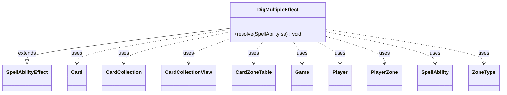

---
aliases:
  - DigMultipleEffect
tags:
  - java/class
  - module/forge-game
  - pkg/forge/game/ability/effects
fqn: forge.game.ability.effects.DigMultipleEffect
package: forge.game.ability.effects
module: forge-game
kind: Class
---

# DigMultipleEffect

**Package:** `forge.game.ability.effects`   **Module:** `forge-game`   **Kind:** Class



## Relationships
**Extends:**
- [[forge.game.ability.SpellAbilityEffect|SpellAbilityEffect]]
**Uses:**
- [[forge.game.Game|Game]]
- [[forge.game.card.Card|Card]]
- [[forge.game.card.CardCollection|CardCollection]]
- [[forge.game.card.CardCollectionView|CardCollectionView]]
- [[forge.game.card.CardZoneTable|CardZoneTable]]
- [[forge.game.player.Player|Player]]
- [[forge.game.spellability.SpellAbility|SpellAbility]]
- [[forge.game.zone.PlayerZone|PlayerZone]]
- [[forge.game.zone.ZoneType|ZoneType]]

## Design Description

DigMultipleEffect is a resolution handler in Forge's ability-effect framework, extending `SpellAbilityEffect` to implement the "dig" mechanic: looking at the top N cards of a source zone (typically the library) and distributing them between two destination zones. For each chosen or targeted player it reveals the dug cards, filters them against a `ChangeValid` specification into a category map, prompts the controller to select cards, and moves selections to a primary destination while sending the remainder to a secondary one. It supports extensive parameterization—optional choices, library positioning, tapped entry, face-down exile, imprinting, and remembering—reflecting the data-driven design of Forge's card scripts.

Collaborating heavily with zone and card abstractions (`PlayerZone`, `ZoneType`, `CardCollection`), it accumulates all zone transitions in a `CardZoneTable` and fires `triggerChangesZoneAll` once at the end, ensuring zone-change triggers see the batch atomically rather than per card.

## Source
`forge-game/src/main/java/forge/game/ability/effects/DigMultipleEffect.java`

```java
package forge.game.ability.effects;

import java.util.Collections;
import java.util.Map;

import com.google.common.collect.Maps;

import forge.game.Game;
import forge.game.ability.AbilityKey;
import forge.game.ability.AbilityUtils;
import forge.game.ability.SpellAbilityEffect;
import forge.game.card.Card;
import forge.game.card.CardCollection;
import forge.game.card.CardCollectionView;
import forge.game.card.CardLists;
import forge.game.card.CardZoneTable;
import forge.game.player.Player;
import forge.game.spellability.SpellAbility;
import forge.game.zone.PlayerZone;
import forge.game.zone.ZoneType;
import forge.util.Localizer;

public class DigMultipleEffect extends SpellAbilityEffect {

    @Override
    public void resolve(SpellAbility sa) {
        final Card host = sa.getHostCard();
        final Player player = sa.getActivatingPlayer();
        final Game game = player.getGame();
        int digNum = AbilityUtils.calculateAmount(host, sa.getParam("DigNum"), sa);

        final ZoneType srcZone = sa.hasParam("SourceZone") ? ZoneType.smartValueOf(sa.getParam("SourceZone")) : ZoneType.Library;

        final ZoneType destZone1 = sa.hasParam("DestinationZone") ? ZoneType.smartValueOf(sa.getParam("DestinationZone")) : ZoneType.Hand;
        final ZoneType destZone2 = sa.hasParam("DestinationZone2") ? ZoneType.smartValueOf(sa.getParam("DestinationZone2")) : ZoneType.Library;
        int libraryPosition = sa.hasParam("LibraryPosition") ? Integer.parseInt(sa.getParam("LibraryPosition")) : -1;
        final int libraryPosition2 = sa.hasParam("LibraryPosition2") ? Integer.parseInt(sa.getParam("LibraryPosition2")) : -1;

        String changeValid = sa.getParamOrDefault("ChangeValid", "");
        boolean chooseOptional = sa.hasParam("Optional");

        CardZoneTable table = new CardZoneTable();
        for (final Player chooser : getDefinedPlayersOrTargeted(sa)) {
            if (!chooser.isInGame()) {
                continue;
            }
            final CardCollection top = new CardCollection();
            final CardCollection rest = new CardCollection();
            final PlayerZone sourceZone = chooser.getZone(srcZone);

            int numToDig = Math.min(digNum, sourceZone.size());
            for (int i = 0; i < numToDig; i++) {
                top.add(sourceZone.get(i));
            }

            if (top.isEmpty()) {
                continue;
            }

            rest.addAll(top);

            if (sa.hasParam("Reveal")) {
                game.getAction().reveal(top, chooser, false);
            } else {
                // reveal cards first
                game.getAction().revealTo(top, chooser);
            }

            Map<String, CardCollection> validMap = Maps.newHashMap();

            for (final String valid : changeValid.split(",")) {
                CardCollection list = CardLists.getValidCards(top, valid, host.getController(), host, sa);
                if (!list.isEmpty()) {
                    validMap.put(valid, list);
                }
            }

            if (validMap.isEmpty()) {
                chooser.getController().notifyOfValue(sa, null, Localizer.getInstance().getMessage("lblNoValidCards"));
            } else {
                CardCollection chosen;
                //ensure choosing something when possible and not optional
                while (true) {
                    chosen = chooser.getController().chooseCardsForEffectMultiple(validMap, sa,
                            Localizer.getInstance().getMessage("lblChooseCards"), chooseOptional);

                    if (!chosen.isEmpty()) {
                        game.getAction().reveal(chosen, chooser, true,
                                Localizer.getInstance().getMessage("lblPlayerPickedCardFrom", chooser.getName()));
                        break;
                    }
                    if (chooseOptional) break;
                    chooser.getController().notifyOfValue(sa, null,
                            Localizer.getInstance().getMessage("lblMustChoose"));
                }

                if (sa.hasParam("ChooseAmount") || sa.hasParam("ChosenZone")) {
                    int amount = AbilityUtils.calculateAmount(host, sa.getParamOrDefault("ChooseAmount", "1"), sa);
                    final ZoneType chosenZone = sa.hasParam("ChosenZone") ? ZoneType.smartValueOf(sa.getParam("ChosenZone")) : ZoneType.Battlefield;

                    CardCollectionView extraChosen = chooser.getController().chooseCardsForEffect(chosen, sa, Localizer.getInstance().getMessage("lblChooseCards"), amount, amount, false, null);
                    if (!extraChosen.isEmpty()) {
                        game.getAction().reveal(extraChosen, chooser, true, Localizer.getInstance().getMessage("lblPlayerPickedCardFrom", chooser.getName()));
                    }

                    for (Card c : extraChosen) {
                        final ZoneType origin = c.getZone().getZoneType();
                        final PlayerZone zone = c.getOwner().getZone(chosenZone);
                        chosen.remove(c);
                        rest.remove(c);
                        c = game.getAction().moveTo(zone, c, sa);
                        if (!origin.equals(c.getZone().getZoneType())) {
                            table.put(origin, c.getZone().getZoneType(), c);
                        }
                    }
                }

                for (Card c : chosen) {
                    final ZoneType origin = c.getZone().getZoneType();
                    final PlayerZone zone = c.getOwner().getZone(destZone1);

                    if (!sa.hasParam("ChangeLater")) {
                        if (zone.getZoneType().isDeck()) {
                            c = game.getAction().moveTo(destZone1, c, libraryPosition, sa, AbilityKey.newMap());
                        } else {
                            if (destZone1.equals(ZoneType.Battlefield)) {
                                if (sa.hasParam("Tapped")) {
                                    c.setTapped(true);
                                }
                            }
                            c = game.getAction().moveTo(zone, c, sa);
                        }
                        if (!origin.equals(c.getZone().getZoneType())) {
                            table.put(origin, c.getZone().getZoneType(), c);
                        }
                    }

                    if (sa.hasParam("ExileFaceDown")) {
                        c.turnFaceDown(true);
                    }
                    if (sa.hasParam("Imprint")) {
                        host.addImprintedCard(c);
                    }
                    if (sa.hasParam("ForgetOtherRemembered")) {
                        host.clearRemembered();
                    }
                    if (sa.hasParam("RememberChanged")) {
                        host.addRemembered(c);
                    }
                    rest.remove(c);
                }
            }

            // now, move the rest to destZone2
            if (!sa.hasParam("ChangeLater")) {
                if (destZone2.isDeck() || destZone2 == ZoneType.Graveyard) {
                    CardCollection afterOrder = rest;
                    if (sa.hasParam("RestRandomOrder")) {
                        CardLists.shuffle(afterOrder);
                    }
                    if (libraryPosition2 != -1) {
                        // Closest to top
                        Collections.reverse(afterOrder);
                    }
                    for (final Card c : afterOrder) {
                        final ZoneType origin = c.getZone().getZoneType();
                        Card m = game.getAction().moveTo(destZone2, c, libraryPosition2, sa, AbilityKey.newMap());
                        if (m != null && !origin.equals(m.getZone().getZoneType())) {
                            table.put(origin, m.getZone().getZoneType(), m);
                        }
                    }
                } else {
                    // just move them randomly
                    for (Card c : rest) {
                        final ZoneType origin = c.getZone().getZoneType();
                        final PlayerZone toZone = c.getOwner().getZone(destZone2);
                        c = game.getAction().moveTo(toZone, c, sa);
                        if (!origin.equals(c.getZone().getZoneType())) {
                            table.put(origin, c.getZone().getZoneType(), c);
                        }
                    }
                }
            }
            if (sa.hasParam("ImprintRest")) {
                host.addImprintedCards(rest);
            }
        }
        //table trigger there
        table.triggerChangesZoneAll(game, sa);
    }

}
```

## Python
`forge/game/ability/effects/DigMultipleEffect.py`

```python
from typing import Map

from forge.game.Game import Game
from forge.game.ability.AbilityKey import AbilityKey
from forge.game.ability.AbilityUtils import AbilityUtils
from forge.game.ability.SpellAbilityEffect import SpellAbilityEffect
from forge.game.card.Card import Card
from forge.game.card.CardCollection import CardCollection
from forge.game.card.CardCollectionView import CardCollectionView
from forge.game.card.CardLists import CardLists
from forge.game.card.CardZoneTable import CardZoneTable
from forge.game.player.Player import Player
from forge.game.spellability.SpellAbility import SpellAbility
from forge.game.zone.PlayerZone import PlayerZone
from forge.game.zone.ZoneType import ZoneType
from forge.util.Localizer import Localizer


class DigMultipleEffect(SpellAbilityEffect):

    def resolve(self, sa: SpellAbility) -> None:
        host = sa.getHostCard()
        player = sa.getActivatingPlayer()
        game = player.getGame()
        digNum = AbilityUtils.calculateAmount(host, sa.getParam("DigNum"), sa)

        srcZone = ZoneType.smartValueOf(sa.getParam("SourceZone")) if sa.hasParam("SourceZone") else ZoneType.Library

        destZone1 = ZoneType.smartValueOf(sa.getParam("DestinationZone")) if sa.hasParam("DestinationZone") else ZoneType.Hand
        destZone2 = ZoneType.smartValueOf(sa.getParam("DestinationZone2")) if sa.hasParam("DestinationZone2") else ZoneType.Library
        libraryPosition = int(sa.getParam("LibraryPosition")) if sa.hasParam("LibraryPosition") else -1
        libraryPosition2 = int(sa.getParam("LibraryPosition2")) if sa.hasParam("LibraryPosition2") else -1

        changeValid = sa.getParamOrDefault("ChangeValid", "")
        chooseOptional = sa.hasParam("Optional")

        table = CardZoneTable()
        for chooser in self.getDefinedPlayersOrTargeted(sa):
            if not chooser.isInGame():
                continue
            top = CardCollection()
            rest = CardCollection()
            sourceZone = chooser.getZone(srcZone)

            numToDig = min(digNum, sourceZone.size())
            for i in range(numToDig):
                top.add(sourceZone.get(i))

            if top.isEmpty():
                continue

            rest.addAll(top)

            if sa.hasParam("Reveal"):
                game.getAction().reveal(top, chooser, False)
            else:
                # reveal cards first
                game.getAction().revealTo(top, chooser)

            validMap: dict[str, CardCollection] = {}

            for valid in changeValid.split(","):
                list = CardLists.getValidCards(top, valid, host.getController(), host, sa)
                if not list.isEmpty():
                    validMap[valid] = list

            if not validMap:
                chooser.getController().notifyOfValue(sa, None, Localizer.getInstance().getMessage("lblNoValidCards"))
            else:
                chosen = None
                # ensure choosing something when possible and not optional
                while True:
                    chosen = chooser.getController().chooseCardsForEffectMultiple(validMap, sa,
                            Localizer.getInstance().getMessage("lblChooseCards"), chooseOptional)

                    if not chosen.isEmpty():
                        game.getAction().reveal(chosen, chooser, True,
                                Localizer.getInstance().getMessage("lblPlayerPickedCardFrom", chooser.getName()))
                        break
                    if chooseOptional:
                        break
                    chooser.getController().notifyOfValue(sa, None,
                            Localizer.getInstance().getMessage("lblMustChoose"))

                if sa.hasParam("ChooseAmount") or sa.hasParam("ChosenZone"):
                    amount = AbilityUtils.calculateAmount(host, sa.getParamOrDefault("ChooseAmount", "1"), sa)
                    chosenZone = ZoneType.smartValueOf(sa.getParam("ChosenZone")) if sa.hasParam("ChosenZone") else ZoneType.Battlefield

                    extraChosen = chooser.getController().chooseCardsForEffect(chosen, sa, Localizer.getInstance().getMessage("lblChooseCards"), amount, amount, False, None)
                    if not extraChosen.isEmpty():
                        game.getAction().reveal(extraChosen, chooser, True, Localizer.getInstance().getMessage("lblPlayerPickedCardFrom", chooser.getName()))

                    for c in extraChosen:
                        origin = c.getZone().getZoneType()
                        zone = c.getOwner().getZone(chosenZone)
                        chosen.remove(c)
                        rest.remove(c)
                        c = game.getAction().moveTo(zone, c, sa)
                        if not origin.equals(c.getZone().getZoneType()):
                            table.put(origin, c.getZone().getZoneType(), c)

                for c in chosen:
                    origin = c.getZone().getZoneType()
                    zone = c.getOwner().getZone(destZone1)

                    if not sa.hasParam("ChangeLater"):
                        if zone.getZoneType().isDeck():
                            c = game.getAction().moveTo(destZone1, c, libraryPosition, sa, AbilityKey.newMap())
                        else:
                            if destZone1.equals(ZoneType.Battlefield):
                                if sa.hasParam("Tapped"):
                                    c.setTapped(True)
                            c = game.getAction().moveTo(zone, c, sa)
                        if not origin.equals(c.getZone().getZoneType()):
                            table.put(origin, c.getZone().getZoneType(), c)

                    if sa.hasParam("ExileFaceDown"):
                        c.turnFaceDown(True)
                    if sa.hasParam("Imprint"):
                        host.addImprintedCard(c)
                    if sa.hasParam("ForgetOtherRemembered"):
                        host.clearRemembered()
                    if sa.hasParam("RememberChanged"):
                        host.addRemembered(c)
                    rest.remove(c)

            # now, move the rest to destZone2
            if not sa.hasParam("ChangeLater"):
                if destZone2.isDeck() or destZone2 == ZoneType.Graveyard:
                    afterOrder = rest
                    if sa.hasParam("RestRandomOrder"):
                        CardLists.shuffle(afterOrder)
                    if libraryPosition2 != -1:
                        # Closest to top
                        Collections.reverse(afterOrder)
                    for c in afterOrder:
                        origin = c.getZone().getZoneType()
                        m = game.getAction().moveTo(destZone2, c, libraryPosition2, sa, AbilityKey.newMap())
                        if m is not None and not origin.equals(m.getZone().getZoneType()):
                            table.put(origin, m.getZone().getZoneType(), m)
                else:
                    # just move them randomly
                    for c in rest:
                        origin = c.getZone().getZoneType()
                        toZone = c.getOwner().getZone(destZone2)
                        c = game.getAction().moveTo(toZone, c, sa)
                        if not origin.equals(c.getZone().getZoneType()):
                            table.put(origin, c.getZone().getZoneType(), c)
            if sa.hasParam("ImprintRest"):
                host.addImprintedCards(rest)
        # table trigger there
        table.triggerChangesZoneAll(game, sa)
```
