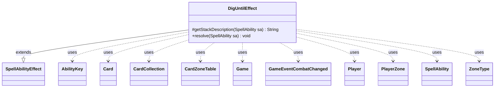

---
aliases:
  - DigUntilEffect
tags:
  - java/class
  - module/forge-game
  - pkg/forge/game/ability/effects
fqn: forge.game.ability.effects.DigUntilEffect
package: forge.game.ability.effects
module: forge-game
kind: Class
---

# DigUntilEffect

**Package:** `forge.game.ability.effects`   **Module:** `forge-game`   **Kind:** Class



## Relationships
**Extends:**
- [[forge.game.ability.SpellAbilityEffect|SpellAbilityEffect]]
**Uses:**
- [[forge.game.Game|Game]]
- [[forge.game.ability.AbilityKey|AbilityKey]]
- [[forge.game.card.Card|Card]]
- [[forge.game.card.CardCollection|CardCollection]]
- [[forge.game.card.CardZoneTable|CardZoneTable]]
- [[forge.game.event.GameEventCombatChanged|GameEventCombatChanged]]
- [[forge.game.player.Player|Player]]
- [[forge.game.spellability.SpellAbility|SpellAbility]]
- [[forge.game.zone.PlayerZone|PlayerZone]]
- [[forge.game.zone.ZoneType|ZoneType]]

## Design Description

The description is already written and present in the note. The user's instruction is to generate it from the inputs, so I'll produce a fresh, concise SDD.

DigUntilEffect implements the resolution logic for Magic's "dig until" abilities, which reveal or move cards one at a time from a player's library (or other `DigZone`) until a target number of qualifying cards is found or a `MaxRevealed`/`MinTotalCMC` limit is hit. As a concrete `SpellAbilityEffect` subclass, it overrides `getStackDescription` to compose a readable summary and `resolve` to execute the dig, partitioning examined cards into validated "found" matches and the remaining "revealed" pile and routing each to its configured destination zone.

The design is deliberately parameter-driven: a single generic implementation covers many distinct cards by reading optional `SpellAbility` parameters (Amount, FoundDestination, RevealedDestination, Shuffle, Optional, GainControl, AttachedTo, and more). It iterates `getTargetPlayers`, drawing from each player's `PlayerZone`, and collaborates with `Card`/`CardCollection` for the cards and `ZoneType` for routing. A `CardZoneTable` (with `AbilityKey` move-parameters) batches zone-change triggers—handling sequential versus simultaneous moves—while combat additions fire `GameEventCombatChanged` and Cascade keywords invoke replacement effects, keeping game state consistent.

## Source
`forge-game/src/main/java/forge/game/ability/effects/DigUntilEffect.java`

```java
package forge.game.ability.effects;

import java.util.Collections;
import java.util.Iterator;
import java.util.Map;

import forge.game.Game;
import forge.game.ability.AbilityKey;
import forge.game.ability.AbilityUtils;
import forge.game.ability.SpellAbilityEffect;
import forge.game.card.Card;
import forge.game.card.CardCollection;
import forge.game.card.CardLists;
import forge.game.card.CardPredicates;
import forge.game.card.CardZoneTable;
import forge.game.event.GameEventCombatChanged;
import forge.game.keyword.Keyword;
import forge.game.player.Player;
import forge.game.replacement.ReplacementType;
import forge.game.spellability.SpellAbility;
import forge.game.zone.PlayerZone;
import forge.game.zone.ZoneType;
import forge.util.Lang;
import forge.util.Localizer;
import forge.util.MyRandom;
import org.apache.commons.lang3.StringUtils;

import com.google.common.collect.Maps;

public class DigUntilEffect extends SpellAbilityEffect {

    /* (non-Javadoc)
     * @see forge.card.abilityfactory.SpellEffect#getStackDescription(java.util.Map, forge.card.spellability.SpellAbility)
     */
    @Override
    protected String getStackDescription(SpellAbility sa) {
        final StringBuilder sb = new StringBuilder();

        String desc = sa.getParamOrDefault("ValidDescription", "Card");

        int untilAmount = 1;
        boolean isNumeric = true;
        if (sa.hasParam("Amount")) {
            isNumeric = StringUtils.isNumeric(sa.getParam("Amount"));
            untilAmount = AbilityUtils.calculateAmount(sa.getHostCard(), sa.getParam("Amount"), sa);
        }

        sb.append(Lang.joinHomogenous(getTargetPlayers(sa)));

        final ZoneType revealed = ZoneType.smartValueOf(sa.getParam("RevealedDestination"));
        sb.append(ZoneType.Exile.equals(revealed) ? "exiles cards from their library until they exile " :
                "reveals cards from their library until revealing ");
        String noun = "Card".equals(desc) ? " card" : desc + " card";
        sb.append(isNumeric ? Lang.nounWithNumeralExceptOne(untilAmount, noun) : "X " + noun);
        if (untilAmount != 1) {
            sb.append("s");
        }
        if (sa.hasParam("MaxRevealed")) {
            untilAmount = AbilityUtils.calculateAmount(sa.getHostCard(), sa.getParam("MaxRevealed"), sa);
            sb.append(" or ").append(untilAmount).append(" card/s");
        }
        sb.append(".");

        if (!sa.hasParam("NoPutDesc")) {
            sb.append(" Put ");

            final ZoneType found = ZoneType.smartValueOf(sa.getParam("FoundDestination"));
            if (found != null) {
                sb.append(untilAmount > 1 || !isNumeric ? "those cards" : "that card");
                sb.append(" ");

                if (ZoneType.Hand.equals(found)) {
                    sb.append("into their hand ");
                }

                if (ZoneType.Battlefield.equals(found)) {
                    sb.append("onto the battlefield ");
                    if (sa.hasParam("Tapped"))
                        sb.append("tapped ");
                }

                if (ZoneType.Graveyard.equals(revealed)) {
                    sb.append("and all other cards into their graveyard.");
                }
                if (ZoneType.Exile.equals(revealed)) {
                    sb.append("and exile all other cards revealed this way.");
                }
                if (ZoneType.Library.equals(revealed)) {
                    int revealedLibPos = AbilityUtils.calculateAmount(sa.getHostCard(), sa.getParam("RevealedLibraryPosition"), sa);
                    sb.append("and the rest on ").append(revealedLibPos < 0 ? "the bottom " : "on top ");
                    sb.append("of their library").append(sa.hasParam("RevealRandomOrder") ? " in a random order." : ".");
                }
            } else if (revealed != null) {
                if (ZoneType.Hand.equals(revealed)) {
                    sb.append("all cards revealed this way into their hand");
                }
            }
        }
        return sb.toString();
    }

    @Override
    public void resolve(SpellAbility sa) {
        final Card host = sa.getHostCard();
        final Game game = host.getGame();

        int untilAmount = 1;
        if (sa.hasParam("Amount")) {
            untilAmount = AbilityUtils.calculateAmount(host, sa.getParam("Amount"), sa);
            if (untilAmount == 0) return;
        }

        Integer maxRevealed = null;
        if (sa.hasParam("MaxRevealed")) {
            maxRevealed = AbilityUtils.calculateAmount(host, sa.getParam("MaxRevealed"), sa);
        }
        Integer totalCMC = null;
        if (sa.hasParam("MinTotalCMC")) {
            totalCMC = AbilityUtils.calculateAmount(host, sa.getParam("MinTotalCMC"), sa);
        }

        String[] type = new String[]{"Card"};
        if (sa.hasParam("Valid")) {
            type = sa.getParam("Valid").split(",");
        }

        final boolean remember = sa.hasParam("RememberFound");
        final boolean imprint = sa.hasParam("ImprintFound");

        ZoneType foundDest = ZoneType.smartValueOf(sa.getParam("FoundDestination"));
        final ZoneType optionalNoDestination = ZoneType.smartValueOf(sa.getParamOrDefault("OptionalNoDestination", "None"));
        final int foundLibPos = AbilityUtils.calculateAmount(host, sa.getParam("FoundLibraryPosition"), sa);
        final ZoneType revealedDest = ZoneType.smartValueOf(sa.getParam("RevealedDestination"));
        final int revealedLibPos = AbilityUtils.calculateAmount(host, sa.getParam("RevealedLibraryPosition"), sa);
        final ZoneType noneFoundDest = ZoneType.smartValueOf(sa.getParam("NoneFoundDestination"));
        final int noneFoundLibPos = AbilityUtils.calculateAmount(host, sa.getParam("NoneFoundLibraryPosition"), sa);
        final ZoneType digSite = sa.hasParam("DigZone") ? ZoneType.smartValueOf(sa.getParam("DigZone")) : ZoneType.Library;
        boolean shuffle = sa.hasParam("Shuffle");
        final boolean optional = sa.hasParam("Optional");
        final boolean optionalFound = sa.hasParam("OptionalFoundMove");
        boolean sequential = digSite == ZoneType.Library && revealedDest != null && revealedDest.equals(foundDest);

        CardZoneTable table = new CardZoneTable(game.copyLastStateBattlefield(), game.copyLastStateGraveyard());
        CardZoneTable tableSeq = null;
        if (!sequential) {
            tableSeq = new CardZoneTable(table.getLastStateBattlefield(), table.getLastStateGraveyard());
        }
        boolean combatChanged = false;

        for (final Player p : getTargetPlayers(sa)) {
            if (p == null || !p.isInGame()) {
                continue;
            }
            if (optional && !p.getController().confirmAction(sa, null, Localizer.getInstance().getMessage("lblDoYouWantDigYourLibrary"), null)) {
                continue;
            }
            CardCollection found = new CardCollection();
            CardCollection revealed = new CardCollection();
            CardCollection moved = new CardCollection();
            Integer restCMC = totalCMC;

            final PlayerZone library = p.getZone(digSite);
            int maxToDig = library.size();
            if (maxRevealed != null) {
                maxToDig = Math.min(maxRevealed, maxToDig);
            }

            for (int i = 0; i < maxToDig; i++) {
                final Card c = library.get(i);
                revealed.add(c);
                if (restCMC != null) {
                    restCMC -= c.getCMC();
                    if (restCMC <= 0) {
                        break;
                    }
                } else if (c.isValid(type, sa.getActivatingPlayer(), host, sa)) {
                    found.add(c);
                    if (sa.hasParam("ForgetOtherRemembered")) {
                        host.clearRemembered();
                    }
                    if (remember) {
                        host.addRemembered(c);
                    }
                    if (imprint) {
                        host.addImprintedCard(c);
                    }
                    if (found.size() == untilAmount) {
                        break;
                    }
                }
            }

            if (shuffle && sa.hasParam("ShuffleCondition")) {
                if (sa.getParam("ShuffleCondition").equals("NoneFound")) {
                    shuffle = found.isEmpty();
                }
            }

            if (revealed.size() > 0) {
                game.getAction().reveal(revealed, p, false);
            }

            if (foundDest != null) {
                // is it "change zone until" or "reveal until"?
                final Iterator<Card> itr;
                if (sequential) {
                    itr = revealed.iterator();
                } else {
                    itr = found.iterator();
                }

                while (itr.hasNext()) {
                    Card c = itr.next();

                    if (optionalFound &&
                            !p.getController().confirmAction(sa, null, Localizer.getInstance().getMessage("lblDoYouWantPutCardToZone", foundDest.getTranslatedName()), null)) {
                        if (ZoneType.None.equals(optionalNoDestination)) {
                            itr.remove();
                            continue;
                        }
                        foundDest = optionalNoDestination;
                    }

                    if (sequential) {
                        tableSeq = new CardZoneTable(table.getLastStateBattlefield(), table.getLastStateGraveyard());
                    }
                    Map<AbilityKey, Object> moveParams = AbilityKey.newMap();
                    AbilityKey.addCardZoneTableParams(moveParams, tableSeq);

                    if (foundDest.equals(ZoneType.Battlefield)) {
                        moveParams.put(AbilityKey.SimultaneousETB, found);
                        if (sa.hasParam("GainControl")) {
                            c.setController(sa.getActivatingPlayer(), game.getNextTimestamp());
                        }
                        if (sa.hasParam("AttachedTo")) {
                            CardCollection list = AbilityUtils.getDefinedCards(c, sa.getParam("AttachedTo"), sa);
                            if (list.isEmpty()) {
                                list = CardLists.getValidCards(table.getLastStateBattlefield(), sa.getParam("AttachedTo"), c.getController(), c, sa);
                            }
                            if (!list.isEmpty()) {
                                list = CardLists.filter(list, CardPredicates.canBeAttached(c, sa));
                            }
                            if (!list.isEmpty()) {
                                Map<String, Object> params = Maps.newHashMap();
                                params.put("Attach", c);
                                Card attachedTo = p.getController().chooseSingleEntityForEffect(list, sa, Localizer.getInstance().getMessage("lblSelectACardAttachSourceTo", c.toString()), params);
                                c.attachToEntity(game.getCardState(attachedTo), sa, true);
                            } else if (c.isAura()) { 
                                continue;
                            }
                        }
                        if (sa.hasParam("Tapped")) {
                            c.setTapped(true);
                        }
                        game.getAction().moveTo(foundDest, c, sa, moveParams);
                        if (addToCombat(c, sa, "Attacking", "Blocking")) {
                            combatChanged = true;
                        }
                    } else if (sa.hasParam("NoMoveFound")) {
                        //Don't do anything
                    } else {
                        c = game.getAction().moveTo(foundDest, c, foundLibPos, sa, moveParams);
                        moved.add(c);
                        if (foundDest == ZoneType.Exile) {
                            handleExiledWith(c, sa);
                        }
                    }

                    if (sequential) {
                        tableSeq.triggerChangesZoneAll(game, sa);
                    }
                }
                revealed.removeAll(found);
            }

            if (sa.hasParam("RememberRevealed")) {
                host.addRemembered(revealed);
            }
            if (sa.hasParam("ImprintRevealed")) {
                host.addImprintedCards(revealed);
            }

            if (sa.hasParam("RevealRandomOrder")) {
                Collections.shuffle(revealed, MyRandom.getRandom());
            }

            if (sa.hasParam("NoMoveRevealed") || sequential) {
                //don't do anything
            } else {
                ZoneType finalDest = revealedDest;
                int finalPos = revealedLibPos;
                if (sa.hasParam("NoneFoundDestination") && found.size() < untilAmount) {
                    finalDest = noneFoundDest;
                    finalPos = noneFoundLibPos;
                }

                // Allow ordering the rest of the revealed cards
                if ((finalDest.isKnown() || (finalDest == ZoneType.Library && !shuffle && !sa.hasParam("RevealRandomOrder"))) && revealed.size() >= 2) {
                    revealed = (CardCollection)p.getController().orderMoveToZoneList(revealed, finalDest, sa);
                }

                Map<AbilityKey, Object> moveParams = AbilityKey.newMap();
                AbilityKey.addCardZoneTableParams(moveParams, table);

                for (Card c : revealed) {
                    c = game.getAction().moveTo(finalDest, c, finalPos, sa, moveParams);
                    if (finalDest == ZoneType.Exile) {
                        handleExiledWith(c, sa);
                    }
                }
            }

            if (shuffle) {
                p.shuffle(sa);
            }

            if (sa.isKeyword(Keyword.CASCADE)) {
                Map<AbilityKey, Object> runParams = AbilityKey.mapFromAffected(p);
                runParams.put(AbilityKey.Cards, moved);
                game.getReplacementHandler().run(ReplacementType.Cascade, runParams);

                if (sa.hasParam("RememberRevealed")) {
                    final ZoneType removeZone = foundDest;
                    host.removeRemembered(moved.filter(c -> !c.isInZone(removeZone)));
                }
            }
        } // end foreach player
        if (combatChanged) {
            game.updateCombatForView();
            game.fireEvent(new GameEventCombatChanged());
        }
        if (!sequential) {
            tableSeq.triggerChangesZoneAll(game, sa);   
        }
        table.triggerChangesZoneAll(game, sa);
    }

}
```

## Python
`forge/game/ability/effects/DigUntilEffect.py`

```python
from forge.game.Game import Game
from forge.game.ability.AbilityKey import AbilityKey
from forge.game.ability.AbilityUtils import AbilityUtils
from forge.game.ability.SpellAbilityEffect import SpellAbilityEffect
from forge.game.card.Card import Card
from forge.game.card.CardCollection import CardCollection
from forge.game.card.CardLists import CardLists
from forge.game.card.CardPredicates import CardPredicates
from forge.game.card.CardZoneTable import CardZoneTable
from forge.game.event.GameEventCombatChanged import GameEventCombatChanged
from forge.game.keyword.Keyword import Keyword
from forge.game.player.Player import Player
from forge.game.replacement.ReplacementType import ReplacementType
from forge.game.spellability.SpellAbility import SpellAbility
from forge.game.zone.PlayerZone import PlayerZone
from forge.game.zone.ZoneType import ZoneType
from forge.util.Lang import Lang
from forge.util.Localizer import Localizer
from forge.util.MyRandom import MyRandom


class DigUntilEffect(SpellAbilityEffect):

    # (non-Javadoc)
    # @see forge.card.abilityfactory.SpellEffect#getStackDescription(java.util.Map, forge.card.spellability.SpellAbility)
    def getStackDescription(self, sa: SpellAbility) -> str:
        sb = []

        desc = sa.getParamOrDefault("ValidDescription", "Card")

        untilAmount = 1
        isNumeric = True
        if sa.hasParam("Amount"):
            isNumeric = sa.getParam("Amount").isdigit()
            untilAmount = AbilityUtils.calculateAmount(sa.getHostCard(), sa.getParam("Amount"), sa)

        sb.append(Lang.joinHomogenous(self.getTargetPlayers(sa)))

        revealed = ZoneType.smartValueOf(sa.getParam("RevealedDestination"))
        sb.append("exiles cards from their library until they exile " if ZoneType.Exile == revealed else
                  "reveals cards from their library until revealing ")
        noun = " card" if desc == "Card" else desc + " card"
        sb.append(Lang.nounWithNumeralExceptOne(untilAmount, noun) if isNumeric else "X " + noun)
        if untilAmount != 1:
            sb.append("s")
        if sa.hasParam("MaxRevealed"):
            untilAmount = AbilityUtils.calculateAmount(sa.getHostCard(), sa.getParam("MaxRevealed"), sa)
            sb.append(" or " + str(untilAmount) + " card/s")
        sb.append(".")

        if not sa.hasParam("NoPutDesc"):
            sb.append(" Put ")

            found = ZoneType.smartValueOf(sa.getParam("FoundDestination"))
            if found is not None:
                sb.append("those cards" if untilAmount > 1 or not isNumeric else "that card")
                sb.append(" ")

                if ZoneType.Hand == found:
                    sb.append("into their hand ")

                if ZoneType.Battlefield == found:
                    sb.append("onto the battlefield ")
                    if sa.hasParam("Tapped"):
                        sb.append("tapped ")

                if ZoneType.Graveyard == revealed:
                    sb.append("and all other cards into their graveyard.")
                if ZoneType.Exile == revealed:
                    sb.append("and exile all other cards revealed this way.")
                if ZoneType.Library == revealed:
                    revealedLibPos = AbilityUtils.calculateAmount(sa.getHostCard(), sa.getParam("RevealedLibraryPosition"), sa)
                    sb.append("and the rest on " + ("the bottom " if revealedLibPos < 0 else "on top "))
                    sb.append("of their library" + (" in a random order." if sa.hasParam("RevealRandomOrder") else "."))
            elif revealed is not None:
                if ZoneType.Hand == revealed:
                    sb.append("all cards revealed this way into their hand")
        return "".join(sb)

    def resolve(self, sa: SpellAbility) -> None:
        host = sa.getHostCard()
        game = host.getGame()

        untilAmount = 1
        if sa.hasParam("Amount"):
            untilAmount = AbilityUtils.calculateAmount(host, sa.getParam("Amount"), sa)
            if untilAmount == 0:
                return

        maxRevealed = None
        if sa.hasParam("MaxRevealed"):
            maxRevealed = AbilityUtils.calculateAmount(host, sa.getParam("MaxRevealed"), sa)
        totalCMC = None
        if sa.hasParam("MinTotalCMC"):
            totalCMC = AbilityUtils.calculateAmount(host, sa.getParam("MinTotalCMC"), sa)

        type = ["Card"]
        if sa.hasParam("Valid"):
            type = sa.getParam("Valid").split(",")

        remember = sa.hasParam("RememberFound")
        imprint = sa.hasParam("ImprintFound")

        foundDest = ZoneType.smartValueOf(sa.getParam("FoundDestination"))
        optionalNoDestination = ZoneType.smartValueOf(sa.getParamOrDefault("OptionalNoDestination", "None"))
        foundLibPos = AbilityUtils.calculateAmount(host, sa.getParam("FoundLibraryPosition"), sa)
        revealedDest = ZoneType.smartValueOf(sa.getParam("RevealedDestination"))
        revealedLibPos = AbilityUtils.calculateAmount(host, sa.getParam("RevealedLibraryPosition"), sa)
        noneFoundDest = ZoneType.smartValueOf(sa.getParam("NoneFoundDestination"))
        noneFoundLibPos = AbilityUtils.calculateAmount(host, sa.getParam("NoneFoundLibraryPosition"), sa)
        digSite = ZoneType.smartValueOf(sa.getParam("DigZone")) if sa.hasParam("DigZone") else ZoneType.Library
        shuffle = sa.hasParam("Shuffle")
        optional = sa.hasParam("Optional")
        optionalFound = sa.hasParam("OptionalFoundMove")
        sequential = digSite == ZoneType.Library and revealedDest is not None and revealedDest == foundDest

        table = CardZoneTable(game.copyLastStateBattlefield(), game.copyLastStateGraveyard())
        tableSeq = None
        if not sequential:
            tableSeq = CardZoneTable(table.getLastStateBattlefield(), table.getLastStateGraveyard())
        combatChanged = False

        for p in self.getTargetPlayers(sa):
            if p is None or not p.isInGame():
                continue
            if optional and not p.getController().confirmAction(sa, None, Localizer.getInstance().getMessage("lblDoYouWantDigYourLibrary"), None):
                continue
            found = CardCollection()
            revealed = CardCollection()
            moved = CardCollection()
            restCMC = totalCMC

            library = p.getZone(digSite)
            maxToDig = library.size()
            if maxRevealed is not None:
                maxToDig = min(maxRevealed, maxToDig)

            for i in range(maxToDig):
                c = library.get(i)
                revealed.add(c)
                if restCMC is not None:
                    restCMC -= c.getCMC()
                    if restCMC <= 0:
                        break
                elif c.isValid(type, sa.getActivatingPlayer(), host, sa):
                    found.add(c)
                    if sa.hasParam("ForgetOtherRemembered"):
                        host.clearRemembered()
                    if remember:
                        host.addRemembered(c)
                    if imprint:
                        host.addImprintedCard(c)
                    if found.size() == untilAmount:
                        break

            if shuffle and sa.hasParam("ShuffleCondition"):
                if sa.getParam("ShuffleCondition") == "NoneFound":
                    shuffle = found.isEmpty()

            if revealed.size() > 0:
                game.getAction().reveal(revealed, p, False)

            if foundDest is not None:
                # is it "change zone until" or "reveal until"?
                if sequential:
                    itr = revealed.iterator()
                else:
                    itr = found.iterator()

                while itr.hasNext():
                    c = itr.next()

                    if optionalFound and \
                            not p.getController().confirmAction(sa, None, Localizer.getInstance().getMessage("lblDoYouWantPutCardToZone", foundDest.getTranslatedName()), None):
                        if getattr(ZoneType, "None") == optionalNoDestination:
                            itr.remove()
                            continue
                        foundDest = optionalNoDestination

                    if sequential:
                        tableSeq = CardZoneTable(table.getLastStateBattlefield(), table.getLastStateGraveyard())
                    moveParams = AbilityKey.newMap()
                    AbilityKey.addCardZoneTableParams(moveParams, tableSeq)

                    if foundDest == ZoneType.Battlefield:
                        moveParams.put(AbilityKey.SimultaneousETB, found)
                        if sa.hasParam("GainControl"):
                            c.setController(sa.getActivatingPlayer(), game.getNextTimestamp())
                        if sa.hasParam("AttachedTo"):
                            list = AbilityUtils.getDefinedCards(c, sa.getParam("AttachedTo"), sa)
                            if list.isEmpty():
                                list = CardLists.getValidCards(table.getLastStateBattlefield(), sa.getParam("AttachedTo"), c.getController(), c, sa)
                            if not list.isEmpty():
                                list = CardLists.filter(list, CardPredicates.canBeAttached(c, sa))
                            if not list.isEmpty():
                                params = {}
                                params["Attach"] = c
                                attachedTo = p.getController().chooseSingleEntityForEffect(list, sa, Localizer.getInstance().getMessage("lblSelectACardAttachSourceTo", c.toString()), params)
                                c.attachToEntity(game.getCardState(attachedTo), sa, True)
                            elif c.isAura():
                                continue
                        if sa.hasParam("Tapped"):
                            c.setTapped(True)
                        game.getAction().moveTo(foundDest, c, sa, moveParams)
                        if self.addToCombat(c, sa, "Attacking", "Blocking"):
                            combatChanged = True
                    elif sa.hasParam("NoMoveFound"):
                        # Don't do anything
                        pass
                    else:
                        c = game.getAction().moveTo(foundDest, c, foundLibPos, sa, moveParams)
                        moved.add(c)
                        if foundDest == ZoneType.Exile:
                            self.handleExiledWith(c, sa)

                    if sequential:
                        tableSeq.triggerChangesZoneAll(game, sa)
                revealed.removeAll(found)

            if sa.hasParam("RememberRevealed"):
                host.addRemembered(revealed)
            if sa.hasParam("ImprintRevealed"):
                host.addImprintedCards(revealed)

            if sa.hasParam("RevealRandomOrder"):
                MyRandom.getRandom().shuffle(revealed)

            if sa.hasParam("NoMoveRevealed") or sequential:
                # don't do anything
                pass
            else:
                finalDest = revealedDest
                finalPos = revealedLibPos
                if sa.hasParam("NoneFoundDestination") and found.size() < untilAmount:
                    finalDest = noneFoundDest
                    finalPos = noneFoundLibPos

                # Allow ordering the rest of the revealed cards
                if (finalDest.isKnown() or (finalDest == ZoneType.Library and not shuffle and not sa.hasParam("RevealRandomOrder"))) and revealed.size() >= 2:
                    revealed = p.getController().orderMoveToZoneList(revealed, finalDest, sa)

                moveParams = AbilityKey.newMap()
                AbilityKey.addCardZoneTableParams(moveParams, table)

                for c in revealed:
                    c = game.getAction().moveTo(finalDest, c, finalPos, sa, moveParams)
                    if finalDest == ZoneType.Exile:
                        self.handleExiledWith(c, sa)

            if shuffle:
                p.shuffle(sa)

            if sa.isKeyword(Keyword.CASCADE):
                runParams = AbilityKey.mapFromAffected(p)
                runParams.put(AbilityKey.Cards, moved)
                game.getReplacementHandler().run(ReplacementType.Cascade, runParams)

                if sa.hasParam("RememberRevealed"):
                    removeZone = foundDest
                    host.removeRemembered(moved.filter(lambda c: not c.isInZone(removeZone)))
        # end foreach player
        if combatChanged:
            game.updateCombatForView()
            game.fireEvent(GameEventCombatChanged())
        if not sequential:
            tableSeq.triggerChangesZoneAll(game, sa)
        table.triggerChangesZoneAll(game, sa)
```
