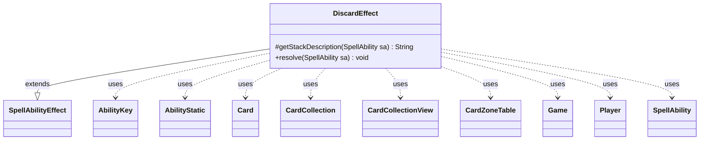

---
aliases:
  - DiscardEffect
tags:
  - java/class
  - module/forge-game
  - pkg/forge/game/ability/effects
fqn: forge.game.ability.effects.DiscardEffect
package: forge.game.ability.effects
module: forge-game
kind: Class
---

# DiscardEffect

**Package:** `forge.game.ability.effects`   **Module:** `forge-game`   **Kind:** Class



## Relationships
**Extends:**
- [[forge.game.ability.SpellAbilityEffect|SpellAbilityEffect]]
**Uses:**
- [[forge.game.Game|Game]]
- [[forge.game.ability.AbilityKey|AbilityKey]]
- [[forge.game.card.Card|Card]]
- [[forge.game.card.CardCollection|CardCollection]]
- [[forge.game.card.CardCollectionView|CardCollectionView]]
- [[forge.game.card.CardZoneTable|CardZoneTable]]
- [[forge.game.player.Player|Player]]
- [[forge.game.spellability.AbilityStatic|AbilityStatic]]
- [[forge.game.spellability.SpellAbility|SpellAbility]]

## Design Description

DiscardEffect implements the resolution of "discard" abilities within Forge's MTG engine. As a concrete subclass of `SpellAbilityEffect`, it overrides `getStackDescription` to render a grammatically-aware, human-readable summary and `resolve` to execute the discard, branching on a `Mode` parameter (Hand, Random, Defined, TgtChoose, RevealDiscardAll, and the Reveal/Look-then-choose variants) to decide which cards leave each player's hand.

It collaborates broadly with the game model, reading the host `Card` and `Game`, resolving target and discarding `Player`s—separating the two for `RevealTgtChoose`—and assembling chosen cards into `CardCollection`/`CardCollectionView` views ordered for the graveyard. Design intent is visible in its consistent `canDiscardBy` gating, optional-confirmation handling, min/max selection for "any number" cases, and its routing of every zone change through a single `CardZoneTable` keyed by `AbilityKey` so one batched trigger fires after resolution, while suppressing triggers for `AbilityStatic` sources.

## Source
`forge-game/src/main/java/forge/game/ability/effects/DiscardEffect.java`

```java
package forge.game.ability.effects;

import java.util.List;
import java.util.Map;

import com.google.common.collect.Lists;
import com.google.common.collect.Maps;

import forge.card.CardType;
import forge.game.Game;
import forge.game.GameActionUtil;
import forge.game.ability.AbilityKey;
import forge.game.ability.AbilityUtils;
import forge.game.ability.SpellAbilityEffect;
import forge.game.card.Card;
import forge.game.card.CardCollection;
import forge.game.card.CardCollectionView;
import forge.game.card.CardLists;
import forge.game.card.CardZoneTable;
import forge.game.player.Player;
import forge.game.player.PlayerActionConfirmMode;
import forge.game.player.PlayerPredicates;
import forge.game.spellability.AbilityStatic;
import forge.game.spellability.SpellAbility;
import forge.game.zone.ZoneType;
import forge.util.*;

public class DiscardEffect extends SpellAbilityEffect {

    @Override
    protected String getStackDescription(SpellAbility sa) {
        final List<Player> tgtPlayers = getTargetPlayers(sa).filter(PlayerPredicates.canDiscardBy(sa, true));
        final StringBuilder sb = new StringBuilder();

        if (!tgtPlayers.isEmpty()) {
            final String tgtPs = Lang.joinHomogenous(tgtPlayers);
            final String mode = sa.getParam("Mode");
            final boolean revealYouChoose = mode.equals("RevealYouChoose");
            final boolean revealDiscardAll = mode.equals("RevealDiscardAll");
            final Player you = sa.getActivatingPlayer();
            final boolean oneTgtP = tgtPlayers.size() == 1;

            sb.append(tgtPs).append(" ");

            if (revealYouChoose) {
                sb.append(oneTgtP ? "reveals their hand. " : "reveal their hands. ");
                sb.append(you).append(" chooses ");
            } else if (revealDiscardAll) {
                sb.append(oneTgtP ? "reveals their hand. " : "reveal their hands. ");
                sb.append("They discard ");
            } else {
                sb.append(oneTgtP ? "discards " : "discard ");
            }

            int numCards = sa.hasParam("NumCards") ?
                    AbilityUtils.calculateAmount(sa.getHostCard(), sa.getParam("NumCards"), sa) : 1;
            final boolean oneCard = numCards == 1 && oneTgtP;

            String valid = "card";
            if (sa.hasParam("DiscardValid")) {
                String validD = sa.hasParam("DiscardValidDesc") ? sa.getParam("DiscardValidDesc")
                        : sa.getParam("DiscardValid");
                if (validD.equals("Card.nonLand")) {
                    validD = "nonland";
                } else if (CardType.CoreType.isValidEnum(validD)) {
                    validD = validD.toLowerCase();
                }
                valid = validD.contains(" card") ? validD : validD + " " + valid;
            }

            if (mode.equals("Hand")) {
                sb.append(oneTgtP ? "their hand" : "their hands");
            } else if (revealDiscardAll) {
                sb.append("all");
            } else if (sa.hasParam("AnyNumber")) {
                sb.append("any number");
            } else if (sa.hasParam("NumCards") && sa.getParam("NumCards").equals("X")
                    && sa.getSVar("X").equals("Remembered$Amount")) {
                sb.append("that many");
            } else {
                sb.append(Lang.nounWithNumeralExceptOne(numCards, valid));
            }

            if (revealYouChoose) {
                sb.append(valid.contains(" from ") ? ". " : (oneTgtP ? " from it. " : " from them. ")).append(tgtPs);
                sb.append(oneTgtP ? " discards " : " discard ");
                sb.append(oneCard ? "that card" : "those cards");
            } else if (revealDiscardAll) {
                sb.append(" of type: ").append(valid);
            }

            if (mode.equals("Defined")) {
                sb.append(" defined cards");

                if (sa.getHostCard() != null) {
                    final List<Card> toDiscard = AbilityUtils.getDefinedCards(sa.getHostCard(), sa.getParam("DefinedCards"), sa);
                    if (!toDiscard.isEmpty()) {
                        sb.append(": ");

                        List<String> definedNames = Lists.newArrayList();
                        for (Card discarded : toDiscard) {
                            definedNames.add(discarded.toString());
                        }

                        sb.append(TextUtil.join(definedNames, ","));
                    }
                }
            }

            if (mode.equals("Random")) {
                sb.append(" at random.");
            } else {
                sb.append(".");
            }
        }
        return sb.toString();
    }

    @Override
    public void resolve(SpellAbility sa) {
        final Card source = sa.getHostCard();
        final String mode = sa.getParam("Mode");
        final Game game = source.getGame();

        final List<Player> targets = getTargetPlayers(sa),
                discarders;
        if (mode.equals("RevealTgtChoose")) {
            // In this case the target need not be the discarding player
            discarders = getDefinedPlayersOrTargeted(sa);
        } else {
            discarders = targets;
        }

        Map<Player, CardCollectionView> discardedMap = Maps.newHashMap();
        for (final Player p : discarders) {
            if (!p.isInGame()) {
                continue;
            }

            CardCollectionView toBeDiscarded = new CardCollection();
            final int numCardsInHand = p.getCardsIn(ZoneType.Hand).size();
            if (mode.equals("Defined")) {
                if (!p.canDiscardBy(sa, true)) {
                    continue;
                }

                if (sa.hasParam("Optional") && !p.getController().confirmAction(sa, PlayerActionConfirmMode.Random, sa.getParam("DiscardMessage"), null)) {
                    continue;
                }

                toBeDiscarded = AbilityUtils.getDefinedCards(source, sa.getParam("DefinedCards"), sa);
                toBeDiscarded = GameActionUtil.orderCardsByTheirOwners(game, toBeDiscarded, ZoneType.Graveyard, sa);
            }

            if (mode.equals("Hand")) {
                toBeDiscarded = p.getCardsIn(ZoneType.Hand);

                // Empty hand can still be discarded
                if (!toBeDiscarded.isEmpty() && !p.canDiscardBy(sa, true)) {
                    continue;
                }

                String message = Localizer.getInstance().getMessage("lblDoYouWantDiscardYourHand");
                if (sa.hasParam("Optional")) {
                    if (!p.getController().confirmAction(sa, PlayerActionConfirmMode.Random, message, null)) {
                        continue;
                    } else if (discarders.size() > 1) {
                        // later players need to know the decision
                        message = Localizer.getInstance().getMessage("lblPlayerKeepNCardsHand", p.getName(), p.getZone(ZoneType.Hand).size());
                        game.getAction().notifyOfValue(sa, p, message, p);
                    }
                }

                toBeDiscarded = GameActionUtil.orderCardsByTheirOwners(game, toBeDiscarded, ZoneType.Graveyard, sa);
            }

            int numCards = 1;
            if (sa.hasParam("NumCards")) {
                numCards = AbilityUtils.calculateAmount(source, sa.getParam("NumCards"), sa);
                numCards = Math.min(numCards, numCardsInHand);
            }

            if (mode.equals("Random")) {
                if (!p.canDiscardBy(sa, true)) {
                    continue;
                }

                String message = Localizer.getInstance().getMessage("lblWouldYouLikeRandomDiscardTargetCard", numCards);
                if (sa.hasParam("Optional") && !p.getController().confirmAction(sa, PlayerActionConfirmMode.Random, message, null)) {
                    continue;
                }

                final String valid = sa.getParamOrDefault("DiscardValid", "Card");
                List<Card> list = CardLists.getValidCards(p.getCardsIn(ZoneType.Hand), valid, source.getController(), source, sa);

                toBeDiscarded = new CardCollection(Aggregates.random(list, numCards));
                toBeDiscarded = GameActionUtil.orderCardsByTheirOwners(game, toBeDiscarded, ZoneType.Graveyard, sa);
            }
            else if (mode.equals("TgtChoose") && sa.hasParam("UnlessType")) {
                if (!p.canDiscardBy(sa, true)) {
                    continue;
                }
                if (numCardsInHand > 0) {
                    CardCollectionView hand = p.getCardsIn(ZoneType.Hand);
                    toBeDiscarded = p.getController().chooseCardsToDiscardUnlessType(numCards, hand, sa.getParam("UnlessType").split(","), sa);
                    toBeDiscarded = GameActionUtil.orderCardsByTheirOwners(game,toBeDiscarded, ZoneType.Graveyard, sa);
                }
            }
            else if (mode.equals("RevealDiscardAll")) {
                final CardCollectionView dPHand = p.getCardsIn(ZoneType.Hand);

                if (dPHand.isEmpty()) {
                    continue;
                }

                game.getAction().reveal(dPHand, ZoneType.Hand, p, true, Localizer.getInstance().getMessage("lblReveal") + " ");

                if (!p.canDiscardBy(sa, true)) {
                    continue;
                }

                String valid = sa.getParamOrDefault("DiscardValid", "Card");

                toBeDiscarded = CardLists.getValidCards(dPHand, valid, source.getController(), source, sa);
                toBeDiscarded = GameActionUtil.orderCardsByTheirOwners(game, toBeDiscarded, ZoneType.Graveyard, sa);
            } else if (mode.endsWith("YouChoose") || mode.endsWith("TgtChoose")) {
                CardCollectionView dPHand = p.getCardsIn(ZoneType.Hand);
                if (dPHand.isEmpty()) {
                    continue;
                }

                if (sa.hasParam("RevealNumber")) {
                    int amount = AbilityUtils.calculateAmount(source, sa.getParam("RevealNumber"), sa);
                    dPHand = p.getController().chooseCardsToRevealFromHand(amount, amount, dPHand);
                }

                Player chooser = p;
                if (mode.endsWith("YouChoose")) {
                    chooser = sa.getActivatingPlayer();
                } else if (mode.equals("RevealTgtChoose")) {
                    chooser = targets.get(0);
                }

                if (mode.startsWith("Reveal")) {
                    game.getAction().reveal(dPHand, p);
                }
                if (mode.startsWith("Look") && p != chooser) {
                    game.getAction().revealTo(dPHand, chooser);
                }

                if (!p.canDiscardBy(sa, true)) {
                    continue;
                }

                final String valid = sa.getParamOrDefault("DiscardValid", "Card");
                CardCollection validCards = CardLists.getValidCards(dPHand, valid, source.getController(), source, sa);

                int min = sa.hasParam("AnyNumber") || sa.hasParam("Optional") ? 0 : Math.min(validCards.size(), numCards);
                int max = sa.hasParam("AnyNumber") ? validCards.size() : Math.min(validCards.size(), numCards);

                // Reveal/Look modes disclose dPHand to the chooser; non-valid revealed cards should remain visible during the choice.
                final boolean revealed = mode.startsWith("Reveal") || mode.startsWith("Look");
                final CardCollectionView visibleToChooser = revealed ? dPHand : validCards;
                toBeDiscarded = max == 0 ? CardCollection.EMPTY : chooser.getController().chooseCardsToDiscardFrom(p, sa, validCards, min, max, visibleToChooser);

                if (toBeDiscarded.isEmpty()) {
                    continue;
                }

                toBeDiscarded = GameActionUtil.orderCardsByTheirOwners(game, toBeDiscarded, ZoneType.Graveyard, sa);

                if (mode.startsWith("Reveal") && p != chooser) {
                    p.getController().reveal(toBeDiscarded, ZoneType.Hand, p, Localizer.getInstance().getMessage("lblPlayerHasChosenCardsFrom", chooser.getName()));
                }
            }
            discardedMap.put(p, toBeDiscarded);
        }

        if (sa.hasParam("RememberDiscardingPlayers")) {
            source.addRemembered(discardedMap.keySet());
        }

        Map<AbilityKey, Object> params = AbilityKey.newMap();
        CardZoneTable table = AbilityKey.addCardZoneTableParams(params, sa);

        // extra check for Circling Vultures
        discard(sa, !(sa instanceof AbilityStatic), discardedMap, params);

        table.triggerChangesZoneAll(game, sa);
    }
}
```

## Python
`forge/game/ability/effects/DiscardEffect.py`

```python
from forge.card.CardType import CardType
from forge.game.Game import Game
from forge.game.GameActionUtil import GameActionUtil
from forge.game.ability.AbilityKey import AbilityKey
from forge.game.ability.AbilityUtils import AbilityUtils
from forge.game.ability.SpellAbilityEffect import SpellAbilityEffect
from forge.game.card.Card import Card
from forge.game.card.CardCollection import CardCollection
from forge.game.card.CardCollectionView import CardCollectionView
from forge.game.card.CardLists import CardLists
from forge.game.card.CardZoneTable import CardZoneTable
from forge.game.player.Player import Player
from forge.game.player.PlayerActionConfirmMode import PlayerActionConfirmMode
from forge.game.player.PlayerPredicates import PlayerPredicates
from forge.game.spellability.AbilityStatic import AbilityStatic
from forge.game.spellability.SpellAbility import SpellAbility
from forge.game.zone.ZoneType import ZoneType
from forge.util.Lang import Lang
from forge.util.TextUtil import TextUtil
from forge.util.Localizer import Localizer
from forge.util.Aggregates import Aggregates


class DiscardEffect(SpellAbilityEffect):

    def getStackDescription(self, sa: SpellAbility) -> str:
        tgtPlayers = list(filter(PlayerPredicates.canDiscardBy(sa, True), self.getTargetPlayers(sa)))
        sb = []

        if tgtPlayers:
            tgtPs = Lang.joinHomogenous(tgtPlayers)
            mode = sa.getParam("Mode")
            revealYouChoose = mode == "RevealYouChoose"
            revealDiscardAll = mode == "RevealDiscardAll"
            you = sa.getActivatingPlayer()
            oneTgtP = len(tgtPlayers) == 1

            sb.append(tgtPs)
            sb.append(" ")

            if revealYouChoose:
                sb.append("reveals their hand. " if oneTgtP else "reveal their hands. ")
                sb.append(str(you))
                sb.append(" chooses ")
            elif revealDiscardAll:
                sb.append("reveals their hand. " if oneTgtP else "reveal their hands. ")
                sb.append("They discard ")
            else:
                sb.append("discards " if oneTgtP else "discard ")

            numCards = AbilityUtils.calculateAmount(sa.getHostCard(), sa.getParam("NumCards"), sa) \
                if sa.hasParam("NumCards") else 1
            oneCard = numCards == 1 and oneTgtP

            valid = "card"
            if sa.hasParam("DiscardValid"):
                validD = sa.getParam("DiscardValidDesc") if sa.hasParam("DiscardValidDesc") \
                    else sa.getParam("DiscardValid")
                if validD == "Card.nonLand":
                    validD = "nonland"
                elif CardType.CoreType.isValidEnum(validD):
                    validD = validD.lower()
                valid = validD if " card" in validD else validD + " " + valid

            if mode == "Hand":
                sb.append("their hand" if oneTgtP else "their hands")
            elif revealDiscardAll:
                sb.append("all")
            elif sa.hasParam("AnyNumber"):
                sb.append("any number")
            elif sa.hasParam("NumCards") and sa.getParam("NumCards") == "X" \
                    and sa.getSVar("X") == "Remembered$Amount":
                sb.append("that many")
            else:
                sb.append(Lang.nounWithNumeralExceptOne(numCards, valid))

            if revealYouChoose:
                sb.append(". " if " from " in valid else (" from it. " if oneTgtP else " from them. "))
                sb.append(tgtPs)
                sb.append(" discards " if oneTgtP else " discard ")
                sb.append("that card" if oneCard else "those cards")
            elif revealDiscardAll:
                sb.append(" of type: ")
                sb.append(valid)

            if mode == "Defined":
                sb.append(" defined cards")

                if sa.getHostCard() is not None:
                    toDiscard = AbilityUtils.getDefinedCards(sa.getHostCard(), sa.getParam("DefinedCards"), sa)
                    if toDiscard:
                        sb.append(": ")

                        definedNames = []
                        for discarded in toDiscard:
                            definedNames.append(str(discarded))

                        sb.append(TextUtil.join(definedNames, ","))

            if mode == "Random":
                sb.append(" at random.")
            else:
                sb.append(".")
        return "".join(sb)

    def resolve(self, sa: SpellAbility) -> None:
        source = sa.getHostCard()
        mode = sa.getParam("Mode")
        game = source.getGame()

        targets = self.getTargetPlayers(sa)
        if mode == "RevealTgtChoose":
            # In this case the target need not be the discarding player
            discarders = self.getDefinedPlayersOrTargeted(sa)
        else:
            discarders = targets

        discardedMap = {}
        for p in discarders:
            if not p.isInGame():
                continue

            toBeDiscarded = CardCollection()
            numCardsInHand = p.getCardsIn(ZoneType.Hand).size()
            if mode == "Defined":
                if not p.canDiscardBy(sa, True):
                    continue

                if sa.hasParam("Optional") and not p.getController().confirmAction(sa, PlayerActionConfirmMode.Random, sa.getParam("DiscardMessage"), None):
                    continue

                toBeDiscarded = AbilityUtils.getDefinedCards(source, sa.getParam("DefinedCards"), sa)
                toBeDiscarded = GameActionUtil.orderCardsByTheirOwners(game, toBeDiscarded, ZoneType.Graveyard, sa)

            if mode == "Hand":
                toBeDiscarded = p.getCardsIn(ZoneType.Hand)

                # Empty hand can still be discarded
                if not toBeDiscarded.isEmpty() and not p.canDiscardBy(sa, True):
                    continue

                message = Localizer.getInstance().getMessage("lblDoYouWantDiscardYourHand")
                if sa.hasParam("Optional"):
                    if not p.getController().confirmAction(sa, PlayerActionConfirmMode.Random, message, None):
                        continue
                    elif len(discarders) > 1:
                        # later players need to know the decision
                        message = Localizer.getInstance().getMessage("lblPlayerKeepNCardsHand", p.getName(), p.getZone(ZoneType.Hand).size())
                        game.getAction().notifyOfValue(sa, p, message, p)

                toBeDiscarded = GameActionUtil.orderCardsByTheirOwners(game, toBeDiscarded, ZoneType.Graveyard, sa)

            numCards = 1
            if sa.hasParam("NumCards"):
                numCards = AbilityUtils.calculateAmount(source, sa.getParam("NumCards"), sa)
                numCards = min(numCards, numCardsInHand)

            if mode == "Random":
                if not p.canDiscardBy(sa, True):
                    continue

                message = Localizer.getInstance().getMessage("lblWouldYouLikeRandomDiscardTargetCard", numCards)
                if sa.hasParam("Optional") and not p.getController().confirmAction(sa, PlayerActionConfirmMode.Random, message, None):
                    continue

                valid = sa.getParamOrDefault("DiscardValid", "Card")
                list = CardLists.getValidCards(p.getCardsIn(ZoneType.Hand), valid, source.getController(), source, sa)

                toBeDiscarded = CardCollection(Aggregates.random(list, numCards))
                toBeDiscarded = GameActionUtil.orderCardsByTheirOwners(game, toBeDiscarded, ZoneType.Graveyard, sa)
            elif mode == "TgtChoose" and sa.hasParam("UnlessType"):
                if not p.canDiscardBy(sa, True):
                    continue
                if numCardsInHand > 0:
                    hand = p.getCardsIn(ZoneType.Hand)
                    toBeDiscarded = p.getController().chooseCardsToDiscardUnlessType(numCards, hand, sa.getParam("UnlessType").split(","), sa)
                    toBeDiscarded = GameActionUtil.orderCardsByTheirOwners(game, toBeDiscarded, ZoneType.Graveyard, sa)
            elif mode == "RevealDiscardAll":
                dPHand = p.getCardsIn(ZoneType.Hand)

                if dPHand.isEmpty():
                    continue

                game.getAction().reveal(dPHand, ZoneType.Hand, p, True, Localizer.getInstance().getMessage("lblReveal") + " ")

                if not p.canDiscardBy(sa, True):
                    continue

                valid = sa.getParamOrDefault("DiscardValid", "Card")

                toBeDiscarded = CardLists.getValidCards(dPHand, valid, source.getController(), source, sa)
                toBeDiscarded = GameActionUtil.orderCardsByTheirOwners(game, toBeDiscarded, ZoneType.Graveyard, sa)
            elif mode.endswith("YouChoose") or mode.endswith("TgtChoose"):
                dPHand = p.getCardsIn(ZoneType.Hand)
                if dPHand.isEmpty():
                    continue

                if sa.hasParam("RevealNumber"):
                    amount = AbilityUtils.calculateAmount(source, sa.getParam("RevealNumber"), sa)
                    dPHand = p.getController().chooseCardsToRevealFromHand(amount, amount, dPHand)

                chooser = p
                if mode.endswith("YouChoose"):
                    chooser = sa.getActivatingPlayer()
                elif mode == "RevealTgtChoose":
                    chooser = targets[0]

                if mode.startswith("Reveal"):
                    game.getAction().reveal(dPHand, p)
                if mode.startswith("Look") and p != chooser:
                    game.getAction().revealTo(dPHand, chooser)

                if not p.canDiscardBy(sa, True):
                    continue

                valid = sa.getParamOrDefault("DiscardValid", "Card")
                validCards = CardLists.getValidCards(dPHand, valid, source.getController(), source, sa)

                min = 0 if (sa.hasParam("AnyNumber") or sa.hasParam("Optional")) else __builtins__["min"](validCards.size(), numCards) if False else (0 if (sa.hasParam("AnyNumber") or sa.hasParam("Optional")) else None)
                minVal = 0 if (sa.hasParam("AnyNumber") or sa.hasParam("Optional")) else min(validCards.size(), numCards)
                maxVal = validCards.size() if sa.hasParam("AnyNumber") else min(validCards.size(), numCards)

                # Reveal/Look modes disclose dPHand to the chooser; non-valid revealed cards should remain visible during the choice.
                revealed = mode.startswith("Reveal") or mode.startswith("Look")
                visibleToChooser = dPHand if revealed else validCards
                toBeDiscarded = CardCollection.EMPTY if maxVal == 0 else chooser.getController().chooseCardsToDiscardFrom(p, sa, validCards, minVal, maxVal, visibleToChooser)

                if toBeDiscarded.isEmpty():
                    continue

                toBeDiscarded = GameActionUtil.orderCardsByTheirOwners(game, toBeDiscarded, ZoneType.Graveyard, sa)

                if mode.startswith("Reveal") and p != chooser:
                    p.getController().reveal(toBeDiscarded, ZoneType.Hand, p, Localizer.getInstance().getMessage("lblPlayerHasChosenCardsFrom", chooser.getName()))
            discardedMap[p] = toBeDiscarded

        if sa.hasParam("RememberDiscardingPlayers"):
            source.addRemembered(discardedMap.keys())

        params = AbilityKey.newMap()
        table = AbilityKey.addCardZoneTableParams(params, sa)

        # extra check for Circling Vultures
        self.discard(sa, not isinstance(sa, AbilityStatic), discardedMap, params)

        table.triggerChangesZoneAll(game, sa)
```
