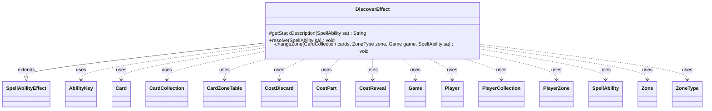

---
aliases:
  - DiscoverEffect
tags:
  - java/class
  - module/forge-game
  - pkg/forge/game/ability/effects
fqn: forge.game.ability.effects.DiscoverEffect
package: forge.game.ability.effects
module: forge-game
kind: Class
---

# DiscoverEffect

**Package:** `forge.game.ability.effects` &nbsp; **Module:** `forge-game` &nbsp; **Kind:** Class



## Relationships
**Extends:**
- [[forge.game.ability.SpellAbilityEffect|SpellAbilityEffect]]
**Uses:**
- [[forge.game.Game|Game]]
- [[forge.game.ability.AbilityKey|AbilityKey]]
- [[forge.game.card.Card|Card]]
- [[forge.game.card.CardCollection|CardCollection]]
- [[forge.game.card.CardZoneTable|CardZoneTable]]
- [[forge.game.cost.CostDiscard|CostDiscard]]
- [[forge.game.cost.CostPart|CostPart]]
- [[forge.game.cost.CostReveal|CostReveal]]
- [[forge.game.player.Player|Player]]
- [[forge.game.player.PlayerCollection|PlayerCollection]]
- [[forge.game.spellability.SpellAbility|SpellAbility]]
- [[forge.game.zone.PlayerZone|PlayerZone]]
- [[forge.game.zone.Zone|Zone]]
- [[forge.game.zone.ZoneType|ZoneType]]

## Design Description

DiscoverEffect is a concrete ability-resolution handler that implements Magic's "Discover N" mechanic. It extends SpellAbilityEffect, overriding `getStackDescription` to phrase the discover action and `resolve` to execute it: for each defined or targeted Player it reveals and exiles cards from the top of the library until finding a nonland card with mana value at most N, then asks that player's controller to either cast it for free or put it into hand, returning the remainder to the bottom in random order.

A private `changeZone` helper centralizes all zone movement through a CardZoneTable, firing zone-change triggers per card when exiling but batched otherwise, and snapshotting last-known battlefield/graveyard state. When casting, it copies the spell with no mana cost, filters out land and over-cost abilities, applies rule 118.8c mandatory-cost semantics, and finally runs Discover triggers via the game's TriggerHandler.

## Source
`forge-game/src/main/java/forge/game/ability/effects/DiscoverEffect.java`

```java
package forge.game.ability.effects;

import forge.game.Game;
import forge.game.ability.AbilityKey;
import forge.game.ability.AbilityUtils;
import forge.game.ability.SpellAbilityEffect;
import forge.game.card.Card;
import forge.game.card.CardCollection;
import forge.game.card.CardLists;
import forge.game.card.CardZoneTable;
import forge.game.cost.CostDiscard;
import forge.game.cost.CostPart;
import forge.game.cost.CostReveal;
import forge.game.player.Player;
import forge.game.player.PlayerCollection;

import forge.game.spellability.SpellAbility;
import forge.game.trigger.TriggerType;
import forge.game.zone.PlayerZone;
import forge.game.zone.Zone;
import forge.game.zone.ZoneType;
import forge.util.Lang;
import forge.util.Localizer;

import org.apache.commons.lang3.StringUtils;

import java.util.Arrays;
import java.util.HashMap;
import java.util.List;
import java.util.Map;

public class DiscoverEffect extends SpellAbilityEffect {

    @Override
    protected String getStackDescription(SpellAbility sa) {
        final PlayerCollection players = getDefinedPlayersOrTargeted(sa);
        final String verb = players.size() == 1 ? " discovers " : " discover ";

        return Lang.joinHomogenous(players) + verb + sa.getParamOrDefault("Num", "1") + ".";
    }

    @Override
    public void resolve(SpellAbility sa) {
        final Card host = sa.getHostCard();
        final Game game = host.getGame();
        final PlayerCollection players = getDefinedPlayersOrTargeted(sa);

        // Exile cards from the top of your library until you exile a nonland card with <N> mana value or less.
        final int num = AbilityUtils.calculateAmount(host, sa.getParamOrDefault("Num", "1"), sa);

        for (final Player p : players) {
            if (p == null || !p.isInGame()) return;

            Card found = null;
            CardCollection exiled = new CardCollection();
            CardCollection rest = new CardCollection();

            final PlayerZone library = p.getZone(ZoneType.Library);

            for (final Card c : library) {
                exiled.add(c);
                if (!c.isLand() && c.getCMC() <= num) {
                    found = c;
                    if (sa.hasParam("RememberDiscovered")) {
                        host.addRemembered(c);
                    }
                    break;
                }
                rest.add(c);
            }

            game.getAction().reveal(exiled, p, false);

            changeZone(exiled, ZoneType.Exile, game, sa);

            // Cast it without paying its mana cost or put it into your hand.
            Map<String, Object> params = new HashMap<>();
            params.put("Card", found);
            if (found != null) {
                String prompt = Localizer.getInstance().getMessage("lblDiscoverChoice",
                        found.getTranslatedName());
                final Zone origin = found.getZone();
                List<String> options =
                        Arrays.asList(StringUtils.capitalize(Localizer.getInstance().getMessage("lblCast")),
                                StringUtils.capitalize(Localizer.getInstance().getMessage("lblHandZone")));
                final boolean play = p.getController().confirmAction(sa, null, prompt, options, found, params);
                boolean cancel = false;

                if (play) {
                    // get basic spells (no flashback, etc.)
                    List<SpellAbility> sas = AbilityUtils.getBasicSpellsFromPlayEffect(found, p);

                    // filter out land abilities due to MDFC or similar
                    sas.removeIf(SpellAbility::isLandAbility);
                    // the spell must also have a mana value equal to or less than the discover number
                    sas.removeIf(sp -> sp.getPayCosts().getTotalMana().getCMC() > num);

                    if (sas.isEmpty()) { // shouldn't happen!
                        System.err.println("DiscoverEffect Error: " + host + " found " + found + " but couldn't play sa");
                    } else {
                        SpellAbility tgtSA = p.getController().getAbilityToPlay(found, sas);

                        if (tgtSA == null) { // in case player canceled from choice dialog
                            cancel = true;
                        } else {
                            tgtSA = tgtSA.copyWithNoManaCost();

                            // 118.8c
                            boolean optional = false;
                            for (CostPart cost : tgtSA.getPayCosts().getCostParts()) {
                                if ((cost instanceof CostDiscard || cost instanceof CostReveal)
                                        && !cost.getType().equals("Card") && !cost.getType().equals("Random")) {
                                    optional = true;
                                    break;
                                }
                            }
                            if (!optional) {
                                tgtSA.getPayCosts().setMandatory(true);
                            }

                            if (tgtSA.usesTargeting() && !optional) {
                                tgtSA.getTargetRestrictions().setMandatory(true);
                            }

                            if (p.getController().playSaFromPlayEffect(tgtSA)) {
                                final Card played = tgtSA.getHostCard();
                                // add remember successfully played here if ever needed
                                final Zone zone = game.getCardState(played).getZone();
                                if (!origin.equals(zone)) {
                                    CardZoneTable trigList = new CardZoneTable();
                                    trigList.put(origin.getZoneType(), zone.getZoneType(), game.getCardState(found));
                                    trigList.triggerChangesZoneAll(game, sa);
                                }
                            }
                        }
                    }
                }
                if (!play || cancel) changeZone(new CardCollection(found), ZoneType.Hand, game, sa);
            }

            // Put the rest on the bottom in a random order.
            changeZone(rest, ZoneType.Library, game, sa);

            // Run discover triggers
            final Map<AbilityKey, Object> runParams = AbilityKey.mapFromPlayer(p);
            runParams.put(AbilityKey.Amount, num);
            game.getTriggerHandler().runTrigger(TriggerType.Discover, runParams, false);
        }
    }

    private void changeZone(CardCollection cards, ZoneType zone, Game game, SpellAbility sa) {
        CardZoneTable table = new CardZoneTable();
        Map<AbilityKey, Object> moveParams = AbilityKey.newMap();
        moveParams.put(AbilityKey.LastStateBattlefield, game.copyLastStateBattlefield());
        moveParams.put(AbilityKey.LastStateGraveyard, game.copyLastStateGraveyard());
        int pos = 0;
        final boolean exileSeq = ZoneType.Exile.equals(zone);

        if (ZoneType.Library.equals(zone)) { // bottom of library in a random order
            pos = -1;
            CardLists.shuffle(cards);
        }

        for (Card c : cards) {
            final ZoneType origin = c.getZone().getZoneType();

            Card m = game.getAction().moveTo(zone, c, pos, sa, moveParams);

            if (m != null && !origin.equals(m.getZone().getZoneType())) {
                table.put(origin, m.getZone().getZoneType(), m);
                if (exileSeq) { // exile cards one at a time
                    table.triggerChangesZoneAll(game, sa);
                    table.clear();
                }
            }
        }
        if (!exileSeq) table.triggerChangesZoneAll(game, sa);
    }
}
```
