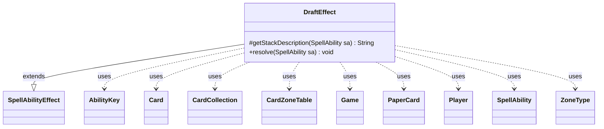

---
aliases:
  - DraftEffect
tags:
  - java/class
  - module/forge-game
  - pkg/forge/game/ability/effects
fqn: forge.game.ability.effects.DraftEffect
package: forge.game.ability.effects
module: forge-game
kind: Class
---

# DraftEffect

**Package:** `forge.game.ability.effects` &nbsp; **Module:** `forge-game` &nbsp; **Kind:** Class



## Relationships
**Extends:**
- [[forge.game.ability.SpellAbilityEffect|SpellAbilityEffect]]
**Uses:**
- [[forge.game.Game|Game]]
- [[forge.game.ability.AbilityKey|AbilityKey]]
- [[forge.game.card.Card|Card]]
- [[forge.game.card.CardCollection|CardCollection]]
- [[forge.game.card.CardZoneTable|CardZoneTable]]
- [[forge.game.player.Player|Player]]
- [[forge.game.spellability.SpellAbility|SpellAbility]]
- [[forge.game.zone.ZoneType|ZoneType]]
- [[forge.item.PaperCard|PaperCard]]

## Design Description

DraftEffect implements the resolution logic for a "draft a card" spell or ability, modeling the Magic mechanic in which a player picks one card from a randomized subset of a host card's predefined spellbook. As a concrete subclass of `SpellAbilityEffect`, it overrides `getStackDescription` to render a human-readable stack message and `resolve` to mutate game state: it splits the `Spellbook` parameter into card names, shuffles them, and offers three choices per draft, repeating for the computed `DraftNum`. Selected `PaperCard` entries are instantiated as `Card` objects (preferring rebalanced "A-" versions) and moved into the player's hand.

Design intent visible in the code includes delegating the choice to the player's controller (so the same effect serves human and AI players), batching zone changes through a `CardZoneTable` so all change-zone triggers fire together at the end, and a `;`-to-`,` escaping convention for card names containing commas. It collaborates with `AbilityUtils` for player/amount resolution, `StaticData` for card lookup, and optionally records picks via `RememberDrafted`.

## Source
`forge-game/src/main/java/forge/game/ability/effects/DraftEffect.java`

```java
package forge.game.ability.effects;

import forge.StaticData;
import forge.game.Game;
import forge.game.ability.AbilityKey;
import forge.game.ability.AbilityUtils;
import forge.game.ability.SpellAbilityEffect;
import forge.game.card.Card;
import forge.game.card.CardCollection;
import forge.game.card.CardZoneTable;
import forge.game.player.Player;
import forge.game.spellability.SpellAbility;
import forge.game.zone.ZoneType;
import forge.item.PaperCard;
import forge.util.Localizer;

import java.util.*;

public class DraftEffect extends SpellAbilityEffect {
    @Override
    protected String getStackDescription(SpellAbility sa) {
        final Card source = sa.getHostCard();
        final Player player = AbilityUtils.getDefinedPlayers(source, sa.getParam("Defined"), sa).get(0);

        final StringBuilder sb = new StringBuilder();

        sb.append(player).append(" drafts a card from ").append(source.getDisplayName()).append("'s spellbook.");

        return sb.toString();
    }

    @Override
    public void resolve(SpellAbility sa) {
        final Card source = sa.getHostCard();
        final Player player = AbilityUtils.getDefinedPlayers(source, sa.getParam("Defined"), sa).get(0);
        final Game game = player.getGame();
        List<String> spellbook = Arrays.asList(sa.getParam("Spellbook").split(","));
        final int numToDraft = AbilityUtils.calculateAmount(source, sa.getParamOrDefault("DraftNum", "1"), sa);
        Map<AbilityKey, Object> moveParams = AbilityKey.newMap();
        moveParams.put(AbilityKey.LastStateBattlefield, sa.getLastStateBattlefield());
        moveParams.put(AbilityKey.LastStateGraveyard, sa.getLastStateGraveyard());
        CardCollection drafted = new CardCollection();

        for (int i = 0; i < numToDraft; i++) {
            Collections.shuffle(spellbook);
            List<Card> draftOptions = new ArrayList<>();
            for (String name : spellbook.subList(0, 3)) {
                // Cardnames that include "," must use ";" instead in Spellbook$ (i.e. Tovolar; Dire Overlord)
                name = name.replace(";", ",");

                PaperCard pc = StaticData.instance().getCommonCards().getUniqueByName(name);
                // Take the balanced version of the card if available.
                if (pc.isUnRebalanced()) {
                    pc = StaticData.instance().getCommonCards().getUniqueByName("A-" + name);
                }

                Card cardOption = Card.fromPaperCard(pc, player);
                draftOptions.add(cardOption);
            }

            Card chosenCard = player.getController().chooseSingleCardForZoneChange(ZoneType.None, new ArrayList<ZoneType>(), sa, new CardCollection(draftOptions), null, Localizer.getInstance().getMessage("lblChooseCardDraft"), false, player);
            game.getAction().moveTo(ZoneType.None, chosenCard, sa, moveParams);
            drafted.add(chosenCard);
        }

        final CardZoneTable triggerList = new CardZoneTable();
        for (final Card c : drafted) {
            Card made = game.getAction().moveToHand(c, sa, moveParams);
            if (c != null) {
                triggerList.put(ZoneType.None, made.getZone().getZoneType(), made);
            }
            if (sa.hasParam("RememberDrafted")) {
                source.addRemembered(made);
            }
        }
        triggerList.triggerChangesZoneAll(game, sa);
    }
}
```
