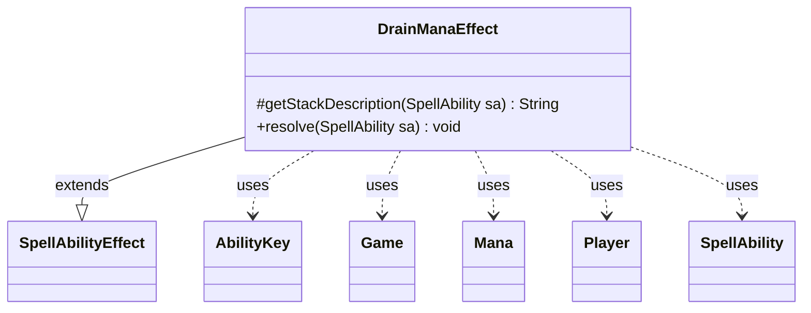

---
aliases:
  - DrainManaEffect
tags:
  - java/class
  - module/forge-game
  - pkg/forge/game/ability/effects
fqn: forge.game.ability.effects.DrainManaEffect
package: forge.game.ability.effects
module: forge-game
kind: Class
---

# DrainManaEffect

**Package:** `forge.game.ability.effects` &nbsp; **Module:** `forge-game` &nbsp; **Kind:** Class



## Relationships
**Extends:**
- [[forge.game.ability.SpellAbilityEffect|SpellAbilityEffect]]
**Uses:**
- [[forge.game.Game|Game]]
- [[forge.game.ability.AbilityKey|AbilityKey]]
- [[forge.game.mana.Mana|Mana]]
- [[forge.game.player.Player|Player]]
- [[forge.game.spellability.SpellAbility|SpellAbility]]

## Design Description

The description is already written and complete in the note. Here it is:

DrainManaEffect is a concrete `SpellAbilityEffect` that resolves the "drain mana" game action, draining all unspent mana from each targeted player's mana pool. As an effect subclass it overrides `getStackDescription` to produce the human-readable stack text and `resolve` to perform the actual game-state mutation, following the standard Forge effect pattern where parameterized behavior is driven by the `SpellAbility` and its host card.

In `resolve` it clears each living target's mana pool via `Player`/`ManaPool`, accumulates the cleared `Mana` objects, and applies mana burn life loss where `StaticAbilityUnspentMana` dictates, batching those losses into a single `LifeLostAll` trigger through the `Game`'s trigger handler and `AbilityKey` parameter map. Optional `DrainMana` and `RememberDrainedMana` parameters let the activating player absorb the drained mana or have the host card remember its count, keeping the class reusable across cards while collaborating only through Forge's player, mana, and trigger abstractions.

## Source
`forge-game/src/main/java/forge/game/ability/effects/DrainManaEffect.java`

```java
package forge.game.ability.effects;

import java.util.ArrayList;
import java.util.List;
import java.util.Map;

import com.google.common.collect.Maps;

import forge.game.Game;
import forge.game.ability.AbilityKey;
import forge.game.ability.SpellAbilityEffect;
import forge.game.mana.Mana;
import forge.game.player.Player;
import forge.game.spellability.SpellAbility;
import forge.game.staticability.StaticAbilityUnspentMana;
import forge.game.trigger.TriggerType;
import forge.util.Lang;

public class DrainManaEffect extends SpellAbilityEffect {
    @Override
    protected String getStackDescription(SpellAbility sa) {
        final StringBuilder sb = new StringBuilder();

        sb.append(Lang.joinHomogenous(getTargetPlayers(sa)));

        sb.append(" loses all unspent mana.");

        return sb.toString();
    }

    @Override
    public void resolve(SpellAbility sa) {
        final Game game = sa.getHostCard().getGame();
        final List<Mana> drained = new ArrayList<>();
        final Map<Player, Integer> lossMap = Maps.newHashMap();

        for (final Player p : getTargetPlayers(sa)) {
            if (!p.isInGame()) {
                continue;
            }
            List<Mana> cleared = p.getManaPool().clearPool(false);
            drained.addAll(cleared);
            if (StaticAbilityUnspentMana.hasManaBurn(p)) {
                final int lost = p.loseLife(cleared.size(), false, true);
                if (lost > 0) {
                    lossMap.put(p, lost);
                }
            }
        }

        if (!lossMap.isEmpty()) { // Run triggers if any player actually lost life
            final Map<AbilityKey, Object> runLifeLostParams = AbilityKey.mapFromPIMap(lossMap);
            game.getTriggerHandler().runTrigger(TriggerType.LifeLostAll, runLifeLostParams, false);
        }

        if (sa.hasParam("DrainMana")) {
            sa.getActivatingPlayer().getManaPool().add(drained);
        }
        if (sa.hasParam("RememberDrainedMana")) {
            sa.getHostCard().addRemembered(drained.size());
        }
    }

}
```
