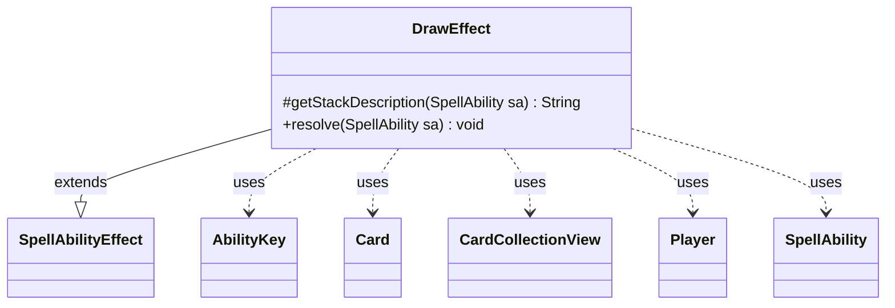

---
aliases:
  - DrawEffect
tags:
  - java/class
  - module/forge-game
  - pkg/forge/game/ability/effects
fqn: forge.game.ability.effects.DrawEffect
package: forge.game.ability.effects
module: forge-game
kind: Class
---

# DrawEffect

**Package:** `forge.game.ability.effects` &nbsp; **Module:** `forge-game` &nbsp; **Kind:** Class



## Relationships
**Extends:**
- [[forge.game.ability.SpellAbilityEffect|SpellAbilityEffect]]
**Uses:**
- [[forge.game.ability.AbilityKey|AbilityKey]]
- [[forge.game.card.Card|Card]]
- [[forge.game.card.CardCollectionView|CardCollectionView]]
- [[forge.game.player.Player|Player]]
- [[forge.game.spellability.SpellAbility|SpellAbility]]

## Design Description

DrawEffect is a concrete effect handler that implements the "Draw" spell ability, extending SpellAbilityEffect within Forge's ability-effects framework. It overrides `getStackDescription` to produce a localized, human-readable summary of which players draw how many cards, and `resolve` to carry out the draw against live game state. Reading SpellAbility parameters (NumCards, Upto, OptionalDecider, Reveal, RememberDrawn), it iterates the defined or targeted Players, scaling the count by each player's duplicate-target frequency and consulting StaticAbilityCantDraw plus controller confirmations for optional and "up to" draws.

By design it threads card-movement context (last-state battlefield and graveyard) through an AbilityKey map into `drawCards`, then uses the returned CardCollectionView to optionally reveal or remember the drawn cards. A separate NumCardsDesc parameter deliberately keeps the stack description stable when the computed count may change before resolution.

## Source
`forge-game/src/main/java/forge/game/ability/effects/DrawEffect.java`

```java
package forge.game.ability.effects;

import java.util.Collections;
import java.util.List;
import java.util.Map;

import com.google.common.collect.Sets;

import forge.game.ability.AbilityKey;
import forge.game.ability.AbilityUtils;
import forge.game.ability.SpellAbilityEffect;
import forge.game.card.Card;
import forge.game.card.CardCollectionView;
import forge.game.player.Player;
import forge.game.spellability.SpellAbility;
import forge.game.staticability.StaticAbilityCantDraw;
import forge.util.Lang;
import forge.util.Localizer;

public class DrawEffect extends SpellAbilityEffect {
    @Override
    protected String getStackDescription(SpellAbility sa) {
        final StringBuilder sb = new StringBuilder();

        if (sa.hasParam("IfDesc")) {
            if (sa.getParam("IfDesc").equals("True") && sa.hasParam("SpellDescription")) {
                String ifDesc = sa.getParam("SpellDescription");
                sb.append(ifDesc, 0, ifDesc.indexOf(",") + 1);
            } else {
                sb.append(sa.getParam("IfDesc"));
            }
            sb.append(" ");
        }

        final List<Player> tgtPlayers = getDefinedPlayersOrTargeted(sa);

        if (!tgtPlayers.isEmpty()) {
            int numCards = sa.hasParam("NumCards") ? AbilityUtils.calculateAmount(sa.getHostCard(), sa.getParam("NumCards"), sa) : 1;

            sb.append(Lang.joinHomogenous(tgtPlayers));

            if (tgtPlayers.size() > 1) {
                sb.append(" each");
            }
            sb.append(Lang.joinVerb(tgtPlayers, " draw")).append(" ");
            //if NumCards calculation could change between getStackDescription and resolve, use NumCardsDesc to avoid
            //a "wrong" stack description
            sb.append(sa.hasParam("NumCardsDesc") ? sa.getParam("NumCardsDesc") : numCards == 1 ? "a card" :
                    (Lang.getNumeral(numCards) + " cards"));
            sb.append(".");
        }

        return sb.toString();
    }

    @Override
    public void resolve(SpellAbility sa) {
        final Card source = sa.getHostCard();
        final int numCards = sa.hasParam("NumCards") ? AbilityUtils.calculateAmount(sa.getHostCard(), sa.getParam("NumCards"), sa) : 1;
        final boolean upto = sa.hasParam("Upto");
        final boolean optional = sa.hasParam("OptionalDecider") || upto;
        Map<AbilityKey, Object> moveParams = AbilityKey.newMap();
        moveParams.put(AbilityKey.LastStateBattlefield, sa.getLastStateBattlefield());
        moveParams.put(AbilityKey.LastStateGraveyard, sa.getLastStateGraveyard());

        final List<Player> tgts = getTargetPlayersWithDuplicates(true, "Defined", sa);

        for (final Player p : Sets.newLinkedHashSet(tgts)) {
            if (!p.isInGame()) {
                continue;
            }

            int actualNum = numCards * Collections.frequency(tgts, p);

            // it is optional, not upto and player can't choose to draw that many cards
            if (optional && !upto && !p.canDrawAmount(actualNum)) {
                continue;
            }

            if (optional && !p.getController().confirmAction(sa, null, Localizer.getInstance().getMessage("lblDoYouWantDrawCards", Lang.nounWithAmount(actualNum, " card")), null)) {
                continue;
            }

            if (upto) { // if it is upto, player can only choose how many cards they can draw
                actualNum = StaticAbilityCantDraw.canDrawAmount(p, actualNum);
            }
            if (actualNum <= 0) {
                continue;
            }
            if (upto) {
                actualNum = p.getController().chooseNumber(sa, Localizer.getInstance().getMessage("lblHowManyCardDoYouWantDraw"), 0, actualNum);
            }

            final CardCollectionView drawn = p.drawCards(actualNum, sa, moveParams);
            if (sa.hasParam("Reveal")) {
                p.getGame().getAction().reveal(drawn, p, !sa.getParam("Reveal").equals("All"));
            }
            if (sa.hasParam("RememberDrawn")) {
                source.addRemembered(drawn);
            }
        }
    }
}
```

## Python
`forge/game/ability/effects/DrawEffect.py`

```python
from forge.game.ability.AbilityKey import AbilityKey
from forge.game.ability.AbilityUtils import AbilityUtils
from forge.game.ability.SpellAbilityEffect import SpellAbilityEffect
from forge.game.card.Card import Card
from forge.game.card.CardCollectionView import CardCollectionView
from forge.game.player.Player import Player
from forge.game.spellability.SpellAbility import SpellAbility
from forge.game.staticability.StaticAbilityCantDraw import StaticAbilityCantDraw
from forge.util.Lang import Lang
from forge.util.Localizer import Localizer


class DrawEffect(SpellAbilityEffect):
    def getStackDescription(self, sa: SpellAbility) -> str:
        sb = []

        if sa.hasParam("IfDesc"):
            if sa.getParam("IfDesc") == "True" and sa.hasParam("SpellDescription"):
                ifDesc = sa.getParam("SpellDescription")
                sb.append(ifDesc[0:ifDesc.find(",") + 1])
            else:
                sb.append(sa.getParam("IfDesc"))
            sb.append(" ")

        tgtPlayers = self.getDefinedPlayersOrTargeted(sa)

        if tgtPlayers:
            numCards = AbilityUtils.calculateAmount(sa.getHostCard(), sa.getParam("NumCards"), sa) if sa.hasParam("NumCards") else 1

            sb.append(Lang.joinHomogenous(tgtPlayers))

            if len(tgtPlayers) > 1:
                sb.append(" each")
            sb.append(Lang.joinVerb(tgtPlayers, " draw"))
            sb.append(" ")
            # if NumCards calculation could change between getStackDescription and resolve, use NumCardsDesc to avoid
            # a "wrong" stack description
            if sa.hasParam("NumCardsDesc"):
                sb.append(sa.getParam("NumCardsDesc"))
            elif numCards == 1:
                sb.append("a card")
            else:
                sb.append(Lang.getNumeral(numCards) + " cards")
            sb.append(".")

        return "".join(sb)

    def resolve(self, sa: SpellAbility) -> None:
        source = sa.getHostCard()
        numCards = AbilityUtils.calculateAmount(sa.getHostCard(), sa.getParam("NumCards"), sa) if sa.hasParam("NumCards") else 1
        upto = sa.hasParam("Upto")
        optional = sa.hasParam("OptionalDecider") or upto
        moveParams = AbilityKey.newMap()
        moveParams[AbilityKey.LastStateBattlefield] = sa.getLastStateBattlefield()
        moveParams[AbilityKey.LastStateGraveyard] = sa.getLastStateGraveyard()

        tgts = self.getTargetPlayersWithDuplicates(True, "Defined", sa)

        for p in dict.fromkeys(tgts):
            if not p.isInGame():
                continue

            actualNum = numCards * tgts.count(p)

            # it is optional, not upto and player can't choose to draw that many cards
            if optional and not upto and not p.canDrawAmount(actualNum):
                continue

            if optional and not p.getController().confirmAction(sa, None, Localizer.getInstance().getMessage("lblDoYouWantDrawCards", Lang.nounWithAmount(actualNum, " card")), None):
                continue

            if upto:  # if it is upto, player can only choose how many cards they can draw
                actualNum = StaticAbilityCantDraw.canDrawAmount(p, actualNum)
            if actualNum <= 0:
                continue
            if upto:
                actualNum = p.getController().chooseNumber(sa, Localizer.getInstance().getMessage("lblHowManyCardDoYouWantDraw"), 0, actualNum)

            drawn = p.drawCards(actualNum, sa, moveParams)
            if sa.hasParam("Reveal"):
                p.getGame().getAction().reveal(drawn, p, not sa.getParam("Reveal") == "All")
            if sa.hasParam("RememberDrawn"):
                source.addRemembered(drawn)
```
