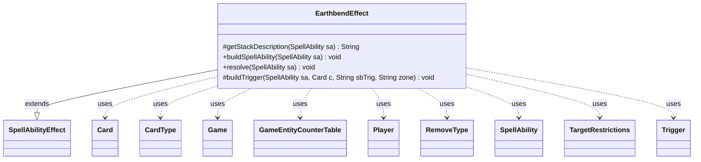

---
aliases:
  - EarthbendEffect
tags:
  - java/class
  - module/forge-game
  - pkg/forge/game/ability/effects
fqn: forge.game.ability.effects.EarthbendEffect
package: forge.game.ability.effects
module: forge-game
kind: Class
---

# EarthbendEffect

**Package:** `forge.game.ability.effects` &nbsp; **Module:** `forge-game` &nbsp; **Kind:** Class



## Relationships
**Extends:**
- [[forge.game.ability.SpellAbilityEffect|SpellAbilityEffect]]
**Uses:**
- [[forge.card.CardType|CardType]]
- [[forge.card.RemoveType|RemoveType]]
- [[forge.game.Game|Game]]
- [[forge.game.GameEntityCounterTable|GameEntityCounterTable]]
- [[forge.game.card.Card|Card]]
- [[forge.game.player.Player|Player]]
- [[forge.game.spellability.SpellAbility|SpellAbility]]
- [[forge.game.spellability.TargetRestrictions|TargetRestrictions]]
- [[forge.game.trigger.Trigger|Trigger]]

## Design Description

EarthbendEffect implements Magic's "Earthbend" keyword action as a concrete `SpellAbilityEffect` subclass, plugging into Forge's ability-resolution framework by overriding the standard lifecycle hooks (`getStackDescription`, `buildSpellAbility`, and `resolve`). Its responsibility is to retarget a single land the player controls—constrained via `TargetRestrictions` to `Land.YouCtrl`—and transform it into a 0/0 haste creature that remains a land, using `CardType`/`RemoveType` changes plus a `GameEntityCounterTable` to place the specified number of +1/+1 counters.

A notable design intent is the delayed-trigger setup: the protected `buildTrigger` helper parses two trigger definitions (death and exile) and registers them with the `TriggerHandler` so the land returns to the battlefield tapped under the player's control. Timestamps order the layered changes, and the effect finally notifies the player via `triggerElementalBend` so other Earthbend-sensitive abilities can respond.

## Source
`forge-game/src/main/java/forge/game/ability/effects/EarthbendEffect.java`

```java
package forge.game.ability.effects;

import java.util.EnumSet;
import java.util.List;
import java.util.Map;

import forge.card.CardType;
import forge.card.RemoveType;
import forge.game.Game;
import forge.game.GameEntityCounterTable;
import forge.game.ability.AbilityFactory;
import forge.game.ability.AbilityUtils;
import forge.game.ability.SpellAbilityEffect;
import forge.game.card.Card;
import forge.game.card.CounterEnumType;
import forge.game.player.Player;
import forge.game.spellability.SpellAbility;
import forge.game.spellability.TargetRestrictions;
import forge.game.trigger.Trigger;
import forge.game.trigger.TriggerHandler;
import forge.game.trigger.TriggerType;
import forge.util.Lang;

public class EarthbendEffect extends SpellAbilityEffect {

    @Override
    protected String getStackDescription(SpellAbility sa) {
        final StringBuilder sb = new StringBuilder("Earthbend ");
        final Card card = sa.getHostCard();
        final int amount = AbilityUtils.calculateAmount(card, sa.getParamOrDefault("Num", "1"), sa);

        sb.append(amount).append(". (Target land you control becomes a 0/0 creature with haste that's still a land. Put  ");
        sb.append(Lang.nounWithNumeral(amount, "+1/+1 counter"));
        sb.append(" on it. When it dies or is exiled, return it to the battlefield tapped under your control.)");

        return sb.toString();
    }

    @Override
    public void buildSpellAbility(final SpellAbility sa) {
        super.buildSpellAbility(sa);
        TargetRestrictions abTgt = new TargetRestrictions(Map.of("ValidTgtsDesc", "land you control", "ValidTgts", "Land.YouCtrl"));
        sa.setTargetRestrictions(abTgt);
    }

    @Override
    public void resolve(SpellAbility sa) {
        final Card source = sa.getHostCard();
        final Game game = source.getGame();
        final Player pl = sa.getActivatingPlayer();
        int num = AbilityUtils.calculateAmount(source, sa.getParamOrDefault("Num", "1"), sa);

        long ts = game.getNextTimestamp();

        String desc = "When it dies or is exiled, return it to the battlefield tapped.";
        String sbTrigA = "Mode$ ChangesZone | ValidCard$ Card.IsTriggerRemembered | Origin$ Battlefield | Destination$ Graveyard | TriggerDescription$ " + desc;
        String sbTrigB = "Mode$ Exiled | Origin$ Battlefield | ValidCard$ Card.IsTriggerRemembered | TriggerZones$ Battlefield | TriggerDescription$ " + desc;

        // Earthbend should only target one land
        for (Card c : getTargetCards(sa)) {
            c.addNewPT(0, 0, ts, 0);
            c.addChangedCardTypes(new CardType(List.of("Creature"), true), null, false, EnumSet.noneOf(RemoveType.class), ts, 0, true, false);
            c.addChangedCardKeywords(List.of("Haste"), null, false, ts, null);

            GameEntityCounterTable table = new GameEntityCounterTable();
            c.addCounter(CounterEnumType.P1P1, num, pl, table);
            table.replaceCounterEffect(game, sa);

            buildTrigger(sa, c, sbTrigA, "Graveyard");
            buildTrigger(sa, c, sbTrigB, "Exile");
        }
        pl.triggerElementalBend(TriggerType.Earthbend);
    }

    protected void buildTrigger(SpellAbility sa, Card c, String sbTrig, String zone) {
        final Card source = sa.getHostCard();
        final Game game = source.getGame();
        String trigSA = "DB$ ChangeZone | Defined$ DelayTriggerRemembered | Origin$ " + zone + " | Destination$ Battlefield | Tapped$ True | GainControl$ You";

        final Trigger trig = TriggerHandler.parseTrigger(sbTrig, source, sa.isIntrinsic());
        final SpellAbility newSa = AbilityFactory.getAbility(trigSA, sa.getHostCard());
        newSa.setIntrinsic(sa.isIntrinsic());
        trig.addRemembered(c);
        trig.setOverridingAbility(newSa);
        trig.setSpawningAbility(sa.copy(sa.getHostCard(), true));
        trig.setKeyword(trig.getSpawningAbility().getKeyword());

        game.getTriggerHandler().registerDelayedTrigger(trig);
    }
}
```
