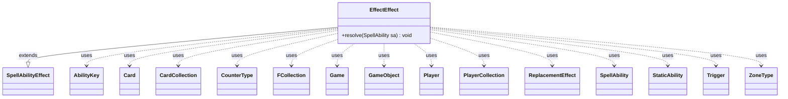

---
aliases:
  - EffectEffect
tags:
  - java/class
  - module/forge-game
  - pkg/forge/game/ability/effects
fqn: forge.game.ability.effects.EffectEffect
package: forge.game.ability.effects
module: forge-game
kind: Class
---

# EffectEffect

**Package:** `forge.game.ability.effects`   **Module:** `forge-game`   **Kind:** Class



## Relationships
**Extends:**
- [[forge.game.ability.SpellAbilityEffect|SpellAbilityEffect]]
**Uses:**
- [[forge.game.Game|Game]]
- [[forge.game.GameObject|GameObject]]
- [[forge.game.ability.AbilityKey|AbilityKey]]
- [[forge.game.card.Card|Card]]
- [[forge.game.card.CardCollection|CardCollection]]
- [[forge.game.card.CounterType|CounterType]]
- [[forge.game.player.Player|Player]]
- [[forge.game.player.PlayerCollection|PlayerCollection]]
- [[forge.game.replacement.ReplacementEffect|ReplacementEffect]]
- [[forge.game.spellability.SpellAbility|SpellAbility]]
- [[forge.game.staticability.StaticAbility|StaticAbility]]
- [[forge.game.trigger.Trigger|Trigger]]
- [[forge.game.zone.ZoneType|ZoneType]]
- [[forge.util.collect.FCollection|FCollection]]

## Design Description

EffectEffect is a concrete `SpellAbilityEffect` subclass that resolves Forge's generic, script-driven "Effect" ability—the mechanism used to materialize emblems, boons, adventures, and other transient command-zone constructs. Its single overridden `resolve` reads a broad set of optional parameters off the incoming `SpellAbility` and, for each defined `Player` in the effect's owner set, builds a command-zone `Card` via the inherited `createEffect`, then grafts onto it granted `SpellAbility`s, `Trigger`s, `StaticAbility`s, and `ReplacementEffect`s—each scoped to `ZoneType.Command` and marked intrinsic.

Beyond construction it manages the effect's memory and lifecycle: tracking remembered `GameObject`s in an `FCollection`, wiring forget/exile cleanup triggers, noting counters, propagating chosen colors, cards, players, and types from the host `Card`, and registering duration-based expiry through `addUntilCommand`. The design deliberately centralizes diverse, data-configured card behaviors into one parameter-interpreting resolver, favoring script flexibility over per-card Java.

## Source
`forge-game/src/main/java/forge/game/ability/effects/EffectEffect.java`

```java
package forge.game.ability.effects;

import java.util.Arrays;
import java.util.EnumSet;
import java.util.List;
import java.util.Map;

import com.google.common.collect.Lists;

import forge.ImageKeys;
import forge.StaticData;
import forge.game.Game;
import forge.game.GameObject;
import forge.game.ability.AbilityFactory;
import forge.game.ability.AbilityKey;
import forge.game.ability.AbilityUtils;
import forge.game.ability.SpellAbilityEffect;
import forge.game.card.*;
import forge.game.player.Player;
import forge.game.player.PlayerCollection;
import forge.game.replacement.ReplacementEffect;
import forge.game.replacement.ReplacementHandler;
import forge.game.spellability.SpellAbility;
import forge.game.staticability.StaticAbility;
import forge.game.trigger.Trigger;
import forge.game.trigger.TriggerHandler;
import forge.game.zone.ZoneType;
import forge.util.IterableUtil;
import forge.util.TextUtil;
import forge.util.collect.FCollection;

public class EffectEffect extends SpellAbilityEffect {

    /**
     * <p>
     * effectResolve.
     * </p>
     * @param sa
     *            a {@link forge.game.spellability.SpellAbility} object.
     */

    @Override
    public void resolve(SpellAbility sa) {
        final Card hostCard = sa.getHostCard();
        final Game game = hostCard.getGame();

        String[] effectAbilities = null;
        String[] effectTriggers = null;
        String[] effectStaticAbilities = null;
        String[] effectReplacementEffects = null;
        FCollection<GameObject> rememberList = null;
        String effectImprinted = null;
        String noteCounterDefined = null;
        final String duration = sa.getParam("Duration");

        if (!checkValidDuration(duration, sa)) {
            return;
        }

        if (sa.hasParam("Abilities")) {
            effectAbilities = sa.getParam("Abilities").split(",");
        }

        if (sa.hasParam("Triggers")) {
            effectTriggers = sa.getParam("Triggers").split(",");
        }

        if (sa.hasParam("StaticAbilities")) {
            effectStaticAbilities = sa.getParam("StaticAbilities").split(",");
        }

        if (sa.hasParam("ReplacementEffects")) {
            effectReplacementEffects = sa.getParam("ReplacementEffects").split(",");
        }

        if (sa.hasParam("RememberSpell")) {
            rememberList = new FCollection<>();
            for (final String rem : sa.getParam("RememberSpell").split(",")) {
                rememberList.addAll(AbilityUtils.getDefinedSpellAbilities(hostCard, rem, sa));
            }
        }

        if (sa.hasParam("RememberObjects")) {
            rememberList = new FCollection<>(
                    AbilityUtils.getDefinedEntities(hostCard, sa.getParam("RememberObjects").split(" & "), sa)
            );

            if (sa.hasParam("ForgetCounter")) {
                CounterType cType = CounterType.getType(sa.getParam("ForgetCounter"));
                rememberList = new FCollection<>(CardLists.filter(IterableUtil.filter(rememberList, Card.class), CardPredicates.hasCounter(cType)));
            }

            // don't create Effect if there is no remembered Objects
            if (rememberList.isEmpty() && (sa.hasParam("ForgetOnMoved") || sa.hasParam("ExileOnMoved") || sa.hasParam("ForgetCounter") || sa.hasParam("ForgetOnPhasedIn"))) {
                return;
            }
        }

        if (sa.hasParam("RememberLKI")) {
            rememberList = new FCollection<>();
            for (final String rem : sa.getParam("RememberLKI").split(",")) {
                CardCollection def = AbilityUtils.getDefinedCards(hostCard, rem, sa);
                for (Card c : def) {
                    rememberList.add(CardCopyService.getLKICopy(c));
                }
            }

            // don't create Effect if there is no remembered Objects
            if (rememberList.isEmpty() && (sa.hasParam("ForgetOnMoved") || sa.hasParam("ExileOnMoved"))) {
                return;
            }
        }

        if (sa.hasParam("ImprintCards")) {
            effectImprinted = sa.getParam("ImprintCards");
        }

        if (sa.hasParam("NoteCounterDefined")) {
            noteCounterDefined = sa.getParam("NoteCounterDefined");
        }

        String name = sa.getParam("Name");
        if (name == null) {
            if (sa.hasParam("Adventure")) {
                name = hostCard + "'s Adventure";
            } else {
                name = hostCard + (sa.hasParam("Boon") ? "'s Boon" : "'s Effect");
            }
        }

        PlayerCollection effectOwner = sa.hasParam("EffectOwner") ?
                AbilityUtils.getDefinedPlayers(hostCard, sa.getParam("EffectOwner"), sa) :
                new PlayerCollection(sa.getActivatingPlayer());

        // Unique$ is for effects that should be one per player (e.g. Gollum, Obsessed Stalker)
        if (sa.hasParam("Unique")) {
            for (Player eo : effectOwner.threadSafeIterable()) {
                if (eo.isCardInCommand(name)) {
                    effectOwner.remove(eo);
                }
            }
        }

        if (effectOwner.isEmpty()) {
            return; // return if we don't need to make an effect
        }

        String image;
        if (name.startsWith("Emblem")) {
            if (sa.hasParam("Image")) {
                image = StaticData.instance().getOtherImageKey(sa.getParam("Image"), hostCard.getSetCode());
            } else {
                // try to get the image from name
                String imageKey = TextUtil.fastReplace(
                    TextUtil.fastReplace(
                        TextUtil.fastReplace(name.toLowerCase(), " — ", "_"),
                        ",", ""),
                        " ", "_");
                image = StaticData.instance().getOtherImageKey(imageKey, hostCard.getSetCode());
            }
        } else if (sa.hasParam("Image")) {
            image = ImageKeys.getTokenKey(sa.getParam("Image"));
        } else if (sa.hasParam("Adventure")) {
            image = StaticData.instance().getOtherImageKey(ImageKeys.ADVENTURE_IMAGE, hostCard.getSetCode());
        } else { // use host image
            image = hostCard.getImageKey();
        }

        Map<AbilityKey, Object> params = AbilityKey.newMap();
        params.put(AbilityKey.LastStateBattlefield, sa.getLastStateBattlefield());
        params.put(AbilityKey.LastStateGraveyard, sa.getLastStateGraveyard());

        for (Player controller : effectOwner) {
            final Card eff = createEffect(sa, controller, name, image);
            if (sa.hasParam("Boon")) {
                eff.setBoon(true);
            }

            // Abilities and triggers work the same as they do for Token
            // Grant abilities
            if (effectAbilities != null) {
                for (final String s : effectAbilities) {
                    final SpellAbility grantedAbility = AbilityFactory.getAbility(eff, s, sa);
                    eff.addSpellAbility(grantedAbility);
                    grantedAbility.setIntrinsic(true);
                }
            }

            // Grant triggers
            if (effectTriggers != null) {
                for (final String s : effectTriggers) {
                    final Trigger parsedTrigger = TriggerHandler.parseTrigger(AbilityUtils.getSVar(sa, s), eff, true, sa);
                    parsedTrigger.setActiveZone(EnumSet.of(ZoneType.Command));
                    parsedTrigger.setIntrinsic(true);
                    eff.addTrigger(parsedTrigger);
                }
            }

            // Grant static abilities
            if (effectStaticAbilities != null) {
                for (final String s : effectStaticAbilities) {
                    final StaticAbility addedStaticAbility = eff.addStaticAbility(AbilityUtils.getSVar(sa, s));
                    if (addedStaticAbility != null) { //prevent npe casting adventure card spell
                        addedStaticAbility.setActiveZone(EnumSet.of(ZoneType.Command));
                        addedStaticAbility.setIntrinsic(true);
                    }
                }
            }

            // Grant replacement effects
            if (effectReplacementEffects != null) {
                for (final String s : effectReplacementEffects) {
                    final String actualReplacement = AbilityUtils.getSVar(sa, s);

                    final ReplacementEffect parsedReplacement = ReplacementHandler.parseReplacement(actualReplacement, eff, true, eff.getCurrentState());
                    parsedReplacement.setActiveZone(EnumSet.of(ZoneType.Command));
                    parsedReplacement.setIntrinsic(true);
                    eff.addReplacementEffect(parsedReplacement);
                }
            }

            // Remember Keywords
            if (sa.hasParam("RememberKeywords")) {
                List<String> effectKeywords = Arrays.asList(sa.getParam("RememberKeywords").split(","));
                if (sa.hasParam("SharedKeywordsZone")) {
                    List<ZoneType> zones = ZoneType.listValueOf(sa.getParam("SharedKeywordsZone"));
                    String[] restrictions = sa.hasParam("SharedRestrictions") ? sa.getParam("SharedRestrictions").split(",")
                            : new String[]{"Card"};
                    effectKeywords = CardFactoryUtil.sharedKeywords(effectKeywords, restrictions, zones, hostCard, sa);
                }
                if (effectKeywords != null) {
                    eff.addRemembered(effectKeywords);
                }
            }

            // Set Remembered
            if (rememberList != null) {
                eff.addRemembered(rememberList);
                if (sa.hasParam("ForgetOnMoved")) {
                    addForgetOnMovedTrigger(eff, sa.getParam("ForgetOnMoved"));
                    if (!"Stack".equals(sa.getParam("ForgetOnMoved")) && !"False".equalsIgnoreCase(sa.getParam("ForgetOnCast"))) {
                        addForgetOnCastTrigger(eff, "Card.IsRemembered");
                    }
                } else if (sa.hasParam("ExileOnMoved")) {
                    addExileOnMovedTrigger(eff, sa.getParam("ExileOnMoved"));
                }
                if (sa.hasParam("ForgetOnPhasedIn")) {
                    addForgetOnPhasedInTrigger(eff);
                }
                if (sa.hasParam("ForgetCounter")) {
                    addForgetCounterTrigger(eff, sa.getParam("ForgetCounter"));
                }
            } else if (sa.hasParam("ForgetOnCast")) {
                addForgetOnCastTrigger(eff, sa.getParam("ForgetOnCast"));
            }

            if (sa.hasParam("ExileOnLost")) {
                addExileOnLostTrigger(eff);
            }

            if (sa.hasParam("ExileOnCounter")) {
                addExileCounterTrigger(eff, sa.getParam("ExileOnCounter"));
            }

            if (effectImprinted != null) {
                eff.addImprintedCards(AbilityUtils.getDefinedCards(hostCard, effectImprinted, sa));
            }

            // Note counters on defined
            if (noteCounterDefined != null) {
                for (final Card c : AbilityUtils.getDefinedCards(hostCard, noteCounterDefined, sa)) {
                    CountersNoteEffect.noteCounters(c, eff);
                }
            }

            if (hostCard.hasChosenColor()) {
                eff.setChosenColors(Lists.newArrayList(hostCard.getChosenColors()));
            }

            if (hostCard.hasChosenCard()) {
                eff.setChosenCards(hostCard.getChosenCards());
            }

            if (hostCard.hasChosenPlayer()) {
                eff.setChosenPlayer(hostCard.getChosenPlayer());
            }

            if (hostCard.getChosenDirection() != null) {
                eff.setChosenDirection(hostCard.getChosenDirection());
            }

            if (hostCard.hasChosenType()) {
                eff.setChosenType(hostCard.getChosenType());
            }
            if (hostCard.hasChosenType2()) {
                eff.setChosenType2(hostCard.getChosenType2());
            }

            if (hostCard.hasNamedCard()) {
                eff.setNamedCards(Lists.newArrayList(hostCard.getNamedCards()));
            }

            if (sa.hasParam("SetChosenNumber")) {
                eff.setChosenNumber(AbilityUtils.calculateAmount(hostCard, sa.getParam("SetChosenNumber"), sa));
            } else if (hostCard.hasChosenNumber()) {
                eff.setChosenNumber(hostCard.getChosenNumber());
            }

            // Copy text changes
            if (sa.isIntrinsic()) {
                eff.copyChangedTextFrom(hostCard);
            }

            if (sa.hasParam("AtEOT")) {
                registerDelayedTrigger(sa, sa.getParam("AtEOT"), Lists.newArrayList(hostCard));
            }

            if (duration == null || !duration.equals("Permanent")) {
                addUntilCommand(sa, () -> game.getAction().exileEffect(eff), controller);
            }

            if (sa.hasParam("ImprintOnHost")) {
                hostCard.addImprintedCard(eff);
            }

            game.getAction().moveToCommand(eff, sa);
        }
    }

}
```

## Python
`forge/game/ability/effects/EffectEffect.py`

```python
from forge.ImageKeys import ImageKeys
from forge.StaticData import StaticData
from forge.game.Game import Game
from forge.game.GameObject import GameObject
from forge.game.ability.AbilityFactory import AbilityFactory
from forge.game.ability.AbilityKey import AbilityKey
from forge.game.ability.AbilityUtils import AbilityUtils
from forge.game.ability.SpellAbilityEffect import SpellAbilityEffect
from forge.game.ability.effects.CountersNoteEffect import CountersNoteEffect
from forge.game.card.Card import Card
from forge.game.card.CardCollection import CardCollection
from forge.game.card.CardCopyService import CardCopyService
from forge.game.card.CardFactoryUtil import CardFactoryUtil
from forge.game.card.CardLists import CardLists
from forge.game.card.CardPredicates import CardPredicates
from forge.game.card.CounterType import CounterType
from forge.game.player.Player import Player
from forge.game.player.PlayerCollection import PlayerCollection
from forge.game.replacement.ReplacementEffect import ReplacementEffect
from forge.game.replacement.ReplacementHandler import ReplacementHandler
from forge.game.spellability.SpellAbility import SpellAbility
from forge.game.staticability.StaticAbility import StaticAbility
from forge.game.trigger.Trigger import Trigger
from forge.game.trigger.TriggerHandler import TriggerHandler
from forge.game.zone.ZoneType import ZoneType
from forge.util.IterableUtil import IterableUtil
from forge.util.TextUtil import TextUtil
from forge.util.collect.FCollection import FCollection


class EffectEffect(SpellAbilityEffect):

    def resolve(self, sa: SpellAbility) -> None:
        hostCard = sa.getHostCard()
        game = hostCard.getGame()

        effectAbilities = None
        effectTriggers = None
        effectStaticAbilities = None
        effectReplacementEffects = None
        rememberList = None
        effectImprinted = None
        noteCounterDefined = None
        duration = sa.getParam("Duration")

        if not self.checkValidDuration(duration, sa):
            return

        if sa.hasParam("Abilities"):
            effectAbilities = sa.getParam("Abilities").split(",")

        if sa.hasParam("Triggers"):
            effectTriggers = sa.getParam("Triggers").split(",")

        if sa.hasParam("StaticAbilities"):
            effectStaticAbilities = sa.getParam("StaticAbilities").split(",")

        if sa.hasParam("ReplacementEffects"):
            effectReplacementEffects = sa.getParam("ReplacementEffects").split(",")

        if sa.hasParam("RememberSpell"):
            rememberList = FCollection()
            for rem in sa.getParam("RememberSpell").split(","):
                rememberList.addAll(AbilityUtils.getDefinedSpellAbilities(hostCard, rem, sa))

        if sa.hasParam("RememberObjects"):
            rememberList = FCollection(
                AbilityUtils.getDefinedEntities(hostCard, sa.getParam("RememberObjects").split(" & "), sa)
            )

            if sa.hasParam("ForgetCounter"):
                cType = CounterType.getType(sa.getParam("ForgetCounter"))
                rememberList = FCollection(CardLists.filter(IterableUtil.filter(rememberList, Card), CardPredicates.hasCounter(cType)))

            # don't create Effect if there is no remembered Objects
            if rememberList.isEmpty() and (sa.hasParam("ForgetOnMoved") or sa.hasParam("ExileOnMoved") or sa.hasParam("ForgetCounter") or sa.hasParam("ForgetOnPhasedIn")):
                return

        if sa.hasParam("RememberLKI"):
            rememberList = FCollection()
            for rem in sa.getParam("RememberLKI").split(","):
                def_ = AbilityUtils.getDefinedCards(hostCard, rem, sa)
                for c in def_:
                    rememberList.add(CardCopyService.getLKICopy(c))

            # don't create Effect if there is no remembered Objects
            if rememberList.isEmpty() and (sa.hasParam("ForgetOnMoved") or sa.hasParam("ExileOnMoved")):
                return

        if sa.hasParam("ImprintCards"):
            effectImprinted = sa.getParam("ImprintCards")

        if sa.hasParam("NoteCounterDefined"):
            noteCounterDefined = sa.getParam("NoteCounterDefined")

        name = sa.getParam("Name")
        if name is None:
            if sa.hasParam("Adventure"):
                name = str(hostCard) + "'s Adventure"
            else:
                name = str(hostCard) + ("'s Boon" if sa.hasParam("Boon") else "'s Effect")

        effectOwner = AbilityUtils.getDefinedPlayers(hostCard, sa.getParam("EffectOwner"), sa) \
            if sa.hasParam("EffectOwner") \
            else PlayerCollection(sa.getActivatingPlayer())

        # Unique$ is for effects that should be one per player (e.g. Gollum, Obsessed Stalker)
        if sa.hasParam("Unique"):
            for eo in effectOwner.threadSafeIterable():
                if eo.isCardInCommand(name):
                    effectOwner.remove(eo)

        if effectOwner.isEmpty():
            return  # return if we don't need to make an effect

        if name.startswith("Emblem"):
            if sa.hasParam("Image"):
                image = StaticData.instance().getOtherImageKey(sa.getParam("Image"), hostCard.getSetCode())
            else:
                # try to get the image from name
                imageKey = TextUtil.fastReplace(
                    TextUtil.fastReplace(
                        TextUtil.fastReplace(name.lower(), " ?????????????????? ", "_"),
                        ",", ""),
                    " ", "_")
                image = StaticData.instance().getOtherImageKey(imageKey, hostCard.getSetCode())
        elif sa.hasParam("Image"):
            image = ImageKeys.getTokenKey(sa.getParam("Image"))
        elif sa.hasParam("Adventure"):
            image = StaticData.instance().getOtherImageKey(ImageKeys.ADVENTURE_IMAGE, hostCard.getSetCode())
        else:  # use host image
            image = hostCard.getImageKey()

        params = AbilityKey.newMap()
        params.put(AbilityKey.LastStateBattlefield, sa.getLastStateBattlefield())
        params.put(AbilityKey.LastStateGraveyard, sa.getLastStateGraveyard())

        for controller in effectOwner:
            eff = self.createEffect(sa, controller, name, image)
            if sa.hasParam("Boon"):
                eff.setBoon(True)

            # Abilities and triggers work the same as they do for Token
            # Grant abilities
            if effectAbilities is not None:
                for s in effectAbilities:
                    grantedAbility = AbilityFactory.getAbility(eff, s, sa)
                    eff.addSpellAbility(grantedAbility)
                    grantedAbility.setIntrinsic(True)

            # Grant triggers
            if effectTriggers is not None:
                for s in effectTriggers:
                    parsedTrigger = TriggerHandler.parseTrigger(AbilityUtils.getSVar(sa, s), eff, True, sa)
                    parsedTrigger.setActiveZone({ZoneType.Command})
                    parsedTrigger.setIntrinsic(True)
                    eff.addTrigger(parsedTrigger)

            # Grant static abilities
            if effectStaticAbilities is not None:
                for s in effectStaticAbilities:
                    addedStaticAbility = eff.addStaticAbility(AbilityUtils.getSVar(sa, s))
                    if addedStaticAbility is not None:  # prevent npe casting adventure card spell
                        addedStaticAbility.setActiveZone({ZoneType.Command})
                        addedStaticAbility.setIntrinsic(True)

            # Grant replacement effects
            if effectReplacementEffects is not None:
                for s in effectReplacementEffects:
                    actualReplacement = AbilityUtils.getSVar(sa, s)

                    parsedReplacement = ReplacementHandler.parseReplacement(actualReplacement, eff, True, eff.getCurrentState())
                    parsedReplacement.setActiveZone({ZoneType.Command})
                    parsedReplacement.setIntrinsic(True)
                    eff.addReplacementEffect(parsedReplacement)

            # Remember Keywords
            if sa.hasParam("RememberKeywords"):
                effectKeywords = list(sa.getParam("RememberKeywords").split(","))
                if sa.hasParam("SharedKeywordsZone"):
                    zones = ZoneType.listValueOf(sa.getParam("SharedKeywordsZone"))
                    restrictions = sa.getParam("SharedRestrictions").split(",") if sa.hasParam("SharedRestrictions") \
                        else ["Card"]
                    effectKeywords = CardFactoryUtil.sharedKeywords(effectKeywords, restrictions, zones, hostCard, sa)
                if effectKeywords is not None:
                    eff.addRemembered(effectKeywords)

            # Set Remembered
            if rememberList is not None:
                eff.addRemembered(rememberList)
                if sa.hasParam("ForgetOnMoved"):
                    self.addForgetOnMovedTrigger(eff, sa.getParam("ForgetOnMoved"))
                    if sa.getParam("ForgetOnMoved") != "Stack" and not (sa.getParam("ForgetOnCast") is not None and sa.getParam("ForgetOnCast").lower() == "false"):
                        self.addForgetOnCastTrigger(eff, "Card.IsRemembered")
                elif sa.hasParam("ExileOnMoved"):
                    self.addExileOnMovedTrigger(eff, sa.getParam("ExileOnMoved"))
                if sa.hasParam("ForgetOnPhasedIn"):
                    self.addForgetOnPhasedInTrigger(eff)
                if sa.hasParam("ForgetCounter"):
                    self.addForgetCounterTrigger(eff, sa.getParam("ForgetCounter"))
            elif sa.hasParam("ForgetOnCast"):
                self.addForgetOnCastTrigger(eff, sa.getParam("ForgetOnCast"))

            if sa.hasParam("ExileOnLost"):
                self.addExileOnLostTrigger(eff)

            if sa.hasParam("ExileOnCounter"):
                self.addExileCounterTrigger(eff, sa.getParam("ExileOnCounter"))

            if effectImprinted is not None:
                eff.addImprintedCards(AbilityUtils.getDefinedCards(hostCard, effectImprinted, sa))

            # Note counters on defined
            if noteCounterDefined is not None:
                for c in AbilityUtils.getDefinedCards(hostCard, noteCounterDefined, sa):
                    CountersNoteEffect.noteCounters(c, eff)

            if hostCard.hasChosenColor():
                eff.setChosenColors(list(hostCard.getChosenColors()))

            if hostCard.hasChosenCard():
                eff.setChosenCards(hostCard.getChosenCards())

            if hostCard.hasChosenPlayer():
                eff.setChosenPlayer(hostCard.getChosenPlayer())

            if hostCard.getChosenDirection() is not None:
                eff.setChosenDirection(hostCard.getChosenDirection())

            if hostCard.hasChosenType():
                eff.setChosenType(hostCard.getChosenType())
            if hostCard.hasChosenType2():
                eff.setChosenType2(hostCard.getChosenType2())

            if hostCard.hasNamedCard():
                eff.setNamedCards(list(hostCard.getNamedCards()))

            if sa.hasParam("SetChosenNumber"):
                eff.setChosenNumber(AbilityUtils.calculateAmount(hostCard, sa.getParam("SetChosenNumber"), sa))
            elif hostCard.hasChosenNumber():
                eff.setChosenNumber(hostCard.getChosenNumber())

            # Copy text changes
            if sa.isIntrinsic():
                eff.copyChangedTextFrom(hostCard)

            if sa.hasParam("AtEOT"):
                self.registerDelayedTrigger(sa, sa.getParam("AtEOT"), [hostCard])

            if duration is None or duration != "Permanent":
                self.addUntilCommand(sa, lambda eff=eff: game.getAction().exileEffect(eff), controller)

            if sa.hasParam("ImprintOnHost"):
                hostCard.addImprintedCard(eff)

            game.getAction().moveToCommand(eff, sa)
```
