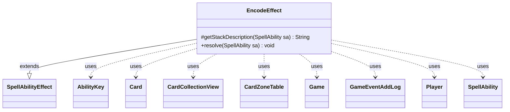

---
aliases:
  - EncodeEffect
tags:
  - java/class
  - module/forge-game
  - pkg/forge/game/ability/effects
fqn: forge.game.ability.effects.EncodeEffect
package: forge.game.ability.effects
module: forge-game
kind: Class
---

# EncodeEffect

**Package:** `forge.game.ability.effects` &nbsp; **Module:** `forge-game` &nbsp; **Kind:** Class



## Relationships
**Extends:**
- [[forge.game.ability.SpellAbilityEffect|SpellAbilityEffect]]
**Uses:**
- [[forge.game.Game|Game]]
- [[forge.game.ability.AbilityKey|AbilityKey]]
- [[forge.game.card.Card|Card]]
- [[forge.game.card.CardCollectionView|CardCollectionView]]
- [[forge.game.card.CardZoneTable|CardZoneTable]]
- [[forge.game.event.GameEventAddLog|GameEventAddLog]]
- [[forge.game.player.Player|Player]]
- [[forge.game.spellability.SpellAbility|SpellAbility]]

## Design Description

EncodeEffect implements Magic's "Cipher" mechanic as a concrete `SpellAbilityEffect`, overriding `getStackDescription` to render the encode prompt and `resolve` to carry out the action. As a leaf effect in the ability-resolution framework, it is invoked when its host spell resolves: it exiles the host card, then asks the activating player (through their `Player` controller) to confirm and to choose one creature they control from the battlefield. The chosen `Card` and the exiled card are then cross-linked via `addEncodedCard`/`setEncodingCard`, establishing the encoded-card relationship that lets the creature later cast the hidden spell.

Notable design intent includes early returns that short-circuit the effect for tokens or when no creatures are available, use of `AbilityKey` move-parameter maps with a `CardZoneTable` to record and fire the exile zone-change triggers uniformly, and `GameEventAddLog` plus `Localizer` to surface the encoding to the game log and player in a localized, event-driven way.

## Source
`forge-game/src/main/java/forge/game/ability/effects/EncodeEffect.java`

```java
package forge.game.ability.effects;

import java.util.Map;

import forge.game.Game;
import forge.game.GameLogEntryType;
import forge.game.event.GameEventAddLog;
import forge.game.ability.AbilityKey;
import forge.game.ability.SpellAbilityEffect;
import forge.game.card.Card;
import forge.game.card.CardCollectionView;
import forge.game.card.CardZoneTable;
import forge.game.player.Player;
import forge.game.spellability.SpellAbility;
import forge.util.Localizer;

public class EncodeEffect extends SpellAbilityEffect {
    @Override
    protected String getStackDescription(SpellAbility sa) {
        if (sa.getHostCard().isToken()) {
            return "";
        }

        final StringBuilder sb = new StringBuilder();

        sb.append(sa.getActivatingPlayer());
        sb.append(" chooses a card to encode with Cipher.");

        return sb.toString();
    }

    @Override
    public void resolve(SpellAbility sa) {
        final Card host = sa.getHostCard();
        final Player activator = sa.getActivatingPlayer();
        final Game game = activator.getGame();

        if (host.isToken()) {
            return;
        }

        CardCollectionView choices = host.getController().getCreaturesInPlay();

        // if no creatures on battlefield, cannot encoded
        if (choices.isEmpty()) {
            return;
        }

        // Handle choice of whether or not to encoded
        if (!activator.getController().confirmAction(sa, null, Localizer.getInstance().getMessage("lblDoYouWantExileCardAndEncodeOntoYouCreature", host.getTranslatedName()), null)) {
            return;
        }

        Map<AbilityKey, Object> moveParams = AbilityKey.newMap();
        CardZoneTable zoneMovements = AbilityKey.addCardZoneTableParams(moveParams, sa);

        Card moved = game.getAction().exile(host, sa, moveParams);

        zoneMovements.triggerChangesZoneAll(game, sa);

        Card choice = activator.getController().chooseSingleEntityForEffect(choices, sa, Localizer.getInstance().getMessage("lblChooseACreatureYouControlToEncode") + " ", false, null);

        if (choice == null) {
            return;
        }

        StringBuilder codeLog = new StringBuilder();
        codeLog.append("Encoding ").append(host).append(" to ").append(choice);
        game.fireEvent(new GameEventAddLog(GameLogEntryType.STACK_RESOLVE, codeLog.toString()));

        // store hostcard in encoded array
        choice.addEncodedCard(moved);
        moved.setEncodingCard(choice);
    }

}
```

## Python
`forge/game/ability/effects/EncodeEffect.py`

```python
from forge.game.Game import Game
from forge.game.GameLogEntryType import GameLogEntryType
from forge.game.event.GameEventAddLog import GameEventAddLog
from forge.game.ability.AbilityKey import AbilityKey
from forge.game.ability.SpellAbilityEffect import SpellAbilityEffect
from forge.game.card.Card import Card
from forge.game.card.CardCollectionView import CardCollectionView
from forge.game.card.CardZoneTable import CardZoneTable
from forge.game.player.Player import Player
from forge.game.spellability.SpellAbility import SpellAbility
from forge.util.Localizer import Localizer


class EncodeEffect(SpellAbilityEffect):
    def getStackDescription(self, sa: SpellAbility) -> str:
        if sa.getHostCard().isToken():
            return ""

        sb = []

        sb.append(str(sa.getActivatingPlayer()))
        sb.append(" chooses a card to encode with Cipher.")

        return "".join(sb)

    def resolve(self, sa: SpellAbility) -> None:
        host = sa.getHostCard()
        activator = sa.getActivatingPlayer()
        game = activator.getGame()

        if host.isToken():
            return

        choices = host.getController().getCreaturesInPlay()

        # if no creatures on battlefield, cannot encoded
        if choices.isEmpty():
            return

        # Handle choice of whether or not to encoded
        if not activator.getController().confirmAction(sa, None, Localizer.getInstance().getMessage("lblDoYouWantExileCardAndEncodeOntoYouCreature", host.getTranslatedName()), None):
            return

        moveParams = AbilityKey.newMap()
        zoneMovements = AbilityKey.addCardZoneTableParams(moveParams, sa)

        moved = game.getAction().exile(host, sa, moveParams)

        zoneMovements.triggerChangesZoneAll(game, sa)

        choice = activator.getController().chooseSingleEntityForEffect(choices, sa, Localizer.getInstance().getMessage("lblChooseACreatureYouControlToEncode") + " ", False, None)

        if choice is None:
            return

        codeLog = []
        codeLog.append("Encoding ")
        codeLog.append(str(host))
        codeLog.append(" to ")
        codeLog.append(str(choice))
        game.fireEvent(GameEventAddLog(GameLogEntryType.STACK_RESOLVE, "".join(codeLog)))

        # store hostcard in encoded array
        choice.addEncodedCard(moved)
        moved.setEncodingCard(choice)
```
