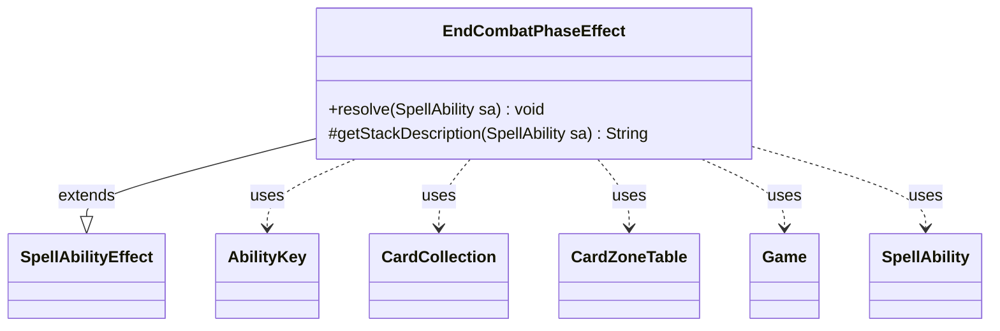

---
aliases:
  - EndCombatPhaseEffect
tags:
  - java/class
  - module/forge-game
  - pkg/forge/game/ability/effects
fqn: forge.game.ability.effects.EndCombatPhaseEffect
package: forge.game.ability.effects
module: forge-game
kind: Class
---

# EndCombatPhaseEffect

**Package:** `forge.game.ability.effects`   **Module:** `forge-game`   **Kind:** Class



## Relationships
**Extends:**
- [[forge.game.ability.SpellAbilityEffect|SpellAbilityEffect]]
**Uses:**
- [[forge.game.Game|Game]]
- [[forge.game.ability.AbilityKey|AbilityKey]]
- [[forge.game.card.CardCollection|CardCollection]]
- [[forge.game.card.CardZoneTable|CardZoneTable]]
- [[forge.game.spellability.SpellAbility|SpellAbility]]


## Design Description

EndCombatPhaseEffect is a concrete SpellAbilityEffect that implements Magic's "end the combat phase" action (CR 723.2g, 721.2a). It overrides `resolve` to perform the work and `getStackDescription` to return the player-facing text "End the combat phase," conforming to the engine's data-driven ability framework in which each effect type is a distinct handler invoked at resolution.

The class is a stateless orchestrator. It obtains the active Game from the resolving SpellAbility, returns harmlessly if no combat is in progress, then clears waiting triggers, exiles everything on the stack, clears the stack, checks state-based actions without granting priority, and finally calls the phase handler to jump to the postcombat main phase. It collaborates with AbilityKey and CardZoneTable to build zone-change parameters and fire batched zone-change triggers, and with CardCollection to bundle the stack's cards for exile—routing all mutation through central Game subsystems rather than handling it locally.

## Source
`forge-game/src/main/java/forge/game/ability/effects/EndCombatPhaseEffect.java`

```java
package forge.game.ability.effects;

import java.util.Map;

import forge.game.Game;
import forge.game.ability.AbilityKey;
import forge.game.ability.SpellAbilityEffect;
import forge.game.card.CardCollection;
import forge.game.card.CardZoneTable;
import forge.game.spellability.SpellAbility;

public class EndCombatPhaseEffect extends SpellAbilityEffect {

    /*
     * (non-Javadoc)
     * @see forge.game.ability.SpellAbilityEffect#resolve(forge.game.spellability.SpellAbility)
     */
    @Override
    public void resolve(SpellAbility sa) {
        final Game game = sa.getActivatingPlayer().getGame();

        // CR 723.2g If an effect attempts to end the combat phase at any time that’s not a combat phase, nothing happens
        if (game.getCombat() == null) {
            return;
        }

        // CR 721.2a
        game.getTriggerHandler().clearWaitingTriggers(); 

        // 1) All spells and abilities on the stack are exiled.
        Map<AbilityKey, Object> moveParams = AbilityKey.newMap();
        CardZoneTable zoneMovements = AbilityKey.addCardZoneTableParams(moveParams, sa);

        game.getAction().exile(new CardCollection(game.getStackZone().getCards()), sa, moveParams);

        zoneMovements.triggerChangesZoneAll(game, sa);

        game.getStack().clear();
        game.getStack().clearSimultaneousStack();

        // 2) State-based actions are checked. No player gets priority, and no
        // triggered abilities are put onto the stack.
        game.getAction().checkStateEffects(true);

        // 3) The current phase and step ends. The game skips straight to the postcombat main phase. As this happens,
        // all attacking and blocking creatures are removed from combat and effects that last “until end of combat” expire.
        game.getPhaseHandler().endCombatPhaseByEffect();
    }

    /*
     * (non-Javadoc)
     * @see forge.game.ability.SpellAbilityEffect#getStackDescription(forge.game.spellability.SpellAbility)
     */
    @Override
    protected String getStackDescription(SpellAbility sa) {
        return "End the combat phase.";
    }

}
```
