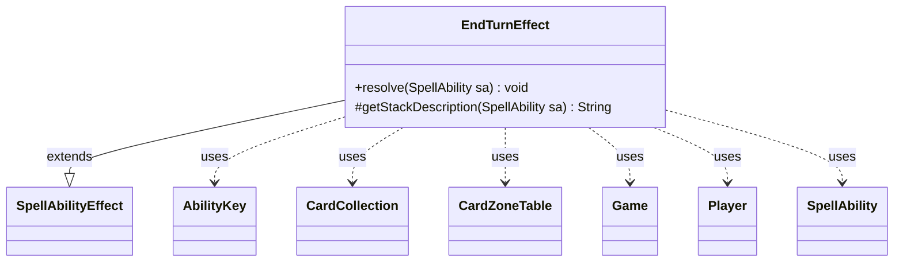

---
aliases:
  - EndTurnEffect
tags:
  - java/class
  - module/forge-game
  - pkg/forge/game/ability/effects
fqn: forge.game.ability.effects.EndTurnEffect
package: forge.game.ability.effects
module: forge-game
kind: Class
---

# EndTurnEffect

**Package:** `forge.game.ability.effects` &nbsp; **Module:** `forge-game` &nbsp; **Kind:** Class



## Relationships
**Extends:**
- [[forge.game.ability.SpellAbilityEffect|SpellAbilityEffect]]
**Uses:**
- [[forge.game.Game|Game]]
- [[forge.game.ability.AbilityKey|AbilityKey]]
- [[forge.game.card.CardCollection|CardCollection]]
- [[forge.game.card.CardZoneTable|CardZoneTable]]
- [[forge.game.player.Player|Player]]
- [[forge.game.spellability.SpellAbility|SpellAbility]]

## Design Description

EndTurnEffect is a concrete effect handler implementing the "end the turn" game action (e.g., Time Stop). It is one of many leaf classes extending `SpellAbilityEffect` in the ability-effects framework, fulfilling that contract by overriding `resolve` to carry out the action and `getStackDescription` to supply the brief UI string "End the turn." Its `resolve` method selects the affected player from the ability's defined/targeted players (falling back to the activating player, with a re-chooser if that player has left the game) and honors an optional confirmation prompt before proceeding.

The class delegates the actual rules sequence to the `Game` aggregate's handlers: it clears waiting triggers, exiles everything in the stack zone via a `CardCollection`, ends combat, checks state-based actions, and skips to the cleanup step. Notable design intent is its careful fidelity to the comprehensive rules—inline comments cite CR 721.1a and Gatherer's Time Stop rulings to justify each ordered step—and its use of `AbilityKey`/`CardZoneTable` move parameters so the exile correctly fires zone-change triggers.

## Source
`forge-game/src/main/java/forge/game/ability/effects/EndTurnEffect.java`

```java
package forge.game.ability.effects;

import java.util.List;
import java.util.Map;

import forge.game.Game;
import forge.game.ability.AbilityKey;
import forge.game.ability.SpellAbilityEffect;
import forge.game.card.CardCollection;
import forge.game.card.CardZoneTable;
import forge.game.player.Player;
import forge.game.spellability.SpellAbility;
import forge.util.Localizer;

public class EndTurnEffect extends SpellAbilityEffect {

    /* (non-Javadoc)
     * @see forge.card.abilityfactory.SpellEffect#resolve(java.util.Map, forge.card.spellability.SpellAbility)
     */
    @Override
    public void resolve(SpellAbility sa) {
        final List<Player> enders = getDefinedPlayersOrTargeted(sa, "Defined");
        Player ender = enders.isEmpty() ? sa.getActivatingPlayer() : enders.get(0);
        if (!ender.isInGame()) {
            ender = getNewChooser(sa, ender);
        }

        if (sa.hasParam("Optional") && !ender.getController().confirmAction(sa, null, Localizer.getInstance().getMessage("lblDoYouWantEndTurn"), null)) {
            return;
        }

        Game game = ender.getGame();
        // CR 721.1a
        game.getTriggerHandler().clearWaitingTriggers();

        // Steps taken from gatherer's rulings on Time Stop.
        // 1) All spells and abilities on the stack are exiled. This includes
        // Time Stop, though it will continue to resolve. It also includes
        // spells and abilities that can't be countered.
        Map<AbilityKey, Object> moveParams = AbilityKey.newMap();
        CardZoneTable zoneMovements = AbilityKey.addCardZoneTableParams(moveParams, sa);

        game.getAction().exile(new CardCollection(game.getStackZone().getCards()), sa, moveParams);
        zoneMovements.triggerChangesZoneAll(game, sa);

        game.getStack().clear();
        game.getStack().clearSimultaneousStack();

        // 2) All attacking and blocking creatures are removed from combat.
        game.getPhaseHandler().endCombat();

        // 3) State-based actions are checked. No player gets priority, and no
        // triggered abilities are put onto the stack.
        game.getAction().checkStateEffects(true);

        // 4) The current phase and/or step ends. The game skips straight to the
        // cleanup step. The cleanup step happens in its entirety.
        game.getPhaseHandler().endTurnByEffect();
    }

    /* (non-Javadoc)
     * @see forge.card.abilityfactory.SpellEffect#getStackDescription(java.util.Map, forge.card.spellability.SpellAbility)
     */
    @Override
    protected String getStackDescription(SpellAbility sa) {
        return "End the turn.";
    }

}
```
