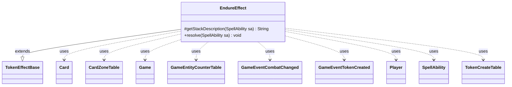

---
aliases:
  - EndureEffect
tags:
  - java/class
  - module/forge-game
  - pkg/forge/game/ability/effects
fqn: forge.game.ability.effects.EndureEffect
package: forge.game.ability.effects
module: forge-game
kind: Class
---

# EndureEffect

**Package:** `forge.game.ability.effects` &nbsp; **Module:** `forge-game` &nbsp; **Kind:** Class



## Relationships
**Extends:**
- [[forge.game.ability.effects.TokenEffectBase|TokenEffectBase]]
**Uses:**
- [[forge.game.Game|Game]]
- [[forge.game.GameEntityCounterTable|GameEntityCounterTable]]
- [[forge.game.card.Card|Card]]
- [[forge.game.card.CardZoneTable|CardZoneTable]]
- [[forge.game.card.TokenCreateTable|TokenCreateTable]]
- [[forge.game.event.GameEventCombatChanged|GameEventCombatChanged]]
- [[forge.game.event.GameEventTokenCreated|GameEventTokenCreated]]
- [[forge.game.player.Player|Player]]
- [[forge.game.spellability.SpellAbility|SpellAbility]]

## Design Description

EndureEffect realizes Magic's "endure" keyword as a resolvable ability effect. Extending TokenEffectBase, it overrides `getStackDescription` to build the human-readable stack text and `resolve` to execute the mechanic. For each targeted creature it lets the controller choose (per CR 701.63b) between placing a computed number of +1/+1 counters on the creature or, when the creature has left play or counters are declined, creating one white Spirit token whose power and toughness equal that amount.

The class coordinates several collaborators to keep effects atomic and consistent. It accumulates counter additions in a GameEntityCounterTable and queued tokens in a TokenCreateTable, verifies the creature's continued presence through the Game's current card state and game-timestamp match, then commits counters via `replaceCounterEffect`. Token creation delegates to the inherited `makeTokenTable`, after which it flushes a CardZoneTable's zone changes and fires GameEventTokenCreated and GameEventCombatChanged so the view and combat state remain synchronized.

## Source
`forge-game/src/main/java/forge/game/ability/effects/EndureEffect.java`

```java
package forge.game.ability.effects;

import java.util.List;
import java.util.Map;

import org.apache.commons.lang3.mutable.MutableBoolean;

import com.google.common.collect.Maps;

import forge.game.Game;
import forge.game.GameActionUtil;
import forge.game.GameEntityCounterTable;
import forge.game.ability.AbilityUtils;
import forge.game.card.Card;
import forge.game.card.CardZoneTable;
import forge.game.card.CounterEnumType;
import forge.game.card.TokenCreateTable;
import forge.game.card.token.TokenInfo;
import forge.game.event.GameEventCombatChanged;
import forge.game.event.GameEventTokenCreated;
import forge.game.player.Player;
import forge.game.spellability.SpellAbility;
import forge.game.zone.ZoneType;
import forge.util.Lang;
import forge.util.Localizer;

public class EndureEffect extends TokenEffectBase {

    @Override
    protected String getStackDescription(SpellAbility sa) {
        final Card host = sa.getHostCard();
        final StringBuilder sb = new StringBuilder();

        List<Card> tgt = getTargetCards(sa);

        sb.append(Lang.joinHomogenous(tgt));
        sb.append(" ");
        sb.append(tgt.size() > 1 ? "endure" : "endures");

        int amount = AbilityUtils.calculateAmount(host, sa.getParamOrDefault("Num", "1"), sa);

        sb.append(" ").append(amount);
        sb.append(". ");

        return sb.toString();
    }

    @Override
    public void resolve(SpellAbility sa) {
        final Card host = sa.getHostCard();
        final Game game = host.getGame();
        String num = sa.getParamOrDefault("Num", "1");
        int amount = AbilityUtils.calculateAmount(host, num, sa);

        if (amount < 1) {
            // CR 701.63b
            return;
        }

        GameEntityCounterTable table = new GameEntityCounterTable();
        TokenCreateTable tokenTable = new TokenCreateTable();
        for (final Card c : GameActionUtil.orderCardsByTheirOwners(game, getTargetCards(sa), ZoneType.Battlefield, sa)) {
            final Player pl = c.getController();

            Card gamec = game.getCardState(c, null);

            Map<String, Object> params = Maps.newHashMap();
            params.put("RevealedCard", c);
            params.put("Amount", amount);
            if (gamec != null && gamec.isInPlay() && gamec.equalsWithGameTimestamp(c) && gamec.canReceiveCounters(CounterEnumType.P1P1)
                    && pl.getController().confirmAction(sa, null,
                            Localizer.getInstance().getMessage("lblEndureAction", c.getTranslatedName(), amount),
                            gamec, params)) {
                gamec.addCounter(CounterEnumType.P1P1, amount, pl, table);
            } else {
                final Card result = TokenInfo.getProtoType("w_x_x_spirit", sa, pl, false);

                // set PT
                result.setBasePowerString(num);
                result.setBasePower(amount);
                result.setBaseToughnessString(num);
                result.setBaseToughness(amount);

                tokenTable.put(pl, result, 1);
            }
        }
        table.replaceCounterEffect(game, sa);

        if (!tokenTable.isEmpty()) {
            CardZoneTable triggerList = new CardZoneTable();
            MutableBoolean combatChanged = new MutableBoolean(false);
            makeTokenTable(tokenTable, false, triggerList, combatChanged, sa);

            triggerList.triggerChangesZoneAll(game, sa);

            game.fireEvent(new GameEventTokenCreated());

            if (combatChanged.isTrue()) {
                game.updateCombatForView();
                game.fireEvent(new GameEventCombatChanged());
            }
        }
    }

}
```
