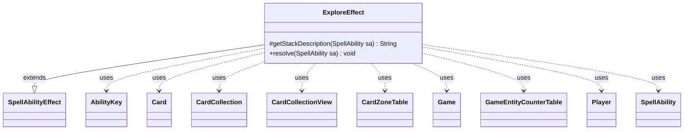

---
aliases:
  - ExploreEffect
tags:
  - java/class
  - module/forge-game
  - pkg/forge/game/ability/effects
fqn: forge.game.ability.effects.ExploreEffect
package: forge.game.ability.effects
module: forge-game
kind: Class
---

# ExploreEffect

**Package:** `forge.game.ability.effects` &nbsp; **Module:** `forge-game` &nbsp; **Kind:** Class



## Relationships
**Extends:**
- [[forge.game.ability.SpellAbilityEffect|SpellAbilityEffect]]
**Uses:**
- [[forge.game.Game|Game]]
- [[forge.game.GameEntityCounterTable|GameEntityCounterTable]]
- [[forge.game.ability.AbilityKey|AbilityKey]]
- [[forge.game.card.Card|Card]]
- [[forge.game.card.CardCollection|CardCollection]]
- [[forge.game.card.CardCollectionView|CardCollectionView]]
- [[forge.game.card.CardZoneTable|CardZoneTable]]
- [[forge.game.player.Player|Player]]
- [[forge.game.spellability.SpellAbility|SpellAbility]]

## Design Description

ExploreEffect implements the resolution logic for the Magic "explore" keyword action as a concrete `SpellAbilityEffect`. As a leaf in the effect hierarchy, it overrides `getStackDescription` to phrase the action for the game log and `resolve` to carry out the mechanic: for each targeted creature (ordered by owner) it reveals the top library card, moving lands to hand or optionally to the graveyard, and otherwise places a +1/+1 counter on the still-present creature.

The class is purely behavioral, holding no state and collaborating with the live `Game` through its action, replacement, and trigger handlers. It honors the `Explore` replacement effect, fires `Explores` triggers via `AbilityKey` parameter maps, and batches counter and zone-change side effects through `GameEntityCounterTable` and `CardZoneTable` so they apply atomically. Notably, it re-fetches current card state and compares game timestamps to ensure the counter only lands on a creature that is still the same object on the battlefield.

## Source
`forge-game/src/main/java/forge/game/ability/effects/ExploreEffect.java`

```java
package forge.game.ability.effects;

import com.google.common.collect.Maps;
import forge.game.Game;
import forge.game.GameActionUtil;
import forge.game.GameEntityCounterTable;
import forge.game.ability.AbilityKey;
import forge.game.ability.AbilityUtils;
import forge.game.ability.SpellAbilityEffect;
import forge.game.card.Card;
import forge.game.card.CardCollection;
import forge.game.card.CardCollectionView;
import forge.game.card.CardZoneTable;
import forge.game.card.CounterEnumType;
import forge.game.player.Player;
import forge.game.replacement.ReplacementResult;
import forge.game.replacement.ReplacementType;
import forge.game.spellability.SpellAbility;
import forge.game.trigger.TriggerType;
import forge.game.zone.ZoneType;
import forge.util.Lang;
import forge.util.Localizer;

import java.util.List;
import java.util.Map;

public class ExploreEffect extends SpellAbilityEffect {

    /* (non-Javadoc)
     * @see forge.game.ability.SpellAbilityEffect#getStackDescription(forge.game.spellability.SpellAbility)
     */
    @Override
    protected String getStackDescription(SpellAbility sa) {
        final StringBuilder sb = new StringBuilder();

        List<Card> tgt = getTargetCards(sa);

        sb.append(Lang.joinHomogenous(tgt));
        sb.append(" ");
        sb.append(tgt.size() > 1 ? "explore" : "explores");
        sb.append(". ");

        return sb.toString();
    }

    /* (non-Javadoc)
     * @see forge.game.ability.SpellAbilityEffect#resolve(forge.game.spellability.SpellAbility)
     */
    @Override
    public void resolve(SpellAbility sa) {
        final Card host = sa.getHostCard();
        final Game game = host.getGame();
        int amount = AbilityUtils.calculateAmount(host, sa.getParamOrDefault("Num", "1"), sa);

        CardCollectionView tgts = GameActionUtil.orderCardsByTheirOwners(game, getTargetCards(sa), ZoneType.Battlefield, sa);

        for (final Card c : tgts) {
            final Player pl = c.getController();
            for (int i = 0; i < amount; i++) {
                if (game.getReplacementHandler().run(ReplacementType.Explore, AbilityKey.mapFromAffected(c))
                        != ReplacementResult.NotReplaced) {
                    continue;
                }

                GameEntityCounterTable table = new GameEntityCounterTable();
                Map<AbilityKey, Object> moveParams = AbilityKey.newMap();
                final CardZoneTable triggerList = AbilityKey.addCardZoneTableParams(moveParams, sa);

                // revealed land card
                boolean revealedLand = false;
                CardCollection top = pl.getTopXCardsFromLibrary(1);
                if (!top.isEmpty()) {
                    game.getAction().reveal(top, pl, false,
                            Localizer.getInstance().getMessage("lblRevealedForExplore") + " - ");
                    final Card r = top.getFirst();
                    if (r.isLand()) {
                        game.getAction().moveTo(ZoneType.Hand, r, sa, moveParams);
                        revealedLand = true;
                    } else {
                        Map<String, Object> params = Maps.newHashMap();
                        params.put("RevealedCard", r);
                        if (pl.getController().confirmAction(sa, null,
                                Localizer.getInstance().getMessage("lblPutThisCardToYourGraveyard",
                                        r.getTranslatedName()), r, params))
                            game.getAction().moveTo(ZoneType.Graveyard, r, sa, moveParams);
                    }
                }
                if (!revealedLand) {
                    // need to get newest game state to check if it is still on the battlefield
                    // and the timestamp didn't change
                    Card gamec = game.getCardState(c);
                    if (gamec.isInPlay() && gamec.equalsWithGameTimestamp(c)) {
                        c.addCounter(CounterEnumType.P1P1, 1, pl, table);
                    }
                }

                // a creature does explore even if it isn't on the battlefield anymore
                pl.addExploredThisTurn();
                final Map<AbilityKey, Object> runParams = AbilityKey.mapFromCard(c);
                if (!top.isEmpty()) runParams.put(AbilityKey.Explored, top.getFirst());
                game.getTriggerHandler().runTrigger(TriggerType.Explores, runParams, false);
                table.replaceCounterEffect(game, sa);
                triggerList.triggerChangesZoneAll(game, sa);
            }
        }
    }

}
```
