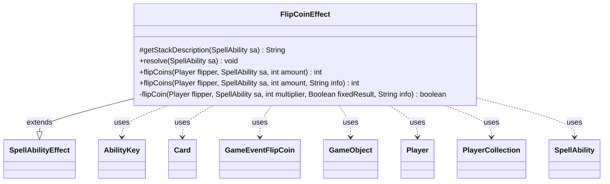

---
aliases:
  - FlipCoinEffect
tags:
  - java/class
  - module/forge-game
  - pkg/forge/game/ability/effects
fqn: forge.game.ability.effects.FlipCoinEffect
package: forge.game.ability.effects
module: forge-game
kind: Class
---

# FlipCoinEffect

**Package:** `forge.game.ability.effects`   **Module:** `forge-game`   **Kind:** Class



## Relationships
**Extends:**
- [[forge.game.ability.SpellAbilityEffect|SpellAbilityEffect]]
**Uses:**
- [[forge.game.GameObject|GameObject]]
- [[forge.game.ability.AbilityKey|AbilityKey]]
- [[forge.game.card.Card|Card]]
- [[forge.game.event.GameEventFlipCoin|GameEventFlipCoin]]
- [[forge.game.player.Player|Player]]
- [[forge.game.player.PlayerCollection|PlayerCollection]]
- [[forge.game.spellability.SpellAbility|SpellAbility]]

## Design Description

FlipCoinEffect implements the resolution logic for any card ability that involves flipping coins, extending the abstract `SpellAbilityEffect` base class by overriding `getStackDescription` and `resolve`. It interprets a `SpellAbility`'s parameters to drive several distinct flip modes—plain win/lose flips, heads-or-tails flips with no call (`NoCall`), and per-player flips (`ForEachPlayer`)—dispatching to remembered results or named sub-abilities (`WinSubAbility`, `LoseSubAbility`, `HeadsSubAbility`, `TailsSubAbility`) based on outcomes, and optionally repeating until a loss.

The actual flipping is delegated to static helpers (`flipCoins`/`flipCoin`) so other effects can reuse coin mechanics directly. These honor `StaticAbilityFlipCoinMod` for replacement multipliers and fixed results, prompt the controlling `Player` to call the flip, use `MyRandom` for randomness, fire a `GameEventFlipCoin`, and run `FlippedCoin` triggers via `AbilityKey` parameters—cleanly separating game-rule mechanics, UI notification, and the event/trigger system.

## Source
`forge-game/src/main/java/forge/game/ability/effects/FlipCoinEffect.java`

```java
package forge.game.ability.effects;

import java.util.HashSet;
import java.util.List;
import java.util.Map;
import java.util.Set;

import com.google.common.collect.Lists;
import forge.game.GameObject;
import forge.game.ability.AbilityKey;
import forge.game.ability.AbilityUtils;
import forge.game.ability.SpellAbilityEffect;
import forge.game.card.Card;
import forge.game.event.GameEventFlipCoin;
import forge.game.player.Player;
import forge.game.player.PlayerCollection;
import forge.game.player.PlayerController;
import forge.game.spellability.SpellAbility;
import forge.game.staticability.StaticAbilityFlipCoinMod;
import forge.game.trigger.TriggerType;
import forge.util.Localizer;
import forge.util.MyRandom;

public class FlipCoinEffect extends SpellAbilityEffect {
    /* (non-Javadoc)
     * @see forge.card.abilityfactory.SpellEffect#getStackDescription(java.util.Map, forge.card.spellability.SpellAbility)
     */
    @Override
    protected String getStackDescription(SpellAbility sa) {
        final Card host = sa.getHostCard();
        final Player player = host.getController();
        final List<GameObject> tgts = getTargets(sa);

        final StringBuilder sb = new StringBuilder();

        sb.append(player).append(" flips a coin.");
        if (tgts != null && !tgts.isEmpty()) {
        	sb.append(" Targeting: ").append(tgts).append(".");
        }
        return sb.toString();
    }

    /* (non-Javadoc)
     * @see forge.card.ability.SpellAbilityEffect#resolve(forge.card.spellability.SpellAbility)
     */
    @Override
    public void resolve(SpellAbility sa) {
        final Card host = sa.getHostCard();

        final List<Player> playersToFlip = AbilityUtils.getDefinedPlayers(host, sa.getParam("Flipper"), sa);
        //final List<Player> caller = AbilityUtils.getDefinedPlayers(host, sa.getParam("Caller"), sa);

        final boolean noCall = sa.hasParam("NoCall");
        final boolean forEachPlayer = sa.hasParam("ForEachPlayer");
        String varName = sa.getParamOrDefault("SaveNumFlipsToSVar", "X");
        int amount = 1;
        if (sa.hasParam("Amount")) {
            amount = AbilityUtils.calculateAmount(host, sa.getParam("Amount"), sa);
        }

        for (final Player flipper : playersToFlip) {
            if (noCall) {
                int countHeads = flipCoins(flipper, sa, amount);
                int countTails = Math.abs(countHeads - amount);
                if (countHeads > 0) {
                    if (sa.hasParam("RememberResult")) {
                        host.addFlipResult(flipper, "Heads");
                    }
                    SpellAbility sub = sa.getAdditionalAbility("HeadsSubAbility");
                    if (sub != null) {
                        if (sa.hasParam("Amount")) {
                            sub.setSVar(varName, "Number$" + countHeads);
                        }
                        AbilityUtils.resolve(sub);
                    }
                }
                if (countTails > 0) {
                    if (sa.hasParam("RememberResult")) {
                        host.addFlipResult(flipper, "Tails");
                    }
                    SpellAbility sub = sa.getAdditionalAbility("TailsSubAbility");
                    if (sub != null) {
                        if (sa.hasParam("Amount")) {
                            sub.setSVar(varName, "Number$" + countTails);
                        }
                        AbilityUtils.resolve(sub);
                    }
                }
            } else if (forEachPlayer) {
                int countWins = 0;
                int countLosses = 0;
                PlayerCollection wonFor = new PlayerCollection();
                PlayerCollection lostFor = new PlayerCollection();

                for (final Player p : AbilityUtils.getDefinedPlayers(host, sa.getParam("ForEachPlayer"), sa)) {
                    final String info = " (" + p.getName() +")";
                    final int win = flipCoins(flipper, sa, 1, info);

                    if (win > 0) {
                        countWins++;
                        wonFor.add(p);
                    } else {
                        countLosses++;
                        lostFor.add(p);
                    }
                }
                if (countWins > 0) {
                    SpellAbility sub = sa.getAdditionalAbility("WinSubAbility");
                    if (sub != null) {
                        List<Object> tempRemembered = Lists.newArrayList(host.getRemembered());
                        host.removeRemembered(tempRemembered);
                        host.addRemembered(wonFor);
                        sub.setSVar("Wins", "Number$" + countWins);
                        AbilityUtils.resolve(sub);
                        host.removeRemembered(wonFor);
                        host.addRemembered(tempRemembered);
                    }
                }
                if (countLosses > 0) {
                    SpellAbility sub = sa.getAdditionalAbility("LoseSubAbility");
                    if (sub != null) {
                        List<Object> tempRemembered = Lists.newArrayList(host.getRemembered());
                        host.removeRemembered(tempRemembered);
                        host.addRemembered(lostFor);
                        sub.setSVar("Losses", "Number$" + countLosses);
                        AbilityUtils.resolve(sub);
                        host.removeRemembered(lostFor);
                        host.addRemembered(tempRemembered);
                    }
                }
            } else {
                int countWins = flipCoins(flipper, sa, amount);
                int countLosses = Math.abs(countWins - amount);
                if (countWins > 0) {
                    if (sa.hasParam("RememberWinner")) {
                        host.addRemembered(flipper);
                    }
                    SpellAbility sub = sa.getAdditionalAbility("WinSubAbility");
                    if (sub != null) {
                        sub.setSVar("Wins", "Number$" + countWins);
                        AbilityUtils.resolve(sub);
                    }
                }
                if (countLosses > 0) {
                    if (sa.hasParam("RememberLoser")) {
                        host.addRemembered(flipper);
                    }
                    SpellAbility sub = sa.getAdditionalAbility("LoseSubAbility");
                    if (sub != null) {
                        sub.setSVar("Losses", "Number$" + countLosses);
                        AbilityUtils.resolve(sub);
                    }
                }
                if (sa.hasParam("RememberNumber")) {
                    String toRemember = sa.getParam("RememberNumber");
                    if (toRemember.startsWith("Win")) {
                        host.addRemembered(countWins);
                    } else if (toRemember.startsWith("Loss")) {
                        host.addRemembered(countLosses);
                    }
                }
            }
        }
    }

    public static int flipCoins(final Player flipper, final SpellAbility sa, final int amount) {
        return flipCoins(flipper, sa, amount, "");
    }
    public static int flipCoins(final Player flipper, final SpellAbility sa, final int amount, final String info) {
        int multiplier = StaticAbilityFlipCoinMod.getFlipMultiplier(flipper);
        int result = 0;
        boolean won = false;
        do {
            Boolean fixedResult = StaticAbilityFlipCoinMod.fixedResult(flipper);
            for (int i = 0; i < amount; i++) {
                String iterationInfo = amount > 1 ? " " + (i+1) + "/"  + amount : "";
                won = flipCoin(flipper, sa, multiplier, fixedResult, info + iterationInfo);
                if (won) {
                    result++;
                }
            }
            // CR 705.3 relevant: until is sequential
        }
        while (sa.hasParam("FlipUntilYouLose") && won);
        return result;
    }

    /**
     * <p>
     * flipCoinCall.
     * </p>
     *
     * @param flipper
     * @param sa
     * @param multiplier
     * @return a boolean.
     */
    private static boolean flipCoin(final Player flipper, final SpellAbility sa, int multiplier, final Boolean fixedResult, final String info) {
        Set<Boolean> flipResults = new HashSet<>();
        boolean noCall = sa.hasParam("NoCall");
        boolean choice = true;
        if (fixedResult != null) {
            flipResults.add(fixedResult);
        } else {
            // no reason to ask if result is fixed anyway
            if (!noCall) {
                choice = flipper.getController().chooseBinary(sa, sa.getHostCard().getDisplayName() + " - " + Localizer.getInstance().getMessage("lblCallCoinFlip") + info, PlayerController.BinaryChoiceType.HeadsOrTails);
            }

            for (int i = 0; i < multiplier; i++) {
                flipResults.add(MyRandom.getRandom().nextBoolean());
            }
        }

        boolean result = flipResults.size() == 1 ? flipResults.iterator().next() : flipper.getController().chooseFlipResult(sa, flipper, !noCall);
        boolean wonOrHeads = result == choice;

        String outcome;
        if (noCall) {
            outcome = wonOrHeads ? Localizer.getInstance().getMessage("lblHeads") : Localizer.getInstance().getMessage("lblTails");
        } else {
            outcome = wonOrHeads ? Localizer.getInstance().getMessage("lblWin") : Localizer.getInstance().getMessage("lblLose");
        }

        flipper.getGame().fireEvent(new GameEventFlipCoin());
        flipper.getGame().getAction().notifyOfValue(sa, flipper, outcome, null);

        flipper.flip();

        if (!noCall || fixedResult != null) {
            final Map<AbilityKey, Object> runParams = AbilityKey.mapFromPlayer(flipper);
            runParams.put(AbilityKey.Result, wonOrHeads);
            flipper.getGame().getTriggerHandler().runTrigger(TriggerType.FlippedCoin, runParams, false);
        }

        return wonOrHeads;
    }

}
```

## Python
`forge/game/ability/effects/FlipCoinEffect.py`

```python
package = "forge.game.ability.effects"

from java.util import HashSet, List, Map, Set

from typing import List as _List

from forge.game.GameObject import GameObject
from forge.game.ability.AbilityKey import AbilityKey
from forge.game.ability.AbilityUtils import AbilityUtils
from forge.game.ability.SpellAbilityEffect import SpellAbilityEffect
from forge.game.card.Card import Card
from forge.game.event.GameEventFlipCoin import GameEventFlipCoin
from forge.game.player.Player import Player
from forge.game.player.PlayerCollection import PlayerCollection
from forge.game.player.PlayerController import PlayerController
from forge.game.spellability.SpellAbility import SpellAbility
from forge.game.staticability.StaticAbilityFlipCoinMod import StaticAbilityFlipCoinMod
from forge.game.trigger.TriggerType import TriggerType
from forge.util.Localizer import Localizer
from forge.util.MyRandom import MyRandom


class FlipCoinEffect(SpellAbilityEffect):
    # (non-Javadoc)
    # @see forge.card.abilityfactory.SpellEffect#getStackDescription(java.util.Map, forge.card.spellability.SpellAbility)
    def getStackDescription(self, sa: SpellAbility) -> str:
        host = sa.getHostCard()
        player = host.getController()
        tgts = self.getTargets(sa)

        sb = []

        sb.append(str(player))
        sb.append(" flips a coin.")
        if tgts is not None and len(tgts) != 0:
            sb.append(" Targeting: ")
            sb.append(str(tgts))
            sb.append(".")
        return "".join(sb)

    # (non-Javadoc)
    # @see forge.card.ability.SpellAbilityEffect#resolve(forge.card.spellability.SpellAbility)
    def resolve(self, sa: SpellAbility) -> None:
        host = sa.getHostCard()

        playersToFlip = AbilityUtils.getDefinedPlayers(host, sa.getParam("Flipper"), sa)
        # caller = AbilityUtils.getDefinedPlayers(host, sa.getParam("Caller"), sa)

        noCall = sa.hasParam("NoCall")
        forEachPlayer = sa.hasParam("ForEachPlayer")
        varName = sa.getParamOrDefault("SaveNumFlipsToSVar", "X")
        amount = 1
        if sa.hasParam("Amount"):
            amount = AbilityUtils.calculateAmount(host, sa.getParam("Amount"), sa)

        for flipper in playersToFlip:
            if noCall:
                countHeads = FlipCoinEffect.flipCoins(flipper, sa, amount)
                countTails = abs(countHeads - amount)
                if countHeads > 0:
                    if sa.hasParam("RememberResult"):
                        host.addFlipResult(flipper, "Heads")
                    sub = sa.getAdditionalAbility("HeadsSubAbility")
                    if sub is not None:
                        if sa.hasParam("Amount"):
                            sub.setSVar(varName, "Number$" + str(countHeads))
                        AbilityUtils.resolve(sub)
                if countTails > 0:
                    if sa.hasParam("RememberResult"):
                        host.addFlipResult(flipper, "Tails")
                    sub = sa.getAdditionalAbility("TailsSubAbility")
                    if sub is not None:
                        if sa.hasParam("Amount"):
                            sub.setSVar(varName, "Number$" + str(countTails))
                        AbilityUtils.resolve(sub)
            elif forEachPlayer:
                countWins = 0
                countLosses = 0
                wonFor = PlayerCollection()
                lostFor = PlayerCollection()

                for p in AbilityUtils.getDefinedPlayers(host, sa.getParam("ForEachPlayer"), sa):
                    info = " (" + p.getName() + ")"
                    win = FlipCoinEffect.flipCoins(flipper, sa, 1, info)

                    if win > 0:
                        countWins += 1
                        wonFor.add(p)
                    else:
                        countLosses += 1
                        lostFor.add(p)
                if countWins > 0:
                    sub = sa.getAdditionalAbility("WinSubAbility")
                    if sub is not None:
                        tempRemembered = list(host.getRemembered())
                        host.removeRemembered(tempRemembered)
                        host.addRemembered(wonFor)
                        sub.setSVar("Wins", "Number$" + str(countWins))
                        AbilityUtils.resolve(sub)
                        host.removeRemembered(wonFor)
                        host.addRemembered(tempRemembered)
                if countLosses > 0:
                    sub = sa.getAdditionalAbility("LoseSubAbility")
                    if sub is not None:
                        tempRemembered = list(host.getRemembered())
                        host.removeRemembered(tempRemembered)
                        host.addRemembered(lostFor)
                        sub.setSVar("Losses", "Number$" + str(countLosses))
                        AbilityUtils.resolve(sub)
                        host.removeRemembered(lostFor)
                        host.addRemembered(tempRemembered)
            else:
                countWins = FlipCoinEffect.flipCoins(flipper, sa, amount)
                countLosses = abs(countWins - amount)
                if countWins > 0:
                    if sa.hasParam("RememberWinner"):
                        host.addRemembered(flipper)
                    sub = sa.getAdditionalAbility("WinSubAbility")
                    if sub is not None:
                        sub.setSVar("Wins", "Number$" + str(countWins))
                        AbilityUtils.resolve(sub)
                if countLosses > 0:
                    if sa.hasParam("RememberLoser"):
                        host.addRemembered(flipper)
                    sub = sa.getAdditionalAbility("LoseSubAbility")
                    if sub is not None:
                        sub.setSVar("Losses", "Number$" + str(countLosses))
                        AbilityUtils.resolve(sub)
                if sa.hasParam("RememberNumber"):
                    toRemember = sa.getParam("RememberNumber")
                    if toRemember.startswith("Win"):
                        host.addRemembered(countWins)
                    elif toRemember.startswith("Loss"):
                        host.addRemembered(countLosses)

    @staticmethod
    def flipCoins(flipper: Player, sa: SpellAbility, amount: int, info: str = "") -> int:
        multiplier = StaticAbilityFlipCoinMod.getFlipMultiplier(flipper)
        result = 0
        won = False
        while True:
            fixedResult = StaticAbilityFlipCoinMod.fixedResult(flipper)
            for i in range(amount):
                iterationInfo = " " + str(i + 1) + "/" + str(amount) if amount > 1 else ""
                won = FlipCoinEffect._flipCoin(flipper, sa, multiplier, fixedResult, info + iterationInfo)
                if won:
                    result += 1
            # CR 705.3 relevant: until is sequential
            if not (sa.hasParam("FlipUntilYouLose") and won):
                break
        return result

    # flipCoinCall.
    #
    # @param flipper
    # @param sa
    # @param multiplier
    # @return a boolean.
    @staticmethod
    def _flipCoin(flipper: Player, sa: SpellAbility, multiplier: int, fixedResult: bool, info: str) -> bool:
        flipResults = set()
        noCall = sa.hasParam("NoCall")
        choice = True
        if fixedResult is not None:
            flipResults.add(fixedResult)
        else:
            # no reason to ask if result is fixed anyway
            if not noCall:
                choice = flipper.getController().chooseBinary(sa, sa.getHostCard().getDisplayName() + " - " + Localizer.getInstance().getMessage("lblCallCoinFlip") + info, PlayerController.BinaryChoiceType.HeadsOrTails)

            for i in range(multiplier):
                flipResults.add(MyRandom.getRandom().nextBoolean())

        result = next(iter(flipResults)) if len(flipResults) == 1 else flipper.getController().chooseFlipResult(sa, flipper, not noCall)
        wonOrHeads = result == choice

        if noCall:
            outcome = Localizer.getInstance().getMessage("lblHeads") if wonOrHeads else Localizer.getInstance().getMessage("lblTails")
        else:
            outcome = Localizer.getInstance().getMessage("lblWin") if wonOrHeads else Localizer.getInstance().getMessage("lblLose")

        flipper.getGame().fireEvent(GameEventFlipCoin())
        flipper.getGame().getAction().notifyOfValue(sa, flipper, outcome, None)

        flipper.flip()

        if not noCall or fixedResult is not None:
            runParams = AbilityKey.mapFromPlayer(flipper)
            runParams.put(AbilityKey.Result, wonOrHeads)
            flipper.getGame().getTriggerHandler().runTrigger(TriggerType.FlippedCoin, runParams, False)

        return wonOrHeads
```
