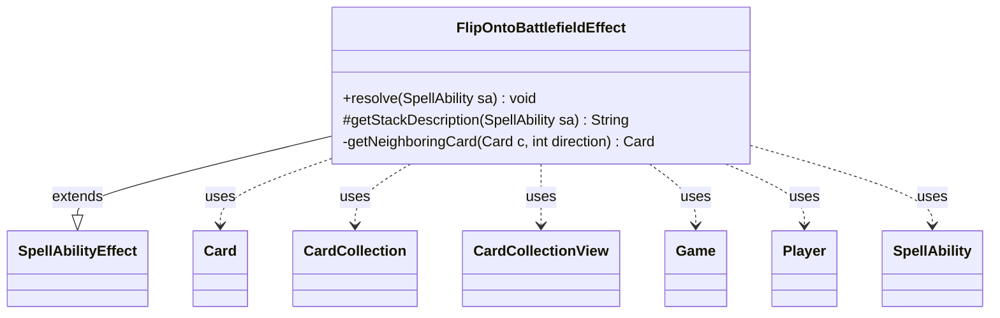

---
aliases:
  - FlipOntoBattlefieldEffect
tags:
  - java/class
  - module/forge-game
  - pkg/forge/game/ability/effects
fqn: forge.game.ability.effects.FlipOntoBattlefieldEffect
package: forge.game.ability.effects
module: forge-game
kind: Class
---

# FlipOntoBattlefieldEffect

**Package:** `forge.game.ability.effects` &nbsp; **Module:** `forge-game` &nbsp; **Kind:** Class



## Relationships
**Extends:**
- [[forge.game.ability.SpellAbilityEffect|SpellAbilityEffect]]
**Uses:**
- [[forge.game.Game|Game]]
- [[forge.game.card.Card|Card]]
- [[forge.game.card.CardCollection|CardCollection]]
- [[forge.game.card.CardCollectionView|CardCollectionView]]
- [[forge.game.player.Player|Player]]
- [[forge.game.spellability.SpellAbility|SpellAbility]]

## Design Description

FlipOntoBattlefieldEffect implements the resolution logic for a whimsical "flip the card onto the battlefield" ability, modeling a physical card toss as a sequence of randomized outcomes. As a concrete subtype of SpellAbilityEffect, it overrides `resolve` to drive the effect and `getStackDescription` to render flavorful stack text, fitting Forge's pattern of one effect class per ability keyword. During resolution it asks the activating Player's controller to choose a target location on the battlefield, then uses weighted probabilities (chance to flip, number of flips, chance to hit one or two cards) via MyRandom to decide what the landing "hits," recording the results through `host.addRemembered`.

The private `getNeighboringCard` helper encodes the spatial intent: lacking a real board-coordinate system, it approximates physical adjacency by scanning same-type cards in zone order and optionally striking attachments. TODO comments make clear this is an intentionally heuristic placeholder pending a proper location-targeting system, collaborating with Card, CardCollection(View), Game, and Player to operate on battlefield state.

## Source
`forge-game/src/main/java/forge/game/ability/effects/FlipOntoBattlefieldEffect.java`

```java
package forge.game.ability.effects;

import com.google.common.collect.Lists;
import forge.game.Game;
import forge.game.ability.SpellAbilityEffect;
import forge.game.card.Card;
import forge.game.card.CardCollection;
import forge.game.card.CardCollectionView;
import forge.game.card.CardLists;
import forge.game.player.Player;
import forge.game.spellability.SpellAbility;
import forge.game.zone.ZoneType;
import forge.util.Aggregates;
import forge.util.Localizer;
import forge.util.MyRandom;

import java.util.ArrayList;

public class FlipOntoBattlefieldEffect extends SpellAbilityEffect {
    @Override
    public void resolve(SpellAbility sa) {
        // Basic parameters defining the chances
        final float chanceToFlip = 0.85f;
        final int maxFlipTimes = 2;
        final float chanceToHit = 0.70f;
        final float chanceToHitTwoCards = 0.20f;

        final Card host = sa.getHostCard();
        final Player p = sa.getActivatingPlayer();
        final Game game = host.getGame();
        boolean flippedOnce = false;

        // TODO: allow to make a bounding box of sorts somehow, ideally - upgrade to a full system allowing to actually target by location
        CardCollectionView tgtBox = p.getController().chooseCardsForEffect(game.getCardsIn(ZoneType.Battlefield), sa, Localizer.getInstance().getMessage("lblChooseDesiredLocation"), 1, 1, sa.hasParam("AllowRandom"), null);

        Card tgtLoc = tgtBox.getFirst();

        Card lhsNeighbor = getNeighboringCard(tgtLoc, -1);
        Card rhsNeighbor = getNeighboringCard(tgtLoc, 1);

        CardCollection randChoices = new CardCollection();
        randChoices.add(tgtLoc);
        if (lhsNeighbor != null) {
            randChoices.add(lhsNeighbor);
        } else if (rhsNeighbor != null) {
            randChoices.add(rhsNeighbor);
        }

        // TODO: would be fun to add a small chance (e.g. 3-5%) to land unpredictably on some random target?

        flippedOnce = MyRandom.getRandom().nextFloat() <= chanceToFlip; // 20% chance that the card won't flip even once
        if (!flippedOnce) {
            sa.setSVar("TimesFlipped", "0");
            game.getAction().notifyOfValue(sa, host, Localizer.getInstance().getMessage("lblDidNotFlipOver"), null);
            return;
        } else {
            int flippedTimes = MyRandom.getRandom().nextInt(maxFlipTimes) + 1;
            sa.setSVar("TimesFlipped", String.valueOf(flippedTimes)); // Currently the exact # of times is unused
            game.getAction().notifyOfValue(sa, host, Localizer.getInstance().getMessage("lblFlippedOver", flippedTimes), null);
        }

        // Choose what was hit
        CardCollection hit = new CardCollection();
        float outcome = MyRandom.getRandom().nextFloat();
        if (outcome <= chanceToHitTwoCards) {
            hit.addAll(Aggregates.random(randChoices, randChoices.size() > 1 ? 2 : 1));
            if (hit.size() == 2) {
                game.getAction().notifyOfValue(sa, host, Localizer.getInstance().getMessage("lblLandedOnTwoCards", hit.getFirst(), hit.getLast()), null);
            } else {
                game.getAction().notifyOfValue(sa, host, Localizer.getInstance().getMessage("lblLandedOnOneCard", hit.getFirst()), null);
            }
        }
        else if (outcome <= chanceToHit) {
            hit.add(Aggregates.random(randChoices));
            game.getAction().notifyOfValue(sa, host, Localizer.getInstance().getMessage("lblLandedOnOneCard", hit.getFirst()), null);
        } else {
            game.getAction().notifyOfValue(sa, host, Localizer.getInstance().getMessage("lblDidNotLandOnCards"), null);
        }

        // Remember whatever was hit
        host.addRemembered(hit);
    }

    @Override
    protected String getStackDescription(SpellAbility sa) {
        final StringBuilder sb = new StringBuilder();
        final Card host = sa.getHostCard();

        sb.append("Flip ");
        sb.append(host.toString());
        sb.append(" onto the battlefield from a height of at least one foot.");

        return sb.toString();
    }

    private Card getNeighboringCard(Card c, int direction) {
        // Currently gets the nearest (in zone order) card to the left or to the right of the designated one by type,
        // as well as the current card attachments that are visually located next to the requested card or are assumed to be near it.
        Player controller = c.getController();
        ArrayList<Card> attachments = Lists.newArrayList();
        CardCollection cardsOTB = CardLists.filter(
                controller.getCardsIn(ZoneType.Battlefield), card -> {
                    if (card.isAttachedToEntity(c)) {
                        attachments.add(card);
                        return true;
                    } else if (c.isCreature()) {
                        return card.isCreature();
                    } else if (c.isPlaneswalker() || c.isArtifact() || (c.isEnchantment() && !c.isAura())) {
                        return card.isPlaneswalker() || card.isArtifact() || (c.isEnchantment() && !c.isAura());
                    } else if (c.isLand()) {
                        return card.isLand();
                    } else if (c.isAttachedToEntity()) {
                        return card.isAttachedToEntity(c.getEntityAttachedTo()) || c.equals(card.getAttachedTo());
                    }
                    return card.sharesCardTypeWith(c);
                }
        );

        // Chance to hit an attachment
        float hitAttachment = 0.50f;
        if (!attachments.isEmpty() && direction < 0 && MyRandom.getRandom().nextFloat() <= hitAttachment) {
            return Aggregates.random(attachments);
        }

        int loc = cardsOTB.indexOf(c);
        if (direction < 0 && loc > 0) {
            return cardsOTB.get(loc - 1);
        } else if (loc < cardsOTB.size() - 1) {
            return cardsOTB.get(loc + 1);
        }

        return c;
    }
}
```
