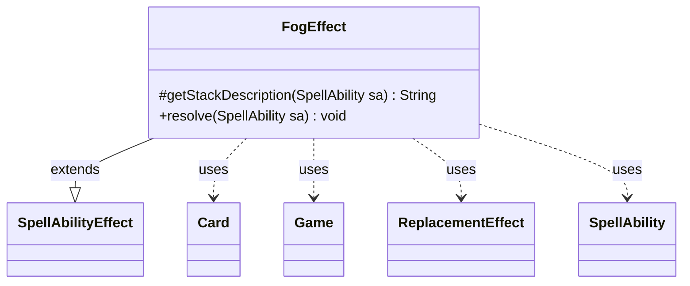

---
aliases:
  - FogEffect
tags:
  - java/class
  - module/forge-game
  - pkg/forge/game/ability/effects
fqn: forge.game.ability.effects.FogEffect
package: forge.game.ability.effects
module: forge-game
kind: Class
---

# FogEffect

**Package:** `forge.game.ability.effects` &nbsp; **Module:** `forge-game` &nbsp; **Kind:** Class



## Relationships
**Extends:**
- [[forge.game.ability.SpellAbilityEffect|SpellAbilityEffect]]
**Uses:**
- [[forge.game.Game|Game]]
- [[forge.game.card.Card|Card]]
- [[forge.game.replacement.ReplacementEffect|ReplacementEffect]]
- [[forge.game.spellability.SpellAbility|SpellAbility]]

## Design Description

FogEffect encapsulates the resolution behavior for a "Fog"-style spell ability, which prevents all combat damage for the remainder of the current turn. As a concrete subclass of `SpellAbilityEffect`, it fulfills that contract by overriding `getStackDescription` to produce a readable stack message naming the controller, and `resolve` to apply the effect when the ability resolves.

Rather than intercepting combat directly, `resolve` builds a data-driven replacement-effect string targeting combat `DamageDone` events and attaches it to a transient command-zone effect `Card` created via the inherited helper. It uses `ReplacementHandler` to parse the definition into a `ReplacementEffect`, then moves the host through the `Game`'s action layer into the command zone. The notable design intent is its reliance on Forge's textual replacement system and an end-of-turn cleanup callback that exiles the effect, keeping the prevention self-contained, turn-scoped, and free of bespoke combat hooks.

## Source
`forge-game/src/main/java/forge/game/ability/effects/FogEffect.java`

```java
package forge.game.ability.effects;

import forge.game.Game;
import forge.game.ability.SpellAbilityEffect;
import forge.game.card.Card;
import forge.game.replacement.ReplacementEffect;
import forge.game.replacement.ReplacementHandler;
import forge.game.spellability.SpellAbility;

public class FogEffect extends SpellAbilityEffect {

    @Override
    protected String getStackDescription(SpellAbility sa) {
        return sa.getHostCard().getController() + " prevents all combat damage this turn.";
    }

    @Override
    public void resolve(SpellAbility sa) {
        final Card hostCard = sa.getHostCard();
        final Game game = hostCard.getGame();
        final String name = hostCard + "'s Effect";
        final String image = hostCard.getImageKey();
        StringBuilder sb = new StringBuilder("Event$ DamageDone | ActiveZones$ Command | IsCombat$ True");
        sb.append(" | Prevent$ True | Description$ Prevent all combat damage this turn.");
        String repeffstr = sb.toString();

        final Card eff = createEffect(sa, hostCard.getController(), name, image);
        ReplacementEffect re = ReplacementHandler.parseReplacement(repeffstr, eff, true);
        eff.addReplacementEffect(re);

        game.getAction().moveToCommand(eff, sa);

        game.getEndOfTurn().addUntil(() -> game.getAction().exileEffect(eff));
    }
}
```

## Python
`forge/game/ability/effects/FogEffect.py`

```python
from forge.game.Game import Game
from forge.game.ability.SpellAbilityEffect import SpellAbilityEffect
from forge.game.card.Card import Card
from forge.game.replacement.ReplacementEffect import ReplacementEffect
from forge.game.replacement.ReplacementHandler import ReplacementHandler
from forge.game.spellability.SpellAbility import SpellAbility


class FogEffect(SpellAbilityEffect):

    def getStackDescription(self, sa: SpellAbility) -> str:
        return str(sa.getHostCard().getController()) + " prevents all combat damage this turn."

    def resolve(self, sa: SpellAbility) -> None:
        hostCard = sa.getHostCard()
        game = hostCard.getGame()
        name = str(hostCard) + "'s Effect"
        image = hostCard.getImageKey()
        sb = ["Event$ DamageDone | ActiveZones$ Command | IsCombat$ True"]
        sb.append(" | Prevent$ True | Description$ Prevent all combat damage this turn.")
        repeffstr = "".join(sb)

        eff = self.createEffect(sa, hostCard.getController(), name, image)
        re = ReplacementHandler.parseReplacement(repeffstr, eff, True)
        eff.addReplacementEffect(re)

        game.getAction().moveToCommand(eff, sa)

        game.getEndOfTurn().addUntil(lambda: game.getAction().exileEffect(eff))
```
