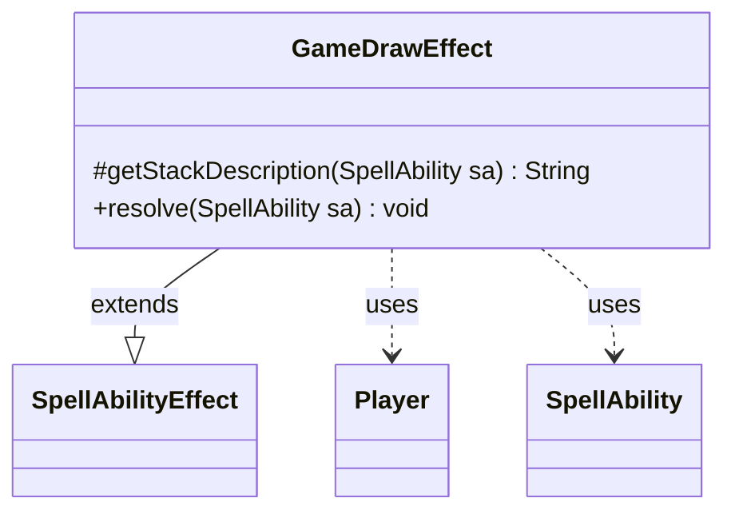

---
aliases:
  - GameDrawEffect
tags:
  - java/class
  - module/forge-game
  - pkg/forge/game/ability/effects
fqn: forge.game.ability.effects.GameDrawEffect
package: forge.game.ability.effects
module: forge-game
kind: Class
---

# GameDrawEffect

**Package:** `forge.game.ability.effects` &nbsp; **Module:** `forge-game` &nbsp; **Kind:** Class



## Relationships
**Extends:**
- [[forge.game.ability.SpellAbilityEffect|SpellAbilityEffect]]
**Uses:**
- [[forge.game.player.Player|Player]]
- [[forge.game.spellability.SpellAbility|SpellAbility]]

## Design Description

The game-draw effect: it resolves a Magic: The Gathering ability that ends the current game in a tie. Extending `SpellAbilityEffect`, it overrides `getStackDescription` to report "The game is a draw." and implements `resolve` to enact the outcome—iterating over every `Player` in the host card's `Game`, recording each as an intentional draw, then ending the game with `GameEndReason.Draw`.

As a leaf in the effect hierarchy, it depends on `SpellAbility` only to reach the host card and its game state, and on `Player` to flag the shared result. The design reflects the engine's data-driven pattern, where each card ability maps to a small, single-purpose effect class invoked polymorphically through `resolve`, keeping game-ending logic isolated and uniformly resolvable.

## Source
`forge-game/src/main/java/forge/game/ability/effects/GameDrawEffect.java`

```java
package forge.game.ability.effects;

import forge.game.GameEndReason;
import forge.game.ability.SpellAbilityEffect;
import forge.game.player.Player;
import forge.game.spellability.SpellAbility;

public class GameDrawEffect extends SpellAbilityEffect {

    /* (non-Javadoc)
     * @see forge.card.abilityfactory.SpellEffect#getStackDescription(java.util.Map, forge.card.spellability.SpellAbility)
     */
    @Override
    protected String getStackDescription(SpellAbility sa) {
        return "The game is a draw.";
    }

    @Override
    public void resolve(SpellAbility sa) {
        for (Player p : sa.getHostCard().getGame().getPlayers()) {
            p.intentionalDraw();
        }
        sa.getHostCard().getGame().setGameOver(GameEndReason.Draw);
    }

}
```
