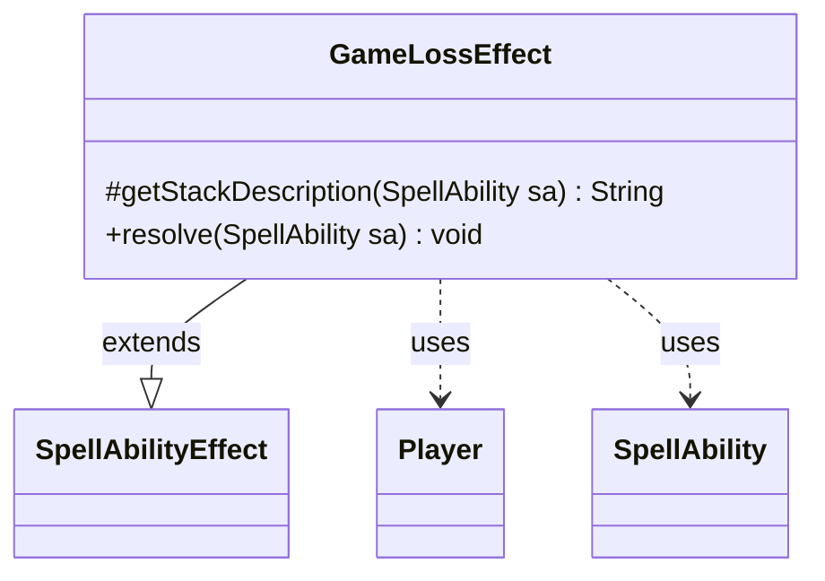

---
aliases:
  - GameLossEffect
tags:
  - java/class
  - module/forge-game
  - pkg/forge/game/ability/effects
fqn: forge.game.ability.effects.GameLossEffect
package: forge.game.ability.effects
module: forge-game
kind: Class
---

# GameLossEffect

**Package:** `forge.game.ability.effects` &nbsp; **Module:** `forge-game` &nbsp; **Kind:** Class



## Relationships
**Extends:**
- [[forge.game.ability.SpellAbilityEffect|SpellAbilityEffect]]
**Uses:**
- [[forge.game.player.Player|Player]]
- [[forge.game.spellability.SpellAbility|SpellAbility]]

## Design Description

GameLossEffect is a concrete ability-resolution handler implementing the "loses the game" spell effect within Forge's data-driven ability-effects layer. Extending `SpellAbilityEffect`, it overrides two framework hooks: `getStackDescription`, which composes the human-readable stack text by naming each targeted player, and `resolve`, which applies the game-state change. Resolution iterates over the SpellAbility's target players and calls `loseConditionMet` on each, tagging the loss with `GameLossReason.SpellEffect` and the host card's name for provenance.

The class is deliberately stateless, deriving its targets entirely from the supplied `SpellAbility` and collaborating with `Player` only through the loss-condition API. This keeps it a thin, focused adapter between a card's scripted ability and the player-elimination mechanics, consistent with the one-effect-per-class convention throughout the package.

## Source
`forge-game/src/main/java/forge/game/ability/effects/GameLossEffect.java`

```java
package forge.game.ability.effects;

import java.util.List;

import forge.game.ability.SpellAbilityEffect;
import forge.game.player.GameLossReason;
import forge.game.player.Player;
import forge.game.spellability.SpellAbility;

public class GameLossEffect extends SpellAbilityEffect {

    /* (non-Javadoc)
         * @see forge.card.abilityfactory.SpellEffect#getStackDescription(java.util.Map, forge.card.spellability.SpellAbility)
         */
    @Override
    protected String getStackDescription(SpellAbility sa) {
        final StringBuilder sb = new StringBuilder();

        final List<Player> tgtPlayers = getTargetPlayers(sa);
        for (final Player p : tgtPlayers) {
            sb.append(p.getName()).append(" ");
        }

        sb.append("loses the game.");
        return sb.toString();
    }

    @Override
    public void resolve(SpellAbility sa) {
        for (final Player p : getTargetPlayers(sa)) {
            p.loseConditionMet(GameLossReason.SpellEffect, sa.getHostCard().getName());
        }
    }

}
```

## Python
`forge/game/ability/effects/GameLossEffect.py`

```python
from typing import List

from forge.game.ability.SpellAbilityEffect import SpellAbilityEffect
from forge.game.player.GameLossReason import GameLossReason
from forge.game.player.Player import Player
from forge.game.spellability.SpellAbility import SpellAbility


class GameLossEffect(SpellAbilityEffect):

    # (non-Javadoc)
    # @see forge.card.abilityfactory.SpellEffect#getStackDescription(java.util.Map, forge.card.spellability.SpellAbility)
    def getStackDescription(self, sa: SpellAbility) -> str:
        sb = []

        tgtPlayers: List[Player] = self.getTargetPlayers(sa)
        for p in tgtPlayers:
            sb.append(p.getName())
            sb.append(" ")

        sb.append("loses the game.")
        return "".join(sb)

    def resolve(self, sa: SpellAbility) -> None:
        for p in self.getTargetPlayers(sa):
            p.loseConditionMet(GameLossReason.SpellEffect, sa.getHostCard().getName())
```
