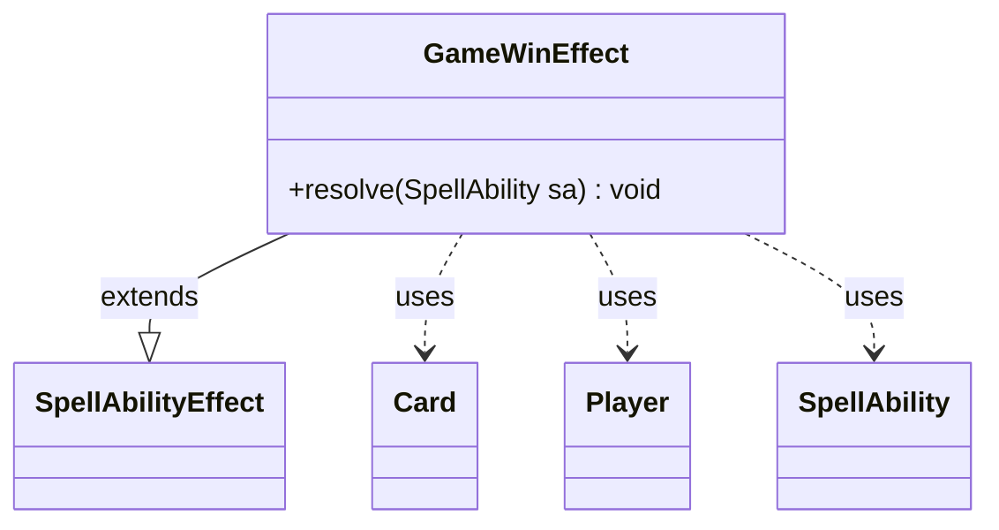

---
aliases:
  - GameWinEffect
tags:
  - java/class
  - module/forge-game
  - pkg/forge/game/ability/effects
fqn: forge.game.ability.effects.GameWinEffect
package: forge.game.ability.effects
module: forge-game
kind: Class
---

# GameWinEffect

**Package:** `forge.game.ability.effects`   **Module:** `forge-game`   **Kind:** Class



## Relationships
**Extends:**
- [[forge.game.ability.SpellAbilityEffect|SpellAbilityEffect]]
**Uses:**
- [[forge.game.card.Card|Card]]
- [[forge.game.player.Player|Player]]
- [[forge.game.spellability.SpellAbility|SpellAbility]]

## Design Description

A class in the package `forge.game.ability.effects`, `GameWinEffect` implements the resolution logic for spell or ability effects that cause one or more targeted players to win the game. As a concrete subclass of `SpellAbilityEffect`, it overrides the single `resolve(SpellAbility)` method, fitting into Forge's effect-resolution framework where the host `Card` and its `SpellAbility` supply the runtime context.

On resolution it retrieves the host card, then iterates over the ability's target `Player`s, invoking `altWinBySpellEffect` with the card's name to record an alternate-win condition keyed to the effect's source. It finishes by triggering `checkGameOverCondition`, deliberately enforcing comprehensive rule 104.1—that a game ends immediately when a player wins—so the victory takes effect without delay.

## Source
`forge-game/src/main/java/forge/game/ability/effects/GameWinEffect.java`

```java
package forge.game.ability.effects;

import forge.game.ability.SpellAbilityEffect;
import forge.game.card.Card;
import forge.game.player.Player;
import forge.game.spellability.SpellAbility;

public class GameWinEffect extends SpellAbilityEffect {

    /* (non-Javadoc)
     * @see forge.card.abilityfactory.SpellEffect#resolve(java.util.Map, forge.card.spellability.SpellAbility)
     */
    @Override
    public void resolve(SpellAbility sa) {
        final Card card = sa.getHostCard();

        for (final Player p : getTargetPlayers(sa)) {
            p.altWinBySpellEffect(card.getName());
        }

        // CR 104.1. A game ends immediately when a player wins
        card.getGame().getAction().checkGameOverCondition();
    }

}
```

## Python
`forge/game/ability/effects/GameWinEffect.py`

```python
from forge.game.ability.SpellAbilityEffect import SpellAbilityEffect
from forge.game.card.Card import Card
from forge.game.player.Player import Player
from forge.game.spellability.SpellAbility import SpellAbility


class GameWinEffect(SpellAbilityEffect):

    # (non-Javadoc)
    # @see forge.card.abilityfactory.SpellEffect#resolve(java.util.Map, forge.card.spellability.SpellAbility)
    def resolve(self, sa: SpellAbility) -> None:
        card = sa.getHostCard()

        for p in self.getTargetPlayers(sa):
            p.altWinBySpellEffect(card.getName())

        # CR 104.1. A game ends immediately when a player wins
        card.getGame().getAction().checkGameOverCondition()
```
