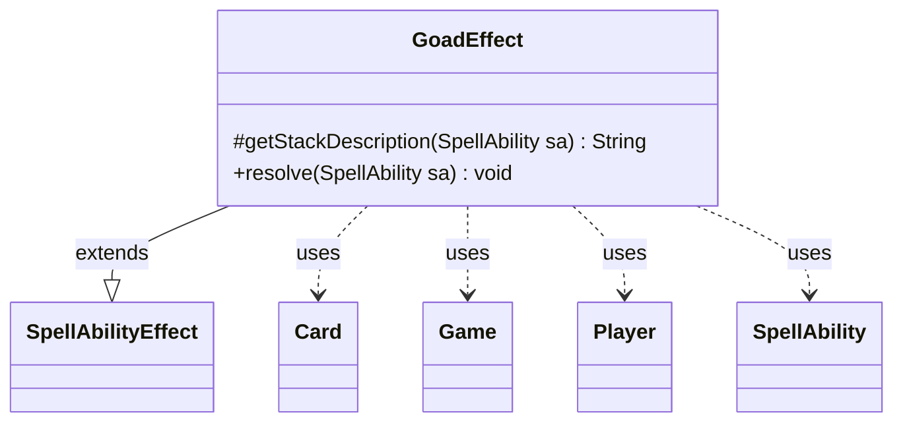

---
aliases:
  - GoadEffect
tags:
  - java/class
  - module/forge-game
  - pkg/forge/game/ability/effects
fqn: forge.game.ability.effects.GoadEffect
package: forge.game.ability.effects
module: forge-game
kind: Class
---

# GoadEffect

**Package:** `forge.game.ability.effects`   **Module:** `forge-game`   **Kind:** Class



## Relationships
**Extends:**
- [[forge.game.ability.SpellAbilityEffect|SpellAbilityEffect]]
**Uses:**
- [[forge.game.Game|Game]]
- [[forge.game.card.Card|Card]]
- [[forge.game.player.Player|Player]]
- [[forge.game.spellability.SpellAbility|SpellAbility]]

## Design Description

GoadEffect is a concrete `SpellAbilityEffect` that implements resolution of the "goad" combat-forcing mechanic within Forge's data-driven ability system. By overriding the protected `getStackDescription`, it renders the human-readable "X goads Y." text shown on the stack; by overriding `resolve`, it performs the actual state mutation. It reads the activating player and string parameters from the `SpellAbility`, draws timestamps and authoritative card state from the `Game`, and marks each targeted `Card` on behalf of a `Player`.

The design is parameter-driven, branching on flags (`NoLonger`, `RememberGoaded`, `Duration`) to cover goading, un-goading, remembering, and permanent versus expiring effects from one class. It deliberately guards correctness by skipping cards no longer in play and rejecting stale last-known-information copies via game-timestamp comparison, and schedules automatic expiry through `addUntilCommand` so non-permanent goads clean themselves up.

## Source
`forge-game/src/main/java/forge/game/ability/effects/GoadEffect.java`

```java
package forge.game.ability.effects;

import forge.game.Game;
import forge.game.ability.SpellAbilityEffect;
import forge.game.card.Card;
import forge.game.player.Player;
import forge.game.spellability.SpellAbility;
import forge.util.Lang;

import java.util.List;

public class GoadEffect extends SpellAbilityEffect {

    @Override
    protected String getStackDescription(SpellAbility sa) {
        final Player player = sa.getActivatingPlayer();
        List<Card> tgt = getDefinedCardsOrTargeted(sa, "Defined");
        String tgtString = sa.getParamOrDefault("DefinedDesc", Lang.joinHomogenous(tgt));
        if (tgtString.isEmpty()) {
            return "";
        } else {
            final StringBuilder sb = new StringBuilder();
            sb.append(player).append(" goads ").append(tgtString).append(".");
            return sb.toString();
        }
    }

    @Override
    public void resolve(SpellAbility sa) {
        final Player player = sa.getActivatingPlayer();
        final Game game = player.getGame();
        final long timestamp = game.getNextTimestamp();
        final boolean remember = sa.hasParam("RememberGoaded");
        final boolean ungoad = sa.hasParam("NoLonger");
        final String duration = sa.getParamOrDefault("Duration", "UntilYourNextTurn");

        for (final Card tgtC : getDefinedCardsOrTargeted(sa)) {
            // only goad things on the battlefield
            if (!tgtC.isInPlay()) {
                continue;
            }

            if (ungoad) {
                tgtC.unGoad();
                continue;
            }

            // check if the object is still in game or if it was moved
            final Card gameCard = game.getCardState(tgtC, null);
            // gameCard is LKI in that case, the card is not in game anymore
            // or the timestamp did change
            // this should check Self too
            if (gameCard == null || !tgtC.equalsWithGameTimestamp(gameCard)) {
                continue;
            }

            // 701.38d is handled by getGoaded
            gameCard.addGoad(timestamp, player);

            // currently, only Life of the Party uses Duration$ – Duration$ Permanent
            if (!duration.equals("Permanent")) {
                addUntilCommand(sa, () -> gameCard.removeGoad(timestamp), duration, player);
            }

            if (remember && gameCard.isGoaded()) {
                sa.getHostCard().addRemembered(gameCard);
            }
        }
    }

}
```

## Python
`forge/game/ability/effects/GoadEffect.py`

```python
from forge.game.Game import Game
from forge.game.ability.SpellAbilityEffect import SpellAbilityEffect
from forge.game.card.Card import Card
from forge.game.player.Player import Player
from forge.game.spellability.SpellAbility import SpellAbility
from forge.util.Lang import Lang


class GoadEffect(SpellAbilityEffect):

    def getStackDescription(self, sa: SpellAbility) -> str:
        player = sa.getActivatingPlayer()
        tgt = self.getDefinedCardsOrTargeted(sa, "Defined")
        tgtString = sa.getParamOrDefault("DefinedDesc", Lang.joinHomogenous(tgt))
        if tgtString == "":
            return ""
        else:
            sb = []
            sb.append(str(player))
            sb.append(" goads ")
            sb.append(tgtString)
            sb.append(".")
            return "".join(sb)

    def resolve(self, sa: SpellAbility) -> None:
        player = sa.getActivatingPlayer()
        game = player.getGame()
        timestamp = game.getNextTimestamp()
        remember = sa.hasParam("RememberGoaded")
        ungoad = sa.hasParam("NoLonger")
        duration = sa.getParamOrDefault("Duration", "UntilYourNextTurn")

        for tgtC in self.getDefinedCardsOrTargeted(sa):
            # only goad things on the battlefield
            if not tgtC.isInPlay():
                continue

            if ungoad:
                tgtC.unGoad()
                continue

            # check if the object is still in game or if it was moved
            gameCard = game.getCardState(tgtC, None)
            # gameCard is LKI in that case, the card is not in game anymore
            # or the timestamp did change
            # this should check Self too
            if gameCard is None or not tgtC.equalsWithGameTimestamp(gameCard):
                continue

            # 701.38d is handled by getGoaded
            gameCard.addGoad(timestamp, player)

            # currently, only Life of the Party uses Duration$ ?????????????????? Duration$ Permanent
            if duration != "Permanent":
                self.addUntilCommand(sa, lambda gameCard=gameCard, timestamp=timestamp: gameCard.removeGoad(timestamp), duration, player)

            if remember and gameCard.isGoaded():
                sa.getHostCard().addRemembered(gameCard)
```
