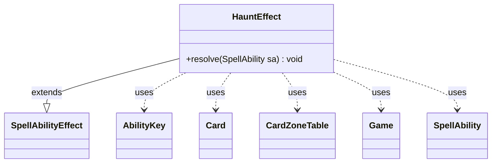

---
aliases:
  - HauntEffect
tags:
  - java/class
  - module/forge-game
  - pkg/forge/game/ability/effects
fqn: forge.game.ability.effects.HauntEffect
package: forge.game.ability.effects
module: forge-game
kind: Class
---

# HauntEffect

**Package:** `forge.game.ability.effects`   **Module:** `forge-game`   **Kind:** Class



## Relationships
**Extends:**
- [[forge.game.ability.SpellAbilityEffect|SpellAbilityEffect]]
**Uses:**
- [[forge.game.Game|Game]]
- [[forge.game.ability.AbilityKey|AbilityKey]]
- [[forge.game.card.Card|Card]]
- [[forge.game.card.CardZoneTable|CardZoneTable]]
- [[forge.game.spellability.SpellAbility|SpellAbility]]

## Design Description

HauntEffect is a concrete spell-resolution handler in Forge's ability-effects layer that implements the Magic "haunt" keyword. It extends the abstract `SpellAbilityEffect`, overriding only `resolve(SpellAbility)` and holding no instance state, in keeping with the engine's stateless-effect convention where each effect class encapsulates one keyword's behavior. On resolution it obtains the host `Card`—substituting the post-transformation `NewCard` triggering object via `AbilityKey` when a permanent has changed identity—then fetches the current card state from the `Game`.

It then branches on intent: a targeting ability exiles the still-grave-resident, non-token host through the game's action system and registers it as haunting the target, threading the move through a `CardZoneTable` so zone-change triggers fire correctly; a non-targeting resolution instead unwinds an existing haunt link. The `equalsWithGameTimestamp` and token guards show deliberate attention to game-object identity, ensuring the effect acts only on the valid card.

## Source
`forge-game/src/main/java/forge/game/ability/effects/HauntEffect.java`

```java
package forge.game.ability.effects;

import java.util.Map;

import forge.game.Game;
import forge.game.ability.AbilityKey;
import forge.game.ability.SpellAbilityEffect;
import forge.game.card.Card;
import forge.game.card.CardZoneTable;
import forge.game.spellability.SpellAbility;

public class HauntEffect extends SpellAbilityEffect {

    @Override
    public void resolve(SpellAbility sa) {
        Card host = sa.getHostCard();
        if (host.isPermanent() && sa.hasTriggeringObject(AbilityKey.NewCard)) {
            // get new version instead of battlefield lki
            host = (Card) sa.getTriggeringObject(AbilityKey.NewCard);
        }
        final Game game = host.getGame();
        Card card = game.getCardState(host, null);
        if (card == null) {
            return;
        } else if (sa.usesTargeting() && !card.isToken() && host.equalsWithGameTimestamp(card)) {
            // haunt target but only if card is no token and still in grave
            Map<AbilityKey, Object> moveParams = AbilityKey.newMap();
            CardZoneTable zoneMovements = AbilityKey.addCardZoneTableParams(moveParams, sa);
            final Card moved = game.getAction().exile(card, sa, moveParams);
            sa.getTargetCard().addHauntedBy(moved);
            zoneMovements.triggerChangesZoneAll(game, sa);
        } else if (!sa.usesTargeting() && card.getHaunting() != null) {
            // unhaunt
            card.getHaunting().removeHauntedBy(card);
            card.setHaunting(null);
        }
    }

}
```

## Python
`forge/game/ability/effects/HauntEffect.py`

```python
from typing import Map

from forge.game.Game import Game
from forge.game.ability.AbilityKey import AbilityKey
from forge.game.ability.SpellAbilityEffect import SpellAbilityEffect
from forge.game.card.Card import Card
from forge.game.card.CardZoneTable import CardZoneTable
from forge.game.spellability.SpellAbility import SpellAbility


class HauntEffect(SpellAbilityEffect):

    def resolve(self, sa: SpellAbility) -> None:
        host = sa.getHostCard()
        if host.isPermanent() and sa.hasTriggeringObject(AbilityKey.NewCard):
            # get new version instead of battlefield lki
            host = sa.getTriggeringObject(AbilityKey.NewCard)
        game = host.getGame()
        card = game.getCardState(host, None)
        if card is None:
            return
        elif sa.usesTargeting() and not card.isToken() and host.equalsWithGameTimestamp(card):
            # haunt target but only if card is no token and still in grave
            moveParams: dict[AbilityKey, object] = AbilityKey.newMap()
            zoneMovements = AbilityKey.addCardZoneTableParams(moveParams, sa)
            moved = game.getAction().exile(card, sa, moveParams)
            sa.getTargetCard().addHauntedBy(moved)
            zoneMovements.triggerChangesZoneAll(game, sa)
        elif not sa.usesTargeting() and card.getHaunting() is not None:
            # unhaunt
            card.getHaunting().removeHauntedBy(card)
            card.setHaunting(None)
```
