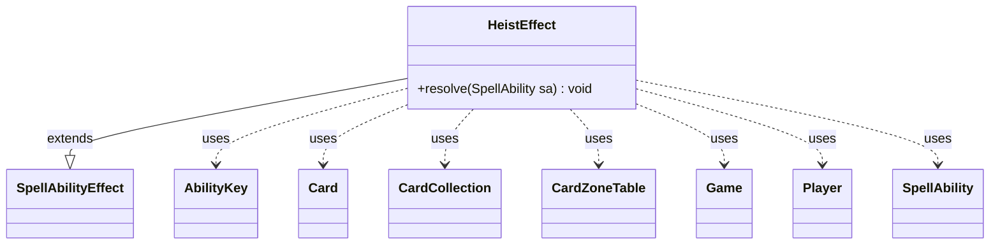

---
aliases:
  - HeistEffect
tags:
  - java/class
  - module/forge-game
  - pkg/forge/game/ability/effects
fqn: forge.game.ability.effects.HeistEffect
package: forge.game.ability.effects
module: forge-game
kind: Class
---

# HeistEffect

**Package:** `forge.game.ability.effects` &nbsp; **Module:** `forge-game` &nbsp; **Kind:** Class



## Relationships
**Extends:**
- [[forge.game.ability.SpellAbilityEffect|SpellAbilityEffect]]
**Uses:**
- [[forge.game.Game|Game]]
- [[forge.game.ability.AbilityKey|AbilityKey]]
- [[forge.game.card.Card|Card]]
- [[forge.game.card.CardCollection|CardCollection]]
- [[forge.game.card.CardZoneTable|CardZoneTable]]
- [[forge.game.player.Player|Player]]
- [[forge.game.spellability.SpellAbility|SpellAbility]]

## Design Description

HeistEffect implements the resolution logic for the "Heist" mechanic as a concrete `SpellAbilityEffect` subclass, plugging into Forge's data-driven ability framework where each effect overrides `resolve(SpellAbility)`. Its responsibility is to let the controlling player exile cards from a target player's library: for a configured number of iterations it randomly samples three non-land cards, prompts the controller through `PlayerController` to choose one, moves it face-down into exile, and records it in a `CardCollection`.

Collaborating with `Card`, `Player`, and `Game`, it then synthesizes a continuous effect granting permission to play the heisted cards with mana of any type while they remain exiled, attaching a static ability plus forget-triggers so the grant cleans up once a card leaves exile or is cast. A `CardZoneTable` batches the library-to-exile movements so their zone-change triggers fire together, reflecting Forge's centralized zone-change accounting.

## Source
`forge-game/src/main/java/forge/game/ability/effects/HeistEffect.java`

```java
package forge.game.ability.effects;

import java.util.List;
import java.util.Map;

import forge.game.Game;
import forge.game.ability.AbilityKey;
import forge.game.ability.AbilityUtils;
import forge.game.ability.SpellAbilityEffect;
import forge.game.card.Card;
import forge.game.card.CardCollection;
import forge.game.card.CardLists;
import forge.game.card.CardZoneTable;
import forge.game.player.Player;
import forge.game.spellability.SpellAbility;
import forge.game.zone.ZoneType;
import forge.util.Aggregates;
import forge.util.Localizer;

public class HeistEffect extends SpellAbilityEffect {

    @Override
    public void resolve(SpellAbility sa) {
        Map<AbilityKey, Object> moveParams = AbilityKey.newMap();
        moveParams.put(AbilityKey.LastStateBattlefield, sa.getLastStateBattlefield());
        moveParams.put(AbilityKey.LastStateGraveyard, sa.getLastStateGraveyard());
        final Card source = sa.getHostCard();
        final Player player = AbilityUtils.getDefinedPlayers(source, sa.getParam("Defined"), sa).get(0);
        final Game game = player.getGame();
        final Player target = getTargetPlayers(sa).get(0);
        final CardZoneTable triggerList = new CardZoneTable();
        final int num = AbilityUtils.calculateAmount(source, sa.getParamOrDefault("Num", "1"), sa);
        CardCollection heisted = new CardCollection();

        for (int i = 0; i < num; i++) {
            List<Card> choices = Aggregates.random(CardLists.getNotType(target.getCardsIn(ZoneType.Library), 
                "Land"), 3);
            if (choices.isEmpty()) continue; //nothing to heist
            Card chosenCard = player.getController().chooseSingleCardForZoneChange(ZoneType.Exile,
                List.of(ZoneType.Library), sa, new CardCollection(choices),
                null, Localizer.getInstance().getMessage("lblChooseCardHeist"), false, 
                player);
            if (!chosenCard.canExiledBy(sa, true)) {
                continue;
            }
            Card exiled = game.getAction().moveTo(ZoneType.Exile, chosenCard, sa, moveParams);
            exiled.turnFaceDown(true);
            exiled.addMayLookFaceDownExile(player);
            handleExiledWith(exiled, sa);
            heisted.add(exiled);
            triggerList.put(ZoneType.Library, exiled.getZone().getZoneType(), exiled);
        }

        if (!heisted.isEmpty()) {
            final Card eff = createEffect(sa, player, source + "'s Heist Effect", source.getImageKey());
            eff.addRemembered(heisted);
            String mayPlay = "Mode$ Continuous | MayPlay$ True | MayPlayIgnoreType$ True | EffectZone$ Command | " +
            "Affected$ Card.IsRemembered | AffectedZone$ Exile | Description$ You may play the heisted card for as " +
            "long as it remains exiled, and mana of any type can be spent to cast it.";
            eff.addStaticAbility(mayPlay);
            addForgetOnMovedTrigger(eff, "Exile");
            addForgetOnCastTrigger(eff, "Card.IsRemembered");
            game.getAction().moveToCommand(eff, sa);
        }

        triggerList.triggerChangesZoneAll(game, sa);
    }
}
```
