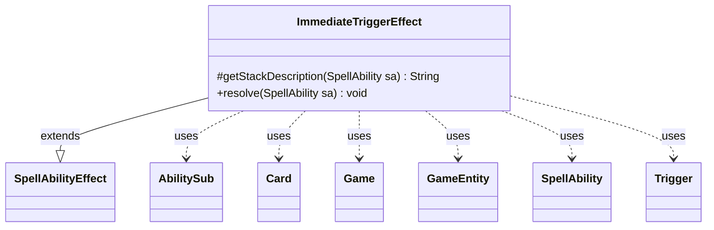

---
aliases:
  - ImmediateTriggerEffect
tags:
  - java/class
  - module/forge-game
  - pkg/forge/game/ability/effects
fqn: forge.game.ability.effects.ImmediateTriggerEffect
package: forge.game.ability.effects
module: forge-game
kind: Class
---

# ImmediateTriggerEffect

**Package:** `forge.game.ability.effects`   **Module:** `forge-game`   **Kind:** Class



## Relationships
**Extends:**
- [[forge.game.ability.SpellAbilityEffect|SpellAbilityEffect]]
**Uses:**
- [[forge.game.Game|Game]]
- [[forge.game.GameEntity|GameEntity]]
- [[forge.game.card.Card|Card]]
- [[forge.game.spellability.AbilitySub|AbilitySub]]
- [[forge.game.spellability.SpellAbility|SpellAbility]]
- [[forge.game.trigger.Trigger|Trigger]]


## Design Description

ImmediateTriggerEffect implements the resolution logic for "reflexive" or immediate triggered abilities—triggers that fire as soon as possible after the effect that spawned them. As a concrete `SpellAbilityEffect` subclass, it slots into Forge's pluggable ability-effect framework, overriding `getStackDescription` to expose the trigger's description text and `resolve` to perform the actual work.

In `resolve`, it resolves the host `Card` and `Game`, then assembles a parameter map flagged as `TriggerType.Immediate`, building one `Trigger` per occurrence to honor CR 603.12a (a multiply-occurring event triggers once per occurrence). Each trigger optionally carries an `Execute` overriding `SpellAbility` (with any `AbilitySub` parent detached) plus remembered `GameEntity` objects or SVar amounts, and is registered as a delayed trigger so it fires immediately. Notably, the design reuses Forge's existing delayed-trigger infrastructure rather than executing inline, keeping immediate triggers consistent with ordinary trigger handling.

## Source
`forge-game/src/main/java/forge/game/ability/effects/ImmediateTriggerEffect.java`

```java
package forge.game.ability.effects;

import java.util.List;
import java.util.Map;

import com.google.common.collect.Maps;

import forge.game.Game;
import forge.game.GameEntity;
import forge.game.ability.AbilityUtils;
import forge.game.ability.SpellAbilityEffect;
import forge.game.card.Card;
import forge.game.spellability.AbilitySub;
import forge.game.spellability.SpellAbility;
import forge.game.trigger.Trigger;
import forge.game.trigger.TriggerHandler;
import forge.game.trigger.TriggerType;

public class ImmediateTriggerEffect extends SpellAbilityEffect {

    /* (non-Javadoc)
     * @see forge.card.abilityfactory.SpellEffect#resolve(java.util.Map, forge.card.spellability.SpellAbility)
     */
    @Override
    protected String getStackDescription(SpellAbility sa) {
        if (sa.hasParam("TriggerDescription")) {
            return sa.getParam("TriggerDescription");
        }
        if (sa.hasParam("SpellDescription")) {
            return sa.getParam("SpellDescription");
        }

        return "";
    }

    @Override
    public void resolve(SpellAbility sa) {
        final Card host = sa.getHostCard();
        final Game game = host.getGame();

        // CR 603.12a if the trigger event or events occur multiple times during the resolution of the spell or ability that created it,
        // the reflexive triggered ability will trigger once for each of those times
        int amt = AbilityUtils.calculateAmount(host, sa.getParamOrDefault("TriggerAmount", "1"), sa);
        if (amt <= 0) {
            return;
        }

        Map<String, String> mapParams = Maps.newHashMap(sa.getMapParams());
        mapParams.put("Mode", TriggerType.Immediate.name());
        if (mapParams.containsKey("SpellDescription") && !mapParams.containsKey("TriggerDescription")) {
            mapParams.put("TriggerDescription", mapParams.get("SpellDescription"));
        }
        mapParams.remove("SpellDescription");
        mapParams.remove("Cost");

        SpellAbility overridingSA = null;
        if (sa.hasAdditionalAbility("Execute")) {
            overridingSA = sa.getAdditionalAbility("Execute").copy(host, sa.getActivatingPlayer(), false);
            // need to set Parent to null, otherwise it might have wrong root ability
            if (overridingSA instanceof AbilitySub) {
                ((AbilitySub)overridingSA).setParent(null);
            }
        }

        List<GameEntity> remember = null;
        if (sa.hasParam("RememberObjects")) {
            remember = AbilityUtils.getDefinedEntities(host, sa.getParam("RememberObjects").split(" & "), sa);
        }

        for (int i = 0; i < amt; i++) {
            final Trigger immediateTrig = TriggerHandler.parseTrigger(mapParams, host, sa.isIntrinsic(), null);
            immediateTrig.setSpawningAbility(sa.copy(host, true));
            if (overridingSA != null) {
                immediateTrig.setOverridingAbility(overridingSA);
            }

            if (remember != null) {
                immediateTrig.addRemembered(
                        sa.hasParam("RememberEach") ? List.of(remember.get(i)) : remember
                );
            }

            if (sa.hasParam("RememberSVarAmount")) {
                immediateTrig.addRemembered(
                        AbilityUtils.calculateAmount(host, sa.getSVar(sa.getParam("RememberSVarAmount")), sa)
                );
            }

            // Instead of registering this, add to the delayed triggers as an immediate trigger type? Which means it'll fire as soon as possible
            game.getTriggerHandler().registerDelayedTrigger(immediateTrig);
        }
    }
}
```

## Python
`forge/game/ability/effects/ImmediateTriggerEffect.py`

```python
from typing import List, Dict

from forge.game.Game import Game
from forge.game.GameEntity import GameEntity
from forge.game.ability.AbilityUtils import AbilityUtils
from forge.game.ability.SpellAbilityEffect import SpellAbilityEffect
from forge.game.card.Card import Card
from forge.game.spellability.AbilitySub import AbilitySub
from forge.game.spellability.SpellAbility import SpellAbility
from forge.game.trigger.Trigger import Trigger
from forge.game.trigger.TriggerHandler import TriggerHandler
from forge.game.trigger.TriggerType import TriggerType


class ImmediateTriggerEffect(SpellAbilityEffect):

    # (non-Javadoc)
    # @see forge.card.abilityfactory.SpellEffect#resolve(java.util.Map, forge.card.spellability.SpellAbility)
    def getStackDescription(self, sa: SpellAbility) -> str:
        if sa.hasParam("TriggerDescription"):
            return sa.getParam("TriggerDescription")
        if sa.hasParam("SpellDescription"):
            return sa.getParam("SpellDescription")

        return ""

    def resolve(self, sa: SpellAbility) -> None:
        host = sa.getHostCard()
        game = host.getGame()

        # CR 603.12a if the trigger event or events occur multiple times during the resolution of the spell or ability that created it,
        # the reflexive triggered ability will trigger once for each of those times
        amt = AbilityUtils.calculateAmount(host, sa.getParamOrDefault("TriggerAmount", "1"), sa)
        if amt <= 0:
            return

        mapParams: Dict[str, str] = dict(sa.getMapParams())
        mapParams["Mode"] = TriggerType.Immediate.name()
        if "SpellDescription" in mapParams and "TriggerDescription" not in mapParams:
            mapParams["TriggerDescription"] = mapParams["SpellDescription"]
        mapParams.pop("SpellDescription", None)
        mapParams.pop("Cost", None)

        overridingSA = None
        if sa.hasAdditionalAbility("Execute"):
            overridingSA = sa.getAdditionalAbility("Execute").copy(host, sa.getActivatingPlayer(), False)
            # need to set Parent to null, otherwise it might have wrong root ability
            if isinstance(overridingSA, AbilitySub):
                overridingSA.setParent(None)

        remember: List[GameEntity] = None
        if sa.hasParam("RememberObjects"):
            remember = AbilityUtils.getDefinedEntities(host, sa.getParam("RememberObjects").split(" & "), sa)

        for i in range(amt):
            immediateTrig = TriggerHandler.parseTrigger(mapParams, host, sa.isIntrinsic(), None)
            immediateTrig.setSpawningAbility(sa.copy(host, True))
            if overridingSA is not None:
                immediateTrig.setOverridingAbility(overridingSA)

            if remember is not None:
                immediateTrig.addRemembered(
                    [remember[i]] if sa.hasParam("RememberEach") else remember
                )

            if sa.hasParam("RememberSVarAmount"):
                immediateTrig.addRemembered(
                    AbilityUtils.calculateAmount(host, sa.getSVar(sa.getParam("RememberSVarAmount")), sa)
                )

            # Instead of registering this, add to the delayed triggers as an immediate trigger type? Which means it'll fire as soon as possible
            game.getTriggerHandler().registerDelayedTrigger(immediateTrig)
```
