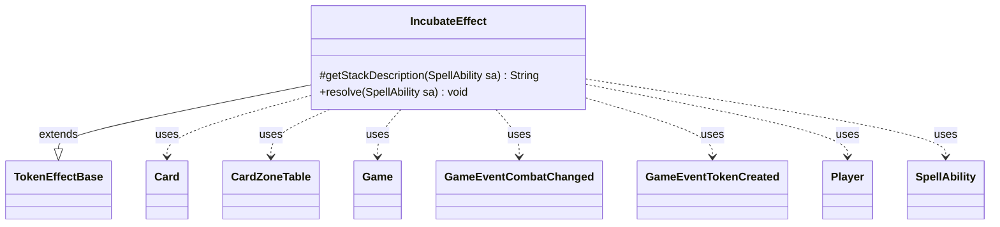

---
aliases:
  - IncubateEffect
tags:
  - java/class
  - module/forge-game
  - pkg/forge/game/ability/effects
fqn: forge.game.ability.effects.IncubateEffect
package: forge.game.ability.effects
module: forge-game
kind: Class
---

# IncubateEffect

**Package:** `forge.game.ability.effects` &nbsp; **Module:** `forge-game` &nbsp; **Kind:** Class



## Relationships
**Extends:**
- [[forge.game.ability.effects.TokenEffectBase|TokenEffectBase]]
**Uses:**
- [[forge.game.Game|Game]]
- [[forge.game.card.Card|Card]]
- [[forge.game.card.CardZoneTable|CardZoneTable]]
- [[forge.game.event.GameEventCombatChanged|GameEventCombatChanged]]
- [[forge.game.event.GameEventTokenCreated|GameEventTokenCreated]]
- [[forge.game.player.Player|Player]]
- [[forge.game.spellability.SpellAbility|SpellAbility]]


## Design Description

IncubateEffect implements Magic's "Incubate" keyword action as a resolvable ability effect within the `forge.game.ability.effects` package. Extending TokenEffectBase, it reuses inherited token-creation machinery to produce colorless "Incubator" Phyrexian artifact tokens, configuring each with P1P1 counters whose amount is driven by the SpellAbility's "Amount" parameter.

The class separates presentation from execution: getStackDescription builds readable stack text, deferring to the configured SpellDescription (with reminder text trimmed) when the amount is non-numeric and hard to precompute. resolve creates tokens per targeted Player, repeated "Times" times, using a CardZoneTable to batch zone-change triggers and a MutableBoolean to detect combat shifts. It then fires GameEventTokenCreated and, only when combat changed, refreshes the combat view and fires GameEventCombatChanged—keeping the Game's event bus and observers synchronized with minimal redundant updates.

## Source
`forge-game/src/main/java/forge/game/ability/effects/IncubateEffect.java`

```java
package forge.game.ability.effects;

import forge.game.Game;
import forge.game.ability.AbilityUtils;
import forge.game.card.*;
import forge.game.event.GameEventCombatChanged;
import forge.game.event.GameEventTokenCreated;
import forge.game.player.Player;
import forge.game.spellability.SpellAbility;
import forge.util.Lang;

import org.apache.commons.lang3.StringUtils;
import org.apache.commons.lang3.mutable.MutableBoolean;

public class IncubateEffect extends TokenEffectBase {

    @Override
    protected String getStackDescription(SpellAbility sa) {
        if (!StringUtils.isNumeric(sa.getParam("Amount"))) { // non-numeric too easy to miscalc, default to SpellDesc
            String desc = sa.getParamOrDefault("SpellDescription", "Please add SpellDescription for non-numeric");
            int idx = desc.indexOf("(");
            if (idx > 0) { //trim reminder text from StackDesc
                desc = desc.substring(0, desc.indexOf("(") - 1);
            }
            return desc;
        }

        final StringBuilder sb = new StringBuilder("Incubate ");
        final Card card = sa.getHostCard();
        final int amount = AbilityUtils.calculateAmount(card, sa.getParamOrDefault("Amount", "1"), sa);
        final int times = AbilityUtils.calculateAmount(card, sa.getParamOrDefault("Times", "1"), sa);

        sb.append(amount);
        if (times > 1) {
            sb.append(" ").append(times == 2 ? "twice" : Lang.nounWithNumeral(amount, "times"));
        }
        sb.append(".");

        return sb.toString();
    }

    @Override
    public void resolve(SpellAbility sa) {
        final Card host = sa.getHostCard();
        final Game game = host.getGame();
        final int times = AbilityUtils.calculateAmount(host, sa.getParamOrDefault("Times", "1"), sa);
        sa.putParam("WithCountersType", "P1P1");
        sa.putParam("WithCountersAmount", sa.getParamOrDefault("Amount", "1"));

        for (final Player p : getTargetPlayers(sa)) {
            for (int i = 0; i < times; i++) {
                CardZoneTable triggerList = new CardZoneTable();
                MutableBoolean combatChanged = new MutableBoolean(false);

                makeTokenTable(makeTokenTableInternal(p, "incubator_c_0_0_a_phyrexian", 1, sa), false,
                        triggerList, combatChanged, sa);

                triggerList.triggerChangesZoneAll(game, sa);

                game.fireEvent(new GameEventTokenCreated());

                if (combatChanged.isTrue()) {
                    game.updateCombatForView();
                    game.fireEvent(new GameEventCombatChanged());
                }
            }
        }
    }
}
```
