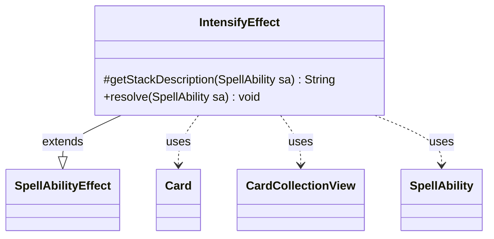

---
aliases:
  - IntensifyEffect
tags:
  - java/class
  - module/forge-game
  - pkg/forge/game/ability/effects
fqn: forge.game.ability.effects.IntensifyEffect
package: forge.game.ability.effects
module: forge-game
kind: Class
---

# IntensifyEffect

**Package:** `forge.game.ability.effects` &nbsp; **Module:** `forge-game` &nbsp; **Kind:** Class



## Relationships
**Extends:**
- [[forge.game.ability.SpellAbilityEffect|SpellAbilityEffect]]
**Uses:**
- [[forge.game.card.Card|Card]]
- [[forge.game.card.CardCollectionView|CardCollectionView]]
- [[forge.game.spellability.SpellAbility|SpellAbility]]

## Design Description

IntensifyEffect implements the resolution logic for the Magic: The Gathering "intensify" mechanic, perpetually increasing the intensity of one or more cards. As a concrete subclass of SpellAbilityEffect, it overrides two hooks: `getStackDescription`, which builds the human-readable stack message naming the activating player, the affected cards, and the amount; and `resolve`, which applies the increase. In both cases the magnitude is resolved dynamically through `AbilityUtils.calculateAmount`, defaulting to 1, so data-driven card scripts can parameterize it via the `Amount` parameter.

The class holds no state, instead reading parameters (`DefinedDesc`, `AllDefined`) from the SpellAbility and delegating target selection either to the inherited `getDefinedCardsOrTargeted` helper or, when `AllDefined` is set, to `CardLists.getValidCards` filtering every card in the game. It then iterates the resulting CardCollectionView and calls `addIntensity` on each Card, keeping the per-card counter mutation on the domain objects themselves.

## Source
`forge-game/src/main/java/forge/game/ability/effects/IntensifyEffect.java`

```java
package forge.game.ability.effects;

import forge.game.ability.AbilityUtils;
import forge.game.card.Card;
import forge.game.ability.SpellAbilityEffect;
import forge.game.card.CardCollectionView;
import forge.game.card.CardLists;
import forge.game.spellability.SpellAbility;
import forge.util.Lang;

public class IntensifyEffect extends SpellAbilityEffect {
    @Override
    protected String getStackDescription(SpellAbility sa) {
        final StringBuilder sb = new StringBuilder();
        String these = sa.hasParam("DefinedDesc") ? sa.getParam("DefinedDesc") :
                Lang.joinHomogenous(getDefinedCardsOrTargeted(sa));
        final int amount = AbilityUtils.calculateAmount(sa.getHostCard(),
                sa.getParamOrDefault("Amount", "1"), sa);

        sb.append(sa.getActivatingPlayer()).append(" perpetually increases the intensity of ").append(these);
        sb.append(" by ").append(amount).append(".");

        return sb.toString();
    }

    @Override
    public void resolve(SpellAbility sa) {
        final Card host = sa.getHostCard();
        final int amount = AbilityUtils.calculateAmount(sa.getHostCard(),
                sa.getParamOrDefault("Amount", "1"), sa);

        CardCollectionView toIntensify;
        if (sa.hasParam("AllDefined")) {
            toIntensify = CardLists.getValidCards(host.getGame().getCardsInGame(), sa.getParam("AllDefined"),
                        sa.getActivatingPlayer(), host, sa);
        } else {
            toIntensify = getDefinedCardsOrTargeted(sa);
        }

        for (final Card tgtC : toIntensify) {
            tgtC.addIntensity(amount);
        }
    }
}
```
