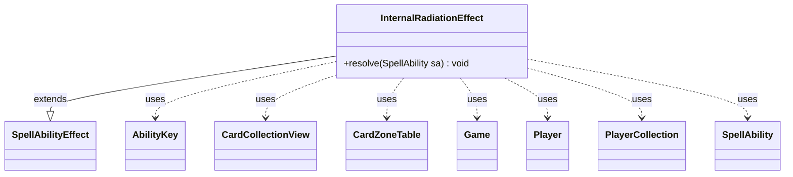

---
aliases:
  - InternalRadiationEffect
tags:
  - java/class
  - module/forge-game
  - pkg/forge/game/ability/effects
fqn: forge.game.ability.effects.InternalRadiationEffect
package: forge.game.ability.effects
module: forge-game
kind: Class
---

# InternalRadiationEffect

**Package:** `forge.game.ability.effects`   **Module:** `forge-game`   **Kind:** Class



## Relationships
**Extends:**
- [[forge.game.ability.SpellAbilityEffect|SpellAbilityEffect]]
**Uses:**
- [[forge.game.Game|Game]]
- [[forge.game.ability.AbilityKey|AbilityKey]]
- [[forge.game.card.CardCollectionView|CardCollectionView]]
- [[forge.game.card.CardZoneTable|CardZoneTable]]
- [[forge.game.player.Player|Player]]
- [[forge.game.player.PlayerCollection|PlayerCollection]]
- [[forge.game.spellability.SpellAbility|SpellAbility]]

## Design Description

InternalRadiationEffect is a concrete `SpellAbilityEffect` that resolves Magic's internal-radiation mechanic, overriding only `resolve(SpellAbility)` to translate a player's RAD counters into game actions. Driven entirely by the passed `SpellAbility`, it mills cards equal to the player's radiation count, counts the non-land cards milled, and—based on the `StaticAbilityGainLifeRadiation` ruling—either grants that much life or inflicts equivalent life loss before stripping one RAD counter per non-land.

As a stateless effect handler in Forge's ability-effects framework, it collaborates with the `Game`'s action and trigger subsystems, assembling an `AbilityKey` parameter map and a `CardZoneTable` to batch zone-change triggers, and uses `PlayerCollection` and `CardCollectionView` over the milled cards. Notably, it fires `LifeLostAll` triggers only when life is genuinely lost, reflecting deliberate rules-engine precision.

## Source
`forge-game/src/main/java/forge/game/ability/effects/InternalRadiationEffect.java`

```java
package forge.game.ability.effects;

import java.util.Map;

import com.google.common.collect.Maps;

import forge.game.Game;
import forge.game.ability.AbilityKey;
import forge.game.ability.SpellAbilityEffect;
import forge.game.card.*;
import forge.game.player.Player;
import forge.game.player.PlayerCollection;
import forge.game.spellability.SpellAbility;
import forge.game.staticability.StaticAbilityGainLifeRadiation;
import forge.game.trigger.TriggerType;
import forge.game.zone.ZoneType;

public class InternalRadiationEffect extends SpellAbilityEffect {

    @Override
    public void resolve(SpellAbility sa) {
        final Player p = sa.getActivatingPlayer();
        final Game game = p.getGame();

        int numRad = p.getCounters(CounterEnumType.RAD);

        Map<AbilityKey, Object> moveParams = AbilityKey.newMap();
        final CardZoneTable table = AbilityKey.addCardZoneTableParams(moveParams, sa);

        final CardCollectionView milled = game.getAction().mill(new PlayerCollection(p), numRad, ZoneType.Graveyard, sa, moveParams);
        table.triggerChangesZoneAll(game, sa);
        int n = CardLists.count(milled, CardPredicates.NON_LANDS);

        if (StaticAbilityGainLifeRadiation.gainLifeRadiation(p)) {
            p.gainLife(n, sa.getHostCard(), sa);
        } else {
            final Map<Player, Integer> lossMap = Maps.newHashMap();
            final int lost = p.loseLife(n, false, false);
            if (lost > 0) {
                lossMap.put(p, lost);
            }
            if (!lossMap.isEmpty()) { // Run triggers if any player actually lost life
                final Map<AbilityKey, Object> runParams = AbilityKey.mapFromPIMap(lossMap);
                game.getTriggerHandler().runTrigger(TriggerType.LifeLostAll, runParams, false);
            }
        }

        // and remove n rad counter
        p.removeRadCounters(n);
    }

}
```

## Python
`forge/game/ability/effects/InternalRadiationEffect.py`

```python
from forge.game.Game import Game
from forge.game.ability.AbilityKey import AbilityKey
from forge.game.ability.SpellAbilityEffect import SpellAbilityEffect
from forge.game.card.CardCollectionView import CardCollectionView
from forge.game.card.CardZoneTable import CardZoneTable
from forge.game.card.CardLists import CardLists
from forge.game.card.CardPredicates import CardPredicates
from forge.game.card.CounterEnumType import CounterEnumType
from forge.game.player.Player import Player
from forge.game.player.PlayerCollection import PlayerCollection
from forge.game.spellability.SpellAbility import SpellAbility
from forge.game.staticability.StaticAbilityGainLifeRadiation import StaticAbilityGainLifeRadiation
from forge.game.trigger.TriggerType import TriggerType
from forge.game.zone.ZoneType import ZoneType


class InternalRadiationEffect(SpellAbilityEffect):

    def resolve(self, sa: SpellAbility) -> None:
        p = sa.getActivatingPlayer()
        game = p.getGame()

        numRad = p.getCounters(CounterEnumType.RAD)

        moveParams: dict[AbilityKey, object] = AbilityKey.newMap()
        table = AbilityKey.addCardZoneTableParams(moveParams, sa)

        milled = game.getAction().mill(PlayerCollection(p), numRad, ZoneType.Graveyard, sa, moveParams)
        table.triggerChangesZoneAll(game, sa)
        n = CardLists.count(milled, CardPredicates.NON_LANDS)

        if StaticAbilityGainLifeRadiation.gainLifeRadiation(p):
            p.gainLife(n, sa.getHostCard(), sa)
        else:
            lossMap: dict[Player, int] = {}
            lost = p.loseLife(n, False, False)
            if lost > 0:
                lossMap[p] = lost
            if lossMap:  # Run triggers if any player actually lost life
                runParams = AbilityKey.mapFromPIMap(lossMap)
                game.getTriggerHandler().runTrigger(TriggerType.LifeLostAll, runParams, False)

        # and remove n rad counter
        p.removeRadCounters(n)
```
