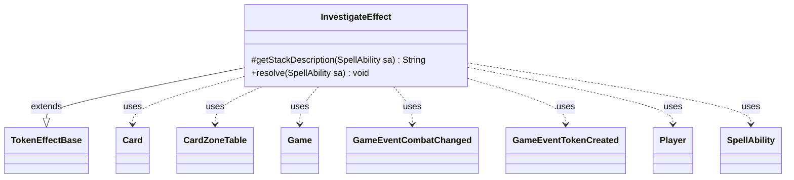

---
aliases:
  - InvestigateEffect
tags:
  - java/class
  - module/forge-game
  - pkg/forge/game/ability/effects
fqn: forge.game.ability.effects.InvestigateEffect
package: forge.game.ability.effects
module: forge-game
kind: Class
---

# InvestigateEffect

**Package:** `forge.game.ability.effects` &nbsp; **Module:** `forge-game` &nbsp; **Kind:** Class



## Relationships
**Extends:**
- [[forge.game.ability.effects.TokenEffectBase|TokenEffectBase]]
**Uses:**
- [[forge.game.Game|Game]]
- [[forge.game.card.Card|Card]]
- [[forge.game.card.CardZoneTable|CardZoneTable]]
- [[forge.game.event.GameEventCombatChanged|GameEventCombatChanged]]
- [[forge.game.event.GameEventTokenCreated|GameEventTokenCreated]]
- [[forge.game.player.Player|Player]]
- [[forge.game.spellability.SpellAbility|SpellAbility]]

## Design Description

InvestigateEffect implements the Magic: The Gathering "Investigate" keyword action, directing one or more players to create colorless Clue artifact tokens. Extending TokenEffectBase, it inherits the token-creation machinery and overrides only the two members that vary per effect: getStackDescription, which builds the player-facing reminder text (pluralizing when investigating multiple times), and resolve, which performs the work. During resolution it loops the configured Num times, and for each iteration walks the targeted Players, optionally prompting for confirmation, minting one Clue per player via the inherited makeTokenTable helpers, recording the investigation, and firing a GameEventTokenCreated.

The design centralizes token bookkeeping in the superclass while this subclass supplies only Clue-specific intent. It batches zone-change and combat side effects per iteration through a CardZoneTable and a MutableBoolean, flushing triggers and refreshing combat state afterward so the Game and its view stay consistent. Optional parameters (Optional, RememberInvestigatingPlayers) keep it reusable across the many cards that grant Investigate.

## Source
`forge-game/src/main/java/forge/game/ability/effects/InvestigateEffect.java`

```java
package forge.game.ability.effects;

import forge.util.Localizer;
import org.apache.commons.lang3.mutable.MutableBoolean;

import forge.game.Game;
import forge.game.ability.AbilityUtils;
import forge.game.card.Card;
import forge.game.card.CardZoneTable;
import forge.game.event.GameEventCombatChanged;
import forge.game.event.GameEventTokenCreated;
import forge.game.player.Player;
import forge.game.spellability.SpellAbility;
import forge.util.Lang;

public class InvestigateEffect extends TokenEffectBase {

    @Override
    protected String getStackDescription(SpellAbility sa) {
        final Card card = sa.getHostCard();
        final int amount = AbilityUtils.calculateAmount(card, sa.getParamOrDefault("Num", "1"), sa);

        StringBuilder sb = new StringBuilder("Investigate");
        if (amount > 1) {
            sb.append(" ").append(Lang.getNumeral(amount)).append(" times");
        }
        sb.append(". (Create a colorless Clue artifact token with \"{2}, Sacrifice this artifact: Draw a card.\")");

        return sb.toString();
    }

    @Override
    public void resolve(SpellAbility sa) {
        final Card card = sa.getHostCard();
        final Game game = card.getGame();

        final int amount = AbilityUtils.calculateAmount(card, sa.getParamOrDefault("Num", "1"), sa);

        // Investigate in Sequence
        for (int i = 0; i < amount; i++) {
            CardZoneTable triggerList = new CardZoneTable();
            MutableBoolean combatChanged = new MutableBoolean(false);

            for (final Player p : getTargetPlayers(sa)) {
                if (!p.isInGame()) {
                    continue;
                }
                if (sa.hasParam("Optional") && !p.getController().confirmAction(sa, null,
                        Localizer.getInstance().getMessage("lblWouldYouLikeInvestigate"), null)) {
                    continue;
                }

                makeTokenTable(makeTokenTableInternal(p, "c_a_clue_draw", 1, sa), false, triggerList, combatChanged, sa);

                p.addInvestigatedThisTurn();

                if (sa.hasParam("RememberInvestigatingPlayers")) {
                    card.addRemembered(p);
                }

                game.fireEvent(new GameEventTokenCreated());
            }

            triggerList.triggerChangesZoneAll(game, sa);
            if (combatChanged.isTrue()) {
                game.updateCombatForView();
                game.fireEvent(new GameEventCombatChanged());
            }
        }
    }

}
```
