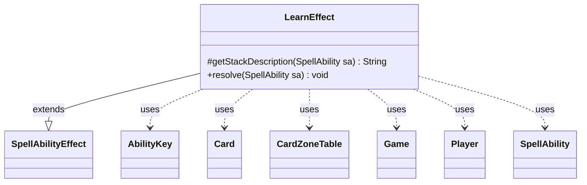

---
aliases:
  - LearnEffect
tags:
  - java/class
  - module/forge-game
  - pkg/forge/game/ability/effects
fqn: forge.game.ability.effects.LearnEffect
package: forge.game.ability.effects
module: forge-game
kind: Class
---

# LearnEffect

**Package:** `forge.game.ability.effects` &nbsp; **Module:** `forge-game` &nbsp; **Kind:** Class



## Relationships
**Extends:**
- [[forge.game.ability.SpellAbilityEffect|SpellAbilityEffect]]
**Uses:**
- [[forge.game.Game|Game]]
- [[forge.game.ability.AbilityKey|AbilityKey]]
- [[forge.game.card.Card|Card]]
- [[forge.game.card.CardZoneTable|CardZoneTable]]
- [[forge.game.player.Player|Player]]
- [[forge.game.spellability.SpellAbility|SpellAbility]]

## Design Description

LearnEffect is a concrete spell-ability effect implementing Magic's "Learn" keyword action, which lets a player either retrieve a Lesson card from outside the game or discard a card to draw one. Extending SpellAbilityEffect, it plugs into Forge's effect-resolution framework by overriding `getStackDescription` to supply the player-facing rules reminder text and `resolve` to apply the game-state change.

On resolution it obtains the host Card and its Game, builds an AbilityKey parameter map seeded with a CardZoneTable for tracking zone movements, then delegates the per-player decision to each targeted Player via `learnLesson`. Once every player has acted, it flushes the accumulated zone changes through `table.triggerChangesZoneAll`, ensuring zone-change triggers fire. The design deliberately keeps the effect thin—orchestrating shared infrastructure while delegating Lesson-specific logic to the Player model.

## Source
`forge-game/src/main/java/forge/game/ability/effects/LearnEffect.java`

```java
package forge.game.ability.effects;

import java.util.Map;

import forge.game.Game;
import forge.game.ability.AbilityKey;
import forge.game.ability.SpellAbilityEffect;
import forge.game.card.Card;
import forge.game.card.CardZoneTable;
import forge.game.player.Player;
import forge.game.spellability.SpellAbility;

public class LearnEffect extends SpellAbilityEffect {

    @Override
    protected String getStackDescription(SpellAbility sa) {
        return "Learn. (You may reveal a Lesson card you own from outside the game and put it into your hand, or discard a card to draw a card.)";
    }
    @Override
    public void resolve(SpellAbility sa) {
        final Card source = sa.getHostCard();
        final Game game = source.getGame();
        Map<AbilityKey, Object> moveParams = AbilityKey.newMap();
        CardZoneTable table = AbilityKey.addCardZoneTableParams(moveParams, sa);
        for (Player p : getTargetPlayers(sa)) {
            p.learnLesson(sa, moveParams);
        }
        table.triggerChangesZoneAll(game, sa);
    }

}
```
