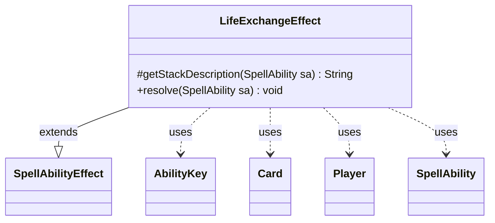

---
aliases:
  - LifeExchangeEffect
tags:
  - java/class
  - module/forge-game
  - pkg/forge/game/ability/effects
fqn: forge.game.ability.effects.LifeExchangeEffect
package: forge.game.ability.effects
module: forge-game
kind: Class
---

# LifeExchangeEffect

**Package:** `forge.game.ability.effects` &nbsp; **Module:** `forge-game` &nbsp; **Kind:** Class



## Relationships
**Extends:**
- [[forge.game.ability.SpellAbilityEffect|SpellAbilityEffect]]
**Uses:**
- [[forge.game.ability.AbilityKey|AbilityKey]]
- [[forge.game.card.Card|Card]]
- [[forge.game.player.Player|Player]]
- [[forge.game.spellability.SpellAbility|SpellAbility]]

## Design Description

LifeExchangeEffect is a concrete `SpellAbilityEffect` that resolves spells and abilities which swap the life totals of two players, plugging into Forge's ability-factory framework where each effect is a handler driven by a `SpellAbility`. It overrides `getStackDescription` to render the human-readable stack text and `resolve` to perform the exchange.

Rather than assigning totals outright, `resolve` equalizes the players by computing their life difference and moving it via `loseLife`/`gainLife`, gated on the `canLoseLife`/`canGainLife` checks so prevention and replacement effects still apply. It collaborates with `Card` as the host source, `Player` for the participants (the activating player plus targets), and `AbilityKey` to build trigger parameters, firing a `LifeLostAll` trigger and supporting optional `RememberOwnLoss` and `RememberDifference` parameters so dependent card logic can reference the amounts moved.

## Source
`forge-game/src/main/java/forge/game/ability/effects/LifeExchangeEffect.java`

```java
package forge.game.ability.effects;

import com.google.common.collect.Maps;
import forge.game.ability.AbilityKey;
import forge.game.ability.SpellAbilityEffect;
import forge.game.card.Card;
import forge.game.player.Player;
import forge.game.spellability.SpellAbility;
import forge.game.trigger.TriggerType;

import java.util.List;
import java.util.Map;

public class LifeExchangeEffect extends SpellAbilityEffect {

    /* (non-Javadoc)
     * @see forge.card.abilityfactory.AbilityFactoryAlterLife.SpellEffect#getStackDescription(java.util.Map, forge.card.spellability.SpellAbility)
     */
    @Override
    protected String getStackDescription(SpellAbility sa) {
        final StringBuilder sb = new StringBuilder();
        final Player activatingPlayer = sa.getActivatingPlayer();
        final List<Player> tgtPlayers = getTargetPlayers(sa);

        if (tgtPlayers.size() == 1) {
            sb.append(activatingPlayer).append(" exchanges life totals with ");
            sb.append(tgtPlayers.get(0));
        } else if (tgtPlayers.size() > 1) {
            sb.append(tgtPlayers.get(0)).append(" exchanges life totals with ");
            sb.append(tgtPlayers.get(1));
        }
        sb.append(".");
        return sb.toString();
    }

    /* (non-Javadoc)
     * @see forge.card.abilityfactory.AbilityFactoryAlterLife.SpellEffect#resolve(java.util.Map, forge.card.spellability.SpellAbility)
     */
    @Override
    public void resolve(SpellAbility sa) {
        final Card source = sa.getHostCard();
        Player p1;
        Player p2;

        final List<Player> tgtPlayers = getTargetPlayers(sa);

        if (tgtPlayers.size() == 1) {
            p1 = sa.getActivatingPlayer();
            p2 = tgtPlayers.get(0);
        } else {
            p1 = tgtPlayers.get(0);
            p2 = tgtPlayers.get(1);
        }

        final int life1 = p1.getLife();
        final int life2 = p2.getLife();
        final int diff = Math.abs(life1 - life2);

        if (life2 > life1) {
            // swap players
            Player tmp = p2;
            p2 = p1;
            p1 = tmp;
        }
        if (diff > 0 && p1.canLoseLife() && p2.canGainLife()) {
            final int lost = p1.loseLife(diff, false, false);
            p2.gainLife(diff, source, sa);
            if (lost > 0) {
                final Map<Player, Integer> lossMap = Maps.newHashMap();
                lossMap.put(p1, lost);
                final Map<AbilityKey, Object> runParams = AbilityKey.mapFromPIMap(lossMap);
                source.getGame().getTriggerHandler().runTrigger(TriggerType.LifeLostAll, runParams, false);
                if (sa.hasParam("RememberOwnLoss") && p1.equals(sa.getActivatingPlayer())) {
                    source.addRemembered(lost);
                }
            }
        }
        if (sa.hasParam("RememberDifference")) {
            source.addRemembered(p1.getLife() - p2.getLife());
        }
    }
}
```

## Python
`forge/game/ability/effects/LifeExchangeEffect.py`

```python
from forge.game.ability.AbilityKey import AbilityKey
from forge.game.ability.SpellAbilityEffect import SpellAbilityEffect
from forge.game.card.Card import Card
from forge.game.player.Player import Player
from forge.game.spellability.SpellAbility import SpellAbility
from forge.game.trigger.TriggerType import TriggerType


class LifeExchangeEffect(SpellAbilityEffect):

    # (non-Javadoc)
    # @see forge.card.abilityfactory.AbilityFactoryAlterLife.SpellEffect#getStackDescription(java.util.Map, forge.card.spellability.SpellAbility)
    def getStackDescription(self, sa: SpellAbility) -> str:
        sb = []
        activatingPlayer = sa.getActivatingPlayer()
        tgtPlayers = self.getTargetPlayers(sa)

        if len(tgtPlayers) == 1:
            sb.append(str(activatingPlayer))
            sb.append(" exchanges life totals with ")
            sb.append(str(tgtPlayers[0]))
        elif len(tgtPlayers) > 1:
            sb.append(str(tgtPlayers[0]))
            sb.append(" exchanges life totals with ")
            sb.append(str(tgtPlayers[1]))
        sb.append(".")
        return "".join(sb)

    # (non-Javadoc)
    # @see forge.card.abilityfactory.AbilityFactoryAlterLife.SpellEffect#resolve(java.util.Map, forge.card.spellability.SpellAbility)
    def resolve(self, sa: SpellAbility) -> None:
        source = sa.getHostCard()

        tgtPlayers = self.getTargetPlayers(sa)

        if len(tgtPlayers) == 1:
            p1 = sa.getActivatingPlayer()
            p2 = tgtPlayers[0]
        else:
            p1 = tgtPlayers[0]
            p2 = tgtPlayers[1]

        life1 = p1.getLife()
        life2 = p2.getLife()
        diff = abs(life1 - life2)

        if life2 > life1:
            # swap players
            tmp = p2
            p2 = p1
            p1 = tmp
        if diff > 0 and p1.canLoseLife() and p2.canGainLife():
            lost = p1.loseLife(diff, False, False)
            p2.gainLife(diff, source, sa)
            if lost > 0:
                lossMap = {}
                lossMap[p1] = lost
                runParams = AbilityKey.mapFromPIMap(lossMap)
                source.getGame().getTriggerHandler().runTrigger(TriggerType.LifeLostAll, runParams, False)
                if sa.hasParam("RememberOwnLoss") and p1 == sa.getActivatingPlayer():
                    source.addRemembered(lost)
        if sa.hasParam("RememberDifference"):
            source.addRemembered(p1.getLife() - p2.getLife())
```
