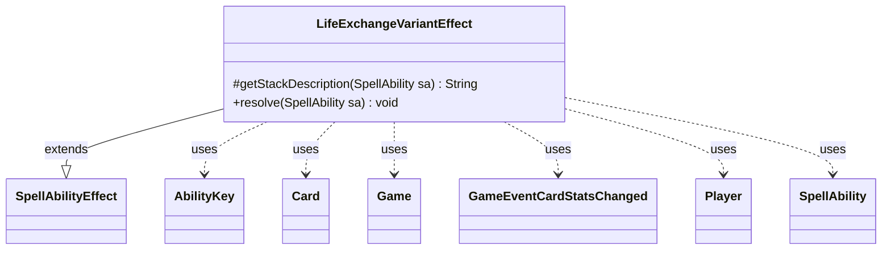

---
aliases:
  - LifeExchangeVariantEffect
tags:
  - java/class
  - module/forge-game
  - pkg/forge/game/ability/effects
fqn: forge.game.ability.effects.LifeExchangeVariantEffect
package: forge.game.ability.effects
module: forge-game
kind: Class
---

# LifeExchangeVariantEffect

**Package:** `forge.game.ability.effects`   **Module:** `forge-game`   **Kind:** Class



## Relationships
**Extends:**
- [[forge.game.ability.SpellAbilityEffect|SpellAbilityEffect]]
**Uses:**
- [[forge.game.Game|Game]]
- [[forge.game.ability.AbilityKey|AbilityKey]]
- [[forge.game.card.Card|Card]]
- [[forge.game.event.GameEventCardStatsChanged|GameEventCardStatsChanged]]
- [[forge.game.player.Player|Player]]
- [[forge.game.spellability.SpellAbility|SpellAbility]]

## Design Description

`LifeExchangeVariantEffect` is a concrete resolution effect implementing a variant life-exchange ability: instead of swapping two players' life totals, it exchanges a target player's life total with one of a source creature's stats—its power or toughness, chosen via the ability's `Mode` parameter. As a subclass of `SpellAbilityEffect`, it satisfies the framework contract by overriding `getStackDescription` for human-readable stack text and `resolve` to apply the state change.

In `resolve` it guards against an invalid host (the source must remain an in-play creature) and honors `canLoseLife`/`canGainLife` permissions before adjusting the player's life and reassigning the creature's power or toughness through a timestamped `addNewPT`. It mutates `Card`, `Player`, and `Game` state, notifies the UI via a fired `GameEventCardStatsChanged`, and, when life is actually lost, assembles an `AbilityKey` parameter map to fire `LifeLostAll` triggers—integrating cleanly with Forge's event and trigger systems.

## Source
`forge-game/src/main/java/forge/game/ability/effects/LifeExchangeVariantEffect.java`

```java
package forge.game.ability.effects;

import com.google.common.collect.Maps;
import forge.game.Game;
import forge.game.ability.AbilityKey;
import forge.game.ability.SpellAbilityEffect;
import forge.game.card.Card;
import forge.game.event.GameEventCardStatsChanged;
import forge.game.player.Player;
import forge.game.spellability.SpellAbility;
import forge.game.trigger.TriggerType;

import java.util.List;
import java.util.Map;

public class LifeExchangeVariantEffect extends SpellAbilityEffect {

    /* (non-Javadoc)
     * @see forge.card.abilityfactory.AbilityFactoryAlterLife.SpellEffect#getStackDescription(java.util.Map, forge.card.spellability.SpellAbility)
     */
    @Override
    protected String getStackDescription(SpellAbility sa) {
        final StringBuilder sb = new StringBuilder();
        final Player activatingPlayer = sa.getActivatingPlayer();
        final String mode = sa.getParam("Mode");

        sb.append(activatingPlayer).append(" exchanges life totals with ");
        sb.append(sa.getHostCard());
        sb.append("'s ");
        sb.append(mode.toLowerCase());

        return sb.toString();
    }

    /* (non-Javadoc)
     * @see forge.card.abilityfactory.AbilityFactoryAlterLife.SpellEffect#resolve(java.util.Map, forge.card.spellability.SpellAbility)
     */
    @Override
    public void resolve(SpellAbility sa) {
        final Card source = sa.getHostCard();
        final String mode = sa.getParam("Mode");
        final List<Player> tgtPlayers = getTargetPlayers(sa);

        if (tgtPlayers.isEmpty()) {
            return;
        }
        if (!source.isInPlay() || !source.isCreature()) {
            return;
        }

        Player p = tgtPlayers.get(0);
        Integer power = null;
        Integer toughness = null;
        final int pLife = p.getLife();
        int num;
        if ("Power".equals(mode)) {
            num = source.getNetPower();
            power = pLife;
        } else if ("Toughness".equals(mode)) {
            num = source.getNetToughness();
            toughness = pLife;
        } else {
            return;
        }

        if (pLife > num && !p.canLoseLife()) {
            return;
        }
        if (num > pLife && !p.canGainLife()) {
            return;
        }

        final Game game = p.getGame();
        final long timestamp = game.getNextTimestamp();
        int lost = 0;
        if (pLife > num) {
            lost = p.loseLife(pLife - num, false, false);
        } else if (num > pLife) {
            p.gainLife(num - pLife, source, sa);
        }
        source.addNewPT(power, toughness, timestamp, 0);
        game.fireEvent(new GameEventCardStatsChanged(source));
        if (lost > 0) { // Run triggers if player actually lost life
            final Map<Player, Integer> lossMap = Maps.newHashMap();
            lossMap.put(p, lost);
            final Map<AbilityKey, Object> runParams = AbilityKey.mapFromPIMap(lossMap);
            game.getTriggerHandler().runTrigger(TriggerType.LifeLostAll, runParams, false);
        }
    }
}
```

## Python
`forge/game/ability/effects/LifeExchangeVariantEffect.py`

```python
from forge.game.Game import Game
from forge.game.ability.AbilityKey import AbilityKey
from forge.game.ability.SpellAbilityEffect import SpellAbilityEffect
from forge.game.card.Card import Card
from forge.game.event.GameEventCardStatsChanged import GameEventCardStatsChanged
from forge.game.player.Player import Player
from forge.game.spellability.SpellAbility import SpellAbility
from forge.game.trigger.TriggerType import TriggerType


class LifeExchangeVariantEffect(SpellAbilityEffect):

    # (non-Javadoc)
    # @see forge.card.abilityfactory.AbilityFactoryAlterLife.SpellEffect#getStackDescription(java.util.Map, forge.card.spellability.SpellAbility)
    def getStackDescription(self, sa: SpellAbility) -> str:
        sb = []
        activatingPlayer = sa.getActivatingPlayer()
        mode = sa.getParam("Mode")

        sb.append(str(activatingPlayer))
        sb.append(" exchanges life totals with ")
        sb.append(str(sa.getHostCard()))
        sb.append("'s ")
        sb.append(mode.lower())

        return "".join(sb)

    # (non-Javadoc)
    # @see forge.card.abilityfactory.AbilityFactoryAlterLife.SpellEffect#resolve(java.util.Map, forge.card.spellability.SpellAbility)
    def resolve(self, sa: SpellAbility) -> None:
        source = sa.getHostCard()
        mode = sa.getParam("Mode")
        tgtPlayers = self.getTargetPlayers(sa)

        if not tgtPlayers:
            return
        if not source.isInPlay() or not source.isCreature():
            return

        p = tgtPlayers[0]
        power = None
        toughness = None
        pLife = p.getLife()
        if "Power" == mode:
            num = source.getNetPower()
            power = pLife
        elif "Toughness" == mode:
            num = source.getNetToughness()
            toughness = pLife
        else:
            return

        if pLife > num and not p.canLoseLife():
            return
        if num > pLife and not p.canGainLife():
            return

        game = p.getGame()
        timestamp = game.getNextTimestamp()
        lost = 0
        if pLife > num:
            lost = p.loseLife(pLife - num, False, False)
        elif num > pLife:
            p.gainLife(num - pLife, source, sa)
        source.addNewPT(power, toughness, timestamp, 0)
        game.fireEvent(GameEventCardStatsChanged(source))
        if lost > 0:  # Run triggers if player actually lost life
            lossMap = {}
            lossMap[p] = lost
            runParams = AbilityKey.mapFromPIMap(lossMap)
            game.getTriggerHandler().runTrigger(TriggerType.LifeLostAll, runParams, False)
```
