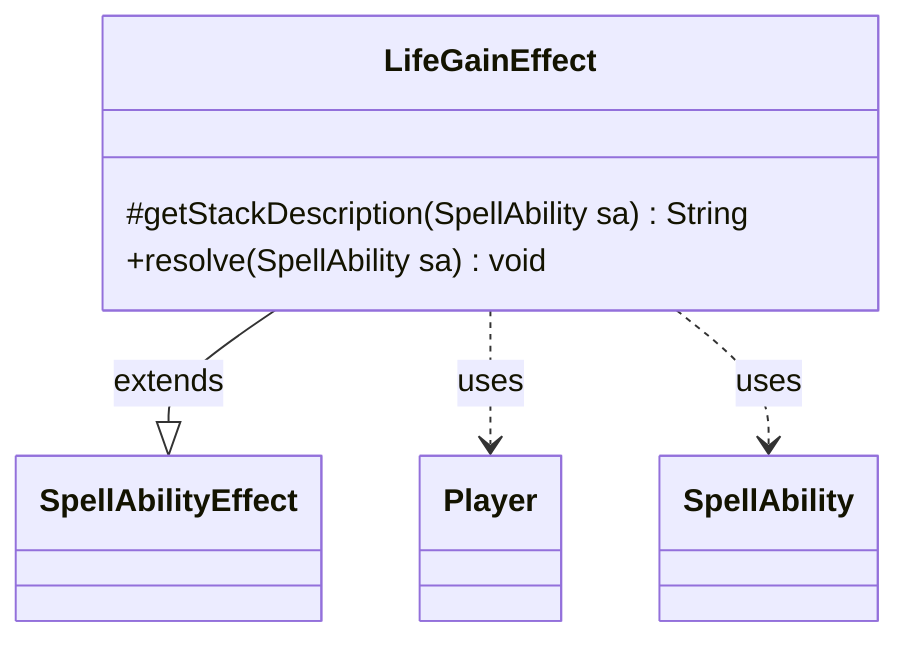

---
aliases:
  - LifeGainEffect
tags:
  - java/class
  - module/forge-game
  - pkg/forge/game/ability/effects
fqn: forge.game.ability.effects.LifeGainEffect
package: forge.game.ability.effects
module: forge-game
kind: Class
---

# LifeGainEffect

**Package:** `forge.game.ability.effects` &nbsp; **Module:** `forge-game` &nbsp; **Kind:** Class



## Relationships
**Extends:**
- [[forge.game.ability.SpellAbilityEffect|SpellAbilityEffect]]
**Uses:**
- [[forge.game.player.Player|Player]]
- [[forge.game.spellability.SpellAbility|SpellAbility]]

## Design Description

LifeGainEffect implements the resolution of "gain life" abilities within Forge's data-driven ability-effect framework. As a concrete subclass of `SpellAbilityEffect`, it overrides two hooks: `getStackDescription`, which assembles the human-readable stack text naming the affected players and the amount gained, and `resolve`, which applies the life change during execution. It reads its parameters (`LifeAmount`, `SpellDescription`) from the collaborating `SpellAbility` and the host card, and credits totals on each target `Player`.

The design reflects Forge's card-scripting approach: amounts are computed dynamically via `AbilityUtils.calculateAmount`, accommodating both literal numbers and derived quantities such as "life equal to the life lost this way." Notably, `resolve` collapses targets into a set to avoid resolving the same player repeatedly, yet scales each player's gain by their frequency in the original target list—correctly handling abilities that target one player multiple times—while skipping any player no longer in the game.

## Source
`forge-game/src/main/java/forge/game/ability/effects/LifeGainEffect.java`

```java
package forge.game.ability.effects;

import forge.game.ability.AbilityUtils;
import forge.game.ability.SpellAbilityEffect;
import forge.game.player.Player;
import forge.game.spellability.SpellAbility;
import forge.util.Lang;

import java.util.Collections;
import java.util.List;

import org.apache.commons.lang3.StringUtils;

import com.google.common.collect.Sets;

public class LifeGainEffect extends SpellAbilityEffect {

    /* (non-Javadoc)
     * @see forge.game.ability.SpellAbilityEffect#getStackDescription(forge.game.spellability.SpellAbility)
     */
    @Override
    protected String getStackDescription(SpellAbility sa) {
        final StringBuilder sb = new StringBuilder();
        final String amountStr = sa.getParam("LifeAmount");
        final String spellDesc = sa.getParam("SpellDescription");

        sb.append(Lang.joinHomogenous(getDefinedPlayersOrTargeted(sa)));
        if (sb.length() == 0 && spellDesc != null) {
            return spellDesc;
        } else {
            sb.append(getDefinedPlayersOrTargeted(sa).size() > 1 ? " gain " : " gains ");
            if (!StringUtils.isNumeric(amountStr) && spellDesc != null && spellDesc.contains("life equal to")) {
                sb.append(spellDesc.substring(spellDesc.indexOf("life equal to")));
            } else if (!amountStr.equals("AFLifeLost") || sa.hasSVar(amountStr)) {
                final int amount = AbilityUtils.calculateAmount(sa.getHostCard(), amountStr, sa);

                sb.append(amount).append(" life.");
            } else {
                sb.append("life equal to the life lost this way.");
            }
        }

        return sb.toString();
    }

    /* (non-Javadoc)
     * @see forge.game.ability.SpellAbilityEffect#resolve(forge.game.spellability.SpellAbility)
     */
    @Override
    public void resolve(SpellAbility sa) {
        final int lifeAmount = AbilityUtils.calculateAmount(sa.getHostCard(), sa.getParam("LifeAmount"), sa);
        final List<Player> tgts = getTargetPlayersWithDuplicates(true, "Defined", sa);

        for (final Player p : Sets.newHashSet(tgts)) {
            if (!p.isInGame()) {
                continue;
            }
            p.gainLife(lifeAmount * Collections.frequency(tgts, p), sa.getHostCard(), sa);
        }
    }

}
```
