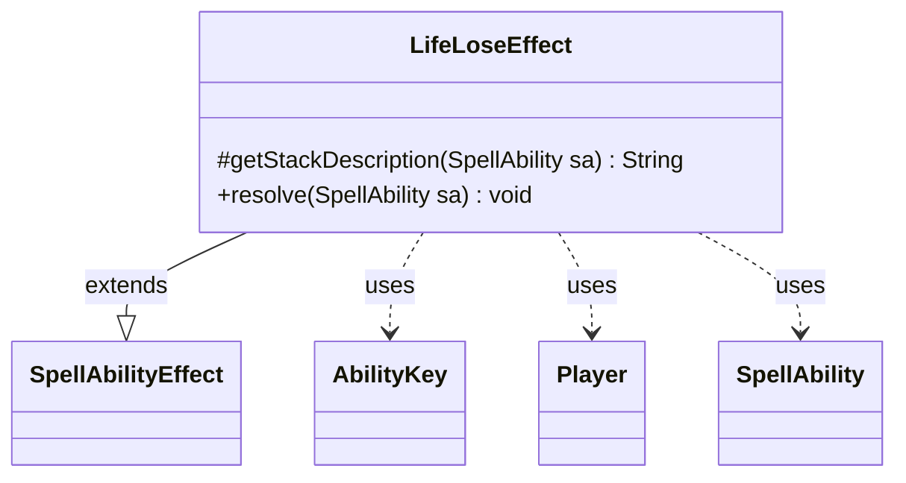

---
aliases:
  - LifeLoseEffect
tags:
  - java/class
  - module/forge-game
  - pkg/forge/game/ability/effects
fqn: forge.game.ability.effects.LifeLoseEffect
package: forge.game.ability.effects
module: forge-game
kind: Class
---

# LifeLoseEffect

**Package:** `forge.game.ability.effects`   **Module:** `forge-game`   **Kind:** Class



## Relationships
**Extends:**
- [[forge.game.ability.SpellAbilityEffect|SpellAbilityEffect]]
**Uses:**
- [[forge.game.ability.AbilityKey|AbilityKey]]
- [[forge.game.player.Player|Player]]
- [[forge.game.spellability.SpellAbility|SpellAbility]]

## Design Description

The description is already complete and well-written in the note. Here it is:

LifeLoseEffect implements the resolution logic for "lose life" spell abilities, extending SpellAbilityEffect to plug into Forge's ability-effect framework. Its `resolve` method calculates the life amount via AbilityUtils, then iterates the targeted Players, deducting life from each in-game player and accumulating per-player losses in a map; the protected `getStackDescription` override produces the human-readable stack text, pluralizing for multiple targets and handling variable "life equal to" amounts.

Notable design intent: results are recorded for downstream use—the total is stashed in the `AFLifeLost` SVar, and the per-player loss map is converted via AbilityKey into trigger parameters that fire a single LifeLostAll trigger, but only when life was actually lost. This collaboration with AbilityKey, Player, and SpellAbility keeps the effect stateless and data-driven, consistent with the engine's card-scripting model.

## Source
`forge-game/src/main/java/forge/game/ability/effects/LifeLoseEffect.java`

```java
package forge.game.ability.effects;

import com.google.common.collect.Maps;
import forge.game.ability.AbilityKey;
import forge.game.ability.AbilityUtils;
import forge.game.ability.SpellAbilityEffect;
import forge.game.player.Player;
import forge.game.spellability.SpellAbility;
import forge.game.trigger.TriggerType;
import forge.util.Lang;
import org.apache.commons.lang3.StringUtils;

import java.util.Map;

public class LifeLoseEffect extends SpellAbilityEffect {

    /* (non-Javadoc)
     * @see forge.game.ability.SpellAbilityEffect#getStackDescription(forge.game.spellability.SpellAbility)
     */
    @Override
    protected String getStackDescription(SpellAbility sa) {
        final StringBuilder sb = new StringBuilder();
        final String amountStr = sa.getParam("LifeAmount");
        final int amount = AbilityUtils.calculateAmount(sa.getHostCard(), amountStr, sa);
        final String spellDesc = sa.getParam("SpellDescription");

        int affected = getTargetPlayers(sa).size();
        sb.append(Lang.joinHomogenous(getTargetPlayers(sa)));

        sb.append(affected > 1 ? " each lose " : " loses ");
        if (!StringUtils.isNumeric(amountStr) && spellDesc != null && spellDesc.contains("life equal to")) {
            sb.append(spellDesc.substring(spellDesc.indexOf("life equal to")));
        } else {
            sb.append(amount).append(" life.");
        }

        return sb.toString();
    }

    /* (non-Javadoc)
     * @see forge.game.ability.SpellAbilityEffect#resolve(forge.game.spellability.SpellAbility)
     */
    @Override
    public void resolve(SpellAbility sa) {
        int lifeLost = 0;

        final int lifeAmount = AbilityUtils.calculateAmount(sa.getHostCard(), sa.getParam("LifeAmount"), sa);

        final Map<Player, Integer> lossMap = Maps.newHashMap();
        for (final Player p : getTargetPlayers(sa)) {
            if (!p.isInGame()) {
                continue;
            }
            final int lost = p.loseLife(lifeAmount, false, false);
            if (lost > 0) {
                lossMap.put(p, lost);
            }
            lifeLost += lost;
        }
        sa.setSVar("AFLifeLost", "Number$" + lifeLost);

        if (!lossMap.isEmpty()) { // Run triggers if any player actually lost life
            final Map<AbilityKey, Object> runParams = AbilityKey.mapFromPIMap(lossMap);
            sa.getHostCard().getGame().getTriggerHandler().runTrigger(TriggerType.LifeLostAll, runParams, false);
        }
    }

}
```

## Python
`forge/game/ability/effects/LifeLoseEffect.py`

```python
from forge.game.ability.AbilityKey import AbilityKey
from forge.game.ability.AbilityUtils import AbilityUtils
from forge.game.ability.SpellAbilityEffect import SpellAbilityEffect
from forge.game.player.Player import Player
from forge.game.spellability.SpellAbility import SpellAbility
from forge.game.trigger.TriggerType import TriggerType
from forge.util.Lang import Lang


class LifeLoseEffect(SpellAbilityEffect):

    # (non-Javadoc)
    # @see forge.game.ability.SpellAbilityEffect#getStackDescription(forge.game.spellability.SpellAbility)
    def getStackDescription(self, sa: SpellAbility) -> str:
        sb = []
        amountStr = sa.getParam("LifeAmount")
        amount = AbilityUtils.calculateAmount(sa.getHostCard(), amountStr, sa)
        spellDesc = sa.getParam("SpellDescription")

        affected = len(self.getTargetPlayers(sa))
        sb.append(Lang.joinHomogenous(self.getTargetPlayers(sa)))

        sb.append(" each lose " if affected > 1 else " loses ")
        if (not (amountStr is not None and amountStr.isdigit())) and spellDesc is not None and "life equal to" in spellDesc:
            sb.append(spellDesc[spellDesc.index("life equal to"):])
        else:
            sb.append(str(amount))
            sb.append(" life.")

        return "".join(sb)

    # (non-Javadoc)
    # @see forge.game.ability.SpellAbilityEffect#resolve(forge.game.spellability.SpellAbility)
    def resolve(self, sa: SpellAbility) -> None:
        lifeLost = 0

        lifeAmount = AbilityUtils.calculateAmount(sa.getHostCard(), sa.getParam("LifeAmount"), sa)

        lossMap: dict[Player, int] = {}
        for p in self.getTargetPlayers(sa):
            if not p.isInGame():
                continue
            lost = p.loseLife(lifeAmount, False, False)
            if lost > 0:
                lossMap[p] = lost
            lifeLost += lost
        sa.setSVar("AFLifeLost", "Number$" + str(lifeLost))

        if lossMap:  # Run triggers if any player actually lost life
            runParams = AbilityKey.mapFromPIMap(lossMap)
            sa.getHostCard().getGame().getTriggerHandler().runTrigger(TriggerType.LifeLostAll, runParams, False)
```
