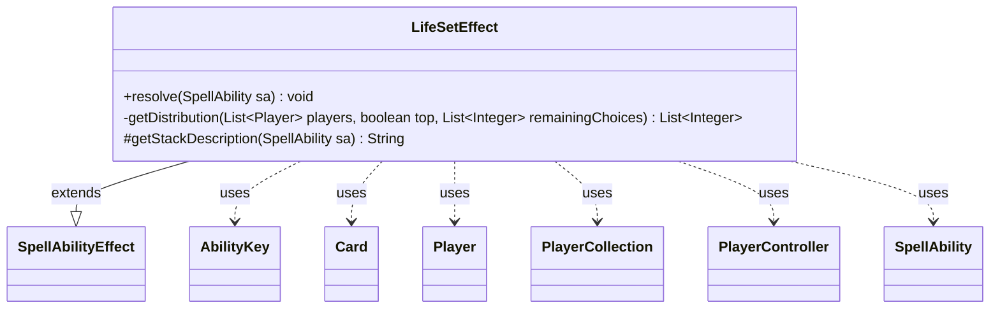

---
aliases:
  - LifeSetEffect
tags:
  - java/class
  - module/forge-game
  - pkg/forge/game/ability/effects
fqn: forge.game.ability.effects.LifeSetEffect
package: forge.game.ability.effects
module: forge-game
kind: Class
---

# LifeSetEffect

**Package:** `forge.game.ability.effects` &nbsp; **Module:** `forge-game` &nbsp; **Kind:** Class



## Relationships
**Extends:**
- [[forge.game.ability.SpellAbilityEffect|SpellAbilityEffect]]
**Uses:**
- [[forge.game.ability.AbilityKey|AbilityKey]]
- [[forge.game.card.Card|Card]]
- [[forge.game.player.Player|Player]]
- [[forge.game.player.PlayerCollection|PlayerCollection]]
- [[forge.game.player.PlayerController|PlayerController]]
- [[forge.game.spellability.SpellAbility|SpellAbility]]

## Design Description

LifeSetEffect is a concrete `SpellAbilityEffect` that resolves abilities which set players' life totals, reading its behavior data-driven from the resolving `SpellAbility`. Targets come either from a controller-driven choice (`PlayerChoices`/`ChoiceAmount`, via `PlayerController.chooseEntitiesForEffect`) or the ability's defined targets, after which each in-game `Player` has the computed `LifeAmount` applied.

A `Redistribute` mode reassigns the players' existing life totals among them; the recursive `getDistribution` helper enforces MTG rules 119.7/8 by pruning totals a player cannot legally gain or lose life into, so only achievable distributions are offered. Per-player life loss is accumulated into a `lossMap` and, if nonzero, fires the `LifeLostAll` trigger through `AbilityKey` and the game's trigger handler. The overridden `getStackDescription` supplies human-readable stack text, integrating the effect with Forge's stack and trigger framework.

## Source
`forge-game/src/main/java/forge/game/ability/effects/LifeSetEffect.java`

```java
package forge.game.ability.effects;

import com.google.common.collect.Lists;
import com.google.common.collect.Maps;
import forge.game.ability.AbilityKey;
import forge.game.ability.AbilityUtils;
import forge.game.ability.SpellAbilityEffect;
import forge.game.card.Card;
import forge.game.player.Player;
import forge.game.player.PlayerCollection;
import forge.game.player.PlayerController;
import forge.game.spellability.SpellAbility;
import forge.game.trigger.TriggerType;
import forge.util.Lang;
import forge.util.Localizer;

import java.util.ArrayList;
import java.util.List;
import java.util.Map;

public class LifeSetEffect extends SpellAbilityEffect {

    /* (non-Javadoc)
     * @see forge.card.abilityfactory.AbilityFactoryAlterLife.SpellEffect#resolve(java.util.Map, forge.card.spellability.SpellAbility)
     */
    @Override
    public void resolve(SpellAbility sa) {
        final Card source = sa.getHostCard();
        final boolean redistribute = sa.hasParam("Redistribute");
        final int lifeAmount = redistribute ? 0 : AbilityUtils.calculateAmount(source, sa.getParam("LifeAmount"), sa);
        final List<Integer> lifetotals = new ArrayList<>();
        final PlayerController pc = sa.getActivatingPlayer().getController();

        PlayerCollection players = new PlayerCollection();
        if (sa.hasParam("PlayerChoices")) {
            PlayerCollection choices = AbilityUtils.getDefinedPlayers(source, sa.getParam("PlayerChoices"), sa);
            int n = 1;
            int min = 1;
            if (sa.hasParam("ChoiceAmount")) {
                if (sa.getParam("ChoiceAmount").equals("Any")) {
                    n = choices.size();
                    min = 0;
                } else {
                    n = AbilityUtils.calculateAmount(source, sa.getParam("ChoiceAmount"), sa);
                    min = n;
                }
            }
            final String prompt = sa.hasParam("ChoicePrompt") ? sa.getParam("ChoicePrompt") :
                    Localizer.getInstance().getMessage("lblChoosePlayer");
            List<Player> chosen = pc.chooseEntitiesForEffect(choices, min, n, null, sa, prompt, null,
                    null);
            players.addAll(chosen);
        } else {
            players = getTargetPlayers(sa);
        }

        if (players.isEmpty()) {
            return;
        }

        if (redistribute) {
            for (final Player p : players) {
                if (!p.isInGame()) {
                    continue;
                }
                lifetotals.add(p.getLife());
            }
        }

        final Map<Player, Integer> lossMap = Maps.newHashMap();
        for (final Player p : players.threadSafeIterable()) {
            if (!p.isInGame()) {
                continue;
            }
            final int preLife = p.getLife();
            if (!redistribute) {
                p.setLife(lifeAmount, sa);
            } else {
                List<Integer> validChoices = getDistribution(players, true, lifetotals);
                int life = pc.chooseNumber(sa, Localizer.getInstance().getMessage("lblLifeTotal") + ": " + p, validChoices, p);
                p.setLife(life, sa);
                lifetotals.remove((Integer) life);
                players.remove(p);
            }
            final int diff = preLife - p.getLife();
            if (diff > 0) {
                lossMap.put(p, diff);
            }
        }
        if (!lossMap.isEmpty()) { // Run triggers if any player actually lost life
            final Map<AbilityKey, Object> runParams = AbilityKey.mapFromPIMap(lossMap);
            source.getGame().getTriggerHandler().runTrigger(TriggerType.LifeLostAll, runParams, false);
        }
    }

    private static List<Integer> getDistribution(List<Player> players, boolean top, List<Integer> remainingChoices) {
        // distribution was successful
        if (players.isEmpty()) {
            // carry signal back
            remainingChoices.add(1);
            return remainingChoices;
        }
        List<Integer> validChoices = Lists.newArrayList(remainingChoices);
        for (Player p : players) {
            for (Integer choice : remainingChoices) {
                // 119.7/8 illegal choice
                if ((p.getLife() < choice && !p.canGainLife()) || (p.getLife() > choice && !p.canLoseLife())) {
                    if (top) {
                        validChoices.remove(choice);
                    }
                    continue;
                }

                // combination is valid, check next
                PlayerCollection nextPlayers = new PlayerCollection(players);
                nextPlayers.remove(p);
                List<Integer> nextChoices = Lists.newArrayList(remainingChoices);
                nextChoices.remove(choice);
                nextChoices = getDistribution(nextPlayers, false, nextChoices);
                if (nextChoices.isEmpty()) {
                    if (top) {
                        // top of recursion stack
                        validChoices.remove(choice);
                    }
                } else if (!top) {
                    return nextChoices;
                }
            }
            if (top) {
                // checking first player is enough
                return validChoices;
            }
        }
        return Lists.newArrayList();
    }

    /* (non-Javadoc)
     * @see forge.card.abilityfactory.AbilityFactoryAlterLife.SpellEffect#getStackDescription(java.util.Map, forge.card.spellability.SpellAbility)
     */
    @Override
    protected String getStackDescription(SpellAbility sa) {
        if (sa.hasParam("Redistribute")) {
            if (sa.hasParam("SpellDescription")) {
                return sa.getParam("SpellDescription");
            } else {
                return ("Please add StackDescription or SpellDescription for Redistribute in LifeSetEffect.");
            }
        }
        final StringBuilder sb = new StringBuilder();
        final int amount = AbilityUtils.calculateAmount(sa.getHostCard(), sa.getParam("LifeAmount"), sa);

        sb.append(Lang.joinHomogenous(getTargetPlayers(sa)));
        sb.append(" life total becomes ").append(amount).append(".");
        return sb.toString();
    }

}
```

## Python
`forge/game/ability/effects/LifeSetEffect.py`

```python
from forge.game.ability.AbilityKey import AbilityKey
from forge.game.ability.AbilityUtils import AbilityUtils
from forge.game.ability.SpellAbilityEffect import SpellAbilityEffect
from forge.game.card.Card import Card
from forge.game.player.Player import Player
from forge.game.player.PlayerCollection import PlayerCollection
from forge.game.player.PlayerController import PlayerController
from forge.game.spellability.SpellAbility import SpellAbility
from forge.game.trigger.TriggerType import TriggerType
from forge.util.Lang import Lang
from forge.util.Localizer import Localizer


class LifeSetEffect(SpellAbilityEffect):

    # (non-Javadoc)
    # @see forge.card.abilityfactory.AbilityFactoryAlterLife.SpellEffect#resolve(java.util.Map, forge.card.spellability.SpellAbility)
    def resolve(self, sa: SpellAbility) -> None:
        source = sa.getHostCard()
        redistribute = sa.hasParam("Redistribute")
        lifeAmount = 0 if redistribute else AbilityUtils.calculateAmount(source, sa.getParam("LifeAmount"), sa)
        lifetotals: list[int] = []
        pc = sa.getActivatingPlayer().getController()

        players = PlayerCollection()
        if sa.hasParam("PlayerChoices"):
            choices = AbilityUtils.getDefinedPlayers(source, sa.getParam("PlayerChoices"), sa)
            n = 1
            min = 1
            if sa.hasParam("ChoiceAmount"):
                if sa.getParam("ChoiceAmount") == "Any":
                    n = choices.size()
                    min = 0
                else:
                    n = AbilityUtils.calculateAmount(source, sa.getParam("ChoiceAmount"), sa)
                    min = n
            prompt = sa.getParam("ChoicePrompt") if sa.hasParam("ChoicePrompt") else \
                Localizer.getInstance().getMessage("lblChoosePlayer")
            chosen = pc.chooseEntitiesForEffect(choices, min, n, None, sa, prompt, None,
                    None)
            players.addAll(chosen)
        else:
            players = self.getTargetPlayers(sa)

        if players.isEmpty():
            return

        if redistribute:
            for p in players:
                if not p.isInGame():
                    continue
                lifetotals.append(p.getLife())

        lossMap: dict[Player, int] = {}
        for p in players.threadSafeIterable():
            if not p.isInGame():
                continue
            preLife = p.getLife()
            if not redistribute:
                p.setLife(lifeAmount, sa)
            else:
                validChoices = self.getDistribution(players, True, lifetotals)
                life = pc.chooseNumber(sa, Localizer.getInstance().getMessage("lblLifeTotal") + ": " + str(p), validChoices, p)
                p.setLife(life, sa)
                lifetotals.remove(life)
                players.remove(p)
            diff = preLife - p.getLife()
            if diff > 0:
                lossMap[p] = diff
        if lossMap:  # Run triggers if any player actually lost life
            runParams = AbilityKey.mapFromPIMap(lossMap)
            source.getGame().getTriggerHandler().runTrigger(TriggerType.LifeLostAll, runParams, False)

    @staticmethod
    def getDistribution(players: list[Player], top: bool, remainingChoices: list[int]) -> list[int]:
        # distribution was successful
        if not players:
            # carry signal back
            remainingChoices.append(1)
            return remainingChoices
        validChoices = list(remainingChoices)
        for p in players:
            for choice in remainingChoices:
                # 119.7/8 illegal choice
                if (p.getLife() < choice and not p.canGainLife()) or (p.getLife() > choice and not p.canLoseLife()):
                    if top:
                        validChoices.remove(choice)
                    continue

                # combination is valid, check next
                nextPlayers = PlayerCollection(players)
                nextPlayers.remove(p)
                nextChoices = list(remainingChoices)
                nextChoices.remove(choice)
                nextChoices = LifeSetEffect.getDistribution(nextPlayers, False, nextChoices)
                if not nextChoices:
                    if top:
                        # top of recursion stack
                        validChoices.remove(choice)
                elif not top:
                    return nextChoices
            if top:
                # checking first player is enough
                return validChoices
        return []

    # (non-Javadoc)
    # @see forge.card.abilityfactory.AbilityFactoryAlterLife.SpellEffect#getStackDescription(java.util.Map, forge.card.spellability.SpellAbility)
    def getStackDescription(self, sa: SpellAbility) -> str:
        if sa.hasParam("Redistribute"):
            if sa.hasParam("SpellDescription"):
                return sa.getParam("SpellDescription")
            else:
                return "Please add StackDescription or SpellDescription for Redistribute in LifeSetEffect."
        sb = []
        amount = AbilityUtils.calculateAmount(sa.getHostCard(), sa.getParam("LifeAmount"), sa)

        sb.append(Lang.joinHomogenous(self.getTargetPlayers(sa)))
        sb.append(" life total becomes ")
        sb.append(str(amount))
        sb.append(".")
        return "".join(sb)
```
