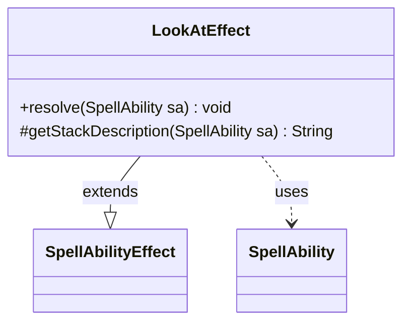

---
aliases:
  - LookAtEffect
tags:
  - java/class
  - module/forge-game
  - pkg/forge/game/ability/effects
fqn: forge.game.ability.effects.LookAtEffect
package: forge.game.ability.effects
module: forge-game
kind: Class
---

# LookAtEffect

**Package:** `forge.game.ability.effects` &nbsp; **Module:** `forge-game` &nbsp; **Kind:** Class



## Relationships
**Extends:**
- [[forge.game.ability.SpellAbilityEffect|SpellAbilityEffect]]
**Uses:**
- [[forge.game.spellability.SpellAbility|SpellAbility]]

## Design Description

`LookAtEffect` is a concrete spell-ability effect that realizes Magic's "look at" action, letting a player privately view one or more target cards. It extends `SpellAbilityEffect`, overriding `resolve` to perform the reveal and `getStackDescription` to produce a readable stack entry, conforming to Forge's framework where each card behavior is an independent `SpellAbilityEffect` subclass invoked at resolution time. The class collaborates with `SpellAbility`, drawing the host card, game, activating player, and target cards from it, then delegating to the game action layer's `revealTo` so the cards are shown only to the activating player. Holding no fields of its own, it derives all context from the passed-in `SpellAbility`, reflecting a deliberately stateless, reusable effect-handler design.

## Source
`forge-game/src/main/java/forge/game/ability/effects/LookAtEffect.java`

```java
package forge.game.ability.effects;

import forge.game.ability.SpellAbilityEffect;
import forge.game.spellability.SpellAbility;
import forge.util.Lang;

public class LookAtEffect extends SpellAbilityEffect {

    @Override
    public void resolve(final SpellAbility sa) {
        sa.getHostCard().getGame().getAction().revealTo(getTargetCards(sa), sa.getActivatingPlayer());
    }

    @Override
    protected String getStackDescription(final SpellAbility sa) {
        final StringBuilder sb = new StringBuilder();
        sb.append(sa.getActivatingPlayer());
        sb.append(" looks at ");
        sb.append(Lang.joinHomogenous(getTargetCards(sa)));
        sb.append('.');
        return sb.toString();
    }

}
```
