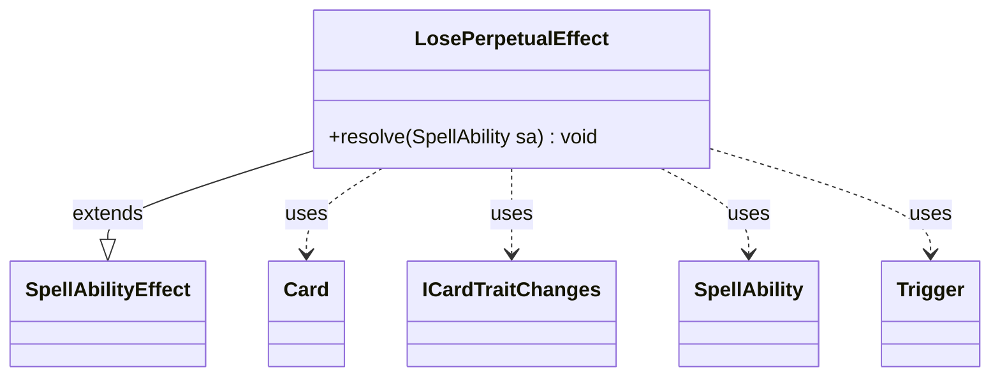

---
aliases:
  - LosePerpetualEffect
tags:
  - java/class
  - module/forge-game
  - pkg/forge/game/ability/effects
fqn: forge.game.ability.effects.LosePerpetualEffect
package: forge.game.ability.effects
module: forge-game
kind: Class
---

# LosePerpetualEffect

**Package:** `forge.game.ability.effects` &nbsp; **Module:** `forge-game` &nbsp; **Kind:** Class



## Relationships
**Extends:**
- [[forge.game.ability.SpellAbilityEffect|SpellAbilityEffect]]
**Uses:**
- [[forge.game.card.Card|Card]]
- [[forge.game.card.ICardTraitChanges|ICardTraitChanges]]
- [[forge.game.spellability.SpellAbility|SpellAbility]]
- [[forge.game.trigger.Trigger|Trigger]]

## Design Description

LosePerpetualEffect is a concrete `SpellAbilityEffect` whose sole responsibility is to undo a previously applied "perpetual" trait change on its host card. Its overridden `resolve(SpellAbility)` reads the originating `Trigger` from the ability, scans the host `Card`'s changed-traits table, and matches each `ICardTraitChanges` entry against that trigger; on a hit it removes the timestamped entry and calls `removePerpetual` to clear it for good.

As a leaf in the ability-effect hierarchy, it relies on `SpellAbility` for context (host card and trigger), mutates state through `Card`, and uses the trait and `Trigger` types purely for identification. The design is deliberately narrow: it keys removal on a fixed `0` secondary timestamp and guards on a non-null trigger, with an inline comment flagging that broader, non-trigger-driven removal is an intended future extension.

## Source
`forge-game/src/main/java/forge/game/ability/effects/LosePerpetualEffect.java`

```java
package forge.game.ability.effects;

import com.google.common.collect.Lists;
import com.google.common.collect.Table.Cell;

import forge.game.ability.SpellAbilityEffect;
import forge.game.card.Card;
import forge.game.card.ICardTraitChanges;
import forge.game.spellability.SpellAbility;
import forge.game.trigger.Trigger;

public class LosePerpetualEffect extends SpellAbilityEffect {

    @Override
    public void resolve(SpellAbility sa) {
        final Card host = sa.getHostCard();
        long toRemove = (long) 0;
        // currently only part of perpetual triggers... expand in future as needed
        if (sa.getTrigger() != null) {
            Trigger trig = sa.getTrigger();
            for (Cell<Long, Long, ICardTraitChanges> cell : host.getChangedCardTraits().cellSet()) {
                if (cell.getValue().applyTrigger(Lists.newArrayList()).contains(trig)) {
                    toRemove = cell.getRowKey();
                    break;
                }
            }
            if (toRemove != (long) 0) {
                host.getChangedCardTraits().remove(toRemove, (long) 0);
                host.removePerpetual(toRemove);
            }       
        }
    }
}
```

## Python
`forge/game/ability/effects/LosePerpetualEffect.py`

```python
from forge.game.ability.SpellAbilityEffect import SpellAbilityEffect
from forge.game.card.Card import Card
from forge.game.card.ICardTraitChanges import ICardTraitChanges
from forge.game.spellability.SpellAbility import SpellAbility
from forge.game.trigger.Trigger import Trigger


class LosePerpetualEffect(SpellAbilityEffect):

    def resolve(self, sa: SpellAbility) -> None:
        host = sa.getHostCard()
        toRemove = 0
        # currently only part of perpetual triggers... expand in future as needed
        if sa.getTrigger() is not None:
            trig = sa.getTrigger()
            for cell in host.getChangedCardTraits().cellSet():
                if trig in cell.getValue().applyTrigger([]):
                    toRemove = cell.getRowKey()
                    break
            if toRemove != 0:
                host.getChangedCardTraits().remove(toRemove, 0)
                host.removePerpetual(toRemove)
```
