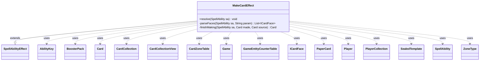

---
aliases:
  - MakeCardEffect
tags:
  - java/class
  - module/forge-game
  - pkg/forge/game/ability/effects
fqn: forge.game.ability.effects.MakeCardEffect
package: forge.game.ability.effects
module: forge-game
kind: Class
---

# MakeCardEffect

**Package:** `forge.game.ability.effects`   **Module:** `forge-game`   **Kind:** Class



## Relationships
**Extends:**
- [[forge.game.ability.SpellAbilityEffect|SpellAbilityEffect]]
**Uses:**
- [[forge.card.ICardFace|ICardFace]]
- [[forge.game.Game|Game]]
- [[forge.game.GameEntityCounterTable|GameEntityCounterTable]]
- [[forge.game.ability.AbilityKey|AbilityKey]]
- [[forge.game.card.Card|Card]]
- [[forge.game.card.CardCollection|CardCollection]]
- [[forge.game.card.CardCollectionView|CardCollectionView]]
- [[forge.game.card.CardZoneTable|CardZoneTable]]
- [[forge.game.player.Player|Player]]
- [[forge.game.player.PlayerCollection|PlayerCollection]]
- [[forge.game.spellability.SpellAbility|SpellAbility]]
- [[forge.game.zone.ZoneType|ZoneType]]
- [[forge.item.BoosterPack|BoosterPack]]
- [[forge.item.PaperCard|PaperCard]]
- [[forge.item.SealedTemplate|SealedTemplate]]

## Design Description

MakeCardEffect is a concrete resolution handler for the "MakeCard" spell-ability keyword, extending `SpellAbilityEffect` and overriding `resolve` to do its work. For each defined `Player` it determines which cards to create—from explicit names, a defined `CardCollection`, a spellbook or choice list, or a randomly drawn `BoosterPack`—then instantiates real `Card` objects from `PaperCard` data, moves them into the configured `ZoneType`, and optionally taps, attaches, counters, reveals, or remembers them.

The class is entirely parameter-driven, reflecting its role as a flexible engine effect configured through `SpellAbility` parameters rather than subclassing. It routes simultaneous zone changes through `CardZoneTable` and counters through `GameEntityCounterTable` so triggers fire correctly, and fires a `ConjureAll` trigger when conjuring. Private helpers `parseFaces` and `finishMaking` isolate face lookup and post-creation bookkeeping from the main resolution loop.

## Source
`forge-game/src/main/java/forge/game/ability/effects/MakeCardEffect.java`

```java
package forge.game.ability.effects;

import com.google.common.collect.Iterables;
import com.google.common.collect.Lists;
import forge.StaticData;
import forge.card.CardEdition;
import forge.card.ICardFace;
import forge.game.Game;
import forge.game.GameEntityCounterTable;
import forge.game.ability.AbilityKey;
import forge.game.ability.AbilityUtils;
import forge.game.ability.SpellAbilityEffect;
import forge.game.card.*;
import forge.game.player.Player;
import forge.game.player.PlayerCollection;
import forge.game.spellability.SpellAbility;
import forge.game.trigger.TriggerType;
import forge.game.zone.ZoneType;
import forge.item.*;
import forge.util.*;

import java.util.ArrayList;
import java.util.Arrays;
import java.util.List;
import java.util.Map;

public class MakeCardEffect extends SpellAbilityEffect {
    @Override
    public void resolve(SpellAbility sa) {
        Map<AbilityKey, Object> moveParams = AbilityKey.newMap();
        moveParams.put(AbilityKey.LastStateBattlefield, sa.getLastStateBattlefield());
        moveParams.put(AbilityKey.LastStateGraveyard, sa.getLastStateGraveyard());
        final Card source = sa.getHostCard();
        final PlayerCollection players = AbilityUtils.getDefinedPlayers(source, sa.getParam("Defined"), sa);

        for (final Player player : players) {
            final Game game = player.getGame();

            List<ICardFace> faces = new ArrayList<>();
            List<PaperCard> pack = null;
            List<String> names = Lists.newArrayList();

            final String desc = sa.getParamOrDefault("OptionPrompt", "");
            if (sa.hasParam("Optional") && sa.hasParam("OptionPrompt") && //for now, OptionPrompt is needed
                    !player.getController().confirmAction(sa, null, Localizer.getInstance().getMessage(desc), null)) {
            		return;
            }
            if (sa.hasParam("Name")) {
                final String n = sa.getParam("Name");
                if (n.equals("ChosenName")) {
                    if (source.hasNamedCard()) {
                        names.addAll(source.getNamedCards());
                    } else {
                        System.err.println("Malformed MakeCard entry! - " + source);
                    }
                } else {
                    names.add(n);
                }
            } else if (sa.hasParam("Names")) {
                List<String> nameList = Arrays.asList(sa.getParam("Names").split(","));
                for (String s : nameList) {
                    // Cardnames that include "," must use ";" instead here
                    s = s.replace(";", ",");
                    names.add(s);
                }
            } else if (sa.hasParam("DefinedName")) {
                final String def = sa.getParam("DefinedName");
                CardCollection cards = new CardCollection();
                if (def.equals("ChosenMap")) {
                    cards = source.getChosenMap().get(player);
                } else {
                    cards = AbilityUtils.getDefinedCards(source, def, sa);
                }
                for (final Card c : cards) {
                    //get the original papercard name
                    names.add(c.getPaperCard().getName());
                }
            } else if (sa.hasParam("Spellbook")) {
                faces.addAll(parseFaces(sa, "Spellbook"));
            } else if (sa.hasParam("Choices")) {
                faces.addAll(parseFaces(sa, "Choices"));
            } else if (sa.hasParam("Booster")) {
                SealedTemplate booster = Aggregates.random(StaticData.instance().getBoosters());
                pack = new BoosterPack(booster.getEdition(), booster).getCards();
                for (PaperCard pc : pack) {
                    ICardFace face = pc.getRules().getMainPart();
                    if (face != null)
                        faces.add(face);
                    else
                        throw new RuntimeException("MakeCardEffect didn't find card face by name: " + pc);
                }
            }

            if (!faces.isEmpty()) {
                if (sa.hasParam("Filter")) {
                    List<ICardFace> filtered = new ArrayList<>();
                    for (ICardFace face : faces) {
                        PaperCard pc = StaticData.instance().getCommonCards().getUniqueByName(face.getName());
                        if (Card.fromPaperCard(pc, player).isValid(sa.getParam("Filter"), player, source, sa)) filtered.add(face);
                    }
                    faces = filtered;
                    if (faces.isEmpty()) continue;
                }
                int i = sa.hasParam("SpellbookAmount") ?
                        AbilityUtils.calculateAmount(source, sa.getParam("SpellbookAmount"), sa) : 1;
                while (i > 0) {
                    String chosen;
                    if (sa.hasParam("AtRandom")) {
                        chosen = Aggregates.random(faces).getName();
                    } else {
                        final String sbName = sa.hasParam("SpellbookName") ? sa.getParam("SpellbookName") :
                                source.getTranslatedName();
                        final String message = sa.hasParam("Choices") ? 
                            Localizer.getInstance().getMessage("lblChooseaCard") :
                            Localizer.getInstance().getMessage("lblChooseFromSpellbook", sbName);
                        chosen = player.getController().chooseCardName(sa, faces, message);
                    }
                    names.add(chosen);
                    faces.remove(StaticData.instance().getCommonCards().getFaceByName(chosen));
                    i--;
                }
            }

            final boolean attach = sa.hasParam("AttachedTo");
            final ZoneType zone = attach ? ZoneType.Battlefield : 
                ZoneType.smartValueOf(sa.getParamOrDefault("Zone", "Library"));
            if (zone == null) return;

            final int amount = sa.hasParam("Amount") ?
                    AbilityUtils.calculateAmount(source, sa.getParam("Amount"), sa) : 1;

            CardCollection cards = new CardCollection();
            final CardZoneTable triggerList = CardZoneTable.getSimultaneousInstance(sa);
            final GameEntityCounterTable counterTable = new GameEntityCounterTable();
            final CardCollectionView lastStateBattlefield = triggerList.getLastStateBattlefield();
            CardCollection attachList = new CardCollection();

            if (attach) {
                attachList = AbilityUtils.getDefinedCards(source, sa.getParam("AttachedTo"), sa);
                if (attachList.isEmpty()) {
                    attachList = CardLists.getValidCards(lastStateBattlefield, 
                        sa.getParam("AttachedTo"), source.getController(), source, sa);
                }
                if (attachList.isEmpty()) return; // nothing to attach to
            }

            for (final String name : names) {
                int toMake = amount;
                if (!name.isEmpty()) {
                    while (toMake > 0) {
                        PaperCard pc;
                        if (pack != null) {
                            pc = Iterables.getLast(IterableUtil.filter(pack, PaperCardPredicates.name(name)));
                        } else {
                            // Try to get the card in the sa host's current edition
                            String editionCode = sa.getHostCard() != null ? sa.getHostCard().getSetCode() : CardEdition.UNKNOWN_CODE;
                            pc = StaticData.instance().getCommonCards().getCard(name, editionCode);
                        }
                        Card card = Card.fromPaperCard(pc, player);

                        if (sa.hasParam("TokenCard")) {
                            card.setTokenCard(true);
                        }
                        game.getAction().moveTo(ZoneType.None, card, sa, moveParams);
                        cards.add(card);
                        toMake--;
                        if (sa.hasParam("Tapped")) {
                            card.setTapped(true);
                        }
                    }
                }
            }

            CardCollection madeCards = new CardCollection();
            final boolean wCounter = sa.hasParam("WithCounter");
            final boolean battlefield = zone.equals(ZoneType.Battlefield);

            for (final Card c : cards) {
                if (wCounter && battlefield) {
                    int numCtr = AbilityUtils.calculateAmount(source, sa.getParamOrDefault("WithCounterNum", "1"), sa);
                    GameEntityCounterTable table = new GameEntityCounterTable();
                    table.put(player, c, CounterType.getType(sa.getParam("WithCounter")), numCtr);
                    moveParams.put(AbilityKey.CounterTable, table);
                }        
                if (attach) {
                    for (Card a : attachList) {
                        Card cc;
                        if (c.getZone().getZoneType().equals(ZoneType.None)) cc = c;
                        else { // make another copy
                            PaperCard next = StaticData.instance().getCommonCards().getCard(c.getName(), c.getSetCode());
                            cc = Card.fromPaperCard(next, player);
                            game.getAction().moveTo(ZoneType.None, cc, sa, moveParams);
                        }
                        cc.attachToEntity(game.getCardState(a), sa, true);
                        game.getAction().moveTo(zone, cc, sa, moveParams);
                        triggerList.put(ZoneType.None, cc.getZone().getZoneType(), cc);
                        madeCards.add(finishMaking(sa, cc, source));
                    }
                } else {
                    final int libraryPos = sa.hasParam("LibraryPosition") ? AbilityUtils.calculateAmount(source, 
                    sa.getParam("LibraryPosition"), sa) : 0;
                    final Card made = game.getAction().moveTo(zone, c, libraryPos, sa, moveParams);
                    if (wCounter && !battlefield) {
                        made.addCounter(CounterType.getType(sa.getParam("WithCounter")),
                                AbilityUtils.calculateAmount(source, sa.getParamOrDefault("WithCounterNum", 
                                "1"), sa), player, counterTable);
                    }
                    triggerList.put(ZoneType.None, made.getZone().getZoneType(), made);
                    madeCards.add(finishMaking(sa, made, source));            
                }
            }
            triggerList.triggerChangesZoneAll(game, sa);
            counterTable.replaceCounterEffect(game, sa);

            if (sa.hasParam("Reveal")) {
                game.getAction().reveal(cards, player, true);
            }

            if (sa.hasParam("Conjure")) {
                final Map<AbilityKey, Object> runParams = AbilityKey.mapFromPlayer(player);
                runParams.put(AbilityKey.Cards, madeCards);
                runParams.put(AbilityKey.Cause, sa); //-- currently not needed
                game.getTriggerHandler().runTrigger(TriggerType.ConjureAll, runParams, false);
            }

            if (zone.equals(ZoneType.Library) && !sa.hasParam("LibraryPosition")) {
                player.shuffle(sa);
            }
        }
    }

    private List<ICardFace> parseFaces(final SpellAbility sa, final String param) {
        List<ICardFace> parsedFaces = new ArrayList<>();
        for (String s : sa.getParam(param).split(",")) {
            // Cardnames that include "," must use ";" instead (i.e. Tovolar; Dire Overlord)
            s = s.replace(";", ",");
            ICardFace face = StaticData.instance().getCommonCards().getFaceByName(s);
            if (face != null)
                parsedFaces.add(face);
            else
                throw new RuntimeException("MakeCardEffect didn't find card face by name: " + s);
        }
        return parsedFaces;
    }

    private Card finishMaking(final SpellAbility sa, final Card made, final Card source) {
        if (sa.hasParam("FaceDown")) made.turnFaceDown(true);
        if (sa.hasParam("RememberMade")) source.addRemembered(made);
        if (sa.hasParam("ImprintMade")) source.addImprintedCard(made);
        return made;
    }
}
```

## Python
`forge/game/ability/effects/MakeCardEffect.py`

```python
from forge.game.ability.SpellAbilityEffect import SpellAbilityEffect
from forge.card.ICardFace import ICardFace
from forge.game.Game import Game
from forge.game.GameEntityCounterTable import GameEntityCounterTable
from forge.game.ability.AbilityKey import AbilityKey
from forge.game.card.Card import Card
from forge.game.card.CardCollection import CardCollection
from forge.game.card.CardCollectionView import CardCollectionView
from forge.game.card.CardZoneTable import CardZoneTable
from forge.game.player.Player import Player
from forge.game.player.PlayerCollection import PlayerCollection
from forge.game.spellability.SpellAbility import SpellAbility
from forge.game.zone.ZoneType import ZoneType
from forge.item.BoosterPack import BoosterPack
from forge.item.PaperCard import PaperCard
from forge.item.SealedTemplate import SealedTemplate

from forge.StaticData import StaticData
from forge.card.CardEdition import CardEdition
from forge.game.ability.AbilityUtils import AbilityUtils
from forge.game.card.CardLists import CardLists
from forge.game.card.CounterType import CounterType
from forge.game.card.PaperCardPredicates import PaperCardPredicates
from forge.game.trigger.TriggerType import TriggerType
from forge.util.Aggregates import Aggregates
from forge.util.IterableUtil import IterableUtil
from forge.util.Iterables import Iterables
from forge.util.Localizer import Localizer


class MakeCardEffect(SpellAbilityEffect):
    def resolve(self, sa: SpellAbility) -> None:
        moveParams: dict[AbilityKey, object] = AbilityKey.newMap()
        moveParams[AbilityKey.LastStateBattlefield] = sa.getLastStateBattlefield()
        moveParams[AbilityKey.LastStateGraveyard] = sa.getLastStateGraveyard()
        source = sa.getHostCard()
        players = AbilityUtils.getDefinedPlayers(source, sa.getParam("Defined"), sa)

        for player in players:
            game = player.getGame()

            faces: list[ICardFace] = []
            pack: list[PaperCard] = None
            names: list[str] = []

            desc = sa.getParamOrDefault("OptionPrompt", "")
            if sa.hasParam("Optional") and sa.hasParam("OptionPrompt") and \
                    not player.getController().confirmAction(sa, None, Localizer.getInstance().getMessage(desc), None):
                return
            if sa.hasParam("Name"):
                n = sa.getParam("Name")
                if n == "ChosenName":
                    if source.hasNamedCard():
                        names.extend(source.getNamedCards())
                    else:
                        print("Malformed MakeCard entry! - " + str(source), file=__import__("sys").stderr)
                else:
                    names.append(n)
            elif sa.hasParam("Names"):
                nameList = sa.getParam("Names").split(",")
                for s in nameList:
                    # Cardnames that include "," must use ";" instead here
                    s = s.replace(";", ",")
                    names.append(s)
            elif sa.hasParam("DefinedName"):
                definedName = sa.getParam("DefinedName")
                cards = CardCollection()
                if definedName == "ChosenMap":
                    cards = source.getChosenMap().get(player)
                else:
                    cards = AbilityUtils.getDefinedCards(source, definedName, sa)
                for c in cards:
                    # get the original papercard name
                    names.append(c.getPaperCard().getName())
            elif sa.hasParam("Spellbook"):
                faces.extend(self.parseFaces(sa, "Spellbook"))
            elif sa.hasParam("Choices"):
                faces.extend(self.parseFaces(sa, "Choices"))
            elif sa.hasParam("Booster"):
                booster = Aggregates.random(StaticData.instance().getBoosters())
                pack = BoosterPack(booster.getEdition(), booster).getCards()
                for pc in pack:
                    face = pc.getRules().getMainPart()
                    if face is not None:
                        faces.append(face)
                    else:
                        raise RuntimeError("MakeCardEffect didn't find card face by name: " + str(pc))

            if faces:
                if sa.hasParam("Filter"):
                    filtered: list[ICardFace] = []
                    for face in faces:
                        pc = StaticData.instance().getCommonCards().getUniqueByName(face.getName())
                        if Card.fromPaperCard(pc, player).isValid(sa.getParam("Filter"), player, source, sa):
                            filtered.append(face)
                    faces = filtered
                    if not faces:
                        continue
                i = AbilityUtils.calculateAmount(source, sa.getParam("SpellbookAmount"), sa) \
                    if sa.hasParam("SpellbookAmount") else 1
                while i > 0:
                    if sa.hasParam("AtRandom"):
                        chosen = Aggregates.random(faces).getName()
                    else:
                        sbName = sa.getParam("SpellbookName") if sa.hasParam("SpellbookName") \
                            else source.getTranslatedName()
                        message = Localizer.getInstance().getMessage("lblChooseaCard") \
                            if sa.hasParam("Choices") \
                            else Localizer.getInstance().getMessage("lblChooseFromSpellbook", sbName)
                        chosen = player.getController().chooseCardName(sa, faces, message)
                    names.append(chosen)
                    faces.remove(StaticData.instance().getCommonCards().getFaceByName(chosen))
                    i -= 1

            attach = sa.hasParam("AttachedTo")
            zone = ZoneType.Battlefield if attach \
                else ZoneType.smartValueOf(sa.getParamOrDefault("Zone", "Library"))
            if zone is None:
                return

            amount = AbilityUtils.calculateAmount(source, sa.getParam("Amount"), sa) \
                if sa.hasParam("Amount") else 1

            cards = CardCollection()
            triggerList = CardZoneTable.getSimultaneousInstance(sa)
            counterTable = GameEntityCounterTable()
            lastStateBattlefield = triggerList.getLastStateBattlefield()
            attachList = CardCollection()

            if attach:
                attachList = AbilityUtils.getDefinedCards(source, sa.getParam("AttachedTo"), sa)
                if attachList.isEmpty():
                    attachList = CardLists.getValidCards(lastStateBattlefield,
                        sa.getParam("AttachedTo"), source.getController(), source, sa)
                if attachList.isEmpty():
                    return  # nothing to attach to

            for name in names:
                toMake = amount
                if name != "":
                    while toMake > 0:
                        if pack is not None:
                            pc = Iterables.getLast(IterableUtil.filter(pack, PaperCardPredicates.name(name)))
                        else:
                            # Try to get the card in the sa host's current edition
                            editionCode = sa.getHostCard().getSetCode() if sa.getHostCard() is not None \
                                else CardEdition.UNKNOWN_CODE
                            pc = StaticData.instance().getCommonCards().getCard(name, editionCode)
                        card = Card.fromPaperCard(pc, player)

                        if sa.hasParam("TokenCard"):
                            card.setTokenCard(True)
                        game.getAction().moveTo(ZoneType.None_, card, sa, moveParams)
                        cards.add(card)
                        toMake -= 1
                        if sa.hasParam("Tapped"):
                            card.setTapped(True)

            madeCards = CardCollection()
            wCounter = sa.hasParam("WithCounter")
            battlefield = zone == ZoneType.Battlefield

            for c in cards:
                if wCounter and battlefield:
                    numCtr = AbilityUtils.calculateAmount(source, sa.getParamOrDefault("WithCounterNum", "1"), sa)
                    table = GameEntityCounterTable()
                    table.put(player, c, CounterType.getType(sa.getParam("WithCounter")), numCtr)
                    moveParams[AbilityKey.CounterTable] = table
                if attach:
                    for a in attachList:
                        if c.getZone().getZoneType() == ZoneType.None_:
                            cc = c
                        else:  # make another copy
                            nextPc = StaticData.instance().getCommonCards().getCard(c.getName(), c.getSetCode())
                            cc = Card.fromPaperCard(nextPc, player)
                            game.getAction().moveTo(ZoneType.None_, cc, sa, moveParams)
                        cc.attachToEntity(game.getCardState(a), sa, True)
                        game.getAction().moveTo(zone, cc, sa, moveParams)
                        triggerList.put(ZoneType.None_, cc.getZone().getZoneType(), cc)
                        madeCards.add(self.finishMaking(sa, cc, source))
                else:
                    libraryPos = AbilityUtils.calculateAmount(source,
                        sa.getParam("LibraryPosition"), sa) if sa.hasParam("LibraryPosition") else 0
                    made = game.getAction().moveTo(zone, c, libraryPos, sa, moveParams)
                    if wCounter and not battlefield:
                        made.addCounter(CounterType.getType(sa.getParam("WithCounter")),
                            AbilityUtils.calculateAmount(source, sa.getParamOrDefault("WithCounterNum",
                            "1"), sa), player, counterTable)
                    triggerList.put(ZoneType.None_, made.getZone().getZoneType(), made)
                    madeCards.add(self.finishMaking(sa, made, source))
            triggerList.triggerChangesZoneAll(game, sa)
            counterTable.replaceCounterEffect(game, sa)

            if sa.hasParam("Reveal"):
                game.getAction().reveal(cards, player, True)

            if sa.hasParam("Conjure"):
                runParams = AbilityKey.mapFromPlayer(player)
                runParams[AbilityKey.Cards] = madeCards
                runParams[AbilityKey.Cause] = sa  # -- currently not needed
                game.getTriggerHandler().runTrigger(TriggerType.ConjureAll, runParams, False)

            if zone == ZoneType.Library and not sa.hasParam("LibraryPosition"):
                player.shuffle(sa)

    def parseFaces(self, sa: SpellAbility, param: str) -> list[ICardFace]:
        parsedFaces: list[ICardFace] = []
        for s in sa.getParam(param).split(","):
            # Cardnames that include "," must use ";" instead (i.e. Tovolar; Dire Overlord)
            s = s.replace(";", ",")
            face = StaticData.instance().getCommonCards().getFaceByName(s)
            if face is not None:
                parsedFaces.append(face)
            else:
                raise RuntimeError("MakeCardEffect didn't find card face by name: " + s)
        return parsedFaces

    def finishMaking(self, sa: SpellAbility, made: Card, source: Card) -> Card:
        if sa.hasParam("FaceDown"):
            made.turnFaceDown(True)
        if sa.hasParam("RememberMade"):
            source.addRemembered(made)
        if sa.hasParam("ImprintMade"):
            source.addImprintedCard(made)
        return made
```
