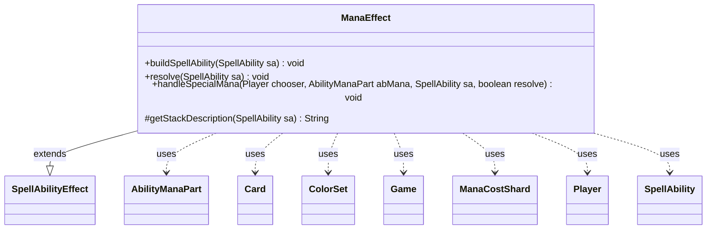

---
aliases:
  - ManaEffect
tags:
  - java/class
  - module/forge-game
  - pkg/forge/game/ability/effects
fqn: forge.game.ability.effects.ManaEffect
package: forge.game.ability.effects
module: forge-game
kind: Class
---

# ManaEffect

**Package:** `forge.game.ability.effects`   **Module:** `forge-game`   **Kind:** Class



## Relationships
**Extends:**
- [[forge.game.ability.SpellAbilityEffect|SpellAbilityEffect]]
**Uses:**
- [[forge.card.ColorSet|ColorSet]]
- [[forge.card.mana.ManaCostShard|ManaCostShard]]
- [[forge.game.Game|Game]]
- [[forge.game.card.Card|Card]]
- [[forge.game.player.Player|Player]]
- [[forge.game.spellability.AbilityManaPart|AbilityManaPart]]
- [[forge.game.spellability.SpellAbility|SpellAbility]]

## Design Description

ManaEffect is the resolution handler for mana-producing abilities within Forge's effect framework. Extending `SpellAbilityEffect`, it overrides `buildSpellAbility` to attach an `AbilityManaPart` to the ability (marking standalone activations undoable), `resolve` to generate colored mana and add it to players' pools, and `getStackDescription` to render the human-readable "adds {mana}" text. Its core responsibility is translating an ability's declared mana production into concrete mana, resolving the color choices that many sources require.

The class centralizes the engine's mana-choice logic, branching on `AbilityManaPart` state: combo mana (multiple selectable colors, including "Different" and EDH-aware variants via `specifyManaCombo`), any-color mana constrained by an express choice, and "special" cases (`EnchantedManaCost`, `DoubleManaInPool`, Jeweled Lotus, etc.) dispatched through the static `handleSpecialMana`. It collaborates with `Player` controllers for color selection, `ColorSet`/`ManaCostShard` to model options, and logs empty-mana anomalies to Sentry—a design that consolidates Magic's intricate mana rules into one effect.

## Source
`forge-game/src/main/java/forge/game/ability/effects/ManaEffect.java`

```java
package forge.game.ability.effects;

import static forge.util.TextUtil.toManaString;

import java.util.List;
import java.util.Map;

import forge.game.card.CardUtil;
import forge.util.Lang;
import org.apache.commons.lang3.StringUtils;

import forge.card.ColorSet;
import forge.card.MagicColor;
import forge.card.mana.ManaAtom;
import forge.card.mana.ManaCostShard;
import forge.game.Game;
import forge.game.GameActionUtil;
import forge.game.ability.AbilityUtils;
import forge.game.ability.SpellAbilityEffect;
import forge.game.card.Card;
import forge.game.keyword.Keyword;
import forge.game.player.Player;
import forge.game.spellability.AbilityManaPart;
import forge.game.spellability.SpellAbility;
import forge.game.trigger.TriggerType;
import forge.util.Localizer;
import io.sentry.Breadcrumb;
import io.sentry.Sentry;

public class ManaEffect extends SpellAbilityEffect {

    @Override
    public void buildSpellAbility(SpellAbility sa) {
        super.buildSpellAbility(sa);
        sa.setManaPart(new AbilityManaPart(sa, sa.getMapParams()));
        if (sa.getParent() == null) {
            sa.setUndoable(true); // will try at least
        }
    }

    @Override
    public void resolve(SpellAbility sa) {
        final Card host = sa.getHostCard();
        final Game game = host.getGame();
        final AbilityManaPart abMana = sa.getManaPart();
        final List<Player> tgtPlayers = getDefinedPlayersOrTargeted(sa);
        final Player activator = sa.getActivatingPlayer();

        // Spells are not undoable
        sa.setUndoable(sa.isAbility() && sa.isUndoable() && tgtPlayers.size() < 2 && !sa.hasParam("ActivationLimit"));

        if (sa.hasParam("Optional") && !activator.getController().confirmAction(sa, null, Localizer.getInstance().getMessage("lblDoYouWantAddMana"), null)) {
            return;
        }

        final StringBuilder producedMana = new StringBuilder();

        for (Player p : tgtPlayers) {
            if (!p.isInGame()) {
                continue;
            }

            final Player chooser;
            if (sa.hasParam("Chooser")) {
                chooser = AbilityUtils.getDefinedPlayers(host, sa.getParam("Chooser"), sa).get(0);
            } else {
                chooser = p;
            }

            if (abMana.isComboMana()) {
                int amount = sa.hasParam("Amount") ? AbilityUtils.calculateAmount(host, sa.getParam("Amount"), sa) : 1;
                int each = sa.hasParam("Each") ? AbilityUtils.calculateAmount(host, sa.getParam("Each"), sa) : 1;
                if (amount <= 0 || each <= 0) {
                    continue;
                }

                String combo = abMana.getComboColors(sa);
                if (combo.isBlank()) {
                    return;
                }
                String[] colorsProduced = combo.split(" ");
                ColorSet colorOptions = ColorSet.fromNames(colorsProduced);
                String express = abMana.getExpressChoice();
                String[] colorsNeeded = express.isEmpty() ? null : express.split(" ");
                boolean differentChoice = abMana.getOrigProduced().contains("Different");
                ColorSet fullOptions = colorOptions;
                final StringBuilder choiceString = new StringBuilder();
                final StringBuilder choiceSymbols = new StringBuilder();
                // Use specifyManaCombo if possible
                if (colorsNeeded == null && amount > 1 && !sa.hasParam("Each")) {
                    Map<Byte, Integer> choices = chooser.getController().specifyManaCombo(sa, colorOptions, amount, differentChoice);
                    for (Map.Entry<Byte, Integer> e : choices.entrySet()) {
                        Byte chosenColor = e.getKey();
                        String choice = MagicColor.toShortString(chosenColor);
                        String symbol = MagicColor.toSymbol(chosenColor);
                        Integer count = e.getValue();
                        while (count > 0) {
                            if (choiceString.length() > 0) {
                                choiceString.append(" ");
                            }
                            choiceString.append(choice);
                            choiceSymbols.append(symbol);
                            --count;
                        }
                    }
                } else {
                    for (int nMana = 0; nMana < amount; nMana++) {
                        String choice = "";
                        if (colorsNeeded != null && colorsNeeded.length > nMana) { // select from express choices if possible
                            colorOptions = ColorSet
                                    .fromMask(fullOptions.getColor() & ManaAtom.fromName(colorsNeeded[nMana]));
                        }
                        if (colorOptions.isColorless() && colorsProduced.length > 0) {
                            // If we just need generic mana, no reason to ask the controller for a choice,
                            // just use the first possible color.
                            choice = colorsProduced[differentChoice ? nMana : 0];
                        } else {
                            byte chosenColor = chooser.getController().chooseColor(Localizer.getInstance().getMessage("lblSelectManaProduce"), sa,
                                    differentChoice && (colorsNeeded == null || colorsNeeded.length <= nMana) ? fullOptions : colorOptions);
                            if (chosenColor == 0)
                                throw new RuntimeException("ManaEffect::resolve() /*combo mana*/ - " + p + " color mana choice is empty for " + host.getName());

                            if (differentChoice) {
                                fullOptions = ColorSet.fromMask(fullOptions.getColor() - chosenColor);
                            }
                            choice = MagicColor.toShortString(chosenColor);
                        }

                        String symbol = MagicColor.toSymbol(choice);
                        int count = each;
                        while (count > 0) {
                            if (choiceString.length() > 0) {
                                choiceString.append(" ");
                            }
                            choiceString.append(choice);
                            choiceSymbols.append(symbol);
                            --count;
                        }
                    }
                }

                if (choiceString.toString().isEmpty() && ("Combo ColorIdentity".equals(abMana.getOrigProduced()) || "Combo Spire".equals(abMana.getOrigProduced()))) {
                    // No mana could be produced here (non-EDH match?), so cut short
                    continue;
                }

                game.getAction().notifyOfValue(sa, p, choiceSymbols.toString(), p);
                abMana.setExpressChoice(choiceString.toString());
            }
            else if (abMana.isAnyMana()) {
                // AI color choice is set in ComputerUtils so only human players need to make a choice

                String colorsNeeded = abMana.getExpressChoice();

                byte mask = 0;
                //loop through colors to make menu
                for (int nChar = 0; nChar < colorsNeeded.length(); nChar++) {
                    mask |= MagicColor.fromName(colorsNeeded.charAt(nChar));
                }
                ColorSet colorMenu = mask == 0 ? ColorSet.WUBRG : ColorSet.fromMask(mask);
                byte val = chooser.getController().chooseColor(Localizer.getInstance().getMessage("lblSelectManaProduce"), sa, colorMenu);
                if (0 == val) {
                    throw new RuntimeException("ManaEffect::resolve() /*any mana*/ - " + p + " color mana choice is empty for " + host.getName());
                }

                game.getAction().notifyOfValue(sa, host, MagicColor.toSymbol(val), p);
                abMana.setExpressChoice(MagicColor.toShortString(val));
            }
            else if (abMana.isSpecialMana()) {
                handleSpecialMana(chooser, abMana, sa, true);
            }

            String mana = GameActionUtil.generatedMana(sa);

            // this can happen when mana is based on criteria that didn't match
            if (mana.isEmpty()) {
                String msg = "AbilityFactoryMana::manaResolve() - special mana effect is empty for";

                Breadcrumb bread = new Breadcrumb(msg);
                bread.setData("Card", host.getName());
                bread.setData("SA", sa.toString());
                Sentry.addBreadcrumb(bread);

                continue;
            }

            producedMana.append(abMana.produceMana(mana, p, sa));
        }

        // Only clear express choice after mana has been produced
        abMana.clearExpressChoice();

        abMana.tapsForMana(sa.getRootAbility(), producedMana.toString());

        if (sa.isKeyword(Keyword.FIREBENDING)) {
            activator.triggerElementalBend(TriggerType.Firebend);
        }
    }

    public static void handleSpecialMana(Player chooser, AbilityManaPart abMana, SpellAbility sa, boolean resolve) {
        String type = abMana.getOrigProduced().split("Special ")[1];
        Card host = sa.getHostCard();

        if (resolve) {
            if (type.equals("EnchantedManaCost")) {
                Card enchanted = host.getEnchantingCard();
                if (enchanted == null)
                    return;

                StringBuilder sb = new StringBuilder();
                int generic = enchanted.getManaCost().getGenericCost();

                for (ManaCostShard s : enchanted.getManaCost()) {
                    ColorSet cs = ColorSet.fromMask(s.getColorMask());
                    byte chosenColor;
                    if (cs.isColorless())
                        continue;
                    if (s.isOr2Generic()) { // CR 106.8
                        chosenColor = chooser.getController().chooseColorAllowColorless(Localizer.getInstance().getMessage("lblChooseSingleColorFromTarget", s.toString()), host, cs);
                        if (chosenColor == MagicColor.COLORLESS) {
                            generic += 2;
                            continue;
                        }
                    } else if (cs.isMonoColor())
                        chosenColor = s.getColorMask();
                    else /* (cs.isMulticolor()) */ {
                        chosenColor = chooser.getController().chooseColor(Localizer.getInstance().getMessage("lblChooseSingleColorFromTarget", s.toString()), sa, cs);
                    }
                    sb.append(MagicColor.toShortString(chosenColor));
                    sb.append(' ');
                }
                if (generic > 0) {
                    sb.append(generic);
                }

                abMana.setExpressChoice(sb.toString().trim());
            } else if (type.startsWith("EachColoredManaSymbol")) {
                final String res = type.split("_")[1];
                StringBuilder sb = new StringBuilder();
                for (Card c : AbilityUtils.getDefinedCards(host, res, sa)) {
                    for (ManaCostShard s : c.getManaCost()) {
                        ColorSet cs = ColorSet.fromMask(s.getColorMask());
                        if (cs.isColorless())
                            continue;
                        sb.append(' ');
                        if (cs.isMonoColor())
                            sb.append(MagicColor.toShortString(s.getColorMask()));
                        else /* (cs.isMulticolor()) */ {
                            byte chosenColor = chooser.getController().chooseColor(Localizer.getInstance().getMessage("lblChooseSingleColorFromTarget", s.toString()), sa, cs);
                            sb.append(MagicColor.toShortString(chosenColor));
                        }
                    }
                }
                abMana.setExpressChoice(sb.toString().trim());
            } else if (type.startsWith("DoubleManaInPool")) {
                StringBuilder sb = new StringBuilder();
                for (byte color : ManaAtom.MANATYPES) {
                    sb.append(StringUtils.repeat(MagicColor.toShortString(color) + " ", chooser.getManaPool().getAmountOfColor(color)));
                }
                abMana.setExpressChoice(sb.toString().trim());
            }
        } else if (type.equals("LastNotedType")) {
            // Jeweled Lotus
            final StringBuilder sb = new StringBuilder();
            for (Object o : host.getRemembered()) {
                if (o instanceof String) {
                    sb.append(o);
                }
            }
            String mana = sb.toString();
            if (mana.isEmpty()) {
                return;
            }
            abMana.setExpressChoice(mana);
        } else if (type.startsWith("EachColorAmong")) {
            final String res = type.split("_")[1];
            ColorSet colors = CardUtil.getColorsFromCards(AbilityUtils.getDefinedCards(host, res, sa));
            if (colors.isColorless()) return;
            abMana.setExpressChoice(colors);
        }
    }

    /**
     * <p>
     * manaStackDescription.
     * </p>
     * @param sa
     *            a {@link forge.game.spellability.SpellAbility} object.
     * @param abMana
     *            a {@link forge.card.spellability.AbilityMana} object.
     * @param af
     *            a {@link forge.game.ability.AbilityFactory} object.
     *
     * @return a {@link java.lang.String} object.
     */

    @Override
    protected String getStackDescription(SpellAbility sa) {
        final StringBuilder sb = new StringBuilder();
        final List<Player> tgtPlayers = getDefinedPlayersOrTargeted(sa);
        String mana = !sa.hasParam("Amount") || StringUtils.isNumeric(sa.getParam("Amount"))
                ? GameActionUtil.generatedMana(sa) : "mana";
        String manaDesc = "";
        if (mana.equals("mana") && sa.hasParam("Produced") && sa.hasParam("AmountDesc")) {
            mana = sa.getParam("Produced");
            manaDesc = sa.getParam("AmountDesc");
        }
        sb.append(Lang.joinHomogenous(tgtPlayers)).append(tgtPlayers.size() == 1 ? " adds " : " add ");
        sb.append(toManaString(mana)).append(manaDesc).append(".");
        if (sa.hasParam("RestrictValid")) {
            sb.append(" ");
            final String desc = sa.getDescription();
            if (desc.contains("Spend this") && desc.contains(".")) {
                int i = desc.indexOf("Spend this");
                sb.append(desc, i, desc.indexOf(".", i) + 1);
            } else if (desc.contains("This mana can't") && desc.contains(".")) { //for negative restrictions (Jegantha)
                int i = desc.indexOf("This mana can't");
                sb.append(desc, i, desc.indexOf(".", i) + 1);
            } else {
                sb.append("[failed to add RestrictValid to StackDesc]");
            }
        }
        return sb.toString();
    }
}
```

## Python
`forge/game/ability/effects/ManaEffect.py`

```python
from forge.util.TextUtil import toManaString

import typing
from typing import List, Map

from forge.game.card.CardUtil import CardUtil
from forge.util.Lang import Lang
from org.apache.commons.lang3.StringUtils import StringUtils

from forge.card.ColorSet import ColorSet
from forge.card.MagicColor import MagicColor
from forge.card.mana.ManaAtom import ManaAtom
from forge.card.mana.ManaCostShard import ManaCostShard
from forge.game.Game import Game
from forge.game.GameActionUtil import GameActionUtil
from forge.game.ability.AbilityUtils import AbilityUtils
from forge.game.ability.SpellAbilityEffect import SpellAbilityEffect
from forge.game.card.Card import Card
from forge.game.keyword.Keyword import Keyword
from forge.game.player.Player import Player
from forge.game.spellability.AbilityManaPart import AbilityManaPart
from forge.game.spellability.SpellAbility import SpellAbility
from forge.game.trigger.TriggerType import TriggerType
from forge.util.Localizer import Localizer
from io.sentry.Breadcrumb import Breadcrumb
from io.sentry.Sentry import Sentry


class ManaEffect(SpellAbilityEffect):

    def buildSpellAbility(self, sa: SpellAbility) -> None:
        super().buildSpellAbility(sa)
        sa.setManaPart(AbilityManaPart(sa, sa.getMapParams()))
        if sa.getParent() is None:
            sa.setUndoable(True)  # will try at least

    def resolve(self, sa: SpellAbility) -> None:
        host = sa.getHostCard()
        game = host.getGame()
        abMana = sa.getManaPart()
        tgtPlayers = self.getDefinedPlayersOrTargeted(sa)
        activator = sa.getActivatingPlayer()

        # Spells are not undoable
        sa.setUndoable(sa.isAbility() and sa.isUndoable() and len(tgtPlayers) < 2 and not sa.hasParam("ActivationLimit"))

        if sa.hasParam("Optional") and not activator.getController().confirmAction(sa, None, Localizer.getInstance().getMessage("lblDoYouWantAddMana"), None):
            return

        producedMana = []

        for p in tgtPlayers:
            if not p.isInGame():
                continue

            if sa.hasParam("Chooser"):
                chooser = AbilityUtils.getDefinedPlayers(host, sa.getParam("Chooser"), sa)[0]
            else:
                chooser = p

            if abMana.isComboMana():
                amount = AbilityUtils.calculateAmount(host, sa.getParam("Amount"), sa) if sa.hasParam("Amount") else 1
                each = AbilityUtils.calculateAmount(host, sa.getParam("Each"), sa) if sa.hasParam("Each") else 1
                if amount <= 0 or each <= 0:
                    continue

                combo = abMana.getComboColors(sa)
                if combo.isBlank():
                    return
                colorsProduced = combo.split(" ")
                colorOptions = ColorSet.fromNames(colorsProduced)
                express = abMana.getExpressChoice()
                colorsNeeded = None if express.isEmpty() else express.split(" ")
                differentChoice = "Different" in abMana.getOrigProduced()
                fullOptions = colorOptions
                choiceString = []
                choiceSymbols = []
                # Use specifyManaCombo if possible
                if colorsNeeded is None and amount > 1 and not sa.hasParam("Each"):
                    choices = chooser.getController().specifyManaCombo(sa, colorOptions, amount, differentChoice)
                    for chosenColor, count in choices.items():
                        choice = MagicColor.toShortString(chosenColor)
                        symbol = MagicColor.toSymbol(chosenColor)
                        while count > 0:
                            choiceString.append(choice)
                            choiceSymbols.append(symbol)
                            count -= 1
                else:
                    for nMana in range(amount):
                        choice = ""
                        if colorsNeeded is not None and len(colorsNeeded) > nMana:  # select from express choices if possible
                            colorOptions = ColorSet.fromMask(fullOptions.getColor() & ManaAtom.fromName(colorsNeeded[nMana]))
                        if colorOptions.isColorless() and len(colorsProduced) > 0:
                            # If we just need generic mana, no reason to ask the controller for a choice,
                            # just use the first possible color.
                            choice = colorsProduced[nMana if differentChoice else 0]
                        else:
                            chosenColor = chooser.getController().chooseColor(Localizer.getInstance().getMessage("lblSelectManaProduce"), sa,
                                    fullOptions if differentChoice and (colorsNeeded is None or len(colorsNeeded) <= nMana) else colorOptions)
                            if chosenColor == 0:
                                raise RuntimeError("ManaEffect::resolve() /*combo mana*/ - " + str(p) + " color mana choice is empty for " + host.getName())

                            if differentChoice:
                                fullOptions = ColorSet.fromMask(fullOptions.getColor() - chosenColor)
                            choice = MagicColor.toShortString(chosenColor)

                        symbol = MagicColor.toSymbol(choice)
                        count = each
                        while count > 0:
                            choiceString.append(choice)
                            choiceSymbols.append(symbol)
                            count -= 1

                if len("".join(choiceSymbols)) == 0 and len(" ".join(choiceString)) == 0 and ("Combo ColorIdentity" == abMana.getOrigProduced() or "Combo Spire" == abMana.getOrigProduced()):
                    # No mana could be produced here (non-EDH match?), so cut short
                    continue

                game.getAction().notifyOfValue(sa, p, "".join(choiceSymbols), p)
                abMana.setExpressChoice(" ".join(choiceString))
            elif abMana.isAnyMana():
                # AI color choice is set in ComputerUtils so only human players need to make a choice

                colorsNeeded = abMana.getExpressChoice()

                mask = 0
                # loop through colors to make menu
                for nChar in range(len(colorsNeeded)):
                    mask |= MagicColor.fromName(colorsNeeded[nChar])
                colorMenu = ColorSet.WUBRG if mask == 0 else ColorSet.fromMask(mask)
                val = chooser.getController().chooseColor(Localizer.getInstance().getMessage("lblSelectManaProduce"), sa, colorMenu)
                if 0 == val:
                    raise RuntimeError("ManaEffect::resolve() /*any mana*/ - " + str(p) + " color mana choice is empty for " + host.getName())

                game.getAction().notifyOfValue(sa, host, MagicColor.toSymbol(val), p)
                abMana.setExpressChoice(MagicColor.toShortString(val))
            elif abMana.isSpecialMana():
                ManaEffect.handleSpecialMana(chooser, abMana, sa, True)

            mana = GameActionUtil.generatedMana(sa)

            # this can happen when mana is based on criteria that didn't match
            if mana.isEmpty():
                msg = "AbilityFactoryMana::manaResolve() - special mana effect is empty for"

                bread = Breadcrumb(msg)
                bread.setData("Card", host.getName())
                bread.setData("SA", sa.toString())
                Sentry.addBreadcrumb(bread)

                continue

            producedMana.append(abMana.produceMana(mana, p, sa))

        # Only clear express choice after mana has been produced
        abMana.clearExpressChoice()

        abMana.tapsForMana(sa.getRootAbility(), "".join(producedMana))

        if sa.isKeyword(Keyword.FIREBENDING):
            activator.triggerElementalBend(TriggerType.Firebend)

    @staticmethod
    def handleSpecialMana(chooser: Player, abMana: AbilityManaPart, sa: SpellAbility, resolve: bool) -> None:
        type = abMana.getOrigProduced().split("Special ")[1]
        host = sa.getHostCard()

        if resolve:
            if type == "EnchantedManaCost":
                enchanted = host.getEnchantingCard()
                if enchanted is None:
                    return

                sb = []
                generic = enchanted.getManaCost().getGenericCost()

                for s in enchanted.getManaCost():
                    cs = ColorSet.fromMask(s.getColorMask())
                    if cs.isColorless():
                        continue
                    if s.isOr2Generic():  # CR 106.8
                        chosenColor = chooser.getController().chooseColorAllowColorless(Localizer.getInstance().getMessage("lblChooseSingleColorFromTarget", s.toString()), host, cs)
                        if chosenColor == MagicColor.COLORLESS:
                            generic += 2
                            continue
                    elif cs.isMonoColor():
                        chosenColor = s.getColorMask()
                    else:  # (cs.isMulticolor())
                        chosenColor = chooser.getController().chooseColor(Localizer.getInstance().getMessage("lblChooseSingleColorFromTarget", s.toString()), sa, cs)
                    sb.append(MagicColor.toShortString(chosenColor))
                    sb.append(' ')
                if generic > 0:
                    sb.append(str(generic))

                abMana.setExpressChoice("".join(sb).strip())
            elif type.startswith("EachColoredManaSymbol"):
                res = type.split("_")[1]
                sb = []
                for c in AbilityUtils.getDefinedCards(host, res, sa):
                    for s in c.getManaCost():
                        cs = ColorSet.fromMask(s.getColorMask())
                        if cs.isColorless():
                            continue
                        sb.append(' ')
                        if cs.isMonoColor():
                            sb.append(MagicColor.toShortString(s.getColorMask()))
                        else:  # (cs.isMulticolor())
                            chosenColor = chooser.getController().chooseColor(Localizer.getInstance().getMessage("lblChooseSingleColorFromTarget", s.toString()), sa, cs)
                            sb.append(MagicColor.toShortString(chosenColor))
                abMana.setExpressChoice("".join(sb).strip())
            elif type.startswith("DoubleManaInPool"):
                sb = []
                for color in ManaAtom.MANATYPES:
                    sb.append(StringUtils.repeat(MagicColor.toShortString(color) + " ", chooser.getManaPool().getAmountOfColor(color)))
                abMana.setExpressChoice("".join(sb).strip())
        elif type == "LastNotedType":
            # Jeweled Lotus
            sb = []
            for o in host.getRemembered():
                if isinstance(o, str):
                    sb.append(o)
            mana = "".join(sb)
            if len(mana) == 0:
                return
            abMana.setExpressChoice(mana)
        elif type.startswith("EachColorAmong"):
            res = type.split("_")[1]
            colors = CardUtil.getColorsFromCards(AbilityUtils.getDefinedCards(host, res, sa))
            if colors.isColorless():
                return
            abMana.setExpressChoice(colors)

    #
    # manaStackDescription.
    #
    # @param sa
    #            a {@link forge.game.spellability.SpellAbility} object.
    # @param abMana
    #            a {@link forge.card.spellability.AbilityMana} object.
    # @param af
    #            a {@link forge.game.ability.AbilityFactory} object.
    #
    # @return a {@link java.lang.String} object.
    #
    def getStackDescription(self, sa: SpellAbility) -> str:
        sb = []
        tgtPlayers = self.getDefinedPlayersOrTargeted(sa)
        mana = GameActionUtil.generatedMana(sa) if not sa.hasParam("Amount") or StringUtils.isNumeric(sa.getParam("Amount")) else "mana"
        manaDesc = ""
        if mana == "mana" and sa.hasParam("Produced") and sa.hasParam("AmountDesc"):
            mana = sa.getParam("Produced")
            manaDesc = sa.getParam("AmountDesc")
        sb.append(Lang.joinHomogenous(tgtPlayers))
        sb.append(" adds " if len(tgtPlayers) == 1 else " add ")
        sb.append(toManaString(mana))
        sb.append(manaDesc)
        sb.append(".")
        if sa.hasParam("RestrictValid"):
            sb.append(" ")
            desc = sa.getDescription()
            if "Spend this" in desc and "." in desc:
                i = desc.index("Spend this")
                sb.append(desc[i:desc.index(".", i) + 1])
            elif "This mana can't" in desc and "." in desc:  # for negative restrictions (Jegantha)
                i = desc.index("This mana can't")
                sb.append(desc[i:desc.index(".", i) + 1])
            else:
                sb.append("[failed to add RestrictValid to StackDesc]")
        return "".join(sb)
```
