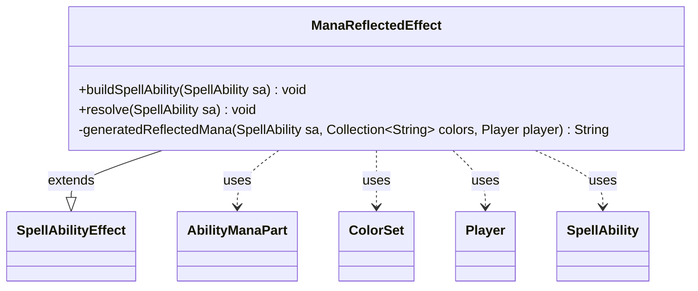

---
aliases:
  - ManaReflectedEffect
tags:
  - java/class
  - module/forge-game
  - pkg/forge/game/ability/effects
fqn: forge.game.ability.effects.ManaReflectedEffect
package: forge.game.ability.effects
module: forge-game
kind: Class
---

# ManaReflectedEffect

**Package:** `forge.game.ability.effects` &nbsp; **Module:** `forge-game` &nbsp; **Kind:** Class



## Relationships
**Extends:**
- [[forge.game.ability.SpellAbilityEffect|SpellAbilityEffect]]
**Uses:**
- [[forge.card.ColorSet|ColorSet]]
- [[forge.game.player.Player|Player]]
- [[forge.game.spellability.AbilityManaPart|AbilityManaPart]]
- [[forge.game.spellability.SpellAbility|SpellAbility]]

## Design Description

ManaReflectedEffect resolves Magic abilities that produce "reflected" mana, whose color is determined dynamically at resolution from a set of reflectable colors rather than being fixed when the ability is defined. As a concrete `SpellAbilityEffect` subclass, it overrides `buildSpellAbility` to attach an `AbilityManaPart` (marking top-level uses undoable) and `resolve` to generate and produce mana for each target `Player`, tapping the host for the combined result.

The private `generatedReflectedMana` helper carries the core logic, reconciling combo-mana specifications, pre-set express color choices, and interactive prompts through the player's controller, using `ColorSet` and `MagicColor` to model and convert colors. It deliberately honors express choices set by auto-payment and AI routines to prevent misplays, scales output by an optional `Amount`, and channels all produced mana through the `AbilityManaPart`, isolating color-determination from the wider effect framework.

## Source
`forge-game/src/main/java/forge/game/ability/effects/ManaReflectedEffect.java`

```java
package forge.game.ability.effects;

import java.util.Collection;
import java.util.Map;

import org.apache.commons.lang3.StringUtils;

import forge.card.ColorSet;
import forge.card.MagicColor;
import forge.game.ability.AbilityUtils;
import forge.game.ability.SpellAbilityEffect;
import forge.game.card.CardUtil;
import forge.game.player.Player;
import forge.game.spellability.AbilityManaPart;
import forge.game.spellability.SpellAbility;
import forge.util.Localizer;

public class ManaReflectedEffect extends SpellAbilityEffect {

    @Override
    public void buildSpellAbility(SpellAbility sa) {
        super.buildSpellAbility(sa);
        sa.setManaPart(new AbilityManaPart(sa, sa.getMapParams()));
        if (sa.getParent() == null) {
            sa.setUndoable(true); // will try at least
        }
    }

    /* (non-Javadoc)
     * @see forge.card.abilityfactory.SpellEffect#resolve(java.util.Map, forge.card.spellability.SpellAbility)
     */
    @Override
    public void resolve(SpellAbility sa) {
        final Collection<String> colors = CardUtil.getReflectableManaColors(sa);
        final AbilityManaPart ma = sa.getManaPart();

        // Spells are not undoable
        sa.setUndoable(sa.isAbility() && sa.isUndoable() && sa.getSubAbility() == null);

        final StringBuilder producedMana = new StringBuilder();
        for (final Player player : getTargetPlayers(sa)) {
            final String generated = generatedReflectedMana(sa, colors, player);
            producedMana.append(ma.produceMana(generated, player, sa));
        }

        ma.tapsForMana(sa.getRootAbility(), producedMana.toString());
    }

    // *************** Utility Functions **********************

    /**
     * <p>
     * generatedReflectedMana.
     * </p>
     *
     * @param sa
     *            a {@link forge.game.spellability.SpellAbility} object.
     * @param colors
     *            a {@link java.util.ArrayList} object.
     * @param player
     *            a {@link forge.game.player.Player} object.
     * @return a {@link java.lang.String} object.
     */
    private static String generatedReflectedMana(final SpellAbility sa, final Collection<String> colors, final Player player) {
        // Calculate generated mana here for stack description and resolving
        final int amount = sa.hasParam("Amount") ? AbilityUtils.calculateAmount(sa.getHostCard(), sa.getParam("Amount"), sa) : 1;
        final StringBuilder sb = new StringBuilder();

        if (sa.getManaPart().isComboMana()) {
            Map<Byte, Integer> choices = player.getController().specifyManaCombo(sa, ColorSet.fromNames(colors), amount, false);
            for (Map.Entry<Byte, Integer> e : choices.entrySet()) {
                Byte chosenColor = e.getKey();
                String choice = MagicColor.toShortString(chosenColor);
                Integer count = e.getValue();
                while (count > 0) {
                    if (sb.length() > 0) {
                        sb.append(" ");
                    }
                    sb.append(choice);
                    --count;
                }
            }
            return sb.toString();
        }

        String baseMana;

        // TODO: This effect explicitly obeys express color choice as set by auto payment and AI routines in order
        // to avoid misplays and auto mana payment selection errors. Perhaps a better solution is possible?
        String expressChoiceColors = sa.getManaPart().getExpressChoice();
        ColorSet colorMenu = null;
        byte mask = 0;
        // loop through colors to make menu
        for (int nChar = 0; nChar < expressChoiceColors.length(); nChar++) {
            mask |= MagicColor.fromName(expressChoiceColors.charAt(nChar));
        }

        if (mask == 0 && !expressChoiceColors.isEmpty() && colors.contains("colorless")) {
            baseMana = MagicColor.toShortString(player.getController().chooseColorAllowColorless(Localizer.getInstance().getMessage("lblSelectManaProduce"), sa.getHostCard(), ColorSet.fromMask(mask)));
        } else {
            // Nothing set previously so ask player if needed
            if (mask == 0) {
                if (colors.isEmpty()) {
                    return "0";
                } else if (colors.size() == 1) {
                    baseMana = MagicColor.toShortString(colors.iterator().next());
                } else if (colors.contains("colorless")) {
                    baseMana = MagicColor.toShortString(player.getController().chooseColorAllowColorless(Localizer.getInstance().getMessage("lblSelectManaProduce"), sa.getHostCard(), ColorSet.fromNames(colors)));
                } else {
                    baseMana = MagicColor.toShortString(player.getController().chooseColor(Localizer.getInstance().getMessage("lblSelectManaProduce"), sa, ColorSet.fromNames(colors)));
                }
            } else {
                colorMenu = ColorSet.fromMask(mask);
                byte color = sa.getActivatingPlayer().getController().chooseColor(Localizer.getInstance().getMessage("lblSelectManaProduce"), sa, colorMenu);
                if (color == 0) {
                    System.err.println("Unexpected behavior in ManaReflectedEffect: " + sa.getActivatingPlayer() + " - color mana choice is empty for " + sa.getHostCard().getName());
                }
                baseMana = MagicColor.toShortString(color);
            }
        }

        if (amount == 0) {
            sb.append("0");
        } else if (StringUtils.isNumeric(baseMana)) {
            // if baseMana is an integer(colorless), just multiply amount and baseMana
            final int base = Integer.parseInt(baseMana);
            sb.append(base * amount);
        } else {
            for (int i = 0; i < amount; i++) {
                if (i != 0) {
                    sb.append(" ");
                }
                sb.append(baseMana);
            }
        }
        return sb.toString();
    }
}
```

## Python
`forge/game/ability/effects/ManaReflectedEffect.py`

```python
from forge.card.ColorSet import ColorSet
from forge.card.MagicColor import MagicColor
from forge.game.ability.AbilityUtils import AbilityUtils
from forge.game.ability.SpellAbilityEffect import SpellAbilityEffect
from forge.game.card.CardUtil import CardUtil
from forge.game.player.Player import Player
from forge.game.spellability.AbilityManaPart import AbilityManaPart
from forge.game.spellability.SpellAbility import SpellAbility
from forge.util.Localizer import Localizer


class ManaReflectedEffect(SpellAbilityEffect):

    def buildSpellAbility(self, sa: SpellAbility) -> None:
        super().buildSpellAbility(sa)
        sa.setManaPart(AbilityManaPart(sa, sa.getMapParams()))
        if sa.getParent() is None:
            sa.setUndoable(True)  # will try at least

    # (non-Javadoc)
    # @see forge.card.abilityfactory.SpellEffect#resolve(java.util.Map, forge.card.spellability.SpellAbility)
    def resolve(self, sa: SpellAbility) -> None:
        colors = CardUtil.getReflectableManaColors(sa)
        ma = sa.getManaPart()

        # Spells are not undoable
        sa.setUndoable(sa.isAbility() and sa.isUndoable() and sa.getSubAbility() is None)

        producedMana = []
        for player in self.getTargetPlayers(sa):
            generated = ManaReflectedEffect.generatedReflectedMana(sa, colors, player)
            producedMana.append(ma.produceMana(generated, player, sa))

        ma.tapsForMana(sa.getRootAbility(), "".join(producedMana))

    # *************** Utility Functions **********************

    @staticmethod
    def generatedReflectedMana(sa: SpellAbility, colors: list[str], player: Player) -> str:
        # Calculate generated mana here for stack description and resolving
        amount = AbilityUtils.calculateAmount(sa.getHostCard(), sa.getParam("Amount"), sa) if sa.hasParam("Amount") else 1
        sb = []

        if sa.getManaPart().isComboMana():
            choices = player.getController().specifyManaCombo(sa, ColorSet.fromNames(colors), amount, False)
            for chosenColor, count in choices.items():
                choice = MagicColor.toShortString(chosenColor)
                while count > 0:
                    if len(sb) > 0:
                        sb.append(" ")
                    sb.append(choice)
                    count -= 1
            return "".join(sb)

        baseMana = None

        # TODO: This effect explicitly obeys express color choice as set by auto payment and AI routines in order
        # to avoid misplays and auto mana payment selection errors. Perhaps a better solution is possible?
        expressChoiceColors = sa.getManaPart().getExpressChoice()
        colorMenu = None
        mask = 0
        # loop through colors to make menu
        for nChar in range(len(expressChoiceColors)):
            mask |= MagicColor.fromName(expressChoiceColors[nChar])

        if mask == 0 and len(expressChoiceColors) > 0 and "colorless" in colors:
            baseMana = MagicColor.toShortString(player.getController().chooseColorAllowColorless(Localizer.getInstance().getMessage("lblSelectManaProduce"), sa.getHostCard(), ColorSet.fromMask(mask)))
        else:
            # Nothing set previously so ask player if needed
            if mask == 0:
                if len(colors) == 0:
                    return "0"
                elif len(colors) == 1:
                    baseMana = MagicColor.toShortString(next(iter(colors)))
                elif "colorless" in colors:
                    baseMana = MagicColor.toShortString(player.getController().chooseColorAllowColorless(Localizer.getInstance().getMessage("lblSelectManaProduce"), sa.getHostCard(), ColorSet.fromNames(colors)))
                else:
                    baseMana = MagicColor.toShortString(player.getController().chooseColor(Localizer.getInstance().getMessage("lblSelectManaProduce"), sa, ColorSet.fromNames(colors)))
            else:
                colorMenu = ColorSet.fromMask(mask)
                color = sa.getActivatingPlayer().getController().chooseColor(Localizer.getInstance().getMessage("lblSelectManaProduce"), sa, colorMenu)
                if color == 0:
                    import sys
                    print("Unexpected behavior in ManaReflectedEffect: " + str(sa.getActivatingPlayer()) + " - color mana choice is empty for " + sa.getHostCard().getName(), file=sys.stderr)
                baseMana = MagicColor.toShortString(color)

        if amount == 0:
            sb.append("0")
        elif baseMana is not None and baseMana.isdigit():
            # if baseMana is an integer(colorless), just multiply amount and baseMana
            base = int(baseMana)
            sb.append(str(base * amount))
        else:
            for i in range(amount):
                if i != 0:
                    sb.append(" ")
                sb.append(baseMana)
        return "".join(sb)
```
