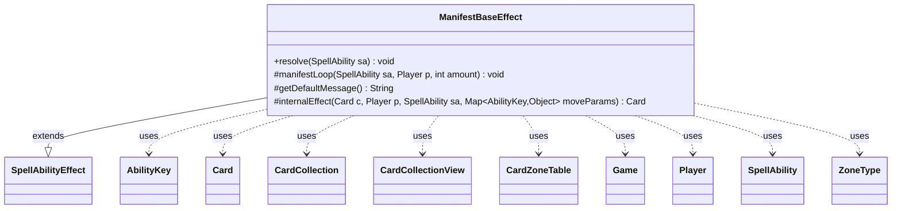

---
aliases:
  - ManifestBaseEffect
tags:
  - java/class
  - module/forge-game
  - pkg/forge/game/ability/effects
fqn: forge.game.ability.effects.ManifestBaseEffect
package: forge.game.ability.effects
module: forge-game
kind: Class
---

# ManifestBaseEffect

**Package:** `forge.game.ability.effects` &nbsp; **Module:** `forge-game` &nbsp; **Kind:** Class



## Relationships
**Extends:**
- [[forge.game.ability.SpellAbilityEffect|SpellAbilityEffect]]
**Uses:**
- [[forge.game.Game|Game]]
- [[forge.game.ability.AbilityKey|AbilityKey]]
- [[forge.game.card.Card|Card]]
- [[forge.game.card.CardCollection|CardCollection]]
- [[forge.game.card.CardCollectionView|CardCollectionView]]
- [[forge.game.card.CardZoneTable|CardZoneTable]]
- [[forge.game.player.Player|Player]]
- [[forge.game.spellability.SpellAbility|SpellAbility]]
- [[forge.game.zone.ZoneType|ZoneType]]

## Design Description

The description is already present in the input note and is well-written. Here it is:

`ManifestBaseEffect` is an abstract resolution handler that centralizes the shared mechanics of "manifest"-style abilities, extending `SpellAbilityEffect` to plug into Forge's spell/ability resolution pipeline. Its `resolve` method computes the manifest amount (supporting `X`) and iterates the defined target players, delegating to `manifestLoop`, which resolves the candidate `CardCollection` from a chosen zone, the top of the library, or explicit targets, optionally shuffling and validating each card's current game state against its timestamp before acting.

The class encodes a deliberate rules distinction (CR 701.34d): cards manifested from a library are processed one at a time, each with its own `CardZoneTable` trigger flush, while cards from other zones move simultaneously under a single trigger batch. It defers the actual per-card transformation and user-facing prompt text to subclasses via the abstract `internalEffect` and `getDefaultMessage` hooks, making it a Template Method base that collaborates with `Game`, `Player`, `AbilityKey`, and `ZoneType` to coordinate zone changes and triggered abilities.

## Source
`forge-game/src/main/java/forge/game/ability/effects/ManifestBaseEffect.java`

```java
package forge.game.ability.effects;

import java.util.Map;

import forge.game.Game;
import forge.game.ability.AbilityKey;
import forge.game.ability.AbilityUtils;
import forge.game.ability.SpellAbilityEffect;
import forge.game.card.Card;
import forge.game.card.CardCollection;
import forge.game.card.CardCollectionView;
import forge.game.card.CardLists;
import forge.game.card.CardPredicates;
import forge.game.card.CardZoneTable;
import forge.game.player.Player;
import forge.game.spellability.SpellAbility;
import forge.game.zone.ZoneType;

public abstract class ManifestBaseEffect extends SpellAbilityEffect {
    @Override
    public void resolve(SpellAbility sa) {
        final Card source = sa.getHostCard();
        // Usually a number leaving possibility for X, Sacrifice X land: Manifest X creatures.
        final int amount = sa.hasParam("Amount") ? AbilityUtils.calculateAmount(source, sa.getParam("Amount"), sa) : 1;

        for (final Player p : getTargetPlayers(sa, "DefinedPlayer")) {
            manifestLoop(sa, p, amount);
        }
    }

    protected void manifestLoop(SpellAbility sa, Player p, final int amount) {
        final Card source = sa.getHostCard();
        final Player activator = sa.getActivatingPlayer();
        final Game game = source.getGame();

        CardCollection tgtCards;
        boolean fromLibrary = false;
        if (sa.hasParam("Choices") || sa.hasParam("ChoiceZone")) {
            ZoneType choiceZone = ZoneType.Hand;
            if (sa.hasParam("ChoiceZone")) {
                choiceZone = ZoneType.smartValueOf(sa.getParam("ChoiceZone"));
                fromLibrary = choiceZone.equals(ZoneType.Library);
            }
            CardCollectionView choices = p.getCardsIn(choiceZone);
            if (sa.hasParam("Choices")) {
                choices = CardLists.getValidCards(choices, sa.getParam("Choices"), activator, source, sa);
            }
            if (choices.isEmpty()) {
                return;
            }

            String title = sa.hasParam("ChoiceTitle") ? sa.getParam("ChoiceTitle") : getDefaultMessage() + " ";

            tgtCards = new CardCollection(p.getController().chooseCardsForEffect(choices, sa, title, amount, amount, false, null));
        } else if ("TopOfLibrary".equals(sa.getParamOrDefault("Defined", "TopOfLibrary"))) {
            tgtCards = p.getTopXCardsFromLibrary(amount);
            fromLibrary = true;
        } else {
            tgtCards = getTargetCards(sa);
            if (tgtCards.allMatch(CardPredicates.inZone(ZoneType.Library))) {
                fromLibrary = true;
            }
        }

        if (sa.hasParam("Shuffle")) {
            CardLists.shuffle(tgtCards);
        }

        if (fromLibrary) {
            for (Card c : tgtCards) {
                Card gameCard = game.getCardState(c, null);
                // gameCard is LKI in that case, the card is not in game anymore
                // or the timestamp did change
                // this should check Self too
                if (gameCard == null || !c.equalsWithGameTimestamp(gameCard)) {
                    continue;
                }
 
                // CR 701.34d If an effect instructs a player to manifest multiple cards from their library, those cards are manifested one at a time.
                Map<AbilityKey, Object> moveParams = AbilityKey.newMap();
                CardZoneTable triggerList = AbilityKey.addCardZoneTableParams(moveParams, sa);
                internalEffect(gameCard, p, sa, moveParams);
                triggerList.triggerChangesZoneAll(game, sa);
            }
        } else {
            // manifest from other zones should be done at the same time
            Map<AbilityKey, Object> moveParams = AbilityKey.newMap();
            CardZoneTable triggerList = AbilityKey.addCardZoneTableParams(moveParams, sa);
            for (Card c : tgtCards) {
                Card gameCard = game.getCardState(c, null);
                // gameCard is LKI in that case, the card is not in game anymore
                // or the timestamp did change
                // this should check Self too
                if (gameCard == null || !c.equalsWithGameTimestamp(gameCard)) {
                    continue;
                }
                internalEffect(gameCard, p, sa, moveParams);
            }
            triggerList.triggerChangesZoneAll(game, sa);
        }
    }

    abstract protected String getDefaultMessage();

    abstract protected Card internalEffect(Card c, Player p, SpellAbility sa, Map<AbilityKey, Object> moveParams);
}
```

## Python
`forge/game/ability/effects/ManifestBaseEffect.py`

```python
from typing import Any

from forge.game.Game import Game
from forge.game.ability.AbilityKey import AbilityKey
from forge.game.ability.AbilityUtils import AbilityUtils
from forge.game.ability.SpellAbilityEffect import SpellAbilityEffect
from forge.game.card.Card import Card
from forge.game.card.CardCollection import CardCollection
from forge.game.card.CardCollectionView import CardCollectionView
from forge.game.card.CardLists import CardLists
from forge.game.card.CardPredicates import CardPredicates
from forge.game.card.CardZoneTable import CardZoneTable
from forge.game.player.Player import Player
from forge.game.spellability.SpellAbility import SpellAbility
from forge.game.zone.ZoneType import ZoneType


class ManifestBaseEffect(SpellAbilityEffect):
    def resolve(self, sa: SpellAbility) -> None:
        source = sa.getHostCard()
        # Usually a number leaving possibility for X, Sacrifice X land: Manifest X creatures.
        amount = AbilityUtils.calculateAmount(source, sa.getParam("Amount"), sa) if sa.hasParam("Amount") else 1

        for p in self.getTargetPlayers(sa, "DefinedPlayer"):
            self.manifestLoop(sa, p, amount)

    def manifestLoop(self, sa: SpellAbility, p: Player, amount: int) -> None:
        source = sa.getHostCard()
        activator = sa.getActivatingPlayer()
        game = source.getGame()

        tgtCards: CardCollection
        fromLibrary = False
        if sa.hasParam("Choices") or sa.hasParam("ChoiceZone"):
            choiceZone = ZoneType.Hand
            if sa.hasParam("ChoiceZone"):
                choiceZone = ZoneType.smartValueOf(sa.getParam("ChoiceZone"))
                fromLibrary = choiceZone == ZoneType.Library
            choices: CardCollectionView = p.getCardsIn(choiceZone)
            if sa.hasParam("Choices"):
                choices = CardLists.getValidCards(choices, sa.getParam("Choices"), activator, source, sa)
            if choices.isEmpty():
                return

            title = sa.getParam("ChoiceTitle") if sa.hasParam("ChoiceTitle") else self.getDefaultMessage() + " "

            tgtCards = CardCollection(p.getController().chooseCardsForEffect(choices, sa, title, amount, amount, False, None))
        elif "TopOfLibrary" == sa.getParamOrDefault("Defined", "TopOfLibrary"):
            tgtCards = p.getTopXCardsFromLibrary(amount)
            fromLibrary = True
        else:
            tgtCards = self.getTargetCards(sa)
            if tgtCards.allMatch(CardPredicates.inZone(ZoneType.Library)):
                fromLibrary = True

        if sa.hasParam("Shuffle"):
            CardLists.shuffle(tgtCards)

        if fromLibrary:
            for c in tgtCards:
                gameCard = game.getCardState(c, None)
                # gameCard is LKI in that case, the card is not in game anymore
                # or the timestamp did change
                # this should check Self too
                if gameCard is None or not c.equalsWithGameTimestamp(gameCard):
                    continue

                # CR 701.34d If an effect instructs a player to manifest multiple cards from their library, those cards are manifested one at a time.
                moveParams: dict[AbilityKey, Any] = AbilityKey.newMap()
                triggerList = AbilityKey.addCardZoneTableParams(moveParams, sa)
                self.internalEffect(gameCard, p, sa, moveParams)
                triggerList.triggerChangesZoneAll(game, sa)
        else:
            # manifest from other zones should be done at the same time
            moveParams: dict[AbilityKey, Any] = AbilityKey.newMap()
            triggerList = AbilityKey.addCardZoneTableParams(moveParams, sa)
            for c in tgtCards:
                gameCard = game.getCardState(c, None)
                # gameCard is LKI in that case, the card is not in game anymore
                # or the timestamp did change
                # this should check Self too
                if gameCard is None or not c.equalsWithGameTimestamp(gameCard):
                    continue

                self.internalEffect(gameCard, p, sa, moveParams)
            triggerList.triggerChangesZoneAll(game, sa)

    def getDefaultMessage(self) -> str:
        ...

    def internalEffect(self, c: Card, p: Player, sa: SpellAbility, moveParams: dict[AbilityKey, Any]) -> Card:
        ...
```
