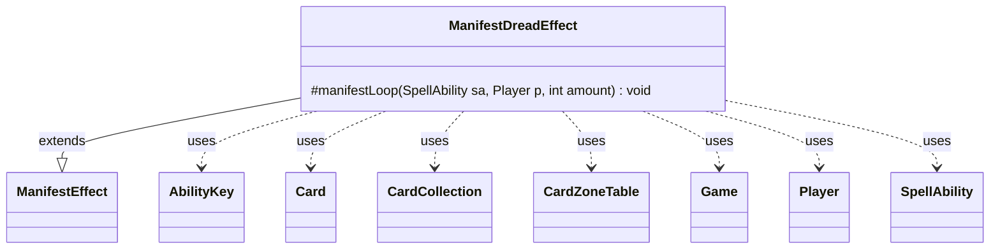

---
aliases:
  - ManifestDreadEffect
tags:
  - java/class
  - module/forge-game
  - pkg/forge/game/ability/effects
fqn: forge.game.ability.effects.ManifestDreadEffect
package: forge.game.ability.effects
module: forge-game
kind: Class
---

# ManifestDreadEffect

**Package:** `forge.game.ability.effects` &nbsp; **Module:** `forge-game` &nbsp; **Kind:** Class



## Relationships
**Extends:**
- [[forge.game.ability.effects.ManifestEffect|ManifestEffect]]
**Uses:**
- [[forge.game.Game|Game]]
- [[forge.game.ability.AbilityKey|AbilityKey]]
- [[forge.game.card.Card|Card]]
- [[forge.game.card.CardCollection|CardCollection]]
- [[forge.game.card.CardZoneTable|CardZoneTable]]
- [[forge.game.player.Player|Player]]
- [[forge.game.spellability.SpellAbility|SpellAbility]]

## Design Description

ManifestDreadEffect implements the "manifest dread" mechanic by specializing the `manifestLoop` step of its parent `ManifestEffect`. For each of `amount` iterations, it draws the top two cards of the player's library, lets the controlling player choose one to manifest face-down via the inherited `internalEffect`, and sends the remaining card (plus the chosen one if manifesting failed, per CR 701.60a) to the graveyard.

As a concrete subclass of `ManifestEffect`, it overrides only the protected `manifestLoop` hook, reusing the base class's manifest machinery while supplying the dread-specific two-card selection logic. It collaborates with `Player` and `CardCollection` to source candidates, uses an `AbilityKey` parameter map and `CardZoneTable` to batch and report zone changes through the `Game`'s action and trigger systems, and fires a `ManifestDread` trigger with the graveyard-bound cards after each iteration.

## Source
`forge-game/src/main/java/forge/game/ability/effects/ManifestDreadEffect.java`

```java
package forge.game.ability.effects;

import java.util.Map;

import forge.game.Game;
import forge.game.ability.AbilityKey;
import forge.game.card.Card;
import forge.game.card.CardCollection;
import forge.game.card.CardZoneTable;
import forge.game.player.Player;
import forge.game.spellability.SpellAbility;
import forge.game.trigger.TriggerType;

public class ManifestDreadEffect extends ManifestEffect {
    @Override
    protected void manifestLoop(SpellAbility sa, Player p, final int amount) {
        final Game game = p.getGame();
        for (int i = 0; i < amount; i++) {
            CardCollection tgtCards = p.getTopXCardsFromLibrary(2);
            CardCollection toGrave = new CardCollection();
            if (!tgtCards.isEmpty()) {
                Card manifest = p.getController().chooseSingleEntityForEffect(tgtCards, sa, getDefaultMessage(), null);
                tgtCards.remove(manifest);

                Map<AbilityKey, Object> moveParams = AbilityKey.newMap();
                CardZoneTable triggerList = AbilityKey.addCardZoneTableParams(moveParams, sa);
                manifest = internalEffect(manifest, p, sa, moveParams);
                // CR 701.60a
                if (!manifest.isManifested()) {
                    tgtCards.add(manifest);
                }
                for (Card c : tgtCards) {
                    toGrave.add(game.getAction().moveToGraveyard(c, sa, moveParams));
                }
                triggerList.triggerChangesZoneAll(game, sa);
            }
            Map<AbilityKey, Object> runParams = AbilityKey.mapFromPlayer(p);
            runParams.put(AbilityKey.Cards, toGrave);
            game.getTriggerHandler().runTrigger(TriggerType.ManifestDread, runParams, true);
        }
    }
}
```

## Python
`forge/game/ability/effects/ManifestDreadEffect.py`

```python
package forge.game.ability.effects → module path forge/game/ability/effects/ManifestDreadEffect.py

from typing import Map... let me just produce the port.

from forge.game.Game import Game
from forge.game.ability.AbilityKey import AbilityKey
from forge.game.card.Card import Card
from forge.game.card.CardCollection import CardCollection
from forge.game.card.CardZoneTable import CardZoneTable
from forge.game.player.Player import Player
from forge.game.spellability.SpellAbility import SpellAbility
from forge.game.trigger.TriggerType import TriggerType
from forge.game.ability.effects.ManifestEffect import ManifestEffect


class ManifestDreadEffect(ManifestEffect):
    def manifestLoop(self, sa: SpellAbility, p: Player, amount: int) -> None:
        game = p.getGame()
        for i in range(amount):
            tgtCards = p.getTopXCardsFromLibrary(2)
            toGrave = CardCollection()
            if not tgtCards.isEmpty():
                manifest = p.getController().chooseSingleEntityForEffect(tgtCards, sa, self.getDefaultMessage(), None)
                tgtCards.remove(manifest)

                moveParams = AbilityKey.newMap()
                triggerList = AbilityKey.addCardZoneTableParams(moveParams, sa)
                manifest = self.internalEffect(manifest, p, sa, moveParams)
                # CR 701.60a
                if not manifest.isManifested():
                    tgtCards.add(manifest)
                for c in tgtCards:
                    toGrave.add(game.getAction().moveToGraveyard(c, sa, moveParams))
                triggerList.triggerChangesZoneAll(game, sa)
            runParams = AbilityKey.mapFromPlayer(p)
            runParams[AbilityKey.Cards] = toGrave
            game.getTriggerHandler().runTrigger(TriggerType.ManifestDread, runParams, True)
```
